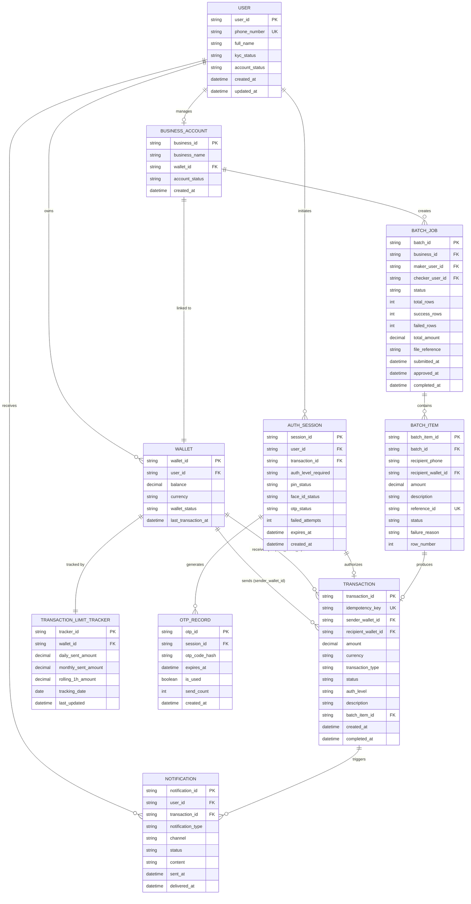

# ERD: Chuyển Tiền Nội Bộ Ví MoMo

---

## Thông tin tài liệu

| Trường | Nội dung |
|---|---|
| **Document ID** | ERD-MOMO-TRANSFER-001 |
| **Version** | 1.0 |
| **Status** | Draft |
| **Ngày tạo** | 2026-05-25 |
| **Ngày cập nhật** | 2026-05-25 |
| **Tác giả** | BA Team |
| **Reviewer** | Tech Lead, Database Architect |
| **Approver** | Engineering Lead |
| **Tài liệu liên quan** | BRD-MOMO-TRANSFER-001, FRD-MOMO-TRANSFER-001, UC-MOMO-TRANSFER-001 |
| **Bảo mật** | Internal — Không phát hành ra ngoài |

## Người đọc dự kiến

| Vai trò | Mục đích |
|---|---|
| Database Architect | Thiết kế schema vật lý |
| Backend Developer | Hiểu quan hệ giữa các entity |
| Tech Lead | Review data model trước khi implementation |
| QA Lead | Xây dựng test data và kiểm tra data integrity |

## Lịch sử thay đổi

| Phiên bản | Ngày | Tác giả | Nội dung thay đổi |
|---|---|---|---|
| 1.0 | 2026-05-25 | BA Team | Khởi tạo tài liệu — full data model cho tính năng chuyển tiền |

---

## 1. Tổng quan Data Model

Tính năng Chuyển Tiền Nội Bộ MoMo bao gồm **10 entity** chính, chia thành 4 nhóm:

| Nhóm | Entity |
|---|---|
| **Identity & Account** | USER, WALLET, BUSINESS_ACCOUNT |
| **Transaction Core** | TRANSACTION, TRANSACTION_LIMIT_TRACKER |
| **Authentication** | AUTH_SESSION, OTP_RECORD |
| **Batch Processing** | BATCH_JOB, BATCH_ITEM |
| **Communication** | NOTIFICATION |

---

## 2. ERD Diagram (Mermaid)



---

## 3. Mô Tả Chi Tiết Các Entity

### 3.1 USER

> Đại diện tài khoản người dùng MoMo (cá nhân).

| Cột | Kiểu | Nullable | Mô tả |
|---|---|---|---|
| user_id | UUID | No | Primary key |
| phone_number | VARCHAR(15) | No | Unique; SĐT đăng ký; dùng để tra cứu recipient |
| full_name | VARCHAR(200) | No | Tên đầy đủ hiển thị khi confirm GD |
| kyc_status | ENUM | No | `UNVERIFIED`, `eKYC_VERIFIED`, `FULL_KYC` |
| account_status | ENUM | No | `ACTIVE`, `SUSPENDED`, `CLOSED` |
| created_at | TIMESTAMP | No | Thời điểm đăng ký tài khoản |
| updated_at | TIMESTAMP | No | Cập nhật gần nhất |

**Notes:**
- `kyc_status` quyết định hạn mức tháng: eKYC_VERIFIED → 200M VND; UNVERIFIED → 20M VND
- `account_status = SUSPENDED` → không thể gửi hoặc nhận tiền

---

### 3.2 WALLET

> Ví điện tử gắn với một USER hoặc BUSINESS_ACCOUNT.

| Cột | Kiểu | Nullable | Mô tả |
|---|---|---|---|
| wallet_id | UUID | No | Primary key |
| user_id | UUID | Yes | FK → USER; null nếu là ví doanh nghiệp độc lập |
| balance | DECIMAL(18,2) | No | Số dư hiện tại; không âm |
| currency | CHAR(3) | No | Mặc định `VND` |
| wallet_status | ENUM | No | `ACTIVE`, `FROZEN`, `CLOSED` |
| last_transaction_at | TIMESTAMP | Yes | Cập nhật sau mỗi GD thành công |

**Notes:**
- Debit và Credit phải là atomic operation trong Wallet Core
- `balance >= 0` là constraint bắt buộc tại DB level

---

### 3.3 BUSINESS_ACCOUNT

> Tài khoản doanh nghiệp dùng để giải ngân.

| Cột | Kiểu | Nullable | Mô tả |
|---|---|---|---|
| business_id | UUID | No | Primary key |
| business_name | VARCHAR(300) | No | Tên pháp nhân doanh nghiệp |
| wallet_id | UUID | No | FK → WALLET; ví doanh nghiệp |
| account_status | ENUM | No | `ACTIVE`, `SUSPENDED`, `CLOSED` |
| created_at | TIMESTAMP | No | Ngày onboarding doanh nghiệp |

---

### 3.4 TRANSACTION

> Bản ghi giao dịch chuyển tiền — mỗi row là 1 lần chuyển tiền hoàn chỉnh.

| Cột | Kiểu | Nullable | Mô tả |
|---|---|---|---|
| transaction_id | UUID | No | Primary key; trả về client sau confirm |
| idempotency_key | VARCHAR(128) | No | Unique; ngăn duplicate debit; do client tạo |
| sender_wallet_id | UUID | No | FK → WALLET |
| recipient_wallet_id | UUID | No | FK → WALLET |
| amount | DECIMAL(18,2) | No | Số tiền chuyển; 1,000 ≤ amount ≤ 20,000,000 |
| currency | CHAR(3) | No | `VND` |
| transaction_type | ENUM | No | `P2P`, `BUSINESS_SINGLE`, `BUSINESS_BATCH` |
| status | ENUM | No | `PENDING`, `PROCESSING`, `COMPLETED`, `FAILED` |
| auth_level | ENUM | No | `1FA`, `2FA`, `3FA` |
| description | VARCHAR(200) | Yes | Ghi chú người dùng hoặc mô tả từ doanh nghiệp |
| batch_item_id | UUID | Yes | FK → BATCH_ITEM; null nếu không phải batch GD |
| created_at | TIMESTAMP | No | Thời điểm tạo GD |
| completed_at | TIMESTAMP | Yes | Thời điểm GD hoàn tất (COMPLETED hoặc FAILED) |

**Notes:**
- Không có UPDATE sau khi status = `COMPLETED` hoặc `FAILED` (immutable)
- `idempotency_key` phải được check trước khi insert bất kỳ TRANSACTION nào

---

### 3.5 TRANSACTION_LIMIT_TRACKER

> Theo dõi hạn mức giao dịch theo ví, theo ngày và theo tháng, phục vụ enforce TT23/2019.

| Cột | Kiểu | Nullable | Mô tả |
|---|---|---|---|
| tracker_id | UUID | No | Primary key |
| wallet_id | UUID | No | FK → WALLET; unique per wallet per day |
| daily_sent_amount | DECIMAL(18,2) | No | Tổng đã gửi trong ngày; reset 00:00 mỗi ngày |
| monthly_sent_amount | DECIMAL(18,2) | No | Tổng đã gửi trong tháng; reset ngày 1 mỗi tháng |
| rolling_1h_amount | DECIMAL(18,2) | No | Tổng gửi trong 60 phút gần nhất; tính sliding window |
| tracking_date | DATE | No | Ngày theo dõi (partition key) |
| last_updated | TIMESTAMP | No | Cập nhật sau mỗi GD thành công |

**Notes:**
- `rolling_1h_amount` dùng sliding window, không phải fixed hour
- Limit Engine đọc bảng này trước mỗi GD; cập nhật ngay sau khi COMPLETED

---

### 3.6 AUTH_SESSION

> Phiên xác thực gắn với một lần thực hiện giao dịch.

| Cột | Kiểu | Nullable | Mô tả |
|---|---|---|---|
| session_id | UUID | No | Primary key |
| user_id | UUID | No | FK → USER |
| transaction_id | UUID | Yes | FK → TRANSACTION; null cho đến khi GD được tạo |
| auth_level_required | ENUM | No | `1FA`, `2FA`, `3FA` |
| pin_status | ENUM | No | `PENDING`, `PASSED`, `FAILED` |
| face_id_status | ENUM | No | `PENDING`, `PASSED`, `FAILED`, `NOT_REQUIRED` |
| otp_status | ENUM | No | `PENDING`, `PASSED`, `FAILED`, `NOT_REQUIRED` |
| failed_attempts | SMALLINT | No | Tổng lần xác thực thất bại; khóa khi = 3 |
| expires_at | TIMESTAMP | No | Hết hạn sau 10 phút kể từ tạo |
| created_at | TIMESTAMP | No | Thời điểm bắt đầu phiên xác thực |

---

### 3.7 OTP_RECORD

> Bản ghi OTP cho mỗi phiên xác thực 3FA.

| Cột | Kiểu | Nullable | Mô tả |
|---|---|---|---|
| otp_id | UUID | No | Primary key |
| session_id | UUID | No | FK → AUTH_SESSION |
| otp_code_hash | VARCHAR(256) | No | Bcrypt hash của OTP; không lưu plaintext |
| expires_at | TIMESTAMP | No | OTP hết hạn sau 5 phút |
| is_used | BOOLEAN | No | True sau khi xác thực thành công; ngăn reuse |
| send_count | SMALLINT | No | Số lần gửi OTP (tối đa 3/phiên) |
| created_at | TIMESTAMP | No | Thời điểm phát hành OTP |

---

### 3.8 BATCH_JOB

> Đại diện một lô giải ngân batch từ doanh nghiệp.

| Cột | Kiểu | Nullable | Mô tả |
|---|---|---|---|
| batch_id | UUID | No | Primary key |
| business_id | UUID | No | FK → BUSINESS_ACCOUNT |
| maker_user_id | UUID | No | FK → USER; người tạo lệnh |
| checker_user_id | UUID | Yes | FK → USER; người phê duyệt; null cho đến khi approved |
| status | ENUM | No | `DRAFT`, `PENDING_APPROVAL`, `APPROVED`, `PROCESSING`, `COMPLETED`, `FAILED`, `REJECTED` |
| total_rows | INT | No | Tổng số dòng trong file |
| success_rows | INT | No | Số dòng xử lý thành công |
| failed_rows | INT | No | Số dòng xử lý thất bại |
| total_amount | DECIMAL(18,2) | No | Tổng tiền của toàn batch |
| file_reference | VARCHAR(500) | No | URL/path file gốc đã upload |
| submitted_at | TIMESTAMP | No | Thời điểm Maker submit |
| approved_at | TIMESTAMP | Yes | Thời điểm Checker approve |
| completed_at | TIMESTAMP | Yes | Thời điểm batch xử lý xong |

**Constraint:**
```
CHECK (maker_user_id != checker_user_id)
```

---

### 3.9 BATCH_ITEM

> Một dòng trong file batch; mỗi dòng tương ứng một lần chuyển tiền.

| Cột | Kiểu | Nullable | Mô tả |
|---|---|---|---|
| batch_item_id | UUID | No | Primary key |
| batch_id | UUID | No | FK → BATCH_JOB |
| recipient_phone | VARCHAR(15) | No | SĐT người nhận |
| recipient_wallet_id | UUID | Yes | Được resolve sau validation; null nếu không tìm thấy ví |
| amount | DECIMAL(18,2) | No | Số tiền; phải ≥ 1,000 và ≤ 20,000,000 |
| description | VARCHAR(200) | No | Mô tả từ file batch |
| reference_id | VARCHAR(128) | No | Unique per batch file; dùng làm idempotency key |
| status | ENUM | No | `PENDING`, `PROCESSING`, `SUCCESS`, `FAILED`, `INVALID` |
| failure_reason | VARCHAR(500) | Yes | Lý do thất bại; null nếu SUCCESS |
| row_number | INT | No | Số thứ tự dòng trong file (bắt đầu từ 1) |

---

### 3.10 NOTIFICATION

> Thông báo gửi đến người dùng sau sự kiện giao dịch.

| Cột | Kiểu | Nullable | Mô tả |
|---|---|---|---|
| notification_id | UUID | No | Primary key |
| user_id | UUID | No | FK → USER; người nhận thông báo |
| transaction_id | UUID | Yes | FK → TRANSACTION; null với notification hệ thống |
| notification_type | ENUM | No | `TRANSFER_SENT`, `TRANSFER_RECEIVED`, `AUTH_REQUIRED`, `BATCH_COMPLETED`, `BATCH_APPROVED` |
| channel | ENUM | No | `PUSH`, `SMS`, `IN_APP` |
| status | ENUM | No | `QUEUED`, `SENT`, `DELIVERED`, `FAILED` |
| content | TEXT | No | Nội dung thông báo |
| sent_at | TIMESTAMP | Yes | Thời điểm gửi thành công |
| delivered_at | TIMESTAMP | Yes | Thời điểm delivery confirmed |

---

## 4. Quan Hệ Giữa Các Entity

| Quan hệ | Cardinality | Mô tả |
|---|---|---|
| USER → WALLET | 1:1 | Mỗi user có đúng 1 ví cá nhân |
| USER → BUSINESS_ACCOUNT | 1:0..1 | User có thể là admin của 0 hoặc 1 business account |
| BUSINESS_ACCOUNT → WALLET | 1:1 | Business account có đúng 1 ví doanh nghiệp |
| WALLET → TRANSACTION (sender) | 1:N | Một ví có thể là sender của nhiều GD |
| WALLET → TRANSACTION (recipient) | 1:N | Một ví có thể là recipient của nhiều GD |
| WALLET → TRANSACTION_LIMIT_TRACKER | 1:1 per day | Mỗi ví có 1 tracker record mỗi ngày |
| USER → AUTH_SESSION | 1:N | Mỗi user có thể có nhiều phiên xác thực |
| AUTH_SESSION → OTP_RECORD | 1:N | Một phiên có thể phát sinh nhiều OTP (resend) |
| AUTH_SESSION → TRANSACTION | 1:0..1 | Mỗi session authorize tối đa 1 GD |
| BUSINESS_ACCOUNT → BATCH_JOB | 1:N | Một business tạo được nhiều batch |
| BATCH_JOB → BATCH_ITEM | 1:N | Mỗi batch chứa nhiều item (tối đa 1,000) |
| BATCH_ITEM → TRANSACTION | 1:0..1 | Mỗi item sinh ra tối đa 1 GD khi xử lý thành công |
| USER → NOTIFICATION | 1:N | Người dùng nhận nhiều thông báo |
| TRANSACTION → NOTIFICATION | 1:N | Một GD trigger nhiều notification (sender + recipient) |

---

## 5. Index Recommendations

| Bảng | Index | Lý do |
|---|---|---|
| USER | `phone_number` (UNIQUE) | Tra cứu recipient theo SĐT — hot path |
| TRANSACTION | `idempotency_key` (UNIQUE) | Ngăn duplicate debit |
| TRANSACTION | `sender_wallet_id, created_at` | Query lịch sử gửi |
| TRANSACTION | `recipient_wallet_id, created_at` | Query lịch sử nhận |
| TRANSACTION_LIMIT_TRACKER | `wallet_id, tracking_date` (UNIQUE) | Limit check — hot path |
| AUTH_SESSION | `user_id, expires_at` | Kiểm tra session còn hiệu lực |
| OTP_RECORD | `session_id, is_used` | Validate OTP nhanh |
| BATCH_ITEM | `batch_id, status` | Query tiến độ batch |
| BATCH_ITEM | `reference_id` (UNIQUE) | Idempotency key per batch |
| NOTIFICATION | `user_id, sent_at` | Load notification history |

---

## 6. Data Integrity Constraints

| Constraint | Mô tả |
|---|---|
| `WALLET.balance >= 0` | Số dư không âm — enforce tại DB |
| `TRANSACTION.idempotency_key` UNIQUE | Ngăn duplicate debit hoàn toàn |
| `BATCH_ITEM.reference_id` UNIQUE | Ngăn duplicate trong cùng batch |
| `BATCH_JOB: maker_user_id != checker_user_id` | Maker-Checker separation — enforce tại DB |
| `OTP_RECORD.is_used = true` sau verify | OTP một lần dùng; không reuse |
| `TRANSACTION` status là immutable sau COMPLETED/FAILED | Không UPDATE GD đã hoàn tất |
| `TRANSACTION.amount` BETWEEN 1000 AND 20000000 | Hạn mức TT23/2019 |

---

## 7. Open Questions — Data Model

| # | Câu hỏi | Owner | Deadline |
|---|---|---|---|
| OQ-ERD-01 | Business account có thể có nhiều ví (multi-wallet) hay chỉ 1? Ảnh hưởng đến relationship BUSINESS_ACCOUNT → WALLET | Tech Lead | Sprint 1 |
| OQ-ERD-02 | TRANSACTION_LIMIT_TRACKER: rolling_1h_amount dùng cơ chế sliding window hay bucket? Nếu sliding → cần lưu TRANSACTION timestamps riêng | Database Architect | Sprint 1 |
| OQ-ERD-03 | Audit log (compliance) lưu chung TRANSACTION hay tách ra bảng AUDIT_LOG riêng bất biến (append-only)? | Compliance + Tech Lead | Sprint 2 |
| OQ-ERD-04 | OTP_RECORD lưu hash hay token reference đến OTP Gateway (nếu OTP Gateway external)? | Security Team | Sprint 1 |

---

*Tài liệu này chỉ dành cho nội bộ. Không sao chép hoặc chia sẻ ra ngoài khi chưa có sự phê duyệt của Engineering Lead.*
