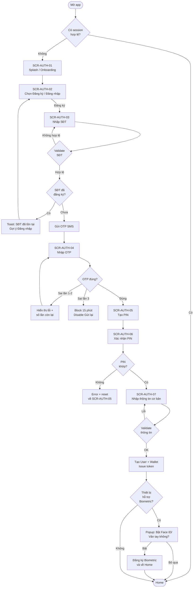
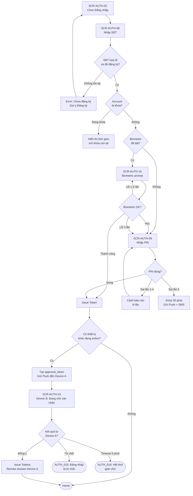
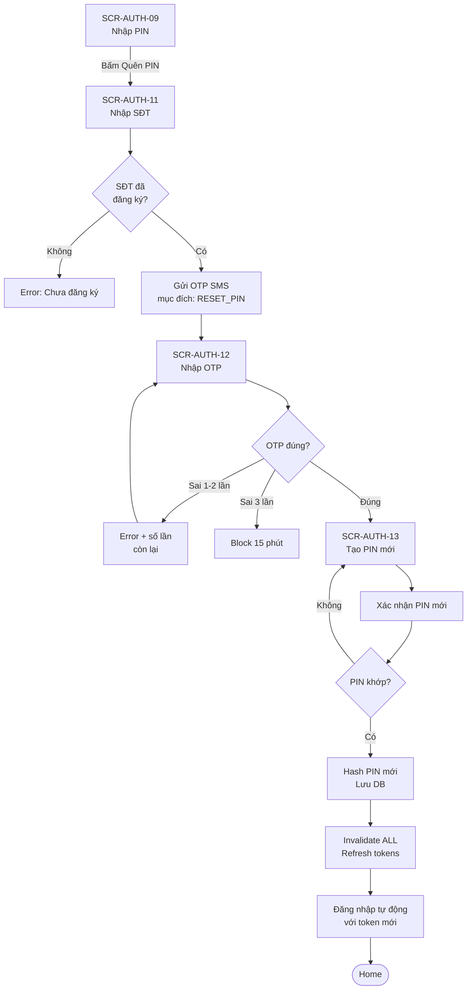
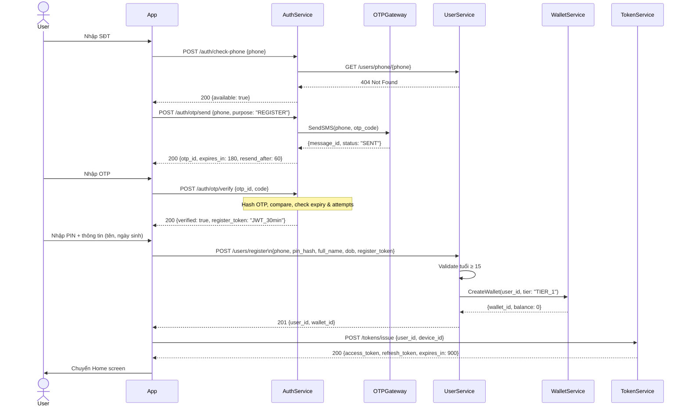
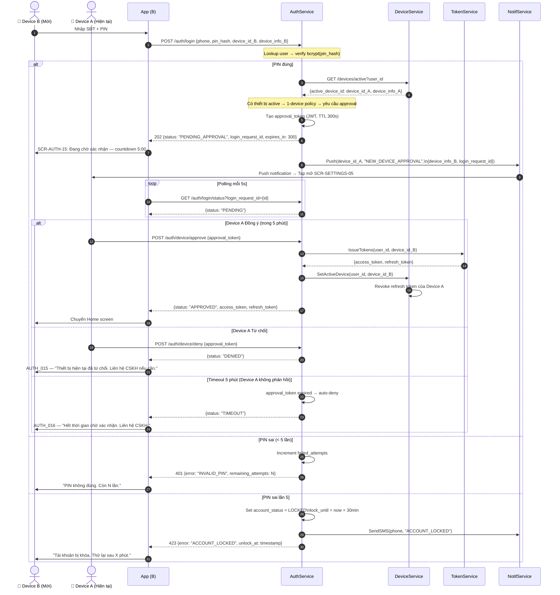
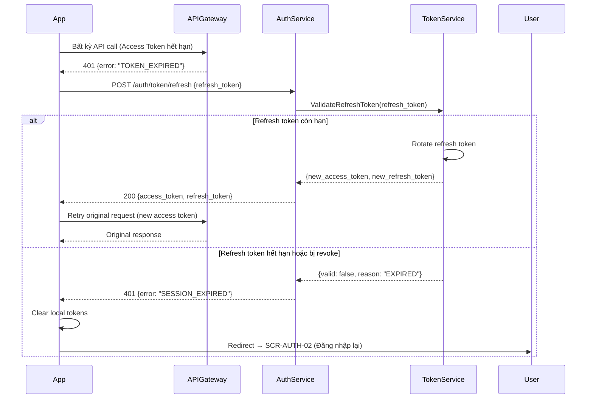

# PRD: Authentication Module

<Info>
  **Document ID:** PRD-EW-AUTH-001 · **Version:** 1.1 · **Status:** Draft  
  **Ngày tạo:** 2026-05-25 · **Tác giả:** BA Team  
  **Reviewer:** Tech Lead, Security Team, QA Lead · **Approver:** Head of Product
</Info>

| Vai trò | Mục đích đọc |
|---|---|
| Tech Lead / Developer | Thiết kế Auth Service, Token Service, luồng xác thực |
| Security Team | Review PIN storage, session management, brute-force protection |
| QA Lead | Xây dựng test cases: đăng ký, đăng nhập, lock/unlock, biometric |
| UX Designer | Hiểu điều kiện hiển thị từng màn hình, error state |

---

## 1. Tổng quan module

Module Authentication xử lý toàn bộ vòng đời xác thực người dùng:

<CardGroup cols={2}>
  <Card title="Đăng ký tài khoản" icon="user-plus">
    SĐT + OTP → Tạo PIN → Nhập thông tin cơ bản → Tạo ví
  </Card>
  <Card title="Đăng nhập" icon="right-to-bracket">
    PIN hoặc Biometric (Face ID / Fingerprint) → JWT token
  </Card>
  <Card title="Quên / Đổi PIN" icon="key">
    SĐT → OTP → PIN mới · Invalidate toàn bộ session cũ
  </Card>
  <Card title="Session Management" icon="clock">
    Access token 15 phút · Refresh token 30 ngày · Auto-logout khi expire
  </Card>
</CardGroup>

---

## 2. Danh sách màn hình

| Screen ID | Tên màn hình | Điều kiện hiển thị |
|---|---|---|
| SCR-AUTH-01 | Splash / Onboarding | App khởi động lần đầu hoặc chưa đăng nhập |
| SCR-AUTH-02 | Lựa chọn Đăng ký / Đăng nhập | Sau splash; chưa có session |
| SCR-AUTH-03 | Nhập SĐT (Đăng ký) | User chọn "Đăng ký" |
| SCR-AUTH-04 | Nhập OTP (Đăng ký) | Sau khi SĐT hợp lệ + chưa đăng ký |
| SCR-AUTH-05 | Tạo PIN | OTP đăng ký xác thực thành công |
| SCR-AUTH-06 | Xác nhận PIN | Sau khi user nhập PIN lần 1 |
| SCR-AUTH-07 | Nhập thông tin cơ bản | PIN tạo thành công |
| SCR-AUTH-08 | Đăng nhập — Nhập SĐT | User chọn "Đăng nhập" |
| SCR-AUTH-09 | Đăng nhập — Nhập PIN | SĐT đã đăng ký; Biometric chưa bật hoặc fail |
| SCR-AUTH-10 | Đăng nhập — Biometric | SĐT đã đăng ký + Biometric đã kích hoạt |
| SCR-AUTH-11 | Quên PIN — Nhập SĐT | User bấm "Quên PIN" từ màn đăng nhập |
| SCR-AUTH-12 | Quên PIN — Nhập OTP | SĐT quên PIN hợp lệ + đã đăng ký |
| SCR-AUTH-13 | Tạo PIN mới | OTP reset xác thực thành công |
| SCR-AUTH-14 | Đổi PIN (từ Settings) | User đã đăng nhập; vào Settings > Bảo mật |
| SCR-AUTH-15 | Chờ xác nhận — Device B | PIN đúng + có thiết bị active khác; Device B chờ Device A duyệt trong tối đa 5 phút |

---

## 3. User Flow — Đăng ký



---

## 4. User Flow — Đăng nhập



---

## 5. User Flow — Quên PIN / Đặt lại PIN



---

## 6. Sequence Diagram — Đăng ký



---

## 7. Sequence Diagram — Đăng nhập (PIN + 1-Device Approval Flow)



---

## 8. Sequence Diagram — Token Refresh



---

## 9. Screen Specifications

### SCR-AUTH-03 — Nhập SĐT (Đăng ký)

```
┌─────────────────────────────────┐
│  ←           Đăng ký           │
│         [●──○──○]  Bước 1/3    │
│                                 │
│   Số điện thoại                 │
│  ┌───────────────────────────┐  │
│  │ +84 │ Nhập số điện thoại  │  │
│  └───────────────────────────┘  │
│  ⚠ Số điện thoại không hợp lệ  │  ← chỉ hiện khi lỗi
│                                 │
│       [      Tiếp tục     ]     │  ← disabled nếu trống
│                                 │
│    Đã có tài khoản? Đăng nhập   │
└─────────────────────────────────┘
```

| Component | Loại | Label / Placeholder | Điều kiện hiển thị | Action |
|---|---|---|---|---|
| Header title | Text | "Đăng ký tài khoản" | Always | — |
| Back button | Icon button | ← | Always | Về SCR-AUTH-02 |
| Progress indicator | Step bar | Bước 1/3 | Always | — |
| Phone input | Text input | "Nhập số điện thoại" | Always | Numeric keyboard; auto-format |
| Country prefix | Label | "+84" | Always | Non-editable |
| Inline error | Text (red) | Xem bảng Validation | Khi validate fail | — |
| "Tiếp tục" button | Primary button | "Tiếp tục" | Always | Disabled khi input rỗng hoặc lỗi |
| "Đã có tài khoản?" | Text link | "Đăng nhập ngay" | Always | Về SCR-AUTH-08 |

**Điều kiện nút "Tiếp tục":**
- Disabled: SĐT rỗng, format sai, đang gọi API
- Enabled: SĐT hợp lệ chưa submit
- Loading state: đang gọi `/auth/check-phone`

---

### SCR-AUTH-04 — Nhập OTP (Đăng ký)

```
┌─────────────────────────────────┐
│  ←      Xác nhận số điện thoại │
│                                 │
│  Nhập mã 6 chữ số gửi đến      │
│         090**** 567             │
│                                 │
│   ┌──┐ ┌──┐ ┌──┐ ┌──┐ ┌──┐ ┌──┐│
│   │  │ │  │ │  │ │  │ │  │ │  ││
│   └──┘ └──┘ └──┘ └──┘ └──┘ └──┘│
│                                 │
│         Gửi lại sau 58s         │  ← countdown
│                                 │
│  ⚠ Mã OTP không đúng. Còn 2 lần│  ← chỉ hiện khi sai
│                                 │
│       Dùng số khác?             │
└─────────────────────────────────┘
```

| Component | Loại | Label / Placeholder | Điều kiện hiển thị | Action |
|---|---|---|---|---|
| Header title | Text | "Xác nhận số điện thoại" | Always | — |
| Subtitle | Text | "Nhập mã 6 chữ số gửi đến {phone}" | Always | Ẩn 3 số giữa SĐT |
| OTP input | 6-cell input | ○ ○ ○ ○ ○ ○ | Always | Auto-focus; numeric; auto-submit khi đủ 6 số |
| Countdown timer | Text | "Gửi lại sau {N}s" | Trong 60s đầu | Disabled |
| "Gửi lại OTP" | Text button | "Gửi lại OTP" | Sau 60s | Gọi `/auth/otp/send` lại; reset countdown |
| Inline error | Text (red) | Xem bảng Validation | Khi OTP sai | — |
| Block state | Banner (red) | "Nhập sai quá 3 lần. Thử lại sau {N} phút." | Khi bị block | Disable tất cả input |
| "Đổi SĐT" | Text link | "Dùng số khác?" | Always | Về SCR-AUTH-03 |

**Điều kiện auto-submit:** Khi user nhập đủ ký tự thứ 6, tự động gọi verify API mà không cần bấm nút.

---

### SCR-AUTH-05 & 06 — Tạo PIN & Xác nhận PIN

```
┌─────────────────────────────────┐
│  ←            Tạo mã PIN       │
│  [●──●──○]         Bước 2/3    │
│                                 │
│  PIN dùng để đăng nhập và       │
│  xác thực giao dịch             │
│                                 │
│         ● ● ● ─ ─ ─             │  ← 3 ký tự đã nhập
│                                 │
│  ┌─────────────────────────┐   │
│  │  1    2    3            │   │
│  │  4    5    6            │   │
│  │  7    8    9            │   │
│  │       0    ⌫            │   │
│  └─────────────────────────┘   │
│                                 │
│  ⚠ Hai mã PIN chưa khớp        │  ← chỉ hiện ở SCR-06
└─────────────────────────────────┘
```

| Component | Loại | Label | Điều kiện hiển thị | Action |
|---|---|---|---|---|
| Header title | Text | "Tạo mã PIN" / "Xác nhận mã PIN" | Per screen | — |
| Subtitle | Text | "PIN dùng để đăng nhập và xác thực giao dịch" | SCR-05 only | — |
| PIN input | 6-dot display | ● ● ● ● ● ● | Always | Ẩn ký tự; numeric pad below |
| Numeric pad | Custom keypad | 0-9 + Xóa | Always | Tap để nhập |
| Strength indicator | — | — | SCR-05: Không hiển thị strength | — |
| Inline error | Text (red) | Xem Validation | Khi PIN không hợp lệ | — |
| "PIN không khớp" | Banner | "Hai mã PIN chưa khớp. Vui lòng nhập lại." | SCR-06: Khi sai | Auto-clear cả 2 ô; về SCR-05 |

---

### SCR-AUTH-09 — Đăng nhập — Nhập PIN

```
┌─────────────────────────────────┐
│                                 │
│         [  Avatar 60px ]        │
│          090**** 567            │
│       Không phải bạn?           │
│                                 │
│       Nhập mã PIN               │
│         ● ● ● ─ ─ ─             │
│                                 │
│  ⚠ PIN không đúng. Còn 3 lần.  │  ← sau lần sai đầu
│                                 │
│  ┌─────────────────────────┐   │
│  │  1    2    3            │   │
│  │  4    5    6            │   │
│  │  7    8    9            │   │
│  │  👁    0    ⌫           │   │  ← 👁 = biometric
│  └─────────────────────────┘   │
│                                 │
│           Quên PIN?             │
└─────────────────────────────────┘
```

| Component | Loại | Label | Điều kiện hiển thị | Action |
|---|---|---|---|---|
| Avatar + SĐT | Display | Ảnh đại diện + SĐT (ẩn giữa) | Always | — |
| "Không phải bạn?" | Text link | "Dùng tài khoản khác" | Always | Clear SĐT; về SCR-AUTH-08 |
| PIN input | 6-dot display | ● ● ● ● ● ● | Always | — |
| Numeric pad | Custom keypad | 0-9 + Xóa | Always | — |
| Remaining attempts | Text (orange) | "PIN không đúng. Còn {N} lần." | Sau lần sai đầu tiên | — |
| Lock banner | Banner (red) | "Tài khoản bị khóa đến {time}" | Account locked | Ẩn PIN pad; chỉ hiện thời gian |
| "Quên PIN?" | Text link | "Quên PIN?" | Khi account không bị lock | Về SCR-AUTH-11 |
| Biometric icon | Icon button | Fingerprint/Face icon | Nếu Biometric bật | Switch sang SCR-AUTH-10 |

---

### SCR-AUTH-15 — Chờ xác nhận đăng nhập (Device B)

<Warning>
  **Cập nhật v1.1 — 1-Device Policy:** Màn hình này thay thế hành vi cũ (chỉ cảnh báo sau khi login). Device B phải **chờ Device A xác nhận trước** khi session được cấp. Xem Device A approval modal tại SCR-SETTINGS-05 trong [Notifications & Settings](/projects/ewallet/notifications-settings).
</Warning>

```
┌─────────────────────────────────┐
│                                 │
│              🔐                 │
│                                 │
│  Đang chờ xác nhận đăng nhập   │
│                                 │
│  ┌───────────────────────────┐  │
│  │  Thiết bị hiện tại của    │  │
│  │  bạn sẽ nhận thông báo   │  │
│  │  để xác nhận yêu cầu.    │  │
│  └───────────────────────────┘  │
│                                 │
│           ⏱ 04:32               │  ← đếm ngược từ 5:00
│                                 │
│  Mở ứng dụng trên thiết bị     │
│  hiện tại và nhấn "Cho phép"   │
│                                 │
│      [   Hủy yêu cầu    ]      │
│                                 │
│   Mất thiết bị? Liên hệ CSKH  │
└─────────────────────────────────┘
```

| Component | Loại | Nội dung | Action |
|---|---|---|---|
| Icon | Icon | 🔐 | — |
| Title | Text | "Đang chờ xác nhận đăng nhập" | — |
| Info box | Card | "Thiết bị hiện tại của bạn sẽ nhận thông báo để xác nhận yêu cầu." | — |
| Countdown timer | Text (lớn, nổi bật) | Đếm ngược từ 5:00 → 0:00 | Về 0 → tự hiển thị toast AUTH_016 |
| Hướng dẫn | Text (phụ) | "Mở ứng dụng trên thiết bị hiện tại và nhấn 'Cho phép'" | — |
| "Hủy yêu cầu" | Secondary button | "Hủy yêu cầu" | DELETE `/auth/login/status/{login_request_id}`; về SCR-AUTH-08 |
| "Liên hệ CSKH" | Text link | "Mất thiết bị? Liên hệ CSKH" | Mở màn hình CSKH (chat / hotline) |

**Polling behavior (client):** App gọi `GET /auth/login/status?login_request_id={id}` mỗi **5 giây**.
- `status: "APPROVED"` → nhận `access_token` + `refresh_token` → điều hướng về Home
- `status: "DENIED"` → hiện toast AUTH_015; về SCR-AUTH-08
- `status: "TIMEOUT"` hoặc countdown = 0 → hiện toast AUTH_016; về SCR-AUTH-08

---

## 10. Validation Rules

| Field | Rule | Error message | Trigger |
|---|---|---|---|
| **Số điện thoại** | Bắt buộc | "Vui lòng nhập số điện thoại" | On blur / submit |
| | Đúng 10 ký tự | "Số điện thoại phải có đúng 10 chữ số" | On blur |
| | Chỉ chứa số | "Số điện thoại chỉ gồm chữ số" | On input |
| | Đầu số hợp lệ VN (03x, 05x, 07x, 08x, 09x) | "Số điện thoại không hợp lệ" | On blur |
| | Chưa đăng ký (register flow) | "Số điện thoại đã được đăng ký. Đăng nhập?" | After API |
| | Đã đăng ký (login flow) | "Số điện thoại chưa đăng ký. Đăng ký?" | After API |
| **OTP** | Bắt buộc | "Vui lòng nhập mã OTP" | On submit |
| | Đúng 6 chữ số | "Mã OTP gồm 6 chữ số" | On input |
| | OTP sai (lần 1-2) | "Mã OTP không đúng. Còn {N} lần thử." | After API |
| | OTP sai lần 3 | "Nhập sai quá nhiều lần. Thử lại sau 15 phút." | After API |
| | OTP hết hạn (3 phút) | "Mã OTP đã hết hạn. Vui lòng gửi lại." | After API |
| | Gửi lại quá 3 lần/giờ | "Bạn đã gửi OTP quá nhiều lần. Thử lại sau {X} phút." | After API |
| **PIN (tạo mới)** | Bắt buộc | "Vui lòng nhập PIN" | On submit |
| | Đúng 6 chữ số | "PIN phải có 6 chữ số" | Real-time |
| | Không phải pattern đơn giản | "PIN quá đơn giản. Chọn PIN khác." | After 6 digits |
| | — Các pattern bị chặn: 123456, 654321, 000000–999999 (6 số giống nhau), 111111, 222222...| | |
| **Xác nhận PIN** | Phải khớp PIN vừa nhập | "Hai mã PIN chưa khớp. Vui lòng thử lại." | After 6 digits |
| **PIN (đăng nhập)** | Sai < 5 lần | "PIN không đúng. Còn {N} lần." | After API |
| | Sai lần 5 | "Tài khoản bị tạm khóa 30 phút." | After API |
| **Họ tên** | Bắt buộc | "Vui lòng nhập họ tên" | On blur |
| | 2–100 ký tự | "Tên phải từ 2 đến 100 ký tự" | On blur |
| | Không chứa số hoặc ký tự đặc biệt | "Tên không hợp lệ" | On blur |
| **Ngày sinh** | Bắt buộc | "Vui lòng nhập ngày sinh" | On blur |
| | Ngày hợp lệ | "Ngày sinh không hợp lệ" | On blur |
| | Tuổi ≥ 15 | "Bạn phải đủ 15 tuổi để đăng ký ví điện tử" | After API |
| | Tuổi < 18 | Hiển thị thêm: "Người dùng dưới 18 tuổi cần sự đồng ý của phụ huynh." | Client-side |

---

## 11. Business Rules

| ID | Rule | Áp dụng tại |
|---|---|---|
| BR-AUTH-01 | Mỗi SĐT chỉ được đăng ký 1 tài khoản | SCR-AUTH-03, `/auth/check-phone` |
| BR-AUTH-02 | OTP hết hạn sau 3 phút kể từ khi gửi | SCR-AUTH-04, SCR-AUTH-12 |
| BR-AUTH-03 | Tối đa 3 lần nhập sai OTP → block 15 phút | SCR-AUTH-04, SCR-AUTH-12 |
| BR-AUTH-04 | Tối đa 3 lần gửi lại OTP / 1 giờ / 1 SĐT | SCR-AUTH-04 "Gửi lại" |
| BR-AUTH-05 | PIN 6 số; không phải pattern đơn giản | SCR-AUTH-05 |
| BR-AUTH-06 | Tối đa 5 lần nhập sai PIN → khóa tài khoản 30 phút | SCR-AUTH-09 |
| BR-AUTH-07 | Đặt lại PIN phải invalidate toàn bộ refresh token cũ | SCR-AUTH-13, SCR-AUTH-14 |
| BR-AUTH-08 | Access token hết hạn sau 15 phút; Refresh token sau 30 ngày | Token Service |
| BR-AUTH-09 | Chỉ 1 thiết bị mobile có active session tại 1 thời điểm; thiết bị mới phải được thiết bị hiện tại xác nhận trước khi session được cấp; khi Device B được approved, session của Device A bị revoke | SCR-AUTH-15, DeviceService |
| BR-AUTH-10 | PIN hash dùng bcrypt với salt; không lưu plaintext | UserService DB |
| BR-AUTH-11 | Biometric chỉ là shortcut; vẫn cần PIN khi re-enroll hoặc biometric fail 3 lần | SCR-AUTH-10 |
| BR-AUTH-12 | Session timeout: tự động logout sau 30 phút inactive (app background) | App client |
| BR-AUTH-13 | Tuổi đăng ký tối thiểu: 15 tuổi (Nghị định 52/2024) | SCR-AUTH-07 |
| BR-AUTH-14 | Nếu không có thiết bị nào đang active (lần đăng nhập đầu tiên, hoặc sau khi CSKH reset), thiết bị mới được cấp session ngay mà không cần approval | Auth Service, DeviceService |
| BR-AUTH-15 | Approval request hết hạn sau 5 phút; hệ thống tự động từ chối (auto-deny) → Device B nhận AUTH_016 | Auth Service |
| BR-AUTH-16 | Mất thiết bị (Device A không tiếp cận được): không có self-service path; phải liên hệ CSKH để revoke session hiện tại và cấp quyền cho thiết bị mới | CSKH, Security Team |

---

## 12. Notification Specifications

| Event | Channel | Nội dung | Thời điểm gửi |
|---|---|---|---|
| Gửi OTP đăng ký | SMS | "Mã xác thực [APP] của bạn: {OTP}. Hiệu lực 3 phút. Không chia sẻ mã này." | Ngay khi gửi OTP |
| Gửi OTP đặt lại PIN | SMS | "Mã đặt lại PIN [APP]: {OTP}. Hiệu lực 3 phút. Nếu không phải bạn, bỏ qua." | Ngay khi gửi OTP |
| Đăng nhập thành công | Push (thiết bị hiện tại) | "Đăng nhập thành công lúc {time}." | Mỗi lần đăng nhập |
| Yêu cầu xác nhận thiết bị mới | Push (Device A — thiết bị đang active) | "📱 Thiết bị mới yêu cầu đăng nhập: {device_name} · {OS} · {location}. Cho phép hay từ chối? Hết hạn sau 5 phút." → Tap để mở SCR-SETTINGS-05 | Khi Device B gửi login request và có Device A đang active |
| Kết quả login Device B | Push (Device B) | Nếu được duyệt: "Đăng nhập thành công." Nếu bị từ chối / timeout: "Yêu cầu đăng nhập bị từ chối. Liên hệ CSKH nếu cần hỗ trợ." | Sau khi Device A phản hồi hoặc approval_token timeout |
| Tài khoản bị khóa | SMS + Push | "Tài khoản bị tạm khóa do nhập sai PIN nhiều lần. Mở khóa lúc {time}." | Khi lock xảy ra |
| Tài khoản mở khóa | Push | "Tài khoản đã mở khóa. Bạn có thể đăng nhập bình thường." | Khi hết thời gian lock |
| Đổi PIN thành công | Push + Email | "Mã PIN đã thay đổi lúc {time}. Nếu không phải bạn, liên hệ CSKH ngay." | Sau khi đổi PIN thành công |
| Đăng xuất toàn bộ thiết bị | Push (tất cả device) | "Bạn đã đăng xuất khỏi tất cả thiết bị." | Khi reset PIN (invalidate all sessions) |

---

## 13. API Summary

| Method | Endpoint | Request body | Response | Mô tả |
|---|---|---|---|---|
| POST | `/auth/check-phone` | `{phone}` | `{available: bool}` | Kiểm tra SĐT tồn tại |
| POST | `/auth/otp/send` | `{phone, purpose}` | `{otp_id, expires_in, resend_after}` | Gửi OTP; purpose: REGISTER / RESET_PIN / VERIFY_DEVICE |
| POST | `/auth/otp/verify` | `{otp_id, code}` | `{verified: true, token}` | Verify OTP; trả short-lived token |
| POST | `/users/register` | `{phone, pin_hash, full_name, dob, register_token}` | `{user_id, wallet_id}` | Tạo user + ví |
| POST | `/auth/login` | `{phone, pin_hash, device_id, device_info}` | 200: `{access_token, refresh_token}` · 202: `{status: "PENDING_APPROVAL", login_request_id, expires_in: 300}` | Đăng nhập PIN; 202 khi cần Device A xác nhận theo 1-device policy |
| POST | `/auth/login/biometric` | `{user_id, biometric_token, device_id}` | `{access_token, refresh_token}` | Đăng nhập Biometric |
| POST | `/auth/token/refresh` | `{refresh_token}` | `{access_token, refresh_token}` | Refresh token; rotate refresh |
| POST | `/auth/pin/reset` | `{phone, new_pin_hash, reset_token}` | `{success: true}` | Đặt lại PIN |
| POST | `/auth/pin/change` | `{old_pin_hash, new_pin_hash}` | `{success: true}` | Đổi PIN (cần đăng nhập) |
| POST | `/auth/logout` | `{refresh_token}` | `{success: true}` | Đăng xuất; revoke token |
| POST | `/auth/logout/all` | — | `{success: true}` | Đăng xuất tất cả thiết bị |
| GET | `/devices` | — (header: access_token) | `[{device_id, device_name, last_seen}]` | Danh sách thiết bị đã đăng nhập |
| DELETE | `/devices/{device_id}` | — | `{success: true}` | Đăng xuất một thiết bị cụ thể |
| GET | `/auth/login/status` | — (query: `login_request_id`) | `{status: "PENDING" / "APPROVED" / "DENIED" / "TIMEOUT", access_token?, refresh_token?}` | Device B polling trạng thái approval request; poll mỗi 5 giây; hết hạn sau 5 phút |
| DELETE | `/auth/login/status/{login_request_id}` | — | `{success: true}` | Device B hủy yêu cầu đăng nhập đang chờ |

---

## 14. Error Codes

| Code | HTTP Status | Hiển thị người dùng | Ghi chú dev |
|---|---|---|---|
| `AUTH_001` | 400 | "Số điện thoại không hợp lệ" | Validate format phone trước khi gọi API |
| `AUTH_002` | 409 | "Số điện thoại đã đăng ký. Đăng nhập?" | Check phone trong register flow |
| `AUTH_003` | 404 | "Số điện thoại chưa đăng ký." | Check phone trong login / reset flow |
| `AUTH_004` | 400 | "Mã OTP không đúng. Còn {N} lần." | `remaining_attempts` trong response |
| `AUTH_005` | 429 | "Nhập sai OTP quá nhiều lần. Thử lại sau {X} phút." | `retry_after` (seconds) trong response |
| `AUTH_006` | 400 | "Mã OTP đã hết hạn. Vui lòng gửi lại." | So sánh `expires_at` server-side |
| `AUTH_007` | 429 | "Gửi OTP quá nhiều lần. Thử lại sau {X} phút." | Rate limit per phone per hour |
| `AUTH_008` | 400 | "Mã PIN quá đơn giản. Chọn PIN khác." | Validate pattern list server-side |
| `AUTH_009` | 401 | "PIN không đúng. Còn {N} lần." | `remaining_attempts` trong response |
| `AUTH_010` | 423 | "Tài khoản tạm khóa đến {time}." | `unlock_at` ISO8601 trong response |
| `AUTH_011` | 401 | *(Auto refresh; nếu fail → redirect login)* | `TOKEN_EXPIRED` — handle silently |
| `AUTH_012` | 401 | "Phiên đăng nhập hết hạn. Đăng nhập lại." | `SESSION_EXPIRED` — refresh token hết hạn |
| `AUTH_013` | 400 | "Bạn phải đủ 15 tuổi để đăng ký." | Validate server-side lại |
| `AUTH_014` | 400 | "Hai mã PIN không khớp." | Validate client-side trước khi gửi API |
| `AUTH_015` | 403 | "Thiết bị hiện tại đã từ chối yêu cầu đăng nhập. Liên hệ CSKH nếu cần hỗ trợ." | Device A tapped "Từ chối" trên SCR-SETTINGS-05 |
| `AUTH_016` | 408 | "Hết thời gian chờ xác nhận (5 phút). Vui lòng thử lại hoặc liên hệ CSKH nếu mất thiết bị." | approval_token expired; hệ thống tự động từ chối (auto-deny) |

---

## 15. Edge Cases

| Trường hợp | Xử lý |
|---|---|
| User thoát app giữa chừng đăng ký (sau OTP, trước tạo PIN) | `register_token` còn hiệu lực 30 phút; user có thể tiếp tục bằng SĐT đó mà không cần OTP lại |
| SMS OTP không đến (SMS service down) | Sau 60s, hiện "Gửi lại OTP"; sau 3 lần fail gọi OTP Gateway → fallback Zalo OA; alert ops |
| Biometric thay đổi (user thêm vân tay mới trên điện thoại) | OS invalidate biometric key → App tự phát hiện → yêu cầu đăng nhập PIN → re-enroll biometric |
| Tài khoản bị lock đúng lúc token refresh | Token refresh thành công nhưng các API tiếp theo trả `AUTH_010`; App hiển thị lock screen |
| Hai thiết bị gửi login request gần như cùng lúc | Hệ thống xử lý theo thứ tự nhận request; chỉ 1 approval request active tại 1 thời điểm; request thứ 2 nhận lỗi "đã có pending approval request" → phải chờ request đầu tiên resolve (approve / deny / timeout) rồi mới được gửi lại |
| Device A mất mạng sau khi nhận push approval notification | Device A không thể phản hồi; sau 5 phút approval_token hết hạn → auto-deny → Device B nhận AUTH_016; khuyến nghị liên hệ CSKH để revoke session Device A và thực hiện lại đăng nhập |
| User click "Đây là tôi" nhưng thực ra là hacker | Case này xử lý bởi Security Team (fraud detection); ngoài scope Auth module |
| Network mất kết nối khi đang nhập OTP | Giữ nguyên OTP đã nhập; retry khi reconnect; OTP vẫn còn hạn |
| User uninstall + reinstall app | Device ID mới → coi như thiết bị mới; cần PIN lại; cảnh báo thiết bị mới được gửi |
| Admin / Security team force-reset PIN (sau security incident) | Account được flag `force_pin_reset = true`; lần đăng nhập kế tiếp bắt buộc đặt lại PIN trước khi vào Home; không thể bỏ qua |
| SĐT user bị carrier tái phân bổ cho người khác (số được tái dùng) | Người mới đăng ký với SĐT đó → hệ thống phát hiện SĐT đã tồn tại → hiển thị "SĐT đã đăng ký, đăng nhập?" → chủ tài khoản cũ phải chứng minh quyền sở hữu qua email (OQ cần resolve: có email không?) |

---

## 16. Open Questions

| # | Câu hỏi | Owner | Sprint |
|---|---|---|---|
| OQ-AUTH-01 | Có cho phép đăng ký bằng email thay SĐT không (dual method)? | Product | Sprint 1 |
| OQ-AUTH-02 | Biometric: dùng LocalAuthentication (on-device) hay server-side verify qua FIDO2? | Security + Tech | Sprint 1 |
| OQ-AUTH-03 | Fallback khi Zalo OA cũng không gửi được OTP — dùng voice call? | Tech | Sprint 2 |
| OQ-AUTH-04 | Sau khi tài khoản bị lock 5 lần, user có thể reset qua "Quên PIN" ngay không hay phải chờ hết 30 phút? | Product + Security | Sprint 1 |
| OQ-AUTH-05 | Đăng xuất tất cả thiết bị có cần xác thực PIN lại không (phòng trường hợp session bị chiếm)? | Security | Sprint 2 |
| OQ-AUTH-06 | Thời gian inactive trước khi auto-logout là 30 phút — có cần cấu hình per user không? | Product | Sprint 2 |

---

## 17. Non-Functional Requirements (NFR)

### Performance

| Chỉ số | Target | Ghi chú |
|---|---|---|
| Login API (PIN) — response time | P95 < 500ms | Đo tại server; không tính SMS delivery |
| OTP send — API accept time | P95 < 2,000ms | Đo đến khi API trả response; SMS delivery ngoài control |
| Token refresh — response time | P95 < 200ms | Redis lookup; không cần DB query |
| Biometric verify | P95 < 300ms | LocalAuthentication on-device |
| App cold start → Login screen | < 2s | React Native cold start trên mid-range device |
| PIN verification (server-side bcrypt) | P95 < 150ms | bcrypt cost factor 12 |

### Bảo mật (Security)

| Yêu cầu | Mô tả |
|---|---|
| PIN storage | bcrypt với cost factor ≥ 12; không lưu plaintext, MD5 hay SHA-1 |
| Token storage trên thiết bị | Secure Enclave (iOS) / Android Keystore; tuyệt đối không dùng AsyncStorage |
| Rate limiting | Áp dụng cả per-IP và per-SĐT: OTP ≤ 3 lần/giờ/SĐT; PIN sai ≤ 5 lần/30 phút |
| Session invalidation | Đổi PIN → revoke tất cả refresh token; thiết bị mới → push cảnh báo ngay lập tức |
| Transport security | TLS 1.2 tối thiểu; Certificate Pinning trên mobile client |
| Biometric | LocalAuthentication on-device; không gửi biometric hash lên server |
| OTP entropy | 6 chữ số ngẫu nhiên từ CSPRNG; không dùng timestamp-based OTP |

### Tính sẵn sàng & Độ tin cậy

| Chỉ số | Target | Ghi chú |
|---|---|---|
| Auth Service uptime | ≥ 99.9% | ≤ 8.7 giờ downtime/năm |
| OTP Gateway (SMS) uptime | ≥ 99.5% | Tự động fallback sang Zalo OA sau 60s không delivery |
| Recovery Time Objective (RTO) | < 5 phút | Auto-restart + health check; không cần manual intervention |
| Recovery Point Objective (RPO) | 0 | Redis Cluster với persistence; không mất token/session |
| Concurrent login sessions | Hỗ trợ đồng thời ≥ 10,000 sessions | Load test trước launch |

### Lưu trữ & Compliance

| Loại dữ liệu | Thời gian lưu | Cơ sở pháp lý |
|---|---|---|
| Login audit logs (thành công + thất bại) | 5 năm | Nghị định 52/2024 — lưu trữ log giao dịch |
| Refresh tokens | 30 ngày (tự expire) | Session management policy |
| Failed PIN attempt logs | 90 ngày | Security audit & fraud investigation |
| OTP send/verify logs | 30 ngày | Troubleshooting & CS support |
| Device registry | 24 tháng không active hoặc khi user xóa | Privacy — Nghị định 13/2023/NĐ-CP |
