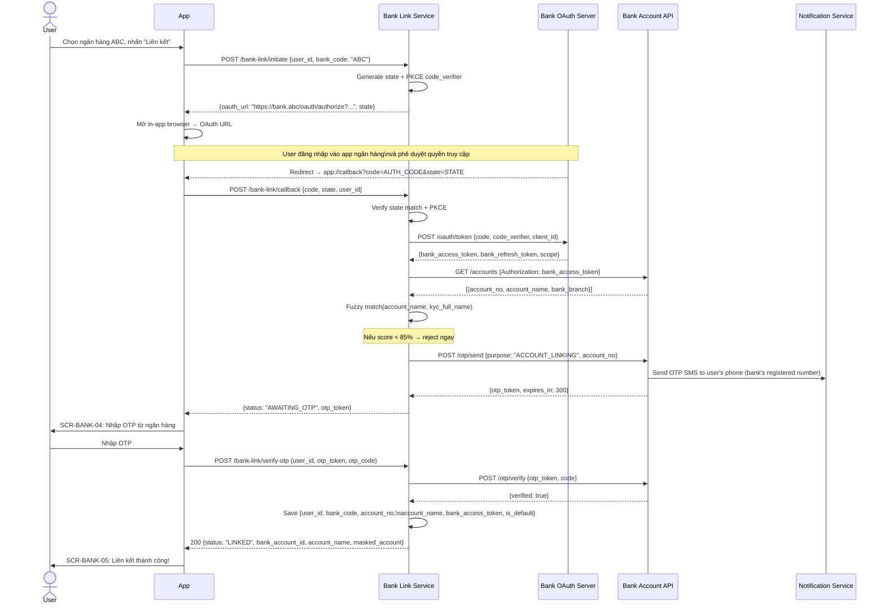
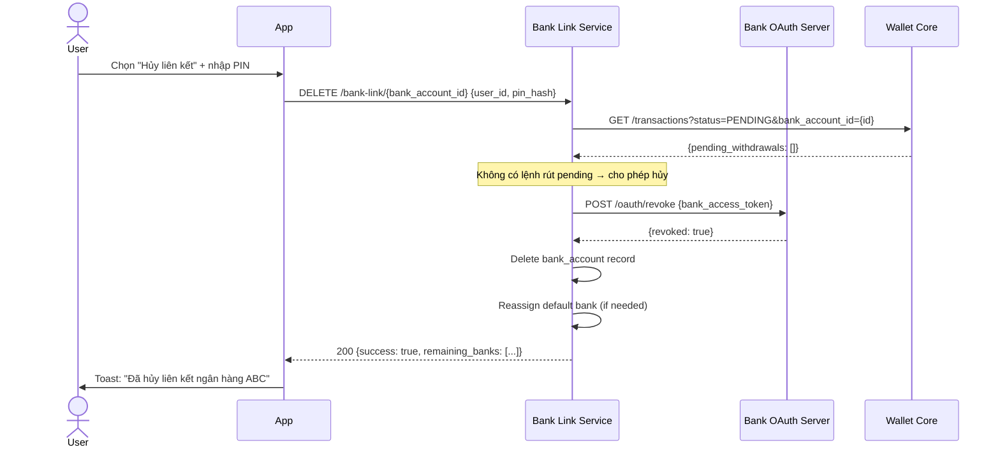

# PRD: Bank Linking Module

<Info>
  **Document ID:** PRD-EW-BANK-001 · **Version:** 1.0 · **Status:** Draft  
  **Ngày tạo:** 2026-05-25 · **Tác giả:** BA Team  
  **Reviewer:** Tech Lead, Security Team, Compliance · **Approver:** Head of Product  
  **Tài liệu liên quan:** PRD-EW-KYC-001, PRD-EW-WALLET-001
</Info>

| Vai trò | Mục đích đọc |
|---|---|
| Tech Lead / Developer | Thiết kế Open Banking OAuth integration; OTP flow; bank account storage |
| Security Team | Review OAuth token handling, OTP ownership verify, unlink authorization |
| Compliance | Confirm 1 TK ngân hàng = 1 chủ sở hữu; lưu trữ đúng quy định |
| QA Lead | Test cases: link mới, max 3 ngân hàng, OTP hết hạn, unlink khi có pending withdrawal |

---

## 1. Tổng quan module

Module Bank Linking cho phép người dùng kết nối tài khoản ngân hàng vào ví điện tử để thực hiện nạp tiền (pull) và rút tiền. Phương thức liên kết sử dụng **Open Banking OAuth** — redirect user sang app/web ngân hàng, xác thực ở đó rồi redirect về — kết hợp **OTP từ ngân hàng** để xác nhận quyền sở hữu.

<Note>
  **Open Banking tại Việt Nam:** NHNN đang triển khai khung Open API (theo Chiến lược tài chính toàn diện đến 2025). Hiện các ngân hàng lớn như Vietcombank, Techcombank, MB đã có API, nhưng mức độ hỗ trợ OAuth/consent flow chưa đồng đều. Trong thực tế triển khai, cần đàm phán API agreement riêng với từng ngân hàng. Tài liệu này thiết kế theo chuẩn OAuth 2.0 Authorization Code Flow.
</Note>

### 1.1 Giới hạn & Quy tắc

| Rule | Chi tiết |
|---|---|
| Số ngân hàng tối đa | 3 tài khoản / user |
| Yêu cầu KYC | Phải hoàn thành KYC Tier 2 trước khi liên kết |
| Sở hữu TK | Tên chủ TK ngân hàng phải khớp với tên KYC (so sánh fuzzy match ≥ 85%) |
| Ngân hàng mặc định | User chỉ định 1 ngân hàng mặc định cho nạp/rút |
| Hủy liên kết | Không được hủy khi có lệnh rút đang pending; cần PIN xác nhận |
| Phí | Miễn phí — không thu phí liên kết hoặc hủy liên kết |

---

## 2. Danh sách màn hình

| Screen ID | Tên màn hình | Điều kiện hiển thị |
|---|---|---|
| SCR-BANK-01 | Quản lý ngân hàng liên kết | Settings > Ngân hàng liên kết; hoặc khi nạp/rút chưa có ngân hàng |
| SCR-BANK-02 | Chọn ngân hàng để liên kết | User nhấn "Thêm ngân hàng" |
| SCR-BANK-03 | Màn hình chuyển tiếp (redirect) | Đang redirect sang bank OAuth |
| SCR-BANK-04 | OTP xác nhận liên kết | Sau khi OAuth callback thành công |
| SCR-BANK-05 | Liên kết thành công | OTP đúng + name match passed |
| SCR-BANK-06 | Liên kết thất bại | OAuth denied / name mismatch / OTP sai max |
| SCR-BANK-07 | Chi tiết ngân hàng liên kết | Tap vào 1 ngân hàng trong danh sách |
| SCR-BANK-08 | Xác nhận hủy liên kết | User chọn "Hủy liên kết" |
| SCR-BANK-09 | Nhập PIN để hủy liên kết | Sau khi confirm hủy |

---

## 3. User Flow — Thêm ngân hàng (Open Banking OAuth)

```mermaid
flowchart TD
    A([User vào\n"Thêm ngân hàng"]) --> B{KYC Tier ≥ 2?}
    B -- Không --> C[Banner: Cần KYC trước\nLink đến KYC module]
    B -- Có --> D{Đã có ≥ 3\nngân hàng?}
    D -- Có --> E[Thông báo: Đã đạt\ntối đa 3 ngân hàng]
    D -- Chưa --> F[SCR-BANK-02\nChọn ngân hàng]

    F --> G[User chọn ngân hàng\ntừ danh sách hỗ trợ]
    G --> H[SCR-BANK-03\nMàn hình chuyển tiếp]
    H --> I[App mở Bank OAuth URL\n(in-app browser hoặc\nredirect sang bank app)]

    I --> J{User xác thực\ntrên app ngân hàng}
    J -- User từ chối\n/ đóng trình duyệt --> K[SCR-BANK-06\nLiên kết thất bại:\nUser huỷ]
    J -- Lỗi OAuth\n(timeout, bank error) --> L[SCR-BANK-06\nLiên kết thất bại:\nLỗi kết nối ngân hàng]
    J -- Thành công\nOAuth callback --> M[Nhận authorization_code\nfrom bank redirect URI]

    M --> N[Exchange code → bank_access_token]
    N --> O[Lấy thông tin TK:\nsố TK + tên chủ TK]
    O --> P{Tên chủ TK khớp\nKYC name ≥ 85%?}
    P -- Không khớp --> Q[SCR-BANK-06\nThất bại: Tên TK không\nkhớp với danh tính KYC]
    P -- Khớp --> R[Yêu cầu ngân hàng\ngửi OTP xác nhận liên kết]

    R --> S[SCR-BANK-04\nNhập OTP từ ngân hàng]
    S --> T{OTP đúng?}
    T -- Sai 1-2 lần --> U[Thông báo lỗi + còn lại]
    U --> S
    T -- Sai 3 lần --> V[SCR-BANK-06\nThất bại: OTP sai\nquá nhiều lần]
    T -- Đúng --> W[Lưu ngân hàng\nvào profile user]
    W --> X{Đây là ngân hàng\nliên kết đầu tiên?}
    X -- Có --> Y[Tự động đặt làm\nngân hàng mặc định]
    X -- Không --> Z[User chọn giữ\nmặc định hiện tại\nhoặc đổi sang mới]
    Y --> AA[SCR-BANK-05\nLiên kết thành công]
    Z --> AA
```

---

## 4. User Flow — Hủy liên kết ngân hàng

```mermaid
flowchart TD
    A([User chọn\n"Hủy liên kết"]) --> B{Có lệnh rút\npending với TK này?}
    B -- Có --> C[Block hủy:\n'Có lệnh rút đang xử lý.\nVui lòng đợi hoàn tất.']
    B -- Không --> D{Đây là ngân hàng\nduy nhất còn lại\nvà Tier 2+?}
    D -- Có --> E[Block hủy:\n'Cần ít nhất 1 ngân hàng\nliên kết để rút tiền.']
    D -- Không --> F[SCR-BANK-08\nXác nhận hủy liên kết\nHiện thị tên bank + số TK]

    F --> G{User xác nhận?}
    G -- Hủy --> H([Thoát; không thay đổi])
    G -- Xác nhận --> I[SCR-BANK-09\nNhập PIN]
    I --> J{PIN đúng?}
    J -- Sai < 5 lần --> K[Lỗi + số lần còn lại]
    K --> I
    J -- Sai 5 lần --> L[Khóa account 30 phút]
    J -- Đúng --> M[Revoke bank_access_token\nXóa bank account record]
    M --> N{Đây là\nngân hàng mặc định?}
    N -- Có --> O[Nếu còn ngân hàng khác:\nTự động chọn mặc định mới]
    N -- Không --> P[Không thay đổi mặc định]
    O --> Q[SCR-BANK-01\nDanh sách đã cập nhật\n+ Toast: Hủy liên kết thành công]
    P --> Q
```

---

## 5. Sequence Diagram — Liên kết ngân hàng (OAuth 2.0 + OTP)



---

## 6. Sequence Diagram — Hủy liên kết



---

## 7. Screen Specifications

### SCR-BANK-01 — Danh sách ngân hàng liên kết

```
┌─────────────────────────────────┐
│  ←       Ngân hàng liên kết    │
│                                 │
│  ┌───────────────────────────┐  │
│  │ [Logo MB] MBBank ****1234 │  │
│  │              [Mặc định ✓] │  │
│  └───────────────────────────┘  │
│  ┌───────────────────────────┐  │
│  │ [Logo VCB] Vietcombank    │  │
│  │                 ****5678  │  │
│  └───────────────────────────┘  │
│                                 │
│  ─── hoặc (khi list rỗng) ───   │
│  [Illustration: no bank]        │
│  Chưa có ngân hàng liên kết    │
│                                 │
│       [ + Thêm ngân hàng ]      │  ← disabled khi = 3
│                                 │
│  ╔═══════════════════════════╗  │
│  ║ Xác minh KYC để liên kết ║  │  ← Tier 1 only
│  ╚═══════════════════════════╝  │
└─────────────────────────────────┘
```

| Component | Loại | Nội dung | Điều kiện | Action |
|---|---|---|---|---|
| Page title | Text H1 | "Ngân hàng liên kết" | Always | — |
| Bank card list | List | Logo + Tên ngân hàng + [3-4 số TK cuối] + Tag "Mặc định" (nếu có) | Per linked bank | Tap → SCR-BANK-07 |
| "Mặc định" badge | Badge (green) | "Mặc định" | Trên ngân hàng default | — |
| Empty state | Illustration + Text | "Chưa có ngân hàng liên kết. Thêm ngay để nạp/rút tiền." | Khi list rỗng | — |
| "Thêm ngân hàng" | Primary button | "+ Thêm ngân hàng" | Khi count < 3 | Sang SCR-BANK-02 |
| "Đã đạt tối đa" | Disabled button | "+ Thêm ngân hàng" + tooltip "Tối đa 3 ngân hàng" | Khi count = 3 | — |
| KYC gate | Banner (orange) | "Xác minh danh tính để liên kết ngân hàng" | Nếu Tier < 2 | Link KYC |

---

### SCR-BANK-02 — Chọn ngân hàng

```
┌─────────────────────────────────┐
│  ←          Chọn ngân hàng     │
│  ┌───────────────────────────┐  │
│  │ 🔍 Tìm tên ngân hàng...   │  │
│  └───────────────────────────┘  │
│                                 │
│  Phổ biến                       │
│  [VCB] [TCB] [MB] [VPB] [ACB]  │
│                                 │
│  Tất cả                         │
│  ┌───────────────────────────┐  │
│  │ [Logo] Agribank           │  │
│  │ [Logo] BIDV               │  │
│  │ [Logo] Eximbank           │  │
│  │ ...                       │  │
│  └───────────────────────────┘  │
│                                 │
│   [ Liên kết với MBBank ]       │  ← sau khi chọn
└─────────────────────────────────┘
```

| Component | Loại | Nội dung | Điều kiện | Action |
|---|---|---|---|---|
| Search bar | Text input | "Tìm tên ngân hàng" | Always | Filter list realtime |
| Bank list | Scrollable list | Logo + Tên ngân hàng (sort: phổ biến trước) | Always | Chọn 1 |
| Popular section | Section header | "Phổ biến" | Always | — |
| All banks section | Section header | "Tất cả" | Always | — |
| Supported badge | — | Chỉ hiện ngân hàng hỗ trợ Open Banking | Always | Ẩn bank không hỗ trợ |
| "Tiếp tục" | Primary button | "Liên kết với {bank_name}" | Sau khi chọn | Trigger OAuth flow |

---

### SCR-BANK-03 — Màn hình chuyển tiếp

```
┌─────────────────────────────────┐
│                                 │
│         [ Logo MBBank ]         │
│                                 │
│              ◌◌◌ (loading)      │
│                                 │
│   Đang chuyển bạn đến MBBank   │
│       để xác thực...            │
│                                 │
│  🔒 Thông tin đăng nhập ngân    │
│     hàng không được chia sẻ     │
│     với chúng tôi.              │
│                                 │
│         Hủy liên kết            │
└─────────────────────────────────┘
```

| Component | Loại | Nội dung | Điều kiện | Action |
|---|---|---|---|---|
| Bank logo | Image | Logo ngân hàng vừa chọn | Always | — |
| Animation | Loading | Vòng tròn loading | Always | — |
| Instruction | Text | "Đang chuyển bạn đến {bank_name} để xác thực..." | Always | — |
| Security note | Text (small, grey) | "🔒 Thông tin đăng nhập ngân hàng của bạn không được chia sẻ với chúng tôi." | Always | — |
| "Hủy" | Text link | "Hủy liên kết" | Always | Hủy OAuth; về SCR-BANK-02 |
| Timeout (30s) | Auto | Nếu sau 30s không redirect về | Timeout | Hiển thị error; về SCR-BANK-06 |

---

### SCR-BANK-04 — OTP từ ngân hàng

```
┌─────────────────────────────────┐
│  ←                             │
│         [ Logo MBBank ]         │
│                                 │
│   Nhập mã xác nhận từ MBBank   │
│                                 │
│  Mã OTP đã được gửi đến số     │
│  điện thoại đăng ký tại MBBank  │
│                                 │
│   ┌──┐ ┌──┐ ┌──┐ ┌──┐ ┌──┐ ┌──┐│
│   │  │ │  │ │  │ │  │ │  │ │  ││
│   └──┘ └──┘ └──┘ └──┘ └──┘ └──┘│
│                                 │
│  ⚠ Mã không đúng. Còn 2 lần.  │  ← sau lần sai đầu
│                                 │
│         Gửi lại sau 45s         │
│       Chọn ngân hàng khác       │
└─────────────────────────────────┘
```

| Component | Loại | Nội dung | Điều kiện | Action |
|---|---|---|---|---|
| Bank logo | Image | Logo ngân hàng | Always | — |
| Title | Text | "Nhập mã xác nhận từ {bank_name}" | Always | — |
| Description | Text | "Mã OTP đã được gửi đến số điện thoại đăng ký tại {bank_name}" | Always | — |
| OTP input | 6-cell input | ○ ○ ○ ○ ○ ○ | Always | Numeric; auto-submit khi đủ 6 số |
| Countdown | Text | "Gửi lại sau {N}s" | 60s đầu | Disabled |
| "Gửi lại OTP" | Text button | "Gửi lại mã" | Sau 60s | Gọi lại bank OTP API |
| Attempt counter | Text (orange) | "Mã không đúng. Còn {N} lần." | Sau lần sai đầu | — |
| "Thay đổi ngân hàng" | Text link | "Chọn ngân hàng khác" | Always | Hủy flow; về SCR-BANK-02 |

---

### SCR-BANK-07 — Chi tiết ngân hàng liên kết

```
┌─────────────────────────────────┐
│  ←                             │
│         [ Logo MBBank ]         │
│           MBBank                │
│        [Ngân hàng mặc định ✓]  │
│                                 │
│  ┌───────────────────────────┐  │
│  │ Chủ TK  NGUYEN DUC CHINH  │  │
│  │ Số TK   **** **** 1234    │  │
│  │ Chi nhánh  Hà Nội - Ba Đình│  │
│  │ Liên kết   26/05/2026     │  │
│  └───────────────────────────┘  │
│                                 │
│  [ Đặt làm mặc định ]          │  ← ẩn nếu đã là default
│                                 │
│  ╔═══════════════════════════╗  │
│  ║ ⚠ Có lệnh rút đang xử lý ║  │  ← nếu có pending
│  ╚═══════════════════════════╝  │
│                                 │
│  [ Hủy liên kết ngân hàng ]    │  ← màu đỏ; disabled nếu pending
└─────────────────────────────────┘
```

| Component | Loại | Nội dung | Điều kiện | Action |
|---|---|---|---|---|
| Bank logo + name | Header | Logo + tên ngân hàng | Always | — |
| Account info | Card | Tên chủ TK · Số TK (ẩn 4 số giữa) · Ngân hàng · Chi nhánh | Always | — |
| Default badge | Badge | "Ngân hàng mặc định" | Nếu là default | — |
| "Đặt làm mặc định" | Button | "Đặt làm mặc định" | Nếu không phải default | Set default |
| Linked date | Text (small) | "Liên kết ngày: {date}" | Always | — |
| "Hủy liên kết" | Danger button | "Hủy liên kết ngân hàng" | Always | Sang SCR-BANK-08 |
| Pending withdrawal warning | Banner (orange) | "Có lệnh rút đang xử lý với ngân hàng này. Không thể hủy liên kết lúc này." | Khi có pending withdrawal | Disable nút hủy |

---

## 8. Validation Rules

| Bước | Rule | Thông báo | Trigger |
|---|---|---|---|
| **Chọn ngân hàng** | Ngân hàng phải hỗ trợ Open Banking | Chỉ hiển thị ngân hàng hỗ trợ (ẩn không hỗ trợ) | Pre-filter |
| | Chưa đạt max 3 ngân hàng | "Đã đạt tối đa 3 ngân hàng liên kết." | Pre-check |
| | User phải là Tier 2+ | "Cần xác minh danh tính trước." | Pre-check |
| **OAuth callback** | `state` parameter phải khớp (CSRF protection) | Reject silently; log security event | Server |
| | OAuth scope phải bao gồm `accounts:read` | "Bạn chưa cấp đủ quyền. Vui lòng thử lại và cho phép toàn bộ quyền." | After token exchange |
| **Name matching** | Tên chủ TK ngân hàng fuzzy match với KYC name ≥ 85% | "Tên tài khoản ngân hàng không khớp với danh tính đã xác minh. Liên hệ CSKH nếu cần hỗ trợ." | Server-side |
| **OTP** | Đúng 6 chữ số | — (auto-submit khi đủ 6 số) | On input |
| | OTP còn hạn (5 phút) | "Mã OTP đã hết hạn. Vui lòng gửi lại." | After API |
| | Sai tối đa 3 lần | "Nhập sai quá nhiều lần. Vui lòng thử liên kết lại." | After 3rd fail |
| | Gửi lại tối đa 3 lần | "Đã gửi lại quá nhiều lần. Vui lòng thử liên kết lại sau." | After 3rd resend |
| **Hủy liên kết** | Không có lệnh rút pending | "Đang có lệnh rút tiền xử lý qua ngân hàng này. Vui lòng đợi hoàn tất." | Pre-check |
| | Tier 2+ phải còn ≥ 1 ngân hàng | "Không thể hủy ngân hàng duy nhất còn lại." | Pre-check |
| | PIN đúng | "PIN không đúng. Còn {N} lần." | After API |

---

## 9. Business Rules

| ID | Rule | Áp dụng tại |
|---|---|---|
| BR-BANK-01 | User phải hoàn thành KYC Tier 2 trước khi liên kết ngân hàng | SCR-BANK-01 (gate), API |
| BR-BANK-02 | Tối đa 3 ngân hàng liên kết / user | SCR-BANK-02 (disable), API |
| BR-BANK-03 | Tên chủ tài khoản ngân hàng phải khớp tên KYC (fuzzy ≥ 85%) | Sau OAuth callback, server-side |
| BR-BANK-04 | Cùng 1 số tài khoản ngân hàng không thể liên kết 2 user khác nhau | Server duplicate check |
| BR-BANK-05 | OTP do ngân hàng gửi (không phải OTP của ví); hết hạn 5 phút | SCR-BANK-04 |
| BR-BANK-06 | Tối đa 3 lần nhập sai OTP ngân hàng → hủy flow; phải bắt đầu lại | SCR-BANK-04 |
| BR-BANK-07 | Ngân hàng mặc định: nếu chỉ có 1 ngân hàng → tự động là mặc định | Auto-set |
| BR-BANK-08 | Không được hủy liên kết khi có lệnh rút pending (status = PROCESSING hoặc PENDING) | SCR-BANK-08, API |
| BR-BANK-09 | PIN bắt buộc khi hủy liên kết (bảo vệ nếu session bị chiếm) | SCR-BANK-09 |
| BR-BANK-10 | Khi hủy ngân hàng mặc định và còn ngân hàng khác: tự động chọn ngân hàng liên kết sớm nhất làm mặc định mới | Post-unlink |
| BR-BANK-11 | bank_access_token phải được revoke ở phía ngân hàng khi hủy liên kết | Bank OAuth API |
| BR-BANK-12 | bank_access_token lưu encrypted tại server (không lưu client-side) | Security |
| BR-BANK-13 | Hủy liên kết ngân hàng **không xóa** lịch sử giao dịch liên quan — transaction records là audit log bất biến và vẫn hiển thị trong Transaction History với tên ngân hàng gốc | Transaction History, Audit |
| BR-BANK-14 | Khi STK tài khoản ngân hàng thay đổi (ngân hàng cấp STK mới): user phải unlink rồi re-link lại — hệ thống không hỗ trợ update STK in-place | Bank Linking Flow |
| BR-BANK-15 | Fuzzy name match score 75–84%: hiển thị cảnh báo "Tên tài khoản không khớp hoàn toàn — {matched_name}. Tiếp tục?" và yêu cầu user xác nhận tường minh (tap "Xác nhận dù khác tên") trước khi liên kết | SCR-BANK-04, Name Validation |

---

## 10. Notification Specifications

| Event | Channel | Nội dung | Thời điểm |
|---|---|---|---|
| Liên kết thành công | Push + In-app | "✅ Đã liên kết tài khoản {bank_name} ({masked_account}). Bạn có thể nạp và rút tiền ngay." | Ngay khi link thành công |
| Liên kết thất bại — name mismatch | In-app | "Không thể liên kết: Tên tài khoản ngân hàng không khớp với danh tính của bạn. Liên hệ CSKH để được hỗ trợ." | Ngay khi fail |
| Liên kết thất bại — OTP sai max | In-app | "Liên kết thất bại do nhập sai OTP quá nhiều lần. Vui lòng thử lại." | Sau lần thứ 3 |
| Hủy liên kết thành công | Push + In-app | "Đã hủy liên kết tài khoản {bank_name} ({masked_account})." | Ngay khi unlink |
| Đăng nhập bất thường sau khi liên kết | Push | "Tài khoản ngân hàng {bank_name} vừa được liên kết với ví của bạn lúc {time}. Không phải bạn? Hủy ngay." | Ngay khi link (thêm cảnh báo security) |

---

## 11. API Summary

| Method | Endpoint | Request | Response | Mô tả |
|---|---|---|---|---|
| GET | `/bank-link/banks` | — | `[[bank_code, bank_name, logo_url, supports_oauth]]` | Danh sách ngân hàng hỗ trợ |
| POST | `/bank-link/initiate` | `[user_id, bank_code]` | `[oauth_url, state, expires_in]` | Khởi tạo OAuth flow; trả URL redirect |
| POST | `/bank-link/callback` | `[code, state, user_id]` | `[status, otp_token?]` | Xử lý OAuth callback; gửi OTP ngân hàng |
| POST | `/bank-link/verify-otp` | `[user_id, otp_token, otp_code]` | `[bank_account_id, account_name, masked_account]` | Xác thực OTP; lưu ngân hàng |
| GET | `/bank-link/accounts` | — (header: token) | `[[bank_account_id, bank_name, masked_account, is_default]]` | Lấy danh sách ngân hàng đã liên kết |
| PUT | `/bank-link/accounts/{id}/default` | — | `[success: true]` | Đặt làm ngân hàng mặc định |
| DELETE | `/bank-link/accounts/{id}` | `{pin_hash}` | `[success: true, remaining_banks]` | Hủy liên kết ngân hàng |

---

## 12. Error Codes

| Code | HTTP | Hiển thị user | Ghi chú dev |
|---|---|---|---|
| `BANK_001` | 403 | "Cần xác minh danh tính (KYC Tier 2) để liên kết ngân hàng." | tier < TIER_2 |
| `BANK_002` | 400 | "Đã đạt tối đa 3 ngân hàng liên kết." | count >= 3 |
| `BANK_003` | 400 | "Tài khoản ngân hàng này đã được liên kết." | Duplicate account_no for same user |
| `BANK_004` | 409 | "Tài khoản ngân hàng này đang được liên kết với người dùng khác." | Duplicate account_no across users |
| `BANK_005` | 400 | "Tên tài khoản ngân hàng không khớp với danh tính của bạn. Liên hệ CSKH." | name fuzzy score < 85% |
| `BANK_006` | 400 | "Mã OTP không đúng. Còn {N} lần thử." | OTP incorrect |
| `BANK_007` | 429 | "Nhập sai OTP quá nhiều lần. Vui lòng liên kết lại." | OTP max attempts |
| `BANK_008` | 400 | "Phiên kết nối ngân hàng đã hết hạn. Vui lòng thử lại." | OAuth state expired |
| `BANK_009` | 503 | "Không kết nối được với {bank_name} lúc này. Thử lại sau." | Bank OAuth server down |
| `BANK_010` | 400 | "Không thể hủy: Đang có lệnh rút tiền đang xử lý." | Pending withdrawal exists |
| `BANK_011` | 400 | "Không thể hủy ngân hàng duy nhất còn lại (Tier 2+ cần có ngân hàng liên kết)." | Last bank for Tier 2+ |
| `BANK_012` | 400 | "Bạn chưa cấp đủ quyền truy cập. Vui lòng thử lại và cho phép toàn bộ quyền." | Insufficient OAuth scope |

---

## 13. Edge Cases

| Trường hợp | Xử lý |
|---|---|
| User đóng browser trong khi đang OAuth (không redirect về) | `state` token expire sau 10 phút; App detect timeout → SCR-BANK-06 |
| Bank server down trong khi đang OAuth | OAuth callback trả error; App hiển thị lỗi ngân hàng; không retry tự động |
| Tên KYC là tên đệm nhưng ngân hàng lưu không có tên đệm (ví dụ: "Nguyen Duc Chinh" vs "Nguyen Chinh") | Fuzzy match algorithm xử lý; nếu score 75–84%: flag manual review thay vì reject ngay |
| User có 2 tài khoản tại cùng 1 ngân hàng (STK khác nhau) | Cho phép liên kết cả 2 miễn là còn trong giới hạn 3; phân biệt bằng `account_no` |
| bank_access_token expire (thường 90 ngày) trước khi user thực hiện giao dịch | Wallet Core dùng bank_refresh_token để lấy token mới; nếu refresh fail → notify user re-link |
| User mở màn hình OAuth trên 2 thiết bị cùng lúc | `state` là GUID unique per session; chỉ session đúng state được accept callback |
| Hủy liên kết ngân hàng đang dùng làm nguồn nạp trong lệnh scheduled (tương lai) | Block hủy; thông báo "Ngân hàng này đang được dùng trong lịch nạp tiền tự động. Hủy lịch trước." |
| Ngân hàng thay đổi số tài khoản của user (nâng cấp tài khoản, hợp nhất ngân hàng) | Tài khoản cũ không còn hợp lệ → topup/withdraw fail → WALLET_011; App gợi ý "Ngân hàng này không khả dụng. Vui lòng hủy liên kết và liên kết lại với số tài khoản mới." |
| Ngân hàng bảo trì planned downtime (thường 0:00–6:00 Chủ Nhật) | OAuth và API calls đến ngân hàng fail → hiển thị banner "Ngân hàng [tên] đang bảo trì, thử lại sau. Các ngân hàng khác vẫn hoạt động bình thường." |

---

## 14. Roadmap — Tính năng phát triển

<Info>
  Các mục dưới đây yêu cầu làm rõ từ phía đối tác ngân hàng, Security Team và Compliance trước Sprint tương ứng. Một số quyết định ảnh hưởng đến kiến trúc tích hợp và không thể dễ dàng đảo ngược sau launch.
</Info>

<AccordionGroup>
  <Accordion title="[Sprint 1] Xác định danh sách ngân hàng hỗ trợ & Chiến lược Aggregator" icon="building-columns">
    **Team:** Tech Lead + Business Dev · **Ưu tiên:** Critical

    Xác định danh sách chính thức các **ngân hàng hỗ trợ Open Banking OAuth** trong MVP. Quyết định kiến trúc tích hợp: mỗi ngân hàng có adapter riêng (direct integration) hay tích hợp tập trung qua **aggregator** (BankHub, Finplex hoặc tương đương) để giảm effort thêm bank mới sau này.

    **Yêu cầu chính:** Business Dev confirm partnership; Tech Lead thiết kế Bank Adapter pattern; cập nhật SCR-BANK-01 với list ngân hàng chính thức và logo.  
    **Phụ thuộc:** Thỏa thuận thương mại với từng ngân hàng hoặc aggregator; timeline ký kết hợp đồng API.
  </Accordion>

  <Accordion title="[Sprint 1] Fuzzy Name Match — Policy cho score 75–84%" icon="user-check">
    **Team:** Compliance + Risk · **Ưu tiên:** High

    Xác định xử lý khi tên chủ tài khoản ngân hàng match **75–84%** với tên KYC: (A) **Auto-reject** và yêu cầu user kiểm tra lại; hoặc (B) Đưa vào **manual review queue** để CS xác nhận. Ảnh hưởng đến tỷ lệ link thành công và rủi ro định danh sai.

    **Yêu cầu chính:** Compliance + Risk quyết định phương án; BA cập nhật BR-BANK-04 và Validation Rules; thiết kế thông báo lỗi / trạng thái phù hợp cho từng phương án.  
    **Phụ thuộc:** Phân tích dữ liệu tên người Việt (biến thể dấu, viết tắt họ, tên đệm) để calibrate fuzzy threshold.
  </Accordion>

  <Accordion title="[Sprint 1] Kiến trúc lưu trữ Bank Token — HSM vs Encrypted DB" icon="database">
    **Team:** Security · **Ưu tiên:** Critical

    Quyết định nơi lưu trữ `bank_access_token` và `bank_refresh_token`: (A) **HSM** — bảo mật cao nhất, chi phí cao; (B) **Encrypted DB** với KMS-managed key — cân bằng bảo mật và chi phí. Đây là quyết định kiến trúc không thể đảo ngược dễ dàng sau launch.

    **Yêu cầu chính:** Security Team ra ADR; thiết kế key rotation policy; document vào Security NFR của module; cập nhật hướng dẫn triển khai cho DevOps.  
    **Phụ thuộc:** Infrastructure team đánh giá cost HSM; Compliance xác nhận yêu cầu tối thiểu theo quy định.
  </Accordion>

  <Accordion title="[Sprint 2] Fallback cho ngân hàng chưa hỗ trợ Open Banking OAuth" icon="rotate">
    **Team:** Product · **Ưu tiên:** Medium

    Thiết kế luồng liên kết thay thế cho ngân hàng chưa có Open Banking API: nhập **STK + tên chủ tài khoản** rồi verify qua **NAPAS lookup** hoặc **micro-transaction** (nạp 1,000đ, xác nhận số tiền). Mở rộng độ phủ ngân hàng mà không cần chờ ngân hàng mở API.

    **Yêu cầu chính:** BA thiết kế thêm luồng fallback cho SCR-BANK-02; kết nối NAPAS name lookup API; document vào module Bank Linking.  
    **Phụ thuộc:** NAPAS cấp quyền truy cập API lookup; Compliance xác nhận validity của phương thức xác minh thay thế.
  </Accordion>

  <Accordion title="[Sprint 2] Thông báo chủ động trước khi Bank Token hết hạn" icon="bell-slash">
    **Team:** Product + Tech · **Ưu tiên:** Medium

    Implement cơ chế **proactive notification** gửi cho user trước khi `bank_refresh_token` hết hạn, nhắc nhở re-link để tránh gián đoạn dịch vụ nạp tiền. Thời gian cảnh báo: đề xuất **7 ngày** và **1 ngày** trước khi hết hạn.

    **Yêu cầu chính:** Background job kiểm tra token expiry hàng ngày; gửi push + email reminder với link deep link vào màn re-link; cập nhật Notification spec của module.  
    **Phụ thuộc:** Tech xác nhận lịch expire của từng bank token; Product xác nhận messaging và CTA cho notification.
  </Accordion>
</AccordionGroup>

---

## 15. Non-Functional Requirements (NFR)

### Performance

| Chỉ số | Target | Ghi chú |
|---|---|---|
| Danh sách ngân hàng hỗ trợ load | P95 < 500ms | Server-side cache; invalidate mỗi 24h |
| OAuth redirect (App → Bank) | < 1s | Chỉ là redirect; không xử lý business logic |
| OAuth callback processing | P95 < 1s | Validate state, exchange code lấy token |
| OTP verify response | P95 < 500ms | So sánh OTP; không gọi external service |
| Bank list refresh | Tối đa 1 lần/ngày | Không real-time; cache chấp nhận stale 24h |

### Bảo mật (Security)

| Yêu cầu | Mô tả |
|---|---|
| bank_access_token storage | Mã hóa tại KMS (Key Management Service) hoặc HSM; không lưu plaintext trong DB |
| OAuth state parameter | GUID unique per session; single-use; expire sau 10 phút; ngăn CSRF attack |
| OTP single-use | OTP hết hạn ngay sau khi verify thành công; không reuse |
| bank_refresh_token rotation | Mỗi lần dùng refresh token → issue token mới + revoke token cũ |
| Name verification | Fuzzy match chạy server-side; không expose score cho client; client chỉ nhận pass/fail/manual |
| Unlink authorization | Bắt buộc PIN confirm; không cho phép unlink qua email/SMS (tránh social engineering) |

### Tính sẵn sàng & Độ tin cậy

| Chỉ số | Target | Ghi chú |
|---|---|---|
| Bank Linking Service uptime | ≥ 99.9% | Non-critical path; có thể chấp nhận planned downtime |
| Bank OAuth endpoint dependency | Biến động theo từng ngân hàng | Có fallback message: "Ngân hàng đang bảo trì, thử lại sau" |
| OAuth timeout | 10 phút | Sau đó state expire; user phải bắt đầu lại |
| bank_access_token TTL | 90 ngày (điển hình) | Vary theo từng ngân hàng; hệ thống cần theo dõi expiry |

### Lưu trữ & Compliance

| Loại dữ liệu | Thời gian lưu | Ghi chú |
|---|---|---|
| Bank link audit logs (link/unlink/fail) | 5 năm | Dispute resolution & compliance |
| Name matching audit (score + decision) | 5 năm | Có thể cần giải trình với Compliance |
| bank_access_token | Đến khi expire hoặc user unlink | Xóa ngay khi unlink |
| bank_refresh_token | Đến khi expire hoặc user unlink | Revoke ngay khi unlink |
| OAuth authorization codes | 1 ngày (single-use, expire ngay) | Cleanup job hàng ngày |
