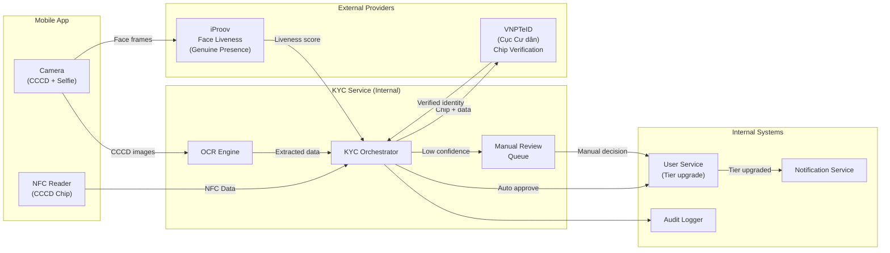
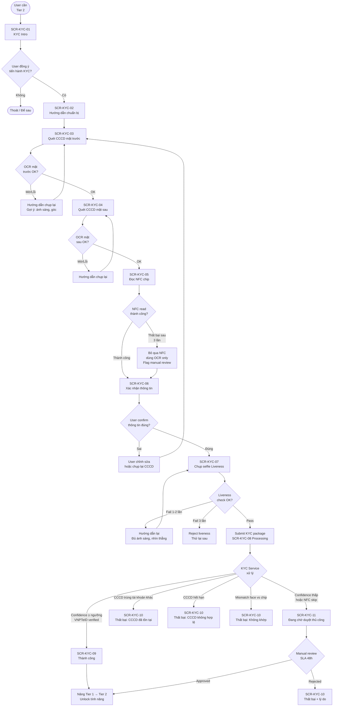
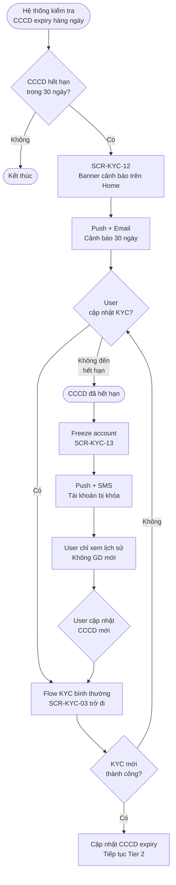
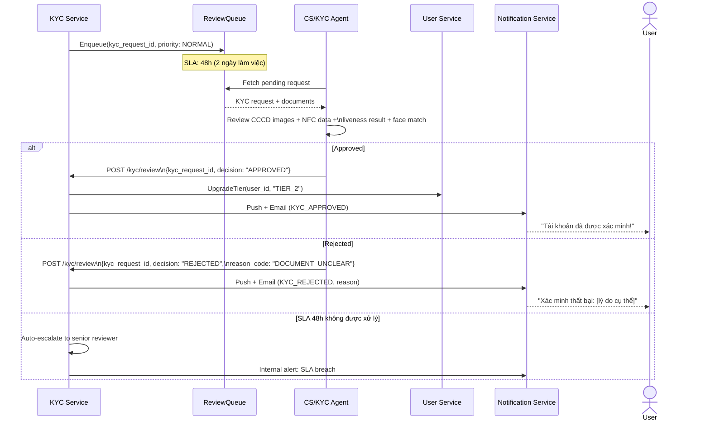

# PRD: KYC Module

<Info>
  **Document ID:** PRD-EW-KYC-001 · **Version:** 1.0 · **Status:** Draft  
  **Ngày tạo:** 2026-05-25 · **Tác giả:** BA Team  
  **Reviewer:** Tech Lead, Compliance, Security Team · **Approver:** Head of Product  
  **Tài liệu liên quan:** PRD-EW-AUTH-001, PRD-EW-WALLET-001
</Info>

| Vai trò | Mục đích đọc |
|---|---|
| Tech Lead / Developer | Tích hợp VNPTeID SDK + iProov SDK; thiết kế KYC Service |
| Compliance / Legal | Đảm bảo đúng Nghị định 52/2024 về xác minh danh tính |
| Security Team | Review NFC data handling, liveness check, duplicate detection |
| QA Lead | Test cases: scan thành công, OCR mờ, liveness fail, CCCD trùng, pending → kết quả |
| UX Designer | Hiểu từng bước scan, trạng thái chờ, thông báo kết quả |

---

## 1. Tổng quan module & eKYC Architecture

### 1.1 Mục tiêu

Module KYC xác minh danh tính người dùng để:
- Nâng cấp tài khoản từ **Tier 1 → Tier 2** (mở toàn bộ tính năng giao dịch)
- Tuân thủ Nghị định 52/2024/NĐ-CP về định danh tài khoản ví điện tử
- Phòng chống gian lận: 1 CCCD = 1 tài khoản ví

### 1.2 KYC Tier System

| Tier | Đạt được khi | Hạn mức GD/lần | Hạn mức tháng | Tính năng |
|---|---|---|---|---|
| **Tier 1** | Đăng ký xong (SĐT verified) | 1M VND | 10M VND | Nhận tiền; nạp; không rút |
| **Tier 2** | eKYC thành công (CCCD + Face) | 20M VND | 100M VND | Đầy đủ: rút, chuyển, QR |
| **Tier 3** | Full KYC (manual, dành cho Business/VIP) | 100M VND | 500M VND | Business disbursement |

### 1.3 eKYC Architecture

<Info>
  **Provider được chọn:** **VNPTeID** (xác thực chip CCCD với CSDL Cục Cư dân) + **iProov** (face liveness). Đây là kiến trúc mà các ví điện tử lớn tại Việt Nam (gồm MoMo) đang áp dụng — kết hợp dữ liệu chip chính phủ với liveness detection cấp ngân hàng.
</Info>



**Luồng xử lý:**
1. **NFC Layer**: App đọc dữ liệu chip CCCD (MRZ, ảnh chân dung, thông tin cá nhân được mã hóa)
2. **OCR Layer**: Nhận diện số CCCD, họ tên, ngày sinh từ ảnh chụp mặt trước làm cross-check
3. **Face Liveness (iProov)**: Phân tích frames selfie → xác nhận người thật, không phải ảnh tĩnh hay video replay
4. **VNPTeID Verification**: Gửi dữ liệu chip lên VNPTeID để xác thực với CSDL Cục Cư dân → xác nhận CCCD thật, chưa bị thu hồi
5. **Auto-approve** nếu tất cả confidence score ≥ ngưỡng → nâng tier ngay
6. **Manual fallback** nếu bất kỳ score nào thấp → queue cho KYC reviewer (SLA 48h)

---

## 2. Danh sách màn hình

| Screen ID | Tên màn hình | Điều kiện hiển thị |
|---|---|---|
| SCR-KYC-01 | KYC Intro — Tại sao cần xác minh? | User Tier 1; chưa KYC; vào tính năng cần Tier 2 hoặc vào Settings > Xác minh |
| SCR-KYC-02 | Hướng dẫn chuẩn bị | Sau khi user bắt đầu KYC |
| SCR-KYC-03 | Quét CCCD mặt trước | Bắt đầu scan flow |
| SCR-KYC-04 | Quét CCCD mặt sau | Sau khi mặt trước OK |
| SCR-KYC-05 | Đọc chip NFC | Sau khi cả 2 mặt OK |
| SCR-KYC-06 | Xác nhận thông tin OCR | Sau khi OCR + NFC read OK |
| SCR-KYC-07 | Chụp ảnh selfie — Liveness | Sau khi user confirm thông tin |
| SCR-KYC-08 | Đang xử lý (Processing) | Sau khi submit; chờ auto-approve |
| SCR-KYC-09 | Kết quả — Thành công | Auto-approve hoặc manual approved |
| SCR-KYC-10 | Kết quả — Thất bại | Auto-reject hoặc manual rejected |
| SCR-KYC-11 | Đang chờ duyệt thủ công | Confidence thấp → manual queue |
| SCR-KYC-12 | Cảnh báo CCCD sắp hết hạn | 30 ngày trước ngày hết hạn CCCD |
| SCR-KYC-13 | Tài khoản bị khóa — CCCD hết hạn | Sau ngày hết hạn mà chưa re-KYC |

---

## 3. User Flow — KYC Lần Đầu (Tier 1 → Tier 2)



---

## 4. User Flow — Re-KYC (CCCD sắp hết hạn)



---

## 5. Sequence Diagram — KYC Auto-Approve

```mermaid
sequenceDiagram
    actor User
    participant App
    participant KYCSvc as KYC Service
    participant VNPTeID
    participant iProov
    participant UserSvc as User Service
    participant NotifSvc as Notification Service

    User->>App: Submit KYC (NFC data + CCCD images + selfie frames)
    App->>KYCSvc: POST /kyc/submit\n{user_id, nfc_data, cccd_front_img,\ncccd_back_img, selfie_frames}

    Note over KYCSvc: Tạo kyc_request_id; status = PROCESSING

    par Parallel verification
        KYCSvc->>VNPTeID: VerifyChip(nfc_data)
        VNPTeID-->>KYCSvc: {verified: true, id_number, full_name,\ndob, expiry_date, confidence: 0.98}
    and
        KYCSvc->>iProov: VerifyLiveness(selfie_frames, reference_face)
        Note over iProov: So sánh selfie với ảnh trên chip\nKiểm tra Genuine Presence
        iProov-->>KYCSvc: {liveness_passed: true,\nface_match_score: 0.94, confidence: 0.96}
    end

    KYCSvc->>KYCSvc: Check duplicate CCCD in DB
    KYCSvc->>KYCSvc: Calculate overall_score = min(chip_conf, liveness_conf)

    alt overall_score ≥ 0.85 (Auto-approve threshold)
        KYCSvc->>UserSvc: UpgradeTier(user_id, tier: "TIER_2",\nkyc_data: {id_number, name, dob, expiry})
        UserSvc-->>KYCSvc: {success: true}
        KYCSvc->>NotifSvc: Push(user_id, "KYC_APPROVED")
        KYCSvc-->>App: 200 {status: "APPROVED", tier: "TIER_2"}
        App->>User: SCR-KYC-09: Thành công!

    else 0.70 ≤ overall_score < 0.85 (Manual review)
        KYCSvc->>KYCSvc: Enqueue to manual_review_queue
        KYCSvc-->>App: 200 {status: "PENDING_REVIEW",\nestimated_sla: "48h"}
        App->>User: SCR-KYC-11: Đang chờ duyệt

    else overall_score < 0.70 OR duplicate OR invalid
        KYCSvc->>KYCSvc: Log rejection reason
        KYCSvc-->>App: 200 {status: "REJECTED",\nreason_code: "FACE_MISMATCH"}
        App->>User: SCR-KYC-10: Thất bại + lý do
    end
```

---

## 6. Sequence Diagram — Manual Review Flow



---

## 7. Screen Specifications

### SCR-KYC-01 — KYC Intro

```
┌─────────────────────────────────┐
│                                 │
│      [Illustration: CCCD+phone] │
│                                 │
│       Xác minh danh tính        │
│  Mở khóa đầy đủ tính năng      │
│  chuyển tiền và rút tiền        │
│                                 │
│  ✅ Chuyển tiền đến 20M/lần     │
│  ✅ Rút tiền về ngân hàng       │
│  ✅ Bảo vệ tài khoản cao hơn    │
│                                 │
│  ┌───────────────────────────┐  │
│  │ 📋 CCCD gắn chip còn hạn  │  │
│  │ 📱 Camera và NFC          │  │
│  └───────────────────────────┘  │
│                                 │
│  [ Bắt đầu xác minh ]          │
│        Để sau                   │
└─────────────────────────────────┘
```

| Component | Loại | Nội dung | Điều kiện | Action |
|---|---|---|---|---|
| Illustration | Image | Hình minh họa CCCD + phone | Always | — |
| Title | Text H1 | "Xác minh danh tính" | Always | — |
| Subtitle | Text | "Mở khóa đầy đủ tính năng chuyển tiền và rút tiền" | Always | — |
| Benefit list | List | ✅ Chuyển tiền đến 20 triệu/lần · ✅ Rút tiền về ngân hàng · ✅ Bảo vệ tài khoản | Always | — |
| What you need | Info box | "📋 CCCD gắn chip còn hạn · 📱 Camera và NFC" | Always | — |
| Legal note | Text (small) | "Theo Nghị định 52/2024/NĐ-CP, ví điện tử yêu cầu xác minh danh tính." | Always | — |
| "Bắt đầu xác minh" | Primary button | "Bắt đầu xác minh" | Always | Sang SCR-KYC-02 |
| "Để sau" | Text link | "Để sau" | Always | Đóng flow; về trang trước |

---

### SCR-KYC-03 — Quét CCCD Mặt Trước

```
┌─────────────────────────────────┐
│  ① Mặt trước ② Mặt sau ③ NFC ④ Selfie│
│                                 │
│  ┌─────────────────────────┐   │
│  │                         │   │
│  │  ┌───────────────────┐  │   │
│  │  │                   │  │   │
│  │  │  [ CCCD FRAME ]   │  │   │  ← khung tỷ lệ CCCD
│  │  │                   │  │   │
│  │  └───────────────────┘  │   │
│  │                         │   │
│  └─────────────────────────┘   │
│                                 │
│  Đặt CCCD vào trong khung      │
│  Giữ cách 20–30cm              │
│                                 │
│  ⚡ [flash]   [Chụp ngay]       │  ← "Chụp ngay" sau 10s
└─────────────────────────────────┘
```

| Component | Loại | Nội dung | Điều kiện | Action |
|---|---|---|---|---|
| Camera viewfinder | Camera | Live camera feed | Always | — |
| CCCD overlay | Overlay | Khung hình chữ nhật tỷ lệ CCCD | Always | Guide position |
| Instruction text | Text | "Đặt CCCD vào trong khung · Giữ điện thoại cách CCCD 20–30cm" | Always | — |
| Progress indicator | Step dots | ① Mặt trước ② Mặt sau ③ NFC ④ Selfie | Always | — |
| Auto-capture indicator | Animation | Vòng xanh khi ảnh đạt chất lượng | Khi chất lượng đủ | Auto-capture sau 1s |
| Flash toggle | Icon button | ⚡ Bật/tắt flash | Always | Toggle flash |
| "Chụp thủ công" | Secondary button | "Chụp ngay" | Nếu auto không trigger sau 10s | Manual capture |
| Rejection feedback | Banner (red) | "Ảnh quá mờ · Ánh sáng không đủ · Bị nghiêng" | Khi quality fail | — |

**Auto-capture logic:**
- Hệ thống liên tục phân tích frame realtime
- Khi: blur score < ngưỡng AND card detected AND 4 góc visible AND không bị che → auto-capture sau 1 giây đếm ngược
- Nếu sau 10 giây không auto-capture → hiện nút "Chụp ngay"

---

### SCR-KYC-05 — Đọc Chip NFC

```
┌─────────────────────────────────┐
│  ① ② ③ NFC ④                  │
│                                 │
│    [Illustration: phone + CCCD  │
│     mặt sau chạm nhau]          │
│                                 │
│  Đặt CCCD tiếp xúc             │
│  mặt sau điện thoại             │
│  Giữ yên trong 5 giây          │
│                                 │
│         ◌◌◌●●● (progress)       │  ← vòng tròn tiến độ
│                                 │
│  ✅ Đọc chip thành công!        │  ← khi thành công
│  ─── hoặc ───                   │
│  ❌ Không đọc được (lần 2/3)    │  ← khi fail
│                                 │
│       [ Bỏ qua bước này ]       │  ← sau 3 lần fail
└─────────────────────────────────┘
```

| Component | Loại | Nội dung | Điều kiện | Action |
|---|---|---|---|---|
| NFC instruction | Illustration | Hình điện thoại đặt sau lưng CCCD | Always | — |
| Instruction | Text | "Đặt CCCD tiếp xúc mặt sau điện thoại · Giữ yên trong 5 giây" | Always | — |
| Progress ring | Animation | Vòng tròn tiến độ đọc NFC | Đang đọc | — |
| Success state | Icon + Text | ✅ "Đọc chip thành công" | NFC OK | Auto-advance sau 1.5s |
| Error state | Icon + Text | ❌ "Không đọc được chip. Thử lại hoặc bỏ qua." | NFC fail | — |
| Retry count | Text | "Lần thử {N}/3" | Khi fail | — |
| "Bỏ qua NFC" | Secondary button | "Bỏ qua bước này" | Sau 3 lần fail | Tiếp tục không có NFC; flag manual review |

**NFC fail fallback:** Nếu skip NFC → KYC package chỉ có OCR data → confidence thường thấp hơn → khả năng cao vào manual review queue.

---

### SCR-KYC-06 — Xác Nhận Thông Tin OCR/NFC

```
┌─────────────────────────────────┐
│  ←     Kiểm tra thông tin CCCD  │
│                                 │
│  Họ và tên                      │
│  NGUYEN DUC CHINH               │  ← read-only
│                                 │
│  Số CCCD                        │
│  079 **** **** 36               │  ← che 4 số giữa
│                                 │
│  Ngày sinh        01/01/1999    │
│  Ngày hết hạn     15/08/2030    │
│                                 │
│  ╔══════════════════════════╗   │
│  ║ ⚠ CCCD còn hạn đến      ║   │  ← nếu < 90 ngày
│  ║   15/08/2026. Cần gia hạn║   │
│  ╚══════════════════════════╝   │
│                                 │
│  [ Thông tin chính xác, tiếp ] │
│  [ Thông tin sai, chụp lại   ] │
└─────────────────────────────────┘
```

| Component | Loại | Nội dung | Điều kiện | Action |
|---|---|---|---|---|
| Title | Text | "Kiểm tra thông tin CCCD" | Always | — |
| Họ và tên | Display field | Tên từ NFC/OCR (đọc-only) | Always | Không chỉnh sửa được |
| Số CCCD | Display field | 12 số (che 4 số giữa) | Always | — |
| Ngày sinh | Display field | DD/MM/YYYY | Always | — |
| Ngày hết hạn CCCD | Display field | DD/MM/YYYY | Always | Cảnh báo màu đỏ nếu < 90 ngày |
| Expiry warning | Banner (orange) | "CCCD còn hạn đến {date}. Hãy chuẩn bị gia hạn sớm." | Khi còn < 90 ngày | — |
| "Thông tin đúng rồi" | Primary button | "Thông tin chính xác, tiếp tục" | Always | Sang SCR-KYC-07 |
| "Chụp lại CCCD" | Secondary button | "Thông tin sai, chụp lại" | Always | Về SCR-KYC-03 |

---

### SCR-KYC-07 — Chụp Selfie Liveness

| Component | Loại | Nội dung | Điều kiện | Action |
|---|---|---|---|---|
| Camera (front) | Camera | Live front camera | Always | — |
| Face oval overlay | Overlay | Hình oval hướng dẫn vị trí khuôn mặt | Always | — |
| Distance indicator | Text + icon | "Gần hơn ↑" / "Xa hơn ↓" / "✅ Khoảng cách tốt" | Realtime | Hướng dẫn động |
| Instruction | Text | "Nhìn thẳng vào camera · Không đeo kính mát · Đủ ánh sáng" | Always | — |
| iProov prompt | Màn hình nhấp nháy | Flash màu chiếu lên mặt (Genuine Presence check) | Khi face detected + distance OK | Auto-capture |
| Retry instruction | Text (red) | "Chưa nhận diện được. Đảm bảo đủ sáng và nhìn thẳng." | Khi fail | — |
| Attempt counter | Text | "Lần thử {N}/3" | Từ lần 2 | — |

**iProov Genuine Presence Assurance™:**
Màn hình điện thoại chiếu một chuỗi ánh sáng màu ngẫu nhiên lên mặt người dùng trong ~2 giây. iProov phân tích phản chiếu ánh sáng để xác nhận đây là người thật đang có mặt, không phải ảnh in hay video phát lại. Cơ chế này là server-side (không xử lý trên thiết bị), không thể bị spoof bằng ảnh tĩnh.

---

### SCR-KYC-11 — Đang Chờ Duyệt Thủ Công

| Component | Loại | Nội dung | Điều kiện | Action |
|---|---|---|---|---|
| Illustration | Image | Đồng hồ / giấy tờ | Always | — |
| Title | Text | "Đang xem xét hồ sơ" | Always | — |
| SLA info | Text | "Chúng tôi sẽ thông báo kết quả trong vòng 48 giờ làm việc." | Always | — |
| Request ID | Text (small) | "Mã yêu cầu: {kyc_request_id}" | Always | — |
| Current access | Info box | "Trong thời gian chờ, tài khoản của bạn vẫn ở Tier 1." | Always | — |
| "Về trang chủ" | Button | "Về trang chủ" | Always | Về Home; notification khi có kết quả |
| Contact CS | Text link | "Cần hỗ trợ? Liên hệ CSKH" | Always | Mở chat CS |

---

## 8. Validation Rules

| Field / Bước | Rule | Thông báo | Trigger |
|---|---|---|---|
| **CCCD scan — chất lượng ảnh** | Không mờ (blur score ≥ ngưỡng) | "Ảnh bị mờ. Giữ điện thoại cố định." | Real-time frame analysis |
| | 4 góc CCCD phải hiện | "Đặt toàn bộ CCCD vào trong khung." | Real-time |
| | Không bị che (che < 5% diện tích) | "Không che thẻ khi chụp." | Real-time |
| | Ánh sáng đủ (brightness ≥ ngưỡng) | "Thiếu sáng. Bật flash hoặc ra chỗ sáng hơn." | Real-time |
| **CCCD — thông tin** | Số CCCD: đúng 12 chữ số | "Không nhận dạng được số CCCD." | After OCR |
| | CCCD chưa hết hạn | "CCCD đã hết hạn. Vui lòng dùng CCCD còn hiệu lực." | After OCR/NFC |
| | Tên khớp với tài khoản (nếu user đã nhập tên khi đăng ký) | "Tên trên CCCD không khớp với thông tin đăng ký." | Server-side |
| | Tuổi ≥ 15 (từ ngày sinh trên CCCD) | "Bạn phải đủ 15 tuổi để sử dụng ví điện tử." | Server-side |
| **CCCD — duplicate** | Số CCCD chưa được KYC bởi tài khoản khác | "CCCD này đã được xác minh bởi tài khoản khác. Liên hệ CSKH nếu đây là nhầm lẫn." | Server-side |
| **NFC** | NFC read thành công (không bắt buộc) | Nếu fail 3 lần: "Không đọc được chip. Bạn có thể bỏ qua bước này." | After 3 fails |
| | Chữ ký số chip hợp lệ (VNPTeID verify) | "Dữ liệu chip không hợp lệ. Dùng CCCD khác hoặc liên hệ CSKH." | Server-side via VNPTeID |
| **Face liveness** | Đủ sáng (ambient light ≥ ngưỡng) | "Vui lòng ra chỗ sáng hơn hoặc bật đèn." | Pre-capture |
| | Không đeo kính mát / khẩu trang che mặt | "Vui lòng bỏ kính mát và đảm bảo thấy rõ khuôn mặt." | Frame analysis |
| | iProov liveness score ≥ 0.80 | "Không xác nhận được khuôn mặt. Thử lại lần {N}/3." | Server iProov |
| | Face match score (selfie vs. chip photo) ≥ 0.75 | "Khuôn mặt không khớp với ảnh CCCD." | Server iProov |
| | Sau 3 lần fail liveness | "Xác minh thất bại. Vui lòng thử lại sau hoặc liên hệ CSKH." | After 3 fails |

---

## 9. Business Rules

| ID | Rule | Áp dụng tại |
|---|---|---|
| BR-KYC-01 | Chỉ chấp nhận CCCD gắn chip 12 số (không nhận CCND 9 số, passport) | SCR-KYC-03 |
| BR-KYC-02 | CCCD phải còn hạn tại thời điểm submit | SCR-KYC-06, server-side |
| BR-KYC-03 | 1 số CCCD = 1 tài khoản ví; phát hiện trùng → block tài khoản mới | Server-side duplicate check |
| BR-KYC-04 | Retry không giới hạn; không có cooling period giữa các lần thử | Flow |
| BR-KYC-05 | Auto-approve khi confidence ≥ 0.85; manual review khi 0.70–0.84; reject khi < 0.70 | KYC Service |
| BR-KYC-06 | NFC read thất bại 3 lần → cho phép bỏ qua; KYC package bị flag → ưu tiên manual | SCR-KYC-05 |
| BR-KYC-07 | Manual review SLA: 48 giờ làm việc (không tính cuối tuần) | Review Queue |
| BR-KYC-08 | Sau manual review SLA 48h: tự động escalate; không auto-approve | Review Queue |
| BR-KYC-09 | Cảnh báo CCCD hết hạn: gửi push + email 30 ngày trước; 14 ngày; 7 ngày; 1 ngày | Scheduler |
| BR-KYC-10 | Sau ngày CCCD hết hạn mà chưa re-KYC: freeze account (chỉ xem lịch sử) | Scheduler |
| BR-KYC-11 | KYC data lưu trữ tối thiểu 5 năm theo Nghị định 52/2024 | Audit/Storage |
| BR-KYC-12 | Reviewer không được tự duyệt hồ sơ của mình (nếu CS cũng là user) | Review system |
| BR-KYC-13 | Tier chỉ tăng, không giảm tự động (chỉ giảm khi tài khoản bị suspend bởi Compliance) | User Service |

---

## 10. Notification Specifications

| Event | Channel | Nội dung | Thời điểm |
|---|---|---|---|
| KYC approved (auto) | Push + In-app | "🎉 Xác minh danh tính thành công! Bạn có thể chuyển tiền và rút tiền ngay." | Ngay khi auto-approve |
| KYC approved (manual) | Push + In-app + Email | Push: "Hồ sơ xác minh đã được duyệt!" Email: Chi tiết tier mới, hạn mức | Ngay khi reviewer approve |
| KYC rejected | Push + In-app | "Xác minh chưa thành công: {reason}. Vui lòng thử lại." | Ngay khi reject |
| KYC pending (manual) | Push + In-app | "Hồ sơ của bạn đang được xem xét. Chúng tôi sẽ thông báo trong 48h." | Khi vào manual queue |
| SLA 48h sắp hết | Internal alert | (Gửi cho CS team) "Hồ sơ {kyc_request_id} còn 4h đến deadline." | Khi còn 4h |
| CCCD sắp hết hạn (30 ngày) | Push + Email | "CCCD của bạn sẽ hết hạn vào {date}. Vui lòng cập nhật để tránh gián đoạn dịch vụ." | 30/14/7/1 ngày trước |
| Tài khoản bị freeze (CCCD hết hạn) | Push + SMS + Email | "Tài khoản tạm thời bị hạn chế do CCCD hết hạn. Cập nhật CCCD để khôi phục đầy đủ tính năng." | Ngay khi freeze |
| Tài khoản được mở khóa sau re-KYC | Push + Email | "Tài khoản đã được khôi phục đầy đủ tính năng sau khi cập nhật CCCD." | Khi re-KYC approved |
| CCCD trùng phát hiện | In-app | "Chúng tôi cần xác minh thêm. Vui lòng liên hệ CSKH." (Không tiết lộ lý do cụ thể) | Khi duplicate detected |

---

## 11. API Summary

| Method | Endpoint | Request | Response | Mô tả |
|---|---|---|---|---|
| POST | `/kyc/submit` | `{user_id, nfc_data?, cccd_front_b64, cccd_back_b64, selfie_frames_b64[]}` | `{kyc_request_id, status, estimated_sla?}` | Submit toàn bộ KYC package |
| GET | `/kyc/status` | Header: access_token | `{status, tier, reason_code?, submitted_at}` | Kiểm tra trạng thái KYC hiện tại |
| GET | `/kyc/requests/{id}` | — | `{kyc_request_id, status, documents, scores, reviewer?}` | Chi tiết một request KYC |
| POST | `/kyc/review` | `{kyc_request_id, decision, reason_code?}` *(internal — CS agent only)* | `{success: true}` | CS agent duyệt / từ chối |
| POST | `/kyc/nfc/verify` | `{nfc_raw_data}` | `{valid: bool, data: {...}}` | Verify NFC data (internal, call VNPTeID) |
| POST | `/kyc/liveness/check` | `{user_id, frames_b64[]}` | `{liveness_passed, face_match_score, confidence}` | iProov liveness check |

---

## 12. Error Codes

| Code | HTTP | Hiển thị user | Ghi chú dev |
|---|---|---|---|
| `KYC_001` | 400 | "Ảnh CCCD không đủ chất lượng. Vui lòng chụp lại." | OCR quality score < threshold |
| `KYC_002` | 400 | "CCCD đã hết hạn. Dùng CCCD còn hiệu lực." | expiry_date < today |
| `KYC_003` | 409 | "CCCD này đã được xác minh bởi tài khoản khác. Liên hệ CSKH." | Duplicate CCCD in DB |
| `KYC_004` | 400 | "Khuôn mặt không khớp với ảnh CCCD. Thử lại." | face_match_score < 0.75 |
| `KYC_005` | 400 | "Không xác nhận được người thật. Đảm bảo đủ sáng và thử lại." | liveness_score < 0.80 |
| `KYC_006` | 400 | "Dữ liệu chip CCCD không hợp lệ. Liên hệ CSKH nếu tiếp tục." | VNPTeID chip invalid |
| `KYC_007` | 400 | "Bạn phải đủ 15 tuổi để sử dụng dịch vụ." | age < 15 from dob |
| `KYC_008` | 400 | "Tên trên CCCD không khớp thông tin đã đăng ký." | name mismatch (nếu áp dụng) |
| `KYC_009` | 503 | "Hệ thống xác minh đang bảo trì. Thử lại sau vài phút." | VNPTeID / iProov timeout |
| `KYC_010` | 400 | "Loại giấy tờ không được hỗ trợ. Dùng CCCD gắn chip 12 số." | Wrong document type detected |

---

## 13. Edge Cases

| Trường hợp | Xử lý |
|---|---|
| User submit KYC rồi đóng app trước khi có kết quả | `kyc_request_id` vẫn xử lý; khi user mở app lại → check `/kyc/status`; hiển thị đúng trạng thái |
| iProov service timeout (> 30s) | Retry 1 lần tự động; nếu vẫn fail → flag manual review; không reject user |
| VNPTeID service down | Queue request; retry sau 15 phút (tối đa 3 lần); nếu vẫn fail → manual review |
| User có 2 CCCD (chip cũ và chip mới cùng số) | NFC đọc cả 2 đều hợp lệ; chấp nhận; lấy expiry xa nhất |
| User thay CCCD (số mới sau khi đổi họ) | Cho phép submit lại; nếu số CCCD mới chưa có trong DB → KYC bình thường; số CCCD cũ bị unlink |
| Camera không có quyền truy cập | Hiển thị hướng dẫn cấp quyền; không tiếp tục được nếu không có camera |
| NFC bị vô hiệu hoá trên thiết bị (iOS) | Phát hiện và bỏ qua bước NFC tự động; OCR only + manual review flag |
| User đang KYC Tier 2, nộp KYC lần 2 (re-KYC expiry) | Chỉ cập nhật expiry date; không reset tier; không cần manual review nếu auto-approve |
| CS agent reject nhầm | CS lead có thể override quyết định trong 24h; trigger re-process |

---

## 14. Open Questions

| # | Câu hỏi | Owner | Sprint |
|---|---|---|---|
| OQ-KYC-01 | Confidence threshold (0.85 auto, 0.70–0.84 manual) có được Compliance và Risk đồng ý không? | Compliance + Risk | Sprint 1 |
| OQ-KYC-02 | CCCD hết hạn và bị freeze: có cho rút tiền về ngân hàng trước khi freeze không? | Compliance + Product | Sprint 1 |
| OQ-KYC-03 | Tier 3 (Full KYC / Business): quy trình là gì? Có thể tự làm online hay phải gặp trực tiếp? | Compliance | Sprint 2 |
| OQ-KYC-04 | Khi phát hiện CCCD trùng: user cũ có được thông báo không, hay chỉ CS biết? | Security + Legal | Sprint 1 |
| OQ-KYC-05 | Nếu NFC fail và vào manual review, reviewer có đủ dữ liệu OCR để duyệt không? Hay cần yêu cầu user nộp thêm giấy tờ? | Product + CS Ops | Sprint 2 |
| OQ-KYC-06 | iProov integration: sử dụng web SDK hay native SDK? Ảnh hưởng đến iOS/Android build | Tech Lead | Sprint 1 |
