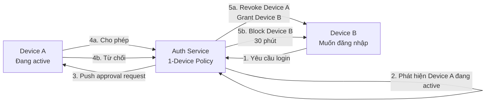
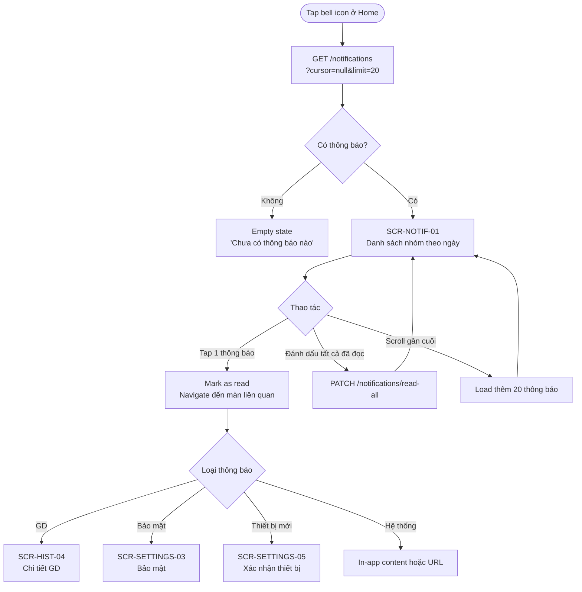
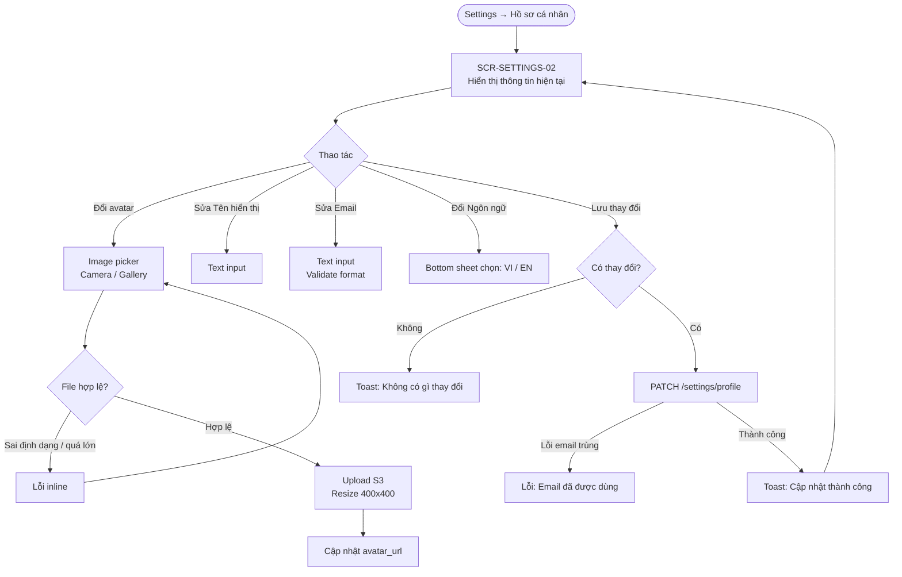
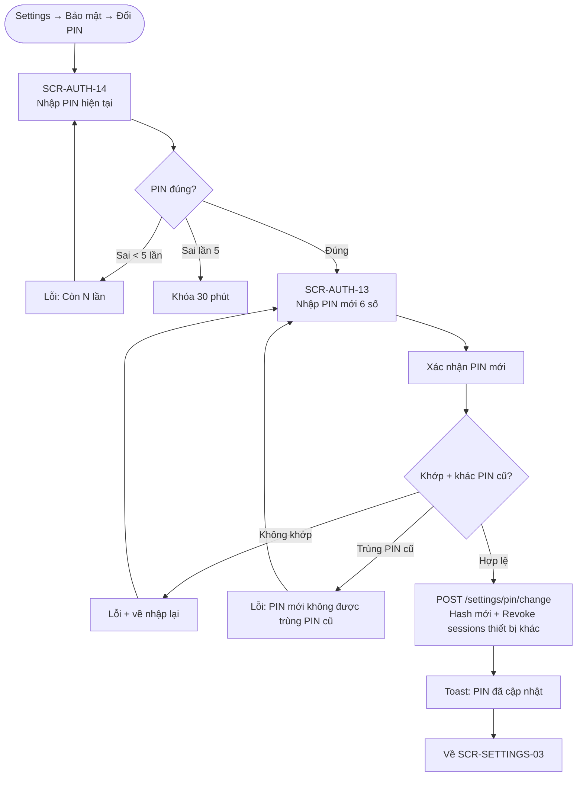
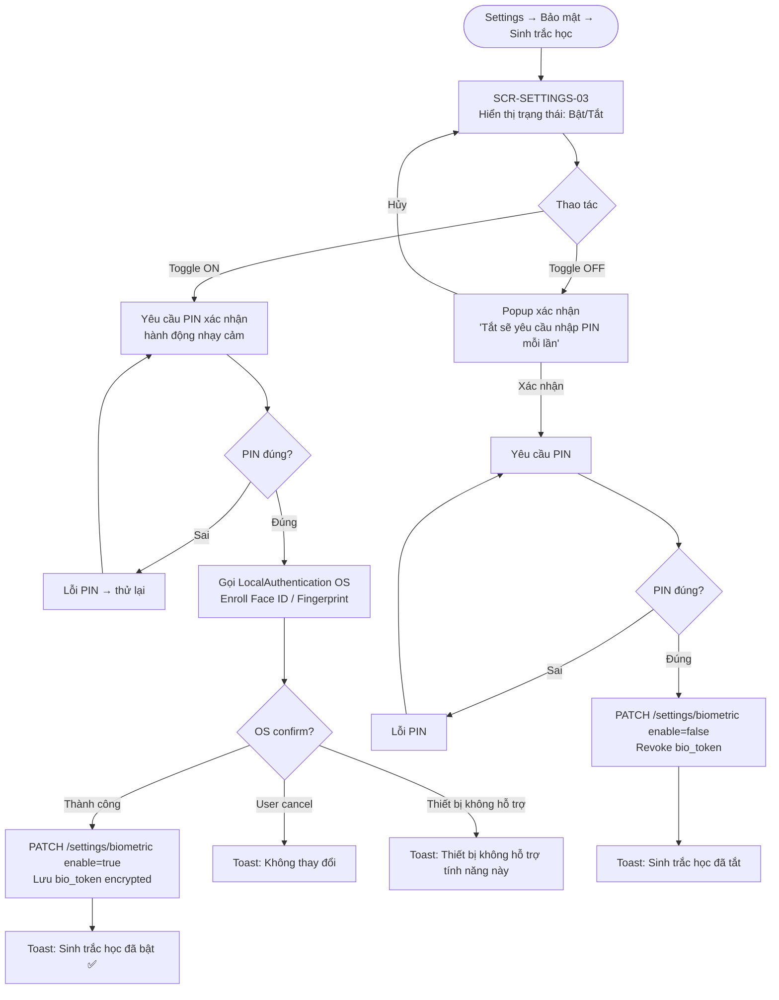
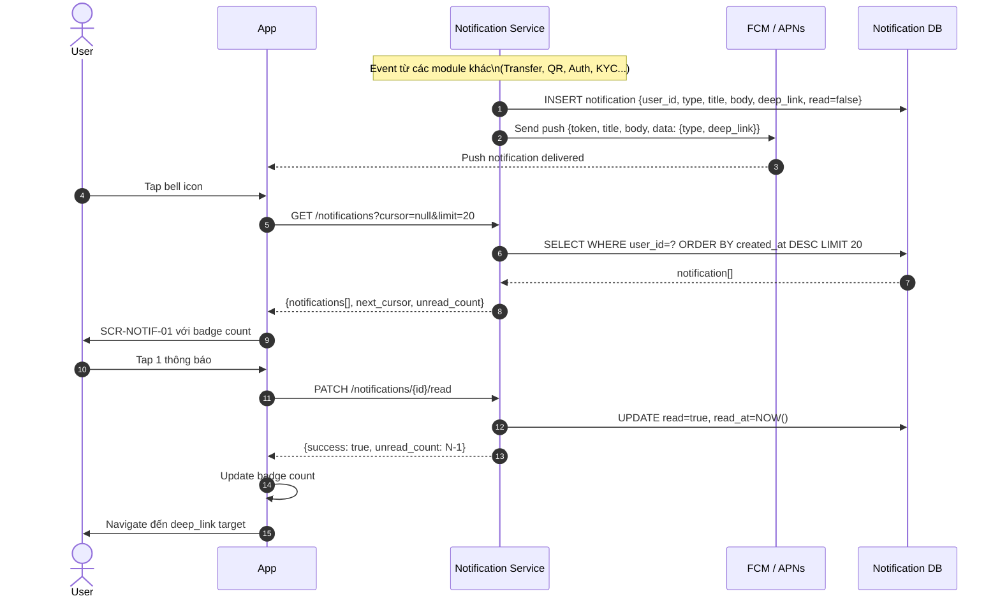
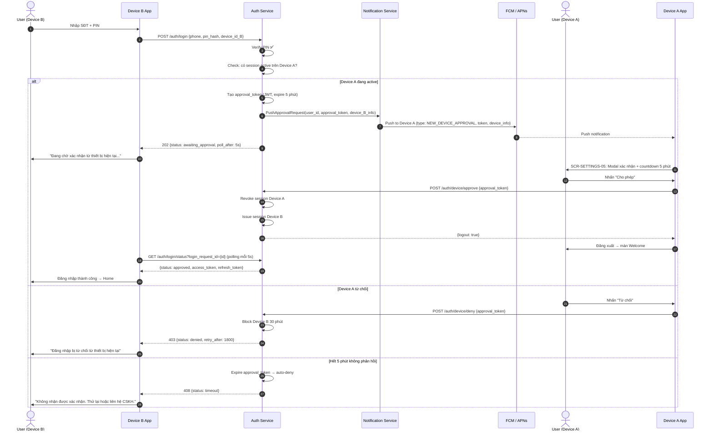

# PRD: Notifications & Settings Module

<Info>
  **Document ID:** PRD-EW-NOTIF-001 · **Version:** 1.0 · **Status:** Draft  
  **Ngày tạo:** 2026-05-26 · **Tác giả:** BA Team  
  **Reviewer:** Tech Lead, Security Team, QA Lead · **Approver:** Head of Product  
  **Tài liệu liên quan:** PRD-EW-AUTH-001, PRD-EW-KYC-001
</Info>

| Vai trò | Mục đích đọc |
|---|---|
| Tech Lead / Developer | Thiết kế Notification Service, 1-device session policy, FCM/APNs integration |
| Security Team | Review 1-device approval flow, session revocation, PIN change security |
| QA Lead | Test cases: notification inbox, profile update, change PIN, new device approval, logout |
| UX Designer | Hiểu notification grouping, approval modal, settings layout |

---

## 1. Tổng quan module

<CardGroup cols={2}>
  <Card title="Hộp thông báo" icon="bell">
    Lưu tất cả notification trong app. Unread badge. Tap để điều hướng đến GD/màn liên quan.
  </Card>
  <Card title="Hồ sơ cá nhân" icon="user">
    Sửa avatar, tên hiển thị, email dự phòng, ngôn ngữ. Họ tên KYC và SĐT là read-only.
  </Card>
  <Card title="Bảo mật" icon="shield">
    Đổi PIN, bật/tắt Biometric. Xem thiết bị đang dùng. Đăng xuất.
  </Card>
  <Card title="Chính sách 1 thiết bị" icon="mobile">
    Chỉ 1 thiết bị active/lúc. Thiết bị mới cần được xác nhận từ thiết bị hiện tại. Mất máy → CSKH.
  </Card>
</CardGroup>

### 1.1 Phạm vi (Scope)

| Tính năng | Trong phạm vi | Ghi chú |
|---|:---:|---|
| Notification inbox (danh sách, unread badge) | ✅ | Lưu 90 ngày gần nhất |
| Phân loại thông báo (GD / Bảo mật / Hệ thống) | ✅ | Display-only; không có toggle per category |
| Toggle bật/tắt push notification per category | ❌ | Roadmap Sprint 10 |
| Chỉnh sửa hồ sơ (avatar, nickname, email, ngôn ngữ) | ✅ | Họ tên KYC + SĐT = read-only |
| Đổi PIN (có xác thực PIN cũ) | ✅ | Luồng từ Auth module (SCR-AUTH-14); entry từ Settings |
| Bật/tắt Biometric | ✅ | Face ID / Vân tay |
| Xem thiết bị hiện tại + đăng xuất | ✅ | 1 thiết bị duy nhất |
| Xác nhận / từ chối thiết bị mới đăng nhập | ✅ | **Chính sách 1 thiết bị** — Device A approve/deny |
| Quản lý nhiều thiết bị | ❌ | Không áp dụng — 1 thiết bị active tại 1 thời điểm |
| 2FA OTP theo ngưỡng GD | ❌ | Không trong scope MVP |
| Tự khóa / đóng tài khoản | ❌ | Không trong scope MVP; xử lý qua CSKH |

### 1.2 Kiến trúc Chính sách 1 Thiết bị

<Warning>
  **Thay đổi so với PRD-EW-AUTH-001 v1.0:** Module này định nghĩa chính sách 1-device approval. Thay vì chỉ "cảnh báo sau khi login" (Auth v1.0), thiết bị mới **phải được thiết bị hiện tại xác nhận TRƯỚC** khi session được cấp. **SCR-AUTH-15 và Sequence Diagram đã được cập nhật tại [Authentication module v1.1](/projects/ewallet/auth).**
</Warning>



**Timeout policy:** Nếu Device A không phản hồi trong 5 phút → tự động từ chối Device B (security conservative). Nếu Device A không có internet → push không đến → Device B không được login → user phải liên hệ CSKH để force-logout Device A.

---

## 2. Danh sách màn hình

| Screen ID | Tên màn hình | Nhóm |
|---|---|---|
| SCR-NOTIF-01 | Hộp thông báo (Notification inbox) | Thông báo |
| SCR-SETTINGS-01 | Menu cài đặt chính | Navigation |
| SCR-SETTINGS-02 | Hồ sơ cá nhân | Hồ sơ |
| SCR-SETTINGS-03 | Cài đặt bảo mật | Bảo mật |
| SCR-SETTINGS-04 | Thiết bị đang đăng nhập | Bảo mật |
| SCR-SETTINGS-05 | Xác nhận thiết bị mới (Device A) | Bảo mật |

---

## 3. User Flow

### 3.1 Flow A — Notification Inbox



### 3.2 Flow B — Chỉnh sửa hồ sơ



### 3.3 Flow C — Đổi PIN (từ Settings)



<Note>
  Đổi PIN dùng lại màn hình từ Auth module (SCR-AUTH-14 và SCR-AUTH-13). Settings chỉ là entry point — không có màn hình mới.
</Note>

### 3.4 Flow D — Bật / Tắt Biometric



### 3.5 Flow E — Thiết bị mới muốn đăng nhập (Device A nhận yêu cầu)

```mermaid
flowchart TD
    A([Device A nhận Push: Thiết bị mới muốn đăng nhập]) --> B{App trạng thái}
    B -- App đang mở --> C[Modal overlay xuất hiện ngay\nSCR-SETTINGS-05]
    B -- App trong background/đóng --> D[Push notification với action buttons]
    D -- Tap notification --> C
    C --> E[Hiển thị: Tên thiết bị · OS · Thời gian · IP location]
    E --> F[Countdown: Hết hạn sau 05:00]
    F --> G{Người dùng chọn}
    G -- Cho phép --> H[POST /auth/device/approve\n{approval_token}]
    H --> I[Device A bị đăng xuất ngay\nDevice B hoàn tất login]
    I --> J[Device A về màn Welcome\nToast: Thiết bị này đã đăng xuất]
    G -- Từ chối --> K[POST /auth/device/deny\n{approval_token}]
    K --> L[Device B bị block 30 phút\nPush alert: Yêu cầu bị từ chối]
    L --> M[Toast: Đã từ chối đăng nhập\nThiết bị của bạn vẫn an toàn]
    F -- Hết thời gian 5 phút --> N[Auto-deny Device B\nModal tự đóng\nNotification: Yêu cầu đã hết hạn]
```

---

## 4. Sequence Diagram

### 4.1 Notification Delivery & Inbox Sync



### 4.2 New Device Login — 1-Device Approval Flow



<Note>
  **Schema: `device_B_info`** — payload truyền từ Auth Service → Notification Service → Device A và hiển thị tại SCR-SETTINGS-05:

  | Field | Kiểu | Mô tả | Ví dụ |
  |---|---|---|---|
  | `device_name` | string | Tên model thiết bị | "Samsung Galaxy S24" |
  | `os` | string | Hệ điều hành + phiên bản | "Android 14" |
  | `city` | string | Thành phố từ GeoIP (best-effort) | "Hồ Chí Minh" |
  | `ip_address` | string | IPv4 (ẩn 2 octet cuối trong UI) | "27.65.xxx.xxx" |
  | `requested_at` | ISO8601 | Thời điểm gửi login request | "2026-05-26T20:15:00+07:00" |
  | `login_request_id` | string (UUID) | ID để Device B poll status | "a3f7..." |
</Note>

---

## 5. Screen Specifications

### SCR-NOTIF-01 — Hộp thông báo

```
┌─────────────────────────────────┐
│  ←      Thông báo        Đọc tất│
│                                 │
│  Hôm nay                        │
│  ┌───────────────────────────┐  │
│  │ 🔴 💰 Nhận 500K từ An    │  │  ← 🔴 = chưa đọc
│  │    Số dư: 2,500,000 đ    │  │
│  │                   14:30   │  │
│  └───────────────────────────┘  │
│  ┌───────────────────────────┐  │
│  │    🛡 Đăng nhập thành công│  │  ← không có 🔴 = đã đọc
│  │    iPhone 15 · Hà Nội    │  │
│  │                   09:15   │  │
│  └───────────────────────────┘  │
│                                 │
│  Hôm qua                        │
│  ┌───────────────────────────┐  │
│  │ 🔴 ⚠ Thiết bị mới muốn  │  │
│  │    đăng nhập — Tap để XN │  │
│  │                   18:45   │  │
│  └───────────────────────────┘  │
│                                 │
│         ⟳ Đang tải thêm...     │
└─────────────────────────────────┘
```

| Component | Loại | Nội dung | Action |
|---|---|---|---|
| Header | Nav | "Thông báo" | — |
| "Đọc tất" | Text button | "Đánh dấu tất cả đã đọc" | PATCH /notifications/read-all |
| Unread dot | Badge (đỏ) | Chấm tròn đỏ bên trái notification chưa đọc | — |
| Group header | Text bold | "Hôm nay" / "Hôm qua" / "DD tháng MM" | — |
| Notification row | List item | [Category icon] [Title] [Preview text] [Time] | Tap → mark read + navigate |
| Category icon | Icon | 💰 GD / 🛡 Bảo mật / ℹ Hệ thống | — |
| Unread row background | Light tint | Màu nền nhạt cho notification chưa đọc | — |
| Empty state | Illustration | "Chưa có thông báo nào" | — |
| Infinite scroll | Spinner | Load thêm batch 20 khi scroll gần cuối | — |

**Notification categories & icons:**

| Category | Icon | Loại thông báo |
|---|---|---|
| GD (Transaction) | 💰 | Nạp/rút/chuyển/QR thành công hoặc thất bại |
| Bảo mật (Security) | 🛡 | Thiết bị mới, đổi PIN, KYC, tài khoản bị khóa |
| Hệ thống (System) | ℹ | Cập nhật app, thông báo bảo trì, tin tức |

---

### SCR-SETTINGS-01 — Menu cài đặt chính

```
┌─────────────────────────────────┐
│  ←         Cài đặt             │
│                                 │
│  ┌─────────────────────────┐   │
│  │ [Avatar] Nguyễn Đức Chinh│   │
│  │          Tier 2 ✅        │   │
│  └─────────────────────────┘   │
│                                 │
│  Hồ sơ                          │
│  ├── Chỉnh sửa hồ sơ      ›    │
│                                 │
│  Bảo mật                        │
│  ├── Đổi PIN              ›    │
│  ├── Sinh trắc học        ›    │
│  ├── Thiết bị đang dùng   ›    │
│                                 │
│  Hỗ trợ                         │
│  ├── Trung tâm hỗ trợ     ›    │
│  ├── Điều khoản & Chính sách ›  │
│                                 │
│  ─────────────────────────────  │
│  [       Đăng xuất       ]     │
└─────────────────────────────────┘
```

| Component | Loại | Nội dung | Action |
|---|---|---|---|
| User card | Card | Avatar + Tên hiển thị + KYC tier badge | Tap → SCR-SETTINGS-02 |
| "Chỉnh sửa hồ sơ" | Row | Chevron ›  | → SCR-SETTINGS-02 |
| "Đổi PIN" | Row | Chevron › | → SCR-AUTH-14 (flow đổi PIN) |
| "Sinh trắc học" | Row | Trạng thái: Đang bật / Đang tắt + chevron | → SCR-SETTINGS-03 |
| "Thiết bị đang dùng" | Row | Tên thiết bị hiện tại (ngắn) + chevron | → SCR-SETTINGS-04 |
| "Trung tâm hỗ trợ" | Row | Chevron | Mở chat CS / FAQ |
| "Điều khoản" | Row | Chevron | In-app webview |
| "Đăng xuất" | Button (destructive) | Màu đỏ nhạt | Confirm popup → DELETE /auth/session |

---

### SCR-SETTINGS-02 — Hồ sơ cá nhân

```
┌─────────────────────────────────┐
│  ←      Hồ sơ cá nhân    Lưu  │  ← Lưu disabled khi chưa thay đổi
│                                 │
│         [ Avatar 80px ]         │
│          Đổi ảnh đại diện       │
│                                 │
│  Họ và tên                      │
│  ┌──────────────────────────┐   │
│  │ Nguyễn Đức Chinh       🔒│   │  ← 🔒 = read-only sau KYC
│  └──────────────────────────┘   │
│                                 │
│  Tên hiển thị                   │
│  ┌──────────────────────────┐   │
│  │ Chinh NDC                │   │  ← editable
│  └──────────────────────────┘   │
│  Hiện trong các giao dịch       │
│                                 │
│  Số điện thoại                  │
│  ┌──────────────────────────┐   │
│  │ 090 **** 567           🔒│   │
│  └──────────────────────────┘   │
│                                 │
│  Email dự phòng                 │
│  ┌──────────────────────────┐   │
│  │ chinh@example.com        │   │  ← editable
│  └──────────────────────────┘   │
│  Nhận thông báo quan trọng      │
│                                 │
│  Ngôn ngữ                       │
│  ┌──────────────────────────┐   │
│  │ Tiếng Việt            ›  │   │  ← bottom sheet selector
│  └──────────────────────────┘   │
└─────────────────────────────────┘
```

| Component | Loại | Nội dung | Điều kiện | Action |
|---|---|---|---|---|
| Header "Lưu" | Text button | Disabled khi không có thay đổi | Khi có edit | PATCH /settings/profile |
| Avatar | Image + Tap | Tap → image picker (Camera / Gallery) | Always | Upload S3 |
| Họ và tên | Display field | Tên từ KYC — read-only | Always | — |
| Lock icon 🔒 | Icon | Bên phải field read-only | Always | Tooltip: "Không thể thay đổi sau KYC" |
| Tên hiển thị | Text input | Nickname tự chọn (khác KYC name) | Editable | — |
| SĐT | Display field | Masked — read-only | Always | — |
| Email dự phòng | Text input | Validate email format | Editable | — |
| Ngôn ngữ | Selector | Tiếng Việt / English | Editable | Bottom sheet selector |

---

### SCR-SETTINGS-03 — Cài đặt bảo mật

```
┌─────────────────────────────────┐
│  ←        Bảo mật              │
│                                 │
│  Mã PIN                         │
│  ├── Đổi mã PIN            ›   │
│                                 │
│  Sinh trắc học                  │
│  ├── Face ID            ○──●   │  ← toggle: Đang bật
│  ├── Vân tay            ○──○   │  ← toggle: Đang tắt
│                                 │
│  Thiết bị đang đăng nhập        │
│  ├── iPhone 15 Pro         ›   │  ← tap → SCR-SETTINGS-04
│                                 │
│  ─────────────────────────────  │
│                                 │
│  🆘 Bị mất thiết bị?            │
│  Liên hệ CSKH để đăng xuất     │
│  và bảo vệ tài khoản            │
│  [  Liên hệ CSKH  ]            │
└─────────────────────────────────┘
```

| Component | Loại | Nội dung | Action |
|---|---|---|---|
| "Đổi mã PIN" | Row + chevron | — | → SCR-AUTH-14 |
| Face ID toggle | Toggle | On/Off — chỉ hiện nếu thiết bị hỗ trợ | Flow D (bật/tắt biometric) |
| Vân tay toggle | Toggle | On/Off — chỉ hiện nếu thiết bị hỗ trợ | Flow D |
| "Thiết bị hiện tại" | Row + tên thiết bị + chevron | Tên device ngắn gọn | → SCR-SETTINGS-04 |
| "Bị mất thiết bị?" | Info box | Text + nút "Liên hệ CSKH" | Mở chat CSKH với template "Tôi bị mất thiết bị" |

---

### SCR-SETTINGS-04 — Thiết bị đang đăng nhập

```
┌─────────────────────────────────┐
│  ←     Thiết bị đang dùng      │
│                                 │
│  ┌───────────────────────────┐  │
│  │ 📱 iPhone 15 Pro          │  │
│  │ iOS 17.4                  │  │
│  │ Đăng nhập: 26/05 · 09:15  │  │
│  │ Hà Nội (IP: 42.112.xxx)   │  │
│  │                           │  │
│  │        [Thiết bị này]     │  │  ← badge xanh
│  └───────────────────────────┘  │
│                                 │
│  ─────────────────────────────  │
│                                 │
│  ℹ Chính sách bảo mật:          │
│  Tài khoản chỉ được đăng nhập  │
│  trên 1 thiết bị tại 1 thời    │
│  điểm. Thiết bị mới cần được   │
│  bạn xác nhận trước khi đăng   │
│  nhập.                          │
│                                 │
│  [      Đăng xuất thiết bị     ]│  ← màu đỏ nhạt
└─────────────────────────────────┘
```

| Component | Loại | Nội dung | Action |
|---|---|---|---|
| Device card | Card | Tên device · OS · Thời gian đăng nhập · IP + city | — |
| "Thiết bị này" badge | Badge (xanh) | Đánh dấu đây là thiết bị đang dùng | — |
| Policy info box | Info | Giải thích chính sách 1 thiết bị | — |
| "Đăng xuất" | Button (danger) | Màu đỏ nhạt | Confirm popup → DELETE /auth/session |

**Confirm popup đăng xuất:**
- Title: "Đăng xuất khỏi thiết bị này?"
- Body: "Sau khi đăng xuất, không còn thiết bị active nào. Lần đăng nhập tiếp theo sẽ được cấp session ngay mà không cần xác nhận từ thiết bị khác."
- CTA: [Hủy] | [Đăng xuất]

---

### SCR-SETTINGS-05 — Xác nhận thiết bị mới (trên Device A)

```
┌─────────────────────────────────┐
│                                 │
│           🔔 !                  │
│                                 │
│    Có thiết bị mới muốn         │
│      đăng nhập vào              │
│       tài khoản của bạn         │
│                                 │
│  ┌───────────────────────────┐  │
│  │ 📱 Samsung Galaxy S24     │  │
│  │ Android 14                │  │
│  │ Hồ Chí Minh (IP: 27.xxx)  │  │
│  │ 26/05/2026 lúc 20:15      │  │
│  └───────────────────────────┘  │
│                                 │
│  ⏳ Hết hạn sau  04:23          │  ← countdown
│                                 │
│  Nếu không phải bạn, hãy TỪ   │
│  CHỐI ngay để bảo vệ tài khoản  │
│                                 │
│  [ ❌ Từ chối — Không phải tôi ]│  ← màu đỏ, prominent
│                                 │
│     [ ✅ Cho phép — Đó là tôi ]  │  ← secondary
└─────────────────────────────────┘
```

| Component | Loại | Nội dung | Action |
|---|---|---|---|
| Alert icon | Icon (large) | 🔔 với badge ! | — |
| Device info card | Card | Tên device · OS · Thành phố · Timestamp | — |
| Countdown timer | Text (orange) | "Hết hạn sau MM:SS" | Đếm ngược từ 05:00; khi về 0 → modal tự đóng + auto-deny |
| Warning text | Text (red) | "Nếu không phải bạn, hãy TỪ CHỐI ngay" | — |
| "Từ chối" | Primary button (đỏ) | Đặt trên để người dùng dễ thấy | POST /auth/device/deny |
| "Cho phép" | Secondary button | Đặt dưới — ít nổi bật hơn | POST /auth/device/approve |

<Warning>
  **UX Decision:** "Từ chối" được đặt trên và màu đỏ nổi bật — vì nếu user thấy màn hình này mà không biết tại sao, hành động an toàn nhất là từ chối. Chỉ user đang chủ động đổi thiết bị mới nên tap "Cho phép".
</Warning>

---

## 6. Validation Rules

| Rule ID | Field | Điều kiện vi phạm | Xử lý |
|---|---|---|---|
| VAL-SET-01 | Tên hiển thị (nickname) | Rỗng hoặc < 2 ký tự | "Tên hiển thị phải có ít nhất 2 ký tự" |
| VAL-SET-02 | Tên hiển thị | > 50 ký tự | "Tên hiển thị tối đa 50 ký tự" |
| VAL-SET-03 | Email dự phòng | Sai format email | "Địa chỉ email không hợp lệ" |
| VAL-SET-04 | Email dự phòng | Email đã được dùng bởi tài khoản khác | "Email này đã được sử dụng" |
| VAL-SET-05 | Avatar | File > 5MB | "Ảnh quá lớn. Vui lòng chọn ảnh nhỏ hơn 5MB" |
| VAL-SET-06 | Avatar | Không phải JPG/PNG/WEBP | "Định dạng không được hỗ trợ. Chọn JPG, PNG hoặc WEBP" |
| VAL-SET-07 | PIN mới (đổi PIN) | Trùng PIN cũ | "Mã PIN mới không được trùng với mã PIN hiện tại" |
| VAL-SET-08 | PIN confirm | Không khớp PIN mới | "Mã PIN xác nhận không khớp" |
| VAL-SET-09 | Đăng xuất | User xác nhận đăng xuất | Confirm popup; không thể undone |

---

## 7. Business Rules

| ID | Rule | Áp dụng tại |
|---|---|---|
| BR-SET-01 | 1 thiết bị active tại 1 thời điểm | Auth Service; không cho phép 2 session active cùng lúc |
| BR-SET-02 | Thiết bị mới: bắt buộc approval từ thiết bị hiện tại | Auth Service; thiết bị mới không được login nếu thiết bị cũ chưa approve |
| BR-SET-03 | Approval timeout: 5 phút → auto-deny | Auth Service; không để request treo vô thời hạn |
| BR-SET-04 | Mất thiết bị: chỉ CSKH mới có thể force-logout | Không có self-service cho trường hợp này; CSKH verify KYC trước khi force-logout |
| BR-SET-05 | Nickname khác KYC name | Nickname dùng trong UI giao dịch; KYC name dùng trong hồ sơ pháp lý và NAPAS |
| BR-SET-06 | Họ tên KYC bất biến sau Tier 2 | Không cho phép thay đổi qua Settings; phải re-KYC |
| BR-SET-07 | SĐT bất biến | Không đổi SĐT qua Settings; cần process riêng qua CSKH + xác minh carrier |
| BR-SET-08 | Biometric token revoke | Khi tắt biometric hoặc đổi PIN → revoke bio_token ngay lập tức |
| BR-SET-09 | Đổi PIN → revoke session thiết bị khác | Sau khi đổi PIN thành công: revoke tất cả session khác ngoài thiết bị hiện tại |
| BR-SET-10 | Thông báo lưu 90 ngày | Notification records tự expire sau 90 ngày; không lưu vĩnh viễn |
| BR-SET-11 | Đăng xuất: revoke token | Tap "Đăng xuất" → DELETE /auth/session → revoke access + refresh token ngay lập tức |
| BR-SET-12 | Push permission: server opt-in | Dù user tắt push trên OS hay trong app đều set `push_opt_in = false` tại server; không unregister FCM token |
| BR-SET-13 | Device A từ chối (deny) approval request → Device B bị block đăng nhập 30 phút; Auth Service trả `403 {retry_after: 1800}`; không thể gửi login request mới trong thời gian này | Auth Service — xem BR-AUTH-17 |

---

## 8. Notification Events từ module này

| Event | Channel | Nội dung | Thời điểm |
|---|---|---|---|
| Đổi PIN thành công | Push + SMS | "Mã PIN ví của bạn vừa được thay đổi lúc [HH:mm]. Nếu không phải bạn, liên hệ CSKH ngay." | Ngay khi đổi PIN |
| Thiết bị mới yêu cầu đăng nhập | Push (Device A) | "Có thiết bị mới muốn đăng nhập vào tài khoản của bạn. Tap để xem chi tiết." | Khi Device B gửi login request |
| Thiết bị mới được cho phép | Push (Device B) | "Đăng nhập được xác nhận. Chào mừng trở lại!" | Khi Device A approve |
| Thiết bị mới bị từ chối | Push (Device B) | "Yêu cầu đăng nhập bị từ chối. Liên hệ CSKH nếu gặp vấn đề." | Khi Device A deny hoặc timeout |
| Biometric thay đổi | Push | "Cài đặt sinh trắc học vừa được thay đổi. Nếu không phải bạn, đổi PIN ngay." | Khi bật/tắt biometric |
| Đăng xuất thành công | Push | "Bạn đã đăng xuất khỏi thiết bị [tên]. Đăng nhập lại khi cần." | Sau logout |

---

## 9. API Summary

| Method | Endpoint | Mô tả | Auth |
|---|---|---|---|
| GET | `/notifications` | Danh sách notification với cursor pagination | JWT |
| GET | `/notifications/unread-count` | Số thông báo chưa đọc (cho badge) | JWT |
| PATCH | `/notifications/{id}/read` | Đánh dấu 1 thông báo đã đọc | JWT |
| PATCH | `/notifications/read-all` | Đánh dấu tất cả đã đọc | JWT |
| GET | `/settings/profile` | Lấy thông tin hồ sơ hiện tại | JWT |
| PATCH | `/settings/profile` | Cập nhật avatar, nickname, email, language | JWT |
| PATCH | `/settings/biometric` | Bật/tắt biometric | JWT + PIN |
| GET | `/settings/device` | Thông tin thiết bị đang đăng nhập | JWT |
| DELETE | `/auth/session` | Đăng xuất thiết bị hiện tại | JWT |
| POST | `/auth/device/approve` | Device A xác nhận cho phép Device B | JWT + approval_token |
| POST | `/auth/device/deny` | Device A từ chối Device B | JWT + approval_token |
| GET | `/auth/login/status` | Device B poll trạng thái chờ approval (query param: `login_request_id`) | approval_token |
| GET | `/auth/pending-approvals` | Device A fetch danh sách approval request đang chờ khi reconnect | JWT |

---

## 10. Error Codes

| Code | HTTP | Hiển thị user | Ghi chú dev |
|---|---|---|---|
| `SET_001` | 400 | "Tên hiển thị không hợp lệ" | Độ dài 2–50 ký tự |
| `SET_002` | 400 | "Địa chỉ email không hợp lệ" | Email format invalid |
| `SET_003` | 409 | "Email này đã được sử dụng" | Trùng email với user khác |
| `SET_004` | 400 | "Ảnh không hợp lệ hoặc quá lớn" | File > 5MB hoặc sai format |
| `SET_005` | 403 | "Thông tin này không thể thay đổi sau khi xác thực KYC" | Cố sửa họ tên hoặc SĐT |
| `SET_006` | 400 | "Mã PIN mới không được trùng PIN cũ" | new_pin == old_pin |
| `SET_007` | 400 | "Mã PIN xác nhận không khớp" | confirm_pin != new_pin |
| `SET_008` | 408 | "Yêu cầu xác nhận đã hết hạn. Vui lòng thử đăng nhập lại." | approval_token expired |
| `SET_009` | 403 | "Yêu cầu đăng nhập bị từ chối" | Device A deny hoặc timeout |
| `SET_010` | 404 | "Không tìm thấy thông báo" | notification_id không tồn tại hoặc đã expire |

---

## 11. Non-Functional Requirements (NFR)

### Performance

| Chỉ số | Target | Ghi chú |
|---|---|---|
| Notification inbox load | P95 < 500ms | Redis cache cho unread_count; DB query cho list |
| Unread badge count | P99 < 100ms | Redis counter; không cần DB query |
| Profile GET | P95 < 200ms | User record cache |
| Profile PATCH | P95 < 1s | Gồm S3 upload nếu có avatar mới |
| Avatar upload | P95 < 3s | Phụ thuộc file size + network |
| Approval request delivery | P95 < 2s | Push phải đến Device A trong 2s |
| Approval polling (Device B) | 5s interval | Không quá 60 polls/request (300s ÷ 5s); aligned với `poll_after: 5s` trả về trong 202 response |

### Bảo mật (Security)

| Yêu cầu | Mô tả |
|---|---|
| 1-device enforcement | Auth Service enforce tại server; client không thể bypass bằng cách gửi request thẳng |
| Approval token | JWT một lần dùng, expire 5 phút, signed với secret riêng; không thể forge |
| Push security | Notification payload không chứa sensitive data (số tiền, SĐT đầy đủ) — chỉ chứa `type` và `deep_link` |
| Session revocation | Revoke ngay lập tức sau logout/approval — không cần chờ token expire |
| PIN change logging | Mọi PIN change action logged với: user_id, device_id, ip, timestamp |

### Tính sẵn sàng & Độ tin cậy

| Chỉ số | Target | Ghi chú |
|---|---|---|
| Notification Service uptime | ≥ 99.5% | Không phải payment-critical |
| FCM/APNs delivery | Best-effort; retry 3 lần | Push không guaranteed; fallback: user thấy trạng thái khi mở app |
| Approval flow fallback | Nếu push không đến trong 60s → in-app polling khi Device A online | Device A fetch pending approvals khi reconnect |
| Settings Service uptime | ≥ 99.9% | Ảnh hưởng đến PIN change và biometric |

### Lưu trữ & Compliance

| Loại dữ liệu | Thời gian lưu | Ghi chú |
|---|---|---|
| Notification records | 90 ngày (auto-expire) | Không cần compliance lưu dài; chỉ cần in-app usability |
| Device approval audit log | 5 năm | Security audit; điều tra nếu có fraud |
| Profile change history | 5 năm | Bao gồm: ai thay đổi, khi nào, IP, device |
| Session log (login/logout) | 5 năm | Compliance + fraud investigation |

---

## 12. Edge Cases

| Trường hợp | Xử lý |
|---|---|
| Device A mất kết nối khi có approval request đang chờ | Push không delivered; khi Device A reconnect, app fetch `GET /auth/pending-approvals` và hiển thị modal nếu approval chưa expire |
| Device A bị tắt hoàn toàn (hết pin) → approval timeout | Sau 5 phút auto-deny Device B; Device B hiển thị "Không nhận được xác nhận" + link CSKH |
| User tap "Cho phép" nhưng push bị delay (double approval) | approval_token là single-use; lần gọi approve thứ hai trả 409 Conflict — không double-process |
| Notification deep link trỏ đến GD đã > 6 tháng | SCR-HIST-04 không load được (ngoài giới hạn); hiển thị "Giao dịch này đã quá cũ để hiển thị chi tiết" |
| User thay đổi email → email cũ nhận được thông báo quan trọng | Notification vẫn gửi đến email mới ngay sau khi cập nhật; email cũ không nhận thêm |
| User đổi ngôn ngữ sang EN → push notification vẫn hiện tiếng Việt | Notification content được generate khi event xảy ra (không phải khi user đọc); cần store preferred_language và generate nội dung theo language tại thời điểm event |
| Avatar upload thất bại (S3 error) → profile khác đã save thành công | Rollback partial: nếu avatar upload fail, trả lỗi cho toàn bộ PATCH; không lưu partial update |
| SCR-SETTINGS-05 timeout 5 phút nhưng user đang nhìn màn hình khác | Countdown chạy dù app ở background; khi về 0, modal tự dismiss và hiển thị notification "Yêu cầu đã hết hạn tự động" |

---

## 13. Roadmap — Tính năng phát triển

<Info>
  Các tính năng dưới đây bổ sung cho phạm vi MVP (Notification inbox + Profile + Security + 1-device policy). Một số mục liên quan đến quy trình CSKH và native mobile development cần confirm sớm với team tương ứng.
</Info>

<AccordionGroup>
  <Accordion title="[Sprint 7] Email Verification khi thêm Email dự phòng" icon="envelope-circle-check">
    **Team:** Product · **Ưu tiên:** High

    Khi user nhập email dự phòng trên SCR-SETTINGS-02, hệ thống gửi **email xác minh** (verification link TTL 24 giờ) và chỉ lưu email sau khi verified. Ngăn user nhập sai email và không nhận được thông báo bảo mật quan trọng.

    **Yêu cầu chính:** Gửi verification email khi save; hiển thị trạng thái "Đang xác minh" với badge vàng; resend option sau 60 giây; tự xóa email pending nếu không verify sau 7 ngày.  
    **Phụ thuộc:** Email service hỗ trợ transactional email (khác marketing email); UX thiết kế trạng thái pending verification trên SCR-SETTINGS-02.
  </Accordion>

  <Accordion title="[Sprint 7] Approval Notification — Action Buttons trên Notification Shade" icon="mobile-screen-button">
    **Team:** Tech Lead (iOS + Android) · **Ưu tiên:** High

    Thêm nút **"Cho phép" / "Từ chối"** trực tiếp trên notification shade (không cần mở app) khi Device A nhận approval request từ Device B. Giảm friction đáng kể trong luồng 1-device approval — đặc biệt quan trọng khi user đang dùng app khác.

    **Yêu cầu chính:** iOS: UNNotificationCategory với UNNotificationAction; Android: addAction() với PendingIntent; deep link vào SCR-SETTINGS-05 nếu tap vào body notification; xử lý edge case action tap sau khi approval_token đã expire.  
    **Phụ thuộc:** Native Dev confirm feasibility trong React Native (có thể cần native module); Security Team review xem action button có thể bị kích hoạt bởi phần mềm độc hại không.
  </Accordion>

  <Accordion title="[Sprint 8] CSKH SOP — Force-Logout Device A khi mất thiết bị" icon="headset">
    **Team:** CSKH + Product · **Ưu tiên:** Critical

    Thiết kế đầy đủ **SOP và công cụ admin cho CSKH** để xử lý khi user mất điện thoại hoàn toàn (Device A offline, không thể tự approve Device B): xác minh danh tính qua video call hoặc giấy tờ, force-logout Device A, cấp quyền cho thiết bị mới.

    **Yêu cầu chính:** Admin tool: `POST /admin/devices/force-logout` với audit trail đầy đủ; user nhận email + SMS xác nhận; SOP document cho CSKH training; logging ai thực hiện action và thời gian.  
    **Phụ thuộc:** Security Team thiết kế identity verification checklist cho CSKH; Legal review trách nhiệm pháp lý nếu xác minh sai dẫn đến mất tài khoản.
  </Accordion>

  <Accordion title="[Sprint 8] Nickname hiển thị trong Transaction History" icon="user-tag">
    **Team:** Product + Tech · **Ưu tiên:** Medium

    Khi user có **nickname**, hiển thị nickname thay vì họ tên đầy đủ KYC trong Transaction History (SCR-HIST-04) và các màn hình liên quan. Tăng tính cá nhân hóa; phù hợp với user không muốn hiện họ tên thật.

    **Yêu cầu chính:** Quyết định kiến trúc: (A) snapshot nickname vào transaction record tại thời điểm GD — không bị ảnh hưởng khi đổi nickname sau; hoặc (B) join từ user_profile khi display — đơn giản hơn nhưng nickname cũ bị mất.  
    **Phụ thuộc:** Phương án (A) yêu cầu thêm field `sender_display_name` vào transaction table — cần migration; UX xác nhận cách hiển thị khi user chưa có nickname.
  </Accordion>

  <Accordion title="[Sprint 10] Archive & Export Notification Inbox" icon="box-archive">
    **Team:** Product + Compliance · **Ưu tiên:** Low

    Sau khi notification tự xóa sau **90 ngày** (hiển thị), user có thể cần lưu lại biên lai thông báo GD. Tính năng này cho phép **export toàn bộ inbox** dưới dạng PDF hoặc CSV qua email, phục vụ compliance và user cần đối soát.

    **Yêu cầu chính:** Async export job tương tự Transaction History sao kê; giới hạn 1 export / tháng / user; email PDF với full notification list; Compliance xác nhận có cần lưu raw data lâu hơn 90 ngày ở DB không.  
    **Phụ thuộc:** Compliance xác nhận regulatory requirement; DB retention policy phải giữ raw notification data đủ lâu dù inbox display chỉ 90 ngày.
  </Accordion>
</AccordionGroup>
