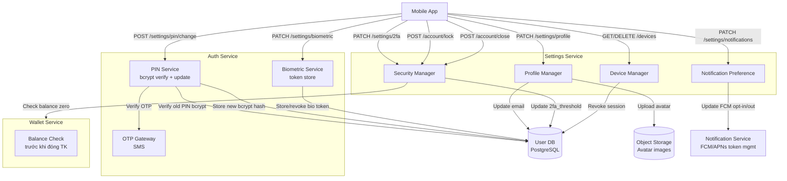
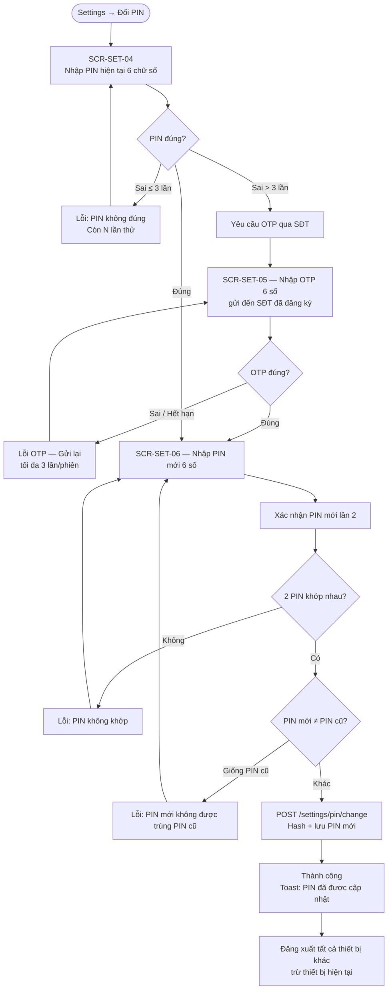
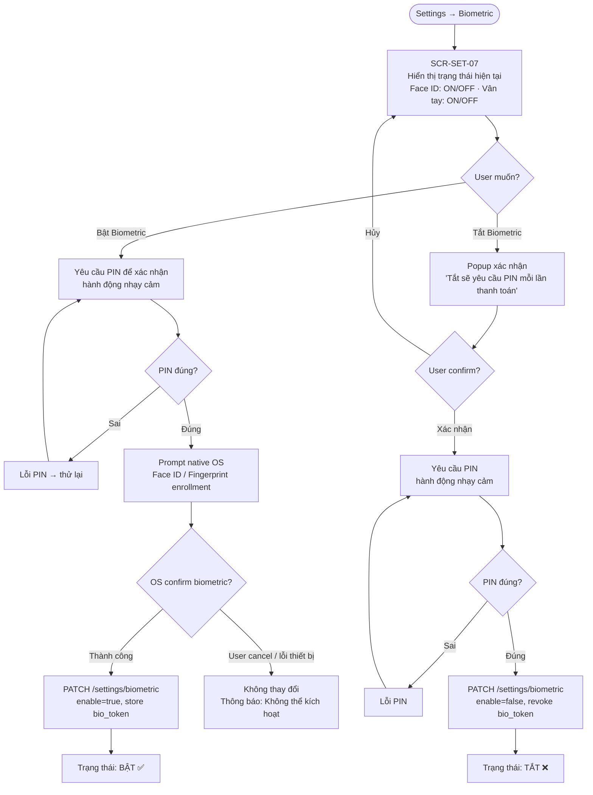
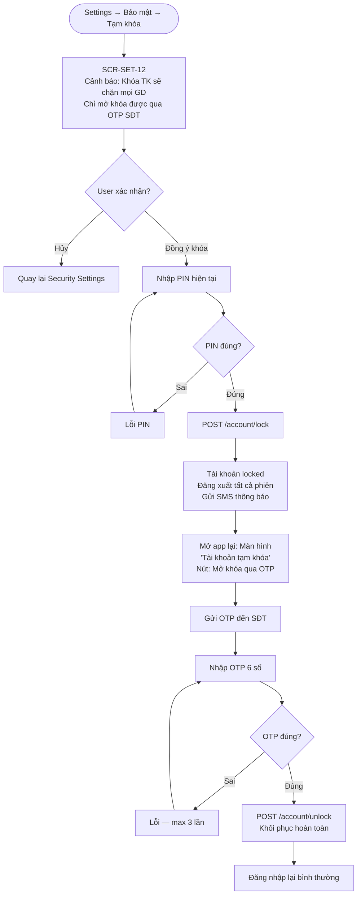
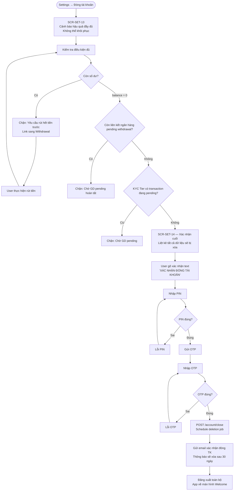
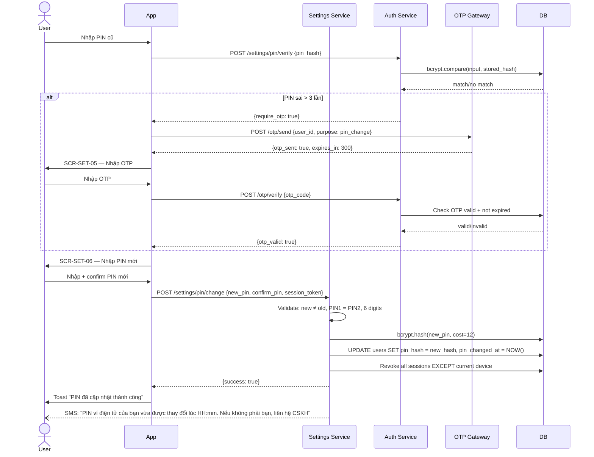
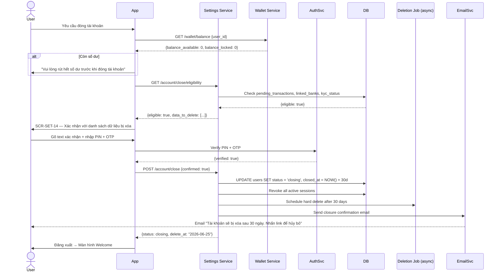

# PRD: Notifications & Settings Module

<Info>
  **Document ID:** PRD-EW-NOTIF-001 · **Version:** 1.0 · **Status:** Draft  
  **Ngày tạo:** 2026-05-26 · **Tác giả:** BA Team
</Info>

---

## 1. Tổng quan

Module Settings là trung tâm quản lý tài khoản và bảo mật của người dùng. Gồm 4 nhóm chính:

| Nhóm | Tính năng |
|------|----------|
| **Thông báo** | Bật/tắt push notification toàn app |
| **Tài khoản** | Cập nhật profile (avatar, email) · Đổi PIN · Biometric |
| **Bảo mật** | 2FA cho GD lớn · Quản lý thiết bị · Tạm khóa tài khoản |
| **Đóng tài khoản** | Offboarding flow — rút tiền → xác nhận → xóa tài khoản |

### 1.1 Phạm vi (Scope)

| Tính năng | Trong phạm vi | Ghi chú |
|-----------|:---:|---------|
| Bật/tắt push notification toàn app | ✅ | |
| Phân loại thông báo (GD / bảo mật / khuyến mãi) | ❌ | Roadmap sprint sau |
| In-app notification center | ❌ | Roadmap sprint sau |
| Cập nhật avatar, email | ✅ | Không đổi được SĐT/họ tên sau KYC |
| Đổi PIN | ✅ | Xác thực PIN cũ + OTP |
| Biometric (Face ID / Fingerprint) | ✅ | Bật/tắt + fallback PIN |
| 2FA OTP bắt buộc cho GD vượt ngưỡng | ✅ | User tự đặt ngưỡng |
| Quản lý thiết bị đăng nhập | ✅ | Xem list + đăng xuất từng device (PIN + OTP) |
| Activity log (lịch sử đăng nhập) | ❌ | Chưa làm |
| Tạm khóa tài khoản (self-lock) | ✅ | Mở khóa qua OTP |
| Đóng tài khoản (offboarding) | ✅ | Phải rút hết tiền trước |

---

## 2. Kiến trúc hệ thống



---

## 3. Danh sách màn hình

| ID | Tên màn hình | Nhóm |
|----|-------------|------|
| SCR-SET-01 | Settings home | Navigation |
| SCR-SET-02 | Notification settings | Thông báo |
| SCR-SET-03 | Chỉnh sửa profile | Tài khoản |
| SCR-SET-04 | Đổi PIN — nhập PIN cũ | Tài khoản |
| SCR-SET-05 | Đổi PIN — OTP xác nhận | Tài khoản |
| SCR-SET-06 | Đổi PIN — nhập PIN mới | Tài khoản |
| SCR-SET-07 | Biometric settings | Tài khoản |
| SCR-SET-08 | Security settings | Bảo mật |
| SCR-SET-09 | 2FA threshold setup | Bảo mật |
| SCR-SET-10 | Quản lý thiết bị | Bảo mật |
| SCR-SET-11 | Đăng xuất thiết bị — PIN + OTP | Bảo mật |
| SCR-SET-12 | Tạm khóa tài khoản | Bảo mật |
| SCR-SET-13 | Đóng tài khoản — offboarding | Đóng TK |
| SCR-SET-14 | Đóng tài khoản — xác nhận cuối | Đóng TK |

---

## 4. User Flows

### 4.1 Flow A — Đổi PIN



### 4.2 Flow B — Bật/Tắt Biometric



### 4.3 Flow C — Đăng xuất thiết bị khác (PIN + OTP)

```mermaid
flowchart TD
    A([Settings → Quản lý thiết bị]) --> B[GET /devices\nDanh sách thiết bị đang active]
    B --> C[SCR-SET-10 — Danh sách\nMỗi thiết bị: tên · OS · Lần cuối active · Current badge]
    C --> D{User chọn 1 thiết bị}
    D -->|Thiết bị hiện tại| E[Không cho đăng xuất\nTooltip: Đây là thiết bị bạn đang dùng]
    D -->|Thiết bị khác| F[Popup xác nhận\n'Đăng xuất [tên thiết bị]?']
    F --> G{Xác nhận?}
    G -->|Hủy| C
    G -->|Tiếp tục| H[SCR-SET-11 — Nhập PIN]
    H --> I{PIN đúng?}
    I -->|Sai ≤ 3| H
    I -->|Sai > 3| J[Block 30 phút]
    I -->|Đúng| K[Gửi OTP đến SĐT\nDELETE /devices/{device_id} — step 1]
    K --> L[Nhập OTP 6 số]
    L --> M{OTP đúng?}
    M -->|Sai / Hết hạn| N[Lỗi — Gửi lại OTP]
    N --> L
    M -->|Đúng| O[Revoke session của thiết bị đó\nXóa FCM token tương ứng]
    O --> P[Toast: Đã đăng xuất [tên thiết bị] thành công]
    P --> B
```

### 4.4 Flow D — Tạm khóa tài khoản (Self-Lock)



### 4.5 Flow E — Đóng tài khoản (Offboarding)



---

## 5. Sequence Diagram

### 5.1 Đổi PIN (End-to-End)



### 5.2 Đóng tài khoản (Account Closure)



---

## 6. Screen Specs

### SCR-SET-01 — Settings Home

| Section | Items | Icon |
|---------|-------|------|
| **Tài khoản** | Chỉnh sửa profile | 👤 |
| | Đổi PIN | 🔑 |
| | Sinh trắc học (Face ID / Vân tay) | 🔐 |
| **Thông báo** | Thông báo đẩy | 🔔 |
| **Bảo mật** | Bảo mật giao dịch (2FA) | 🛡️ |
| | Quản lý thiết bị đăng nhập | 📱 |
| | Tạm khóa tài khoản | 🔒 |
| **Khác** | Điều khoản & Chính sách | 📄 |
| | Liên hệ CSKH | 💬 |
| | Đóng tài khoản | ⚠️ (màu đỏ) |
| | Đăng xuất | 🚪 |

---

### SCR-SET-02 — Notification Settings

| Component | Chi tiết |
|-----------|---------|
| Header | "Thông báo" |
| Toggle master | "Thông báo đẩy (Push)" — bật/tắt toàn bộ push notification |
| Status | Nếu tắt: "Push đã tắt — bạn sẽ không nhận được thông báo từ ứng dụng" |
| Permission check | Nếu OS đã revoke permission: hiển thị "Cấp quyền thông báo trong Cài đặt điện thoại" + nút "Mở Settings" |
| Note | "Phân loại chi tiết (GD, bảo mật, khuyến mãi) sẽ sớm ra mắt" |

**Điều kiện hiển thị:**
- Nếu OS permission chưa được cấp: toggle hiển thị OFF + không thể bật trực tiếp → hướng dẫn ra Settings
- Toggle thay đổi FCM opt-in/opt-out tại server — không unregister token

---

### SCR-SET-03 — Chỉnh sửa Profile

| Component | Chi tiết |
|-----------|---------|
| Avatar | Ảnh hiện tại + icon camera để thay — tap → image picker (camera / gallery) |
| Trường Họ và tên | READ ONLY sau KYC — label "Không thể thay đổi sau xác thực KYC" + icon khóa |
| Trường SĐT | READ ONLY — label "Số điện thoại không thể thay đổi" |
| Trường Email | Editable — validate format email |
| CTA "Lưu thay đổi" | Enabled khi có field nào thay đổi |
| Avatar upload | Max 5MB, định dạng JPG/PNG/WEBP — resize về 400×400px server-side |

---

### SCR-SET-06 — Nhập PIN mới

| Component | Chi tiết |
|-----------|---------|
| Header | "Tạo PIN mới" |
| PIN pad | 6 ô số, dots (không hiện số thực) |
| Strength hints | "Không dùng số liên tiếp (123456)" · "Không dùng số lặp (111111)" — checklist |
| Step indicator | Bước 1: Nhập PIN mới · Bước 2: Xác nhận PIN |
| PIN confirm | Sau khi nhập 6 số: auto-advance sang màn confirm |
| Mismatch error | "Mã PIN không khớp. Vui lòng thử lại" |

---

### SCR-SET-07 — Biometric Settings

| Component | Chi tiết |
|-----------|---------|
| Header | "Xác thực sinh trắc học" |
| Face ID section | Chỉ hiện nếu thiết bị hỗ trợ Face ID. Toggle ON/OFF + icon 🤳 |
| Vân tay section | Chỉ hiện nếu thiết bị hỗ trợ Fingerprint. Toggle ON/OFF + icon 👆 |
| Mô tả | "Dùng sinh trắc học để xác thực thanh toán và đăng nhập nhanh hơn" |
| Fallback note | "Nếu sinh trắc học không nhận diện được, hệ thống sẽ yêu cầu nhập PIN" |
| Trạng thái không hỗ trợ | "Thiết bị của bạn không hỗ trợ tính năng này" (disabled) |

---

### SCR-SET-09 — 2FA Threshold Setup

| Component | Chi tiết |
|-----------|---------|
| Header | "Bảo mật giao dịch" |
| Toggle "Bật OTP cho GD lớn" | Khi bật: mọi GD vượt ngưỡng sẽ yêu cầu OTP SMS thêm sau PIN |
| Ngưỡng (threshold) | Slider hoặc ô nhập VND — mặc định: 5,000,000 VND |
| Min threshold | 500,000 VND |
| Mô tả | "Giao dịch trên [X] VND sẽ yêu cầu mã OTP qua SMS ngoài mã PIN" |
| Preview | "Hiện tại: Bật — Ngưỡng 5,000,000 VND" |

---

### SCR-SET-10 — Quản lý thiết bị

| Component | Chi tiết |
|-----------|---------|
| Header | "Thiết bị đăng nhập" |
| List thiết bị | Mỗi item: [OS icon] Tên thiết bị · Phiên bản OS · Lần cuối active · Badge "Thiết bị này" |
| Thiết bị hiện tại | Không có nút đăng xuất — chỉ hiện badge |
| Thiết bị khác | Nút "Đăng xuất" → flow SCR-SET-11 |
| Nút "Đăng xuất tất cả" | Cuối danh sách — đăng xuất tất cả trừ thiết bị hiện tại (cũng cần PIN + OTP) |
| Thông tin thiết bị | device_name · device_id (masked) · last_active_at |

---

### SCR-SET-12 — Tạm khóa tài khoản

| Component | Chi tiết |
|-----------|---------|
| Header | "Tạm khóa tài khoản" |
| Cảnh báo | Panel đỏ: "Khi khóa tài khoản: Bạn không thể thực hiện giao dịch nào · Tài khoản sẽ bị đăng xuất trên mọi thiết bị · Chỉ mở khóa qua OTP SĐT" |
| CTA | "Khóa tài khoản" — màu đỏ |
| Lý do khóa (optional) | Dropdown: Mất điện thoại · Nghi ngờ bị hack · Lý do khác |
| Hủy | Link text "Không, tôi muốn giữ tài khoản" |

---

### SCR-SET-13/14 — Đóng tài khoản (Offboarding)

**SCR-SET-13 — Điều kiện & Cảnh báo:**

| Component | Chi tiết |
|-----------|---------|
| Header | "Đóng tài khoản" (màu đỏ) |
| Danh sách kiểm tra | ✅ Số dư bằng 0 · ✅ Không có GD đang chờ · ✅ Không có ngân hàng đang chờ liên kết |
| Danh sách dữ liệu bị xóa | Hồ sơ cá nhân · Lịch sử giao dịch · Liên kết ngân hàng · Dữ liệu KYC |
| Retention note | "Một số dữ liệu có thể được giữ lại tối đa 5 năm theo quy định pháp luật" |
| Grace period | "Tài khoản sẽ vẫn còn trong 30 ngày. Trong 30 ngày đó bạn có thể đổi ý qua email hỗ trợ" |

**SCR-SET-14 — Xác nhận cuối:**

| Component | Chi tiết |
|-----------|---------|
| Text input confirm | User gõ chính xác "XÁC NHẬN ĐÓNG TÀI KHOẢN" — CTA disabled cho đến khi đúng |
| PIN input | 6 ô số |
| OTP input | 6 ô số gửi qua SĐT |
| CTA | "Xác nhận đóng tài khoản vĩnh viễn" — màu đỏ đậm |

---

## 7. Validation Rules

| Rule ID | Field | Điều kiện vi phạm | Lỗi hiển thị |
|---------|-------|------------------|-------------|
| VAL-SET-01 | PIN mới | Ít hơn 6 số | "Mã PIN phải có đúng 6 chữ số" |
| VAL-SET-02 | PIN mới | Số liên tiếp (123456, 654321) | Cảnh báo: "PIN dễ đoán — hãy chọn PIN khác an toàn hơn" |
| VAL-SET-03 | PIN mới | Số lặp (111111, 000000) | Cảnh báo tương tự |
| VAL-SET-04 | PIN mới | Trùng PIN cũ | "Mã PIN mới không được trùng với mã PIN hiện tại" |
| VAL-SET-05 | PIN confirm | Không khớp PIN mới | "Mã PIN xác nhận không khớp" |
| VAL-SET-06 | Email | Sai format email | "Địa chỉ email không hợp lệ" |
| VAL-SET-07 | Avatar | > 5MB | "Ảnh quá lớn. Vui lòng chọn ảnh nhỏ hơn 5MB" |
| VAL-SET-08 | Avatar | Không phải JPG/PNG/WEBP | "Định dạng ảnh không được hỗ trợ" |
| VAL-SET-09 | 2FA threshold | < 500,000 VND | "Ngưỡng tối thiểu là 500,000 VND" |
| VAL-SET-10 | Close account text | Không đúng chuỗi xác nhận | CTA disabled — không hiện lỗi, chỉ disable |
| VAL-SET-11 | Close account | Còn số dư > 0 | "Vui lòng rút hết số dư trước khi đóng tài khoản" |
| VAL-SET-12 | Close account | Có GD đang pending | "Có giao dịch đang xử lý. Vui lòng chờ hoàn tất" |

---

## 8. Business Rules

| ID | Rule | Mô tả |
|----|------|-------|
| BR-SET-01 | PIN bcrypt cost=12 | Mã PIN mới được hash bằng bcrypt với cost factor 12. Không lưu plaintext hay MD5 |
| BR-SET-02 | Đổi PIN → đăng xuất thiết bị khác | Sau khi đổi PIN thành công, tất cả refresh token trên thiết bị khác bị revoke. Thiết bị hiện tại giữ session |
| BR-SET-03 | SĐT/Họ tên bất biến sau KYC | Sau khi KYC Tier 2 được duyệt, không cho phép thay đổi SĐT và Họ tên qua Settings. Thay đổi phải qua quy trình KYC lại |
| BR-SET-04 | Biometric token revoke | Khi tắt biometric hoặc đổi PIN → revoke bio_token. Lần đăng nhập/thanh toán biometric tiếp theo sẽ fail → prompt bật lại |
| BR-SET-05 | 2FA threshold phạm vi | Khi 2FA bật, mọi GD (Transfer + QR Payment + Withdrawal) vượt threshold đều cần OTP thêm, sau PIN |
| BR-SET-06 | Đăng xuất thiết bị: PIN + OTP | Hành động đăng xuất thiết bị khác cần PIN hiện tại + OTP SMS — không thể chỉ cần 1 trong 2 |
| BR-SET-07 | Max devices | Một tài khoản tối đa 5 thiết bị active cùng lúc. Đăng nhập thiết bị thứ 6 → yêu cầu đăng xuất 1 thiết bị khác |
| BR-SET-08 | Self-lock: mở bằng OTP | Tài khoản tự khóa chỉ mở được qua OTP SĐT — không thể mở bằng PIN (vì có thể PIN đã bị lộ) |
| BR-SET-09 | Offboarding grace period 30 ngày | Sau khi request đóng TK: status = `closing`, tài khoản không dùng được nhưng dữ liệu chưa xóa. User có thể cancel trong 30 ngày qua CSKH |
| BR-SET-10 | Offboarding: số dư = 0 bắt buộc | Hệ thống từ chối request đóng TK nếu `balance_available + balance_locked > 0` |
| BR-SET-11 | Dữ liệu pháp lý giữ lại | Sau khi xóa TK: thông tin KYC và lịch sử GD được giữ trong hệ thống (anonymized) tối thiểu 5 năm theo NĐ52/2024 |
| BR-SET-12 | Notification toggle server-side | Tắt push = update `push_opt_in = false` tại server → không gửi FCM/APNs message. Không unregister token vì user có thể bật lại |

---

## 9. Notification Events

| Event | Trigger | Kênh | Nội dung |
|-------|---------|------|---------|
| `PIN_CHANGED` | Đổi PIN thành công | SMS + Push | "Mã PIN ví điện tử của bạn vừa được thay đổi lúc [HH:mm]. Nếu không phải bạn, khóa tài khoản ngay" |
| `DEVICE_LOGGED_OUT` | Đăng xuất thiết bị từ xa | Push (thiết bị bị đăng xuất) | "Thiết bị này vừa bị đăng xuất khỏi tài khoản của bạn" |
| `ACCOUNT_LOCKED` | Tài khoản bị tự khóa | SMS | "Tài khoản ví của bạn đã được khóa theo yêu cầu. Nhập OTP để mở khóa" |
| `ACCOUNT_UNLOCKED` | Mở khóa thành công | Push | "Tài khoản của bạn đã được mở khóa thành công" |
| `ACCOUNT_CLOSING` | Request đóng TK | Email | "Tài khoản sẽ bị xóa vào [ngày]. Nhấn link để hủy bỏ nếu đây không phải ý định của bạn" |
| `BIOMETRIC_CHANGED` | Bật/tắt biometric | Push | "Cài đặt sinh trắc học vừa được thay đổi. Nếu không phải bạn, đổi PIN ngay" |
| `NEW_DEVICE_LOGIN` | Đăng nhập thiết bị mới | Push + SMS | Đã xử lý trong Auth module (SCR-AUTH-15) |

---

## 10. API Endpoints

| Method | Endpoint | Mô tả | Auth |
|--------|----------|-------|------|
| `GET` | `/settings` | Lấy toàn bộ cài đặt user | JWT |
| `PATCH` | `/settings/profile` | Cập nhật avatar, email | JWT |
| `POST` | `/settings/pin/verify` | Xác minh PIN hiện tại (bước 1 đổi PIN) | JWT |
| `POST` | `/settings/pin/change` | Hoàn tất đổi PIN | JWT + OTP session |
| `PATCH` | `/settings/biometric` | Bật/tắt biometric | JWT + PIN |
| `PATCH` | `/settings/notifications` | Bật/tắt push notification | JWT |
| `PATCH` | `/settings/2fa` | Cấu hình 2FA threshold | JWT + PIN |
| `GET` | `/devices` | Danh sách thiết bị active | JWT |
| `DELETE` | `/devices/{device_id}` | Đăng xuất 1 thiết bị (PIN + OTP required) | JWT + PIN + OTP |
| `DELETE` | `/devices` | Đăng xuất tất cả thiết bị khác | JWT + PIN + OTP |
| `POST` | `/account/lock` | Tự khóa tài khoản | JWT + PIN |
| `POST` | `/account/unlock` | Mở khóa tài khoản | OTP only (no JWT — đã bị logout) |
| `GET` | `/account/close/eligibility` | Kiểm tra điều kiện đóng TK | JWT |
| `POST` | `/account/close` | Request đóng tài khoản | JWT + PIN + OTP |

---

## 11. Error Codes

| Code | HTTP | Mô tả kỹ thuật | Hiển thị người dùng |
|------|------|---------------|-------------------|
| `SET_001` | 400 | PIN mới trùng PIN cũ | "Mã PIN mới không được trùng với mã PIN hiện tại" |
| `SET_002` | 400 | PIN confirm không khớp | "Mã PIN xác nhận không khớp" |
| `SET_003` | 401 | PIN cũ sai | "Mã PIN không đúng. Còn [N] lần thử" |
| `SET_004` | 429 | PIN sai > 3 lần | "Quá số lần thử PIN — cần xác thực OTP" |
| `SET_005` | 400 | Email không hợp lệ | "Địa chỉ email không hợp lệ" |
| `SET_006` | 422 | Avatar quá lớn / sai định dạng | "Ảnh không hợp lệ" |
| `SET_007` | 403 | Cố thay đổi SĐT/Họ tên sau KYC | "Thông tin này không thể thay đổi sau khi xác thực KYC" |
| `SET_008` | 404 | Device ID không tồn tại | "Thiết bị không tìm thấy" |
| `SET_009` | 403 | Cố đăng xuất thiết bị hiện tại qua API | "Không thể đăng xuất thiết bị đang sử dụng qua tính năng này" |
| `SET_010` | 422 | Đóng TK còn số dư | "Vui lòng rút hết số dư trước khi đóng tài khoản" |
| `SET_011` | 422 | Đóng TK có GD pending | "Có giao dịch đang xử lý. Vui lòng chờ hoàn tất" |
| `SET_012` | 422 | 2FA threshold dưới 500K | "Ngưỡng OTP tối thiểu là 500,000 VND" |

---

## 12. Edge Cases

| # | Tình huống | Xử lý |
|---|-----------|-------|
| 1 | User bật Biometric trên thiết bị chưa enroll Face ID / Fingerprint | OS trả về lỗi enrollment → hiển thị "Vui lòng cài đặt sinh trắc học trong Cài đặt điện thoại trước" |
| 2 | User thay SIM (SĐT mới) → không nhận được OTP cho đổi PIN | Phải qua CSKH với xác minh KYC để cập nhật SĐT. Flow này ngoài phạm vi Settings module |
| 3 | Đóng tài khoản khi đang có nạp tiền Push đang pending (chưa về) | Kiểm tra `balance_locked > 0` → chặn, hiển thị "Bạn có [X] VND đang chờ nạp" |
| 4 | Tắt push notification trên app → OS vẫn còn permission | Server set `push_opt_in = false` → không gửi dù có FCM token hợp lệ. Không unregister token |
| 5 | User có đúng 5 thiết bị, muốn đăng nhập thiết bị mới | Khi login thành công thiết bị 6: hiển thị danh sách 5 thiết bị cũ, yêu cầu chọn 1 để đăng xuất trước khi tiếp tục |
| 6 | Đóng TK nhưng có ngân hàng đã liên kết | OAuth token bị revoke tự động trong closing job. Ngân hàng được liên kết không ảnh hưởng — không cần unlink thủ công |
| 7 | User trong grace period 30 ngày muốn hủy đóng TK | Không có flow trong app — phải liên hệ CSKH qua email. CSKH có thể revert `status` về `active` trong DB |

---

## 13. Open Questions

| # | Câu hỏi | Ảnh hưởng | Target |
|---|---------|----------|--------|
| 1 | Phân loại thông báo chi tiết (GD / bảo mật / khuyến mãi) — khi nào làm? | UX personalization — user tránh spam từ promo | Sprint 9 |
| 2 | In-app notification center (unread badge, danh sách) — scope thế nào? | Cần thiết kế data model riêng cho notification store | Sprint 9 |
| 3 | Grace period 30 ngày — user có thể tự hủy trong app không? | Nếu có: cần thêm `POST /account/close/cancel` + màn hình hủy | Sprint 8 |
| 4 | Max devices = 5 có phù hợp không? | User hay đổi điện thoại hoặc dùng tablet có thể bị chặn | Product decision |
| 5 | Biometric auth: có dùng được cho đăng nhập app không, hay chỉ dùng cho thanh toán? | Auth module cần đồng bộ scope biometric | Sprint 7 clarification |
