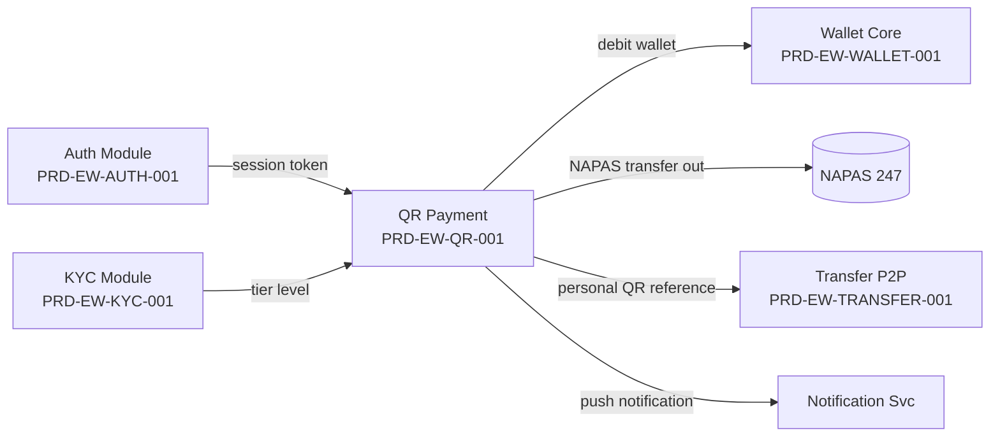
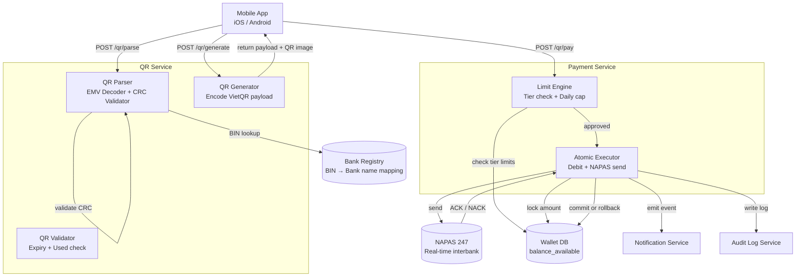
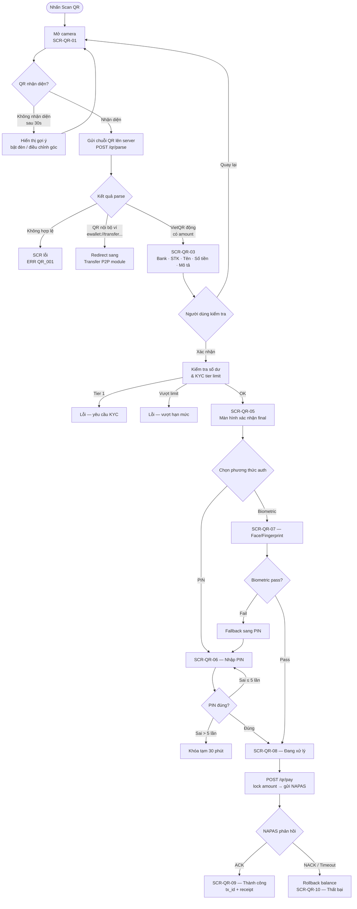
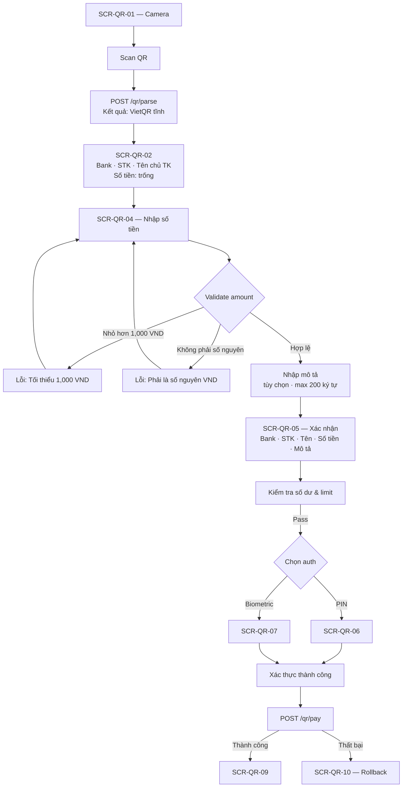
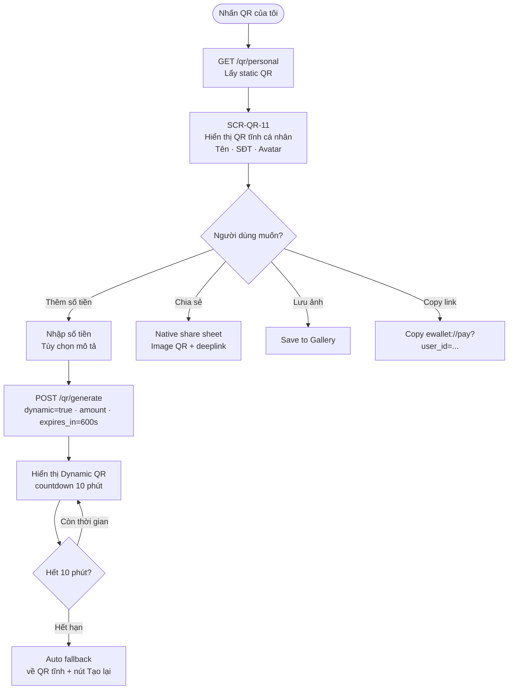
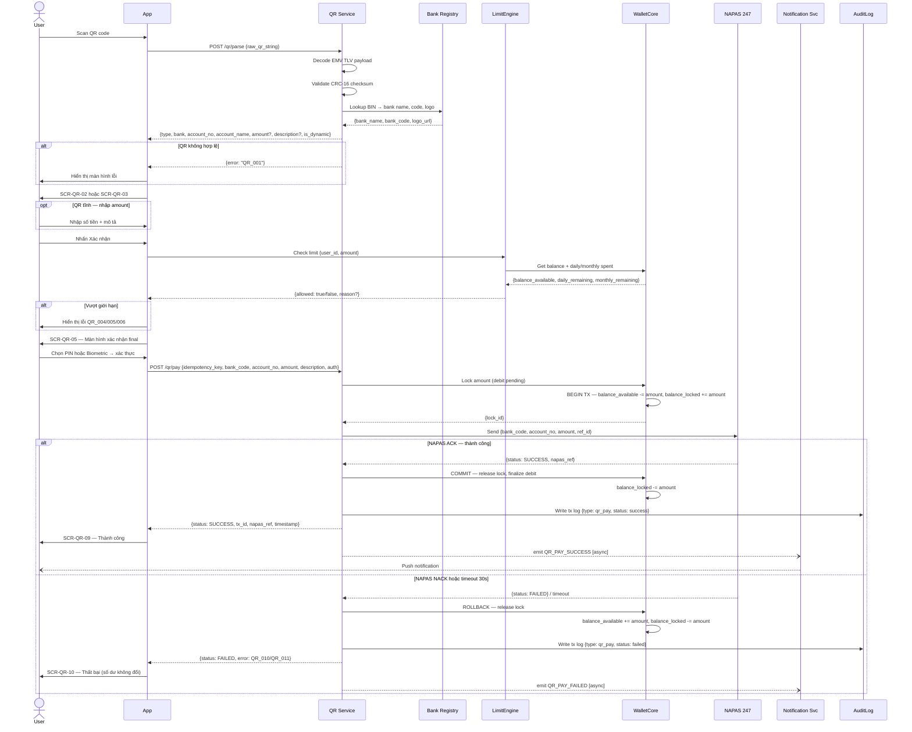
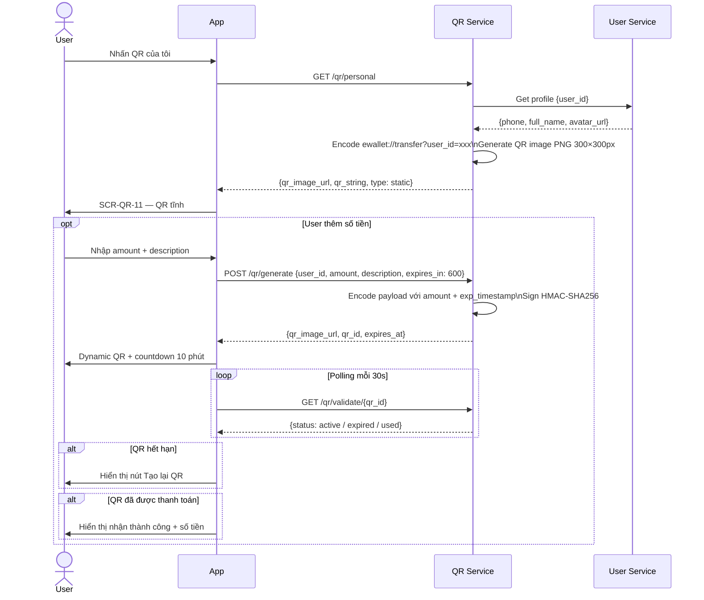

# PRD: QR Payment Module

<Info>
  **Document ID:** PRD-EW-QR-001 · **Version:** 1.0 · **Status:** Draft  
  **Ngày tạo:** 2026-05-26 · **Tác giả:** BA Team
</Info>

---

## 1. Tổng quan

Module QR Payment cho phép người dùng thực hiện thanh toán bằng cách **scan mã QR** hoặc **hiển thị QR cá nhân** để nhận tiền. Khác với Transfer (wallet → wallet theo SĐT), QR Payment xử lý luồng **wallet → tài khoản ngân hàng** thông qua NAPAS 247 sau khi parse QR chứa thông tin ngân hàng thụ hưởng.

### 1.1 Phạm vi (Scope)

| Tính năng | Trong phạm vi | Ghi chú |
|-----------|:---:|---------|
| Scan VietQR tĩnh (không có sẵn số tiền) | ✅ | Người dùng nhập số tiền |
| Scan VietQR động (có sẵn số tiền) | ✅ | Số tiền không thể chỉnh sửa |
| Scan static QR tại merchant (quán ăn, cửa hàng) | ✅ | Cùng chuẩn VietQR/EMV |
| Hiển thị QR cá nhân (nhận tiền) | ✅ | QR tĩnh + QR động có số tiền |
| Xác thực bằng Biometric hoặc PIN | ✅ | Người dùng tự chọn phương thức |
| Thanh toán hóa đơn tiện ích (điện, nước) | ❌ | Roadmap — chưa làm trong sprint này |
| Merchant portal / Dynamic QR từ phía merchant | ❌ | Roadmap future |
| QR cross-border (quốc tế) | ❌ | Out of scope |
| Hoàn tiền (refund) | ❌ | Không hỗ trợ — mọi GD không thể đảo ngược |

### 1.2 Mối quan hệ với các module khác



---

## 2. Chuẩn QR — VietQR & EMV

### 2.1 VietQR là gì?

**VietQR** là chuẩn mã QR do NAPAS phát triển dựa trên **EMV QR Code Specification for Payment Systems** (chuẩn quốc tế ISO 20022). Hầu hết ngân hàng Việt Nam đã tích hợp VietQR — khi người dùng tạo QR từ app ngân hàng hay dán QR tại quán ăn, đó đều là VietQR.

**Cấu trúc payload (TLV — Tag-Length-Value):**

| Tag | Tên trường | Static QR | Dynamic QR |
|-----|-----------|:---:|:---:|
| `00` | Payload Format Indicator | `01` | `01` |
| `01` | Point of Initiation | `11` (static) | `12` (dynamic) |
| `26`–`51` | Merchant Account Info (BIN + số TK) | ✅ | ✅ |
| `52` | Merchant Category Code | Tùy chọn | ✅ |
| `53` | Transaction Currency | `704` (VND) | `704` (VND) |
| `54` | Transaction Amount | ❌ | ✅ |
| `58` | Country Code | `VN` | `VN` |
| `59` | Merchant Name | Tùy chọn | ✅ |
| `62` | Additional Data (description, ref ID) | Tùy chọn | Tùy chọn |
| `63` | CRC Checksum (CRC-16/CCITT) | ✅ | ✅ |

### 2.2 Phân loại QR app cần xử lý

| Loại QR | Ví dụ | Hành động sau parse |
|---------|-------|-------------------|
| **VietQR tĩnh** | QR dán tại quán ăn, ATM | Hiển thị thông tin ngân hàng → yêu cầu nhập số tiền |
| **VietQR động** | QR từ app ngân hàng (có amount) | Prefill đầy đủ → không cho sửa amount |
| **QR nội bộ ví** | `ewallet://transfer?user_id=...` | Redirect sang Transfer P2P module |
| **QR không hợp lệ** | QR sản phẩm, QR website, QR không phải tài chính | Báo lỗi `QR_001` |

---

## 3. Kiến trúc hệ thống



---

## 4. Giới hạn giao dịch theo KYC Tier

<Warning>
  **Tier 1 không được thực hiện giao dịch QR Payment.** Người dùng phải hoàn thành KYC Tier 2 (eKYC CCCD chip + Face liveness) trước khi dùng tính năng này.
</Warning>

| KYC Tier | Mỗi giao dịch | Mỗi ngày | Mỗi tháng |
|----------|:---:|:---:|:---:|
| **Tier 1** | ❌ Bị chặn | — | — |
| **Tier 2** | 20,000,000 VND | 100,000,000 VND | 100,000,000 VND |
| **Tier 3** | 100,000,000 VND | 500,000,000 VND | 500,000,000 VND |

> Giới hạn này **dùng chung với Transfer P2P** — tổng chi tiêu của cả 2 tính năng được tính vào cùng 1 daily/monthly cap do LimitEngine quản lý.

---

## 5. Danh sách màn hình

| ID | Tên màn hình | Khi nào hiển thị |
|----|-------------|-----------------|
| SCR-QR-01 | QR Scanner | Người dùng nhấn "Scan QR" từ Home hoặc Quick Action |
| SCR-QR-02 | Kết quả parse — VietQR tĩnh | Sau khi scan thành công QR không có amount |
| SCR-QR-03 | Kết quả parse — VietQR động | Sau khi scan thành công QR có sẵn amount |
| SCR-QR-04 | Nhập số tiền | Chỉ hiển thị nếu QR tĩnh (không có amount) |
| SCR-QR-05 | Xác nhận thanh toán | Sau khi điền đủ thông tin (bank + amount + description) |
| SCR-QR-06 | Xác thực — PIN | Nếu người dùng chọn PIN để xác thực |
| SCR-QR-07 | Xác thực — Biometric | Nếu người dùng chọn Biometric để xác thực |
| SCR-QR-08 | Đang xử lý | Sau khi xác thực thành công — chờ NAPAS phản hồi |
| SCR-QR-09 | Thanh toán thành công | NAPAS ACK trả về thành công |
| SCR-QR-10 | Thanh toán thất bại | NAPAS NACK hoặc timeout |
| SCR-QR-11 | QR cá nhân — nhận tiền | Người dùng nhấn "QR của tôi" |

---

## 6. User Flow

### 6.1 Flow A — Scan VietQR động (có sẵn số tiền)



### 6.2 Flow B — Scan VietQR tĩnh (không có số tiền)



### 6.3 Flow C — Hiển thị QR cá nhân để nhận tiền



---

## 7. Sequence Diagram

### 7.1 Scan & Pay (End-to-End)



### 7.2 Generate Personal QR



---

## 8. Screen Specs

### SCR-QR-01 — QR Scanner

```
┌─────────────────────────────────┐
│  ✕                    [🖼 Ảnh] │
│                                 │
│  ┌─────────────────────────┐   │
│  │                         │   │
│  │   ╔═══════════════╗     │   │
│  │   ║               ║     │   │
│  │   ║  [ QR FRAME ] ║     │   │
│  │   ║               ║     │   │
│  │   ╚═══════════════╝     │   │
│  │                         │   │
│  └─────────────────────────┘   │
│                                 │
│   Đưa mã QR vào khung để quét  │
│                                 │
│          [🔦 Bật đèn]          │
└─────────────────────────────────┘
```

| Component | Chi tiết |
|-----------|---------|
| Camera viewfinder | Toàn màn hình, overlay hình vuông 70% chiều rộng làm vùng scan |
| Scan area guide | 4 góc viền highlight màu primary, animation pulsing |
| Torch button | Icon đèn pin góc phải dưới — toggle flash |
| Gallery button | Icon ảnh — chọn screenshot QR từ thư viện |
| Cancel button | "✕" góc trái trên → quay về màn hình trước |
| Status text | "Đưa mã QR vào khung để quét" |
| Auto-detect | Nhận diện trong ≤ 1s nếu đủ ánh sáng và QR rõ nét |
| 30s no-detect hint | Toast: "Không nhận được mã? Thử bật đèn hoặc chọn ảnh từ thư viện" |

**Điều kiện hiển thị:**
- Yêu cầu quyền Camera — permission request lần đầu
- Nếu từ chối permission: màn hình hướng dẫn mở Settings để cấp quyền
- Tier 1 bị chặn ngay từ entry point (Quick Action bị disable)

---

### SCR-QR-02 — Kết quả parse VietQR tĩnh

```
┌─────────────────────────────────┐
│  ←  Quét lại                   │
│                                 │
│  Thông tin chuyển khoản         │
│  ┌───────────────────────────┐  │
│  │ [Logo MB]  MBBank         │  │
│  │ STK: **** 1234   [Hiện]   │  │
│  │ Chủ TK: NGUYEN VAN A      │  │
│  └───────────────────────────┘  │
│                                 │
│  Số tiền *                      │
│  ┌───────────────────────────┐  │
│  │   Nhập số tiền (VND)...   │  │
│  └───────────────────────────┘  │
│  [50K]  [100K]  [200K]  [500K] │
│                                 │
│  Nội dung CK (tùy chọn)        │
│  ┌───────────────────────────┐  │
│  │                    0/200  │  │
│  └───────────────────────────┘  │
│                                 │
│       [      Tiếp tục     ]     │
└─────────────────────────────────┘
```

| Component | Chi tiết |
|-----------|---------|
| Bank logo + tên | Logo từ BankRegistry + tên đầy đủ ngân hàng |
| Số tài khoản | Masked: `****1234` + nút "Hiện đầy đủ" (tap to reveal) |
| Tên chủ tài khoản | Hiển thị nếu QR có encode — không bắt buộc theo chuẩn VietQR |
| Số tiền | Trống — placeholder dẫn sang SCR-QR-04 khi tap |
| Nội dung CK | Hiển thị nếu QR có encode — có thể chỉnh sửa |
| CTA "Tiếp tục" | Disabled nếu chưa nhập amount |
| Link "Quét lại" | Quay về SCR-QR-01 |

---

### SCR-QR-03 — Kết quả parse VietQR động

```
┌─────────────────────────────────┐
│  ←  Quét lại                   │
│                                 │
│  Thông tin thanh toán           │
│  ┌───────────────────────────┐  │
│  │ [Logo VCB]  Vietcombank   │  │
│  │ STK: 001 234 567 890      │  │
│  │ Chủ TK: NGUYEN VAN B      │  │
│  └───────────────────────────┘  │
│                                 │
│  Số tiền   ⚠ Số tiền cố định   │
│  ┌───────────────────────────┐  │
│  │   150,000 VND          🔒 │  │
│  └───────────────────────────┘  │
│                                 │
│  Nội dung: Thanh toan bua an   │
│  Ref: ORDER_2026_001234         │
│                                 │
│   [   Thanh toán 150,000 VND  ] │
└─────────────────────────────────┘
```

| Component | Chi tiết |
|-----------|---------|
| Bank logo + tên | Như trên |
| Số tài khoản | Hiển thị đầy đủ |
| Tên chủ tài khoản | Bắt buộc có trong dynamic QR |
| Số tiền | **Prefilled + READ ONLY** — font nổi bật, không tương tác được |
| Badge "Số tiền cố định" | Warning badge màu vàng cạnh ô số tiền |
| Nội dung CK | Prefilled — không chỉnh sửa được |
| Merchant ref ID | Hiển thị nếu có (field `62`) dạng tag nhỏ dưới nội dung CK |
| CTA | "Thanh toán [amount] VND" |

---

### SCR-QR-04 — Nhập số tiền (chỉ dùng cho QR tĩnh)

```
┌─────────────────────────────────┐
│  ←  Quay lại                   │
│                                 │
│  Số tiền *                      │
│  ┌───────────────────────────┐  │
│  │                           │  │
│  │       0 VND               │  │
│  │                           │  │
│  └───────────────────────────┘  │
│  Số dư: 2,500,000 VND           │
│                                 │
│  [50K]  [100K]  [200K]  [500K] │
│                                 │
│  Nội dung chuyển khoản          │
│  ┌───────────────────────────┐  │
│  │ Ví dụ: Tien com           │  │
│  │                    0/200  │  │
│  └───────────────────────────┘  │
│                                 │
│       [      Tiếp tục     ]     │
│  ┌──────────────────────────┐   │
│  │  1  2  3  4  5  6  7  8 │   │
│  │  9  0  ,  ←             │   │
│  └──────────────────────────┘   │
└─────────────────────────────────┘
```

| Component | Chi tiết |
|-----------|---------|
| Ô nhập số tiền | Numeric keyboard, auto-format VND khi nhập |
| Quick amount chips | `50,000` · `100,000` · `200,000` · `500,000` |
| Số dư khả dụng | "Số dư: X VND" phía dưới ô nhập |
| Ô nội dung CK | Optional, max 200 ký tự, character counter |
| Validate inline | Hiện error ngay bên dưới ô nếu sai |
| CTA | "Tiếp tục" (disabled khi chưa có amount hợp lệ) |

---

### SCR-QR-05 — Xác nhận thanh toán

```
┌─────────────────────────────────┐
│  ←  Quay lại                   │
│    Xác nhận thanh toán QR       │
│                                 │
│  ┌───────────────────────────┐  │
│  │ [Logo]  MBBank            │  │
│  │ **** 1234 · NGUYEN VAN A  │  │
│  └───────────────────────────┘  │
│                                 │
│  Số tiền          150,000 VND   │
│  Nội dung     Thanh toan an uong│
│  Phí                  Miễn phí  │
│  ─────────────────────────────  │
│  Tổng cộng        150,000 VND   │
│                                 │
│  Xác thực bằng                  │
│  ○ PIN   ● Vân tay / Khuôn mặt  │
│                                 │
│  ╔═══════════════════════════╗  │
│  ║ ⚠ Giao dịch không thể    ║  │
│  ║    hoàn tác sau xác nhận ║  │
│  ╚═══════════════════════════╝  │
│                                 │
│  [    Xác nhận & Thanh toán   ] │
└─────────────────────────────────┘
```

| Component | Chi tiết |
|-----------|---------|
| Header | "Xác nhận thanh toán QR" |
| Recipient card | Bank logo · Tên bank · STK masked · Tên chủ TK |
| Amount row | Số tiền — font lớn, màu primary |
| Description row | Nội dung CK (nếu có) |
| Fee row | "Phí: Miễn phí" |
| Auth method selector | Toggle: **"PIN"** / **"Sinh trắc học"** — nhớ lựa chọn lần trước |
| Warning banner | "⚠️ Giao dịch không thể hoàn tác sau khi xác nhận" — nền vàng nhạt |
| CTA | "Xác nhận & Thanh toán" |
| Back | Quay lại SCR-QR-02/03/04 |

---

### SCR-QR-09 — Thanh toán thành công

```
┌─────────────────────────────────┐
│                                 │
│                                 │
│           ✅ (animation)        │
│                                 │
│      Thanh toán thành công      │
│                                 │
│         150,000 VND             │
│      MBBank · **** 1234         │
│                                 │
│  ─────────────────────────────  │
│  Mã GD:  TXN-QR-2026-000456    │
│  Thời gian: 14:30 · 26/05/2026  │
│  ─────────────────────────────  │
│                                 │
│     [ 📋 Xem chi tiết GD ]     │
│     [ 📤 Chia sẻ biên lai ]    │
│                                 │
│          Về trang chủ           │
└─────────────────────────────────┘
```

| Component | Chi tiết |
|-----------|---------|
| Animation | ✅ Lottie success animation |
| Tiêu đề | "Thanh toán thành công" |
| Số tiền | VND — font lớn |
| Ngân hàng thụ hưởng | Tên bank + STK masked |
| Mã giao dịch | `tx_id` + `napas_ref` |
| Thời gian | HH:mm:ss DD/MM/YYYY |
| Nút "Xem chi tiết" | Mở Transaction History tại GD này |
| Nút "Chia sẻ biên lai" | Share image/PDF |
| Nút "Về trang chủ" | Pop về Home |

---

### SCR-QR-11 — QR cá nhân (nhận tiền)

```
┌─────────────────────────────────┐
│  ←              [💾 Lưu ảnh]   │
│          QR của tôi             │
│                                 │
│          [  Avatar 60px ]       │
│        Nguyễn Đức Chinh         │
│           0901 234 567          │
│                                 │
│  ┌─────────────────────────┐   │
│  │                         │   │
│  │    ████ ██ ████████     │   │
│  │    ██ ████  [logo] ██   │   │
│  │    ████ ██ ████████     │   │
│  │    QR CODE  300×300px   │   │
│  │                         │   │
│  └─────────────────────────┘   │
│          [ Badge: Tĩnh ]        │
│                                 │
│  [+ Thêm số tiền]  [📤 Chia sẻ]│
└─────────────────────────────────┘
```

| Component | Chi tiết |
|-----------|---------|
| Avatar | Ảnh đại diện người dùng |
| Tên | Họ và tên đầy đủ (từ KYC profile) |
| SĐT | Số điện thoại đã đăng ký |
| QR image | 300×300px PNG, logo ví ở center, border rounded |
| Badge loại QR | "Tĩnh" (xanh) hoặc "Động · hết hạn sau MM:SS" (cam) |
| Nút "Thêm số tiền" | Popup nhập amount + description → tạo Dynamic QR |
| Nút "Lưu ảnh" | Download QR về Camera Roll |
| Nút "Chia sẻ" | Native share sheet (ảnh + deeplink) |
| Nút "Tạo lại QR" | Chỉ hiện khi Dynamic QR đã hết hạn |

---

## 9. Validation Rules

| Rule ID | Field | Điều kiện vi phạm | Lỗi hiển thị |
|---------|-------|------------------|-------------|
| VAL-QR-01 | QR raw string | CRC-16 checksum không khớp | "Mã QR bị hỏng hoặc không hợp lệ" |
| VAL-QR-02 | QR type | Không phải VietQR / EMV / QR nội bộ | "Mã QR này không được hỗ trợ bởi ứng dụng" |
| VAL-QR-03 | Amount (nhập tay) | `< 1,000 VND` | "Số tiền tối thiểu là 1,000 VND" |
| VAL-QR-04 | Amount (nhập tay) | Không phải số nguyên dương | "Số tiền phải là số nguyên (VND không có phần thập phân)" |
| VAL-QR-05 | Amount | `> balance_available` | "Số dư không đủ. Số dư hiện tại: [X] VND" |
| VAL-QR-06 | Amount | `> per_tx limit` theo Tier | "Vượt hạn mức mỗi giao dịch ([limit] VND)" |
| VAL-QR-07 | Daily spent | `daily_spent + amount > daily_limit` | "Vượt hạn mức ngày. Còn được chi: [remaining] VND" |
| VAL-QR-08 | Monthly spent | `monthly_spent + amount > monthly_limit` | "Vượt hạn mức tháng. Còn được chi: [remaining] VND" |
| VAL-QR-09 | KYC Tier | Tier 1 | "Vui lòng xác thực KYC để sử dụng tính năng này" |
| VAL-QR-10 | Description | `> 200 ký tự` | "Nội dung chuyển khoản không được vượt quá 200 ký tự" |
| VAL-QR-11 | Dynamic QR amount | Cố gắng sửa amount | Input bị disable — không cho tương tác, tooltip "Số tiền do người tạo QR đặt" |
| VAL-QR-12 | QR từ gallery | Ảnh không chứa QR code | "Không tìm thấy mã QR trong ảnh này" |
| VAL-QR-13 | PIN | Sai ≤ 5 lần | "Mã PIN không đúng. Còn [N] lần thử" |
| VAL-QR-14 | PIN | Sai > 5 lần | "Tài khoản bị khóa 30 phút do nhập PIN sai quá nhiều lần" |

---

## 10. Business Rules

| ID | Rule | Mô tả |
|----|------|-------|
| BR-QR-01 | CRC validation bắt buộc | QR phải pass CRC-16/CCITT trước khi hiển thị thông tin. Fail CRC → lỗi `QR_002`, không hiển thị dữ liệu ngân hàng |
| BR-QR-02 | Amount immutable với dynamic QR | Nếu QR có embed amount (`tag 54`), field này là READ ONLY. Server từ chối request nếu client gửi amount khác với QR payload |
| BR-QR-03 | Idempotency key | Mỗi request `/qr/pay` phải kèm `idempotency_key` (UUID v4). Server cache kết quả 24h — key trùng trả về kết quả cũ, không tạo GD mới |
| BR-QR-04 | Atomic balance lock | Khi gọi NAPAS: lock amount từ `balance_available` → `balance_locked`. Chỉ release sau khi nhận ACK/NACK cuối cùng |
| BR-QR-05 | Rollback on NAPAS fail | NAPAS NACK hoặc timeout 30s → rollback toàn bộ. Số dư người dùng không thay đổi — GD ghi trạng thái `failed` vào audit log |
| BR-QR-06 | Không hoàn tiền trong app | Sau khi NAPAS ACK thành công, GD không thể đảo ngược. Tranh chấp xử lý qua CSKH bên ngoài app |
| BR-QR-07 | Rate limit | Tối đa 5 QR pay / phút / user. Vượt → lỗi `QR_009` |
| BR-QR-08 | Shared daily/monthly cap | Giới hạn ngày/tháng dùng chung với Transfer P2P. LimitEngine dùng DB row-level lock khi cập nhật `daily_spent` — tránh race condition |
| BR-QR-09 | Dynamic QR expiry 10 phút | QR động hết hạn sau 600s. App poll `/qr/validate/{qr_id}` mỗi 30s để cập nhật trạng thái. Hết hạn → auto fallback về QR tĩnh |
| BR-QR-10 | Auth method persistence | Lựa chọn PIN / Biometric được nhớ trong user preferences. Biometric fail → bắt buộc fallback về PIN |
| BR-QR-11 | QR nội bộ ví redirect | Parse ra `ewallet://transfer?user_id=xxx` → redirect sang Transfer P2P flow với `recipient_id` prefilled, không xử lý tại QR module |
| BR-QR-12 | Bank Registry sync | BIN → bank name/logo sync mỗi 24h từ NAPAS BIN database. Cache server-side, không lookup realtime mỗi scan |
| BR-QR-13 | Dynamic QR one-time use | Mỗi dynamic QR chỉ được thanh toán 1 lần. Sau khi paid: status = `used`, lần scan tiếp theo trả lỗi `QR_014` |

---

## 11. Notification Events

| Event | Trigger | Kênh | Nội dung mẫu |
|-------|---------|------|-------------|
| `QR_PAY_SUCCESS` | NAPAS ACK thành công | Push + In-app | "Thanh toán [amount] VND đến [bank_name] ·[account_no_masked] thành công. Mã GD: [tx_id]" |
| `QR_PAY_FAILED` | NAPAS NACK / timeout | Push + In-app | "Thanh toán QR thất bại — số dư không thay đổi. Vui lòng thử lại sau" |
| `QR_RECEIVED` | Dynamic QR của tôi được dùng | Push + In-app | "[Tên người gửi] vừa chuyển [amount] VND cho bạn qua mã QR" |
| `QR_DYNAMIC_EXPIRED` | 10 phút sau khi tạo dynamic QR | In-app badge | "QR có số tiền của bạn đã hết hạn. Nhấn để tạo lại" |
| `QR_LIMIT_WARNING` | Chi tiêu đạt ≥ 80% daily limit | Push | "Bạn đã sử dụng [X]% hạn mức thanh toán trong ngày. Còn [remaining] VND" |

---

## 12. API Endpoints

| Method | Endpoint | Mô tả | Auth |
|--------|----------|-------|------|
| `POST` | `/qr/parse` | Parse chuỗi QR raw → thông tin ngân hàng / type | JWT |
| `POST` | `/qr/pay` | Thực hiện thanh toán QR (lock → NAPAS → commit/rollback) | JWT + idempotency_key |
| `GET` | `/qr/personal` | Lấy QR tĩnh cá nhân (PNG URL + deeplink string) | JWT |
| `POST` | `/qr/generate` | Tạo QR động với amount + expiry 10 phút | JWT |
| `GET` | `/qr/validate/{qr_id}` | Kiểm tra trạng thái QR động (active / expired / used) | JWT |
| `GET` | `/qr/banks` | Danh sách ngân hàng hỗ trợ VietQR (BIN, tên, logo) | JWT |

## 13. Error Codes

| Code | HTTP | Mô tả kỹ thuật | Hiển thị người dùng |
|------|------|---------------|-------------------|
| `QR_001` | 422 | QR không phải VietQR / EMV / internal | "Mã QR không được hỗ trợ bởi ứng dụng" |
| `QR_002` | 422 | CRC-16 checksum lỗi | "Mã QR bị hỏng hoặc không đọc được" |
| `QR_003` | 403 | KYC Tier 1 — không được phép | "Vui lòng xác thực KYC để sử dụng tính năng này" |
| `QR_004` | 422 | Vượt hạn mức per-transaction | "Vượt hạn mức cho phép mỗi giao dịch ([limit] VND)" |
| `QR_005` | 422 | Vượt hạn mức ngày | "Bạn đã đạt hạn mức thanh toán trong ngày" |
| `QR_006` | 422 | Vượt hạn mức tháng | "Bạn đã đạt hạn mức thanh toán trong tháng" |
| `QR_007` | 422 | Số dư không đủ | "Số dư ví không đủ. Vui lòng nạp thêm" |
| `QR_008` | 400 | Amount không hợp lệ (< 1000 / không phải số nguyên) | "Số tiền không hợp lệ" |
| `QR_009` | 429 | Rate limit — > 5 GD/phút | "Bạn đang thực hiện quá nhiều giao dịch. Vui lòng chờ 1 phút" |
| `QR_010` | 502 | NAPAS NACK — ngân hàng từ chối | "Ngân hàng thụ hưởng không thể nhận tiền lúc này" |
| `QR_011` | 504 | NAPAS timeout > 30s | "Giao dịch hết thời gian chờ — số dư không thay đổi" |
| `QR_012` | 409 | Idempotency key trùng (GD đã xử lý) | Trả lại kết quả GD cũ — không xử lý lại |
| `QR_013` | 410 | Dynamic QR đã hết hạn | "Mã QR này đã hết hạn. Vui lòng yêu cầu QR mới" |
| `QR_014` | 410 | Dynamic QR đã được sử dụng 1 lần | "Mã QR này đã được thanh toán" |
| `QR_015` | 404 | BIN ngân hàng không tìm thấy trong registry | "Ngân hàng không được nhận diện. Vui lòng liên hệ CSKH" |

---

## 14. Edge Cases

| # | Tình huống | Xử lý |
|---|-----------|-------|
| 1 | App crash sau khi lock amount, trước khi nhận NAPAS response | NAPAS webhook callback async → WalletCore nhận event → commit hoặc rollback. User mở lại app thấy trạng thái GD trong Transaction History |
| 2 | QR Payment + Transfer P2P đồng thời vượt daily limit | LimitEngine dùng DB row-level lock khi cập nhật `daily_spent`. GD đến sau bị từ chối `QR_005` / `TRANS_007` |
| 3 | Dynamic QR merchant có amount = 0 | Parse ra `amount = 0` → fail VAL-QR-03 → yêu cầu nhập amount thủ công như QR tĩnh |
| 4 | Camera permission bị từ chối vĩnh viễn | Hiển thị màn hình hướng dẫn Settings → Privacy → Camera → bật app. Không crash, không blank screen |
| 5 | Scan ảnh trong Gallery chứa nhiều QR code | OCR engine chọn QR lớn nhất / nổi bật nhất. Toast gợi ý: "Không đúng? Thử quét trực tiếp mã QR" |
| 6 | NAPAS down diện rộng | Circuit breaker: sau 5 lỗi NACK/timeout liên tiếp → dừng nhận request QR pay, hiện banner "Tính năng tạm thời gián đoạn do sự cố hệ thống" |
| 7 | Dynamic QR hết hạn trong khi user đang trên SCR-QR-05 | App poll mỗi 30s. Nếu expired: modal "QR đã hết hạn trong khi bạn xem xét — quay lại quét QR mới" |
| 8 | Số tài khoản thụ hưởng bị NAPAS từ chối (NACK mã D05 — frozen) | Rollback balance + lỗi `QR_010` với gợi ý "Kiểm tra lại số tài khoản thụ hưởng với người nhận" |

---

## 15. Open Questions

| # | Câu hỏi | Ảnh hưởng | Target sprint |
|---|---------|----------|--------------|
| 1 | Có lookup tên chủ TK từ NAPAS trước khi confirm không? (như Bank Linking) | Giảm chuyển nhầm — nhưng tốn phí NAPAS mỗi lookup | Sprint 7 |
| 2 | Fee model: thu phí QR payment không? Mức nào? | Revenue — đề xuất: miễn phí với GD ≤ 500K, thu 0.5% với GD > 500K | Product decision |
| 3 | Giới hạn số Dynamic QR tạo trong ngày? | Chống abuse — đề xuất max 20 QR động/ngày/user | Sprint 7 |
| 4 | Lưu "QR merchant gần đây" để quét lại nhanh? | UX improvement — scan quán quen không cần quét lại | Sprint 8 |
| 5 | NAPAS callback webhook vs polling: kiến trúc nào? | Webhook cần expose public endpoint + xác thực IP whitelist NAPAS. Polling đơn giản hơn nhưng chậm hơn | Sprint 7 tech design |
