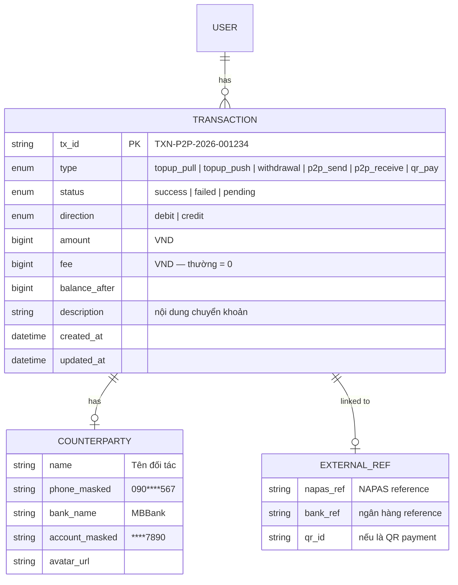
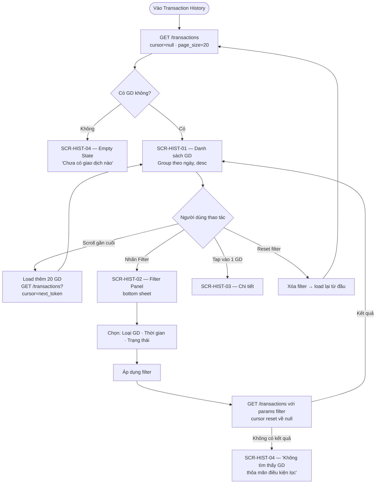
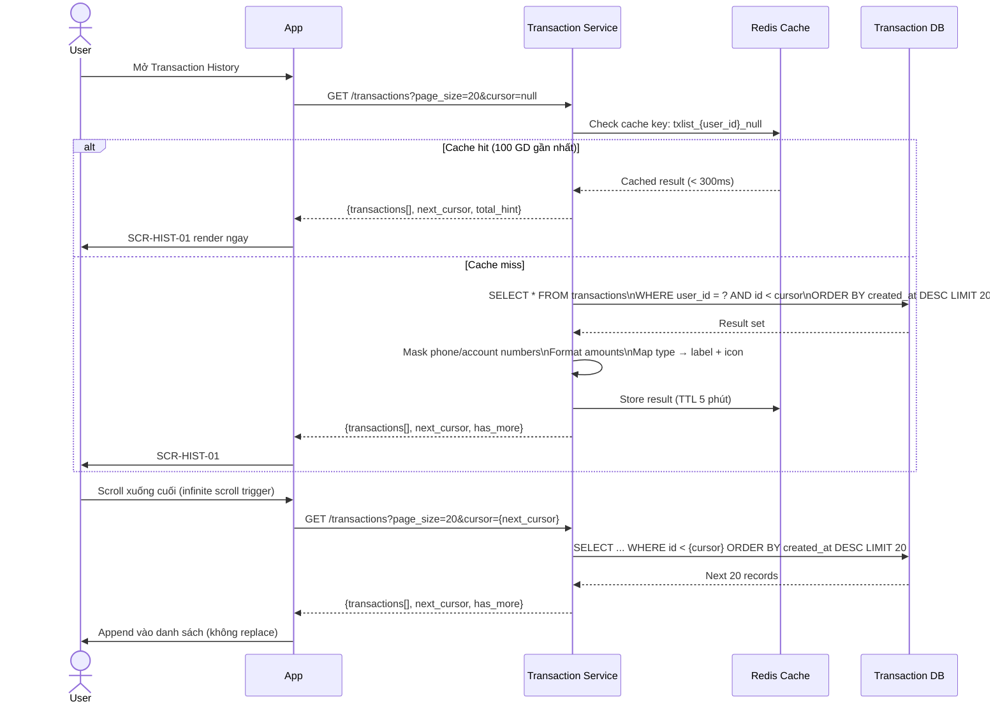
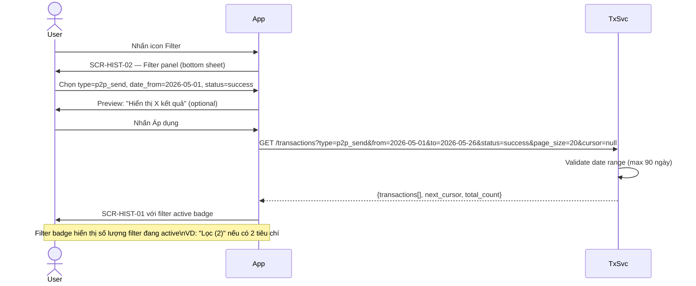

# PRD: Transaction History Module

<Info>
  **Document ID:** PRD-EW-HISTORY-001 · **Version:** 1.0 · **Status:** Draft  
  **Ngày tạo:** 2026-05-26 · **Tác giả:** BA Team
</Info>

---

## 1. Tổng quan

Module Transaction History cung cấp cho người dùng danh sách **toàn bộ giao dịch** đã thực hiện trên ví, bao gồm nạp tiền, rút tiền, chuyển tiền P2P và thanh toán QR. Mỗi giao dịch hiển thị đầy đủ trạng thái, loại, chiều tiền (thu/chi) và có thể xem chi tiết / chia sẻ biên lai.

### 1.1 Phạm vi (Scope)

| Tính năng | Trong phạm vi | Ghi chú |
|-----------|:---:|---------|
| Danh sách tất cả giao dịch (infinite scroll) | ✅ | Load 20 GD / batch |
| Filter theo loại GD | ✅ | Nạp / Rút / P2P / QR |
| Filter theo khoảng thời gian | ✅ | Hôm nay, 7 ngày, 30 ngày, custom range |
| Filter theo trạng thái | ✅ | Thành công / Thất bại / Đang xử lý |
| Xem chi tiết GD (receipt screen) | ✅ | Đầy đủ thông tin + balance after |
| Chia sẻ biên lai (ảnh) | ✅ | Screenshot receipt có watermark app |
| Export CSV | ❌ | Chưa làm trong sprint này |
| Gửi sao kê qua email | ❌ | Chưa làm trong sprint này |
| Tìm kiếm theo tên / SĐT / mã GD | ❌ | Roadmap — phức tạp về index |
| Xóa giao dịch | ❌ | Không hỗ trợ — audit log bất biến |

---

## 2. Data Model — Transaction



### 2.1 Transaction Types

| Type | Direction | Icon | Label hiển thị |
|------|-----------|------|---------------|
| `topup_pull` | credit | ⬆️ | "Nạp tiền — Kéo từ ngân hàng" |
| `topup_push` | credit | ⬆️ | "Nạp tiền — Chuyển khoản đến ví" |
| `withdrawal` | debit | ⬇️ | "Rút tiền — [Tên ngân hàng]" |
| `p2p_send` | debit | ➡️ | "Chuyển đến [Tên người nhận]" |
| `p2p_receive` | credit | ⬅️ | "Nhận từ [Tên người gửi]" |
| `qr_pay` | debit | 📲 | "Thanh toán QR — [Tên bank]·[STK]" |

### 2.2 Transaction Status

| Status | Màu | Ý nghĩa |
|--------|-----|---------|
| `success` | Xanh lá | GD hoàn tất, NAPAS/đối tác xác nhận |
| `failed` | Đỏ | GD thất bại, số dư đã được hoàn trả |
| `pending` | Vàng | Đang chờ NAPAS xác nhận (Push top-up webhook) |

---

## 3. Kiến trúc hệ thống

```mermaid
flowchart TD
    APP[Mobile App]

    subgraph TXSvc[Transaction Service]
        API[REST API Layer]
        FILTER[Filter & Cursor Engine]
        FORMATTER[Response Formatter\nMask phone/account]
    end

    DB[(Transaction DB\nPostgreSQL + Index)]
    CACHE[(Redis Cache\nRecent 100 GD / user)]
    AUDIT[(Audit Log\nImmutable append-only)]

    APP -->|GET /transactions| API
    API -->|Check cache| CACHE
    CACHE -->|Cache hit| APP
    API -->|Cache miss| FILTER
    FILTER -->|cursor-based pagination| DB
    DB -->|result set| FORMATTER
    FORMATTER -->|masked + formatted| APP
    APP -->|GET /transactions/{tx_id}| API
    API -->|DB lookup| DB
```

**Lưu trữ:** Giao dịch được lưu tối thiểu **5 năm** theo Nghị định 52/2024/NĐ-CP (quy định lưu trữ hồ sơ giao dịch thanh toán điện tử). Không cho phép xóa — audit log bất biến (append-only).

---

## 4. Danh sách màn hình

| ID | Tên màn hình | Khi nào hiển thị |
|----|-------------|-----------------|
| SCR-HIST-01 | Danh sách giao dịch | Entry từ menu / Home quick access |
| SCR-HIST-02 | Filter panel (bottom sheet) | Nhấn icon filter trên SCR-HIST-01 |
| SCR-HIST-03 | Chi tiết giao dịch (Receipt) | Tap vào bất kỳ GD nào trong danh sách |
| SCR-HIST-04 | Empty state | Chưa có GD nào / Filter không có kết quả |
| SCR-HIST-05 | Error state | Lỗi load (mất mạng, server lỗi) |

---

## 5. User Flow

### 5.1 Flow A — Xem danh sách và lọc giao dịch



### 5.2 Flow B — Xem chi tiết và chia sẻ biên lai

```mermaid
flowchart TD
    A[Tap GD trong SCR-HIST-01] --> B[GET /transactions/{tx_id}]
    B -->|Không tìm thấy| C[Lỗi HIST_002 — 'Giao dịch không tồn tại']
    B -->|Thành công| D[SCR-HIST-03 — Chi tiết GD\nĐầy đủ thông tin]
    D --> E{Người dùng muốn?}
    E -->|Chia sẻ biên lai| F[Render receipt image\nWatermark logo ứng dụng]
    F --> G[Native Share Sheet\nGửi qua Zalo, Messenger, lưu ảnh...]
    E -->|Liên hệ CSKH về GD này| H[Deeplink sang CSKH\nkèm tx_id prefilled]
    E -->|Quay lại| D
```

---

## 6. Sequence Diagram

### 6.1 Load Transaction List (Cursor-Based Pagination)



### 6.2 Apply Filter



---

## 7. Screen Specs

### SCR-HIST-01 — Danh sách giao dịch

| Component | Chi tiết |
|-----------|---------|
| Header | "Lịch sử giao dịch" + icon Filter góc phải |
| Filter badge | "Lọc ([N])" màu primary nếu có filter active — nhấn → reset |
| Group header | Ngày theo format "Hôm nay", "Hôm qua", "DD tháng MM YYYY" |
| Transaction row | [Icon loại] [Tên/Label] [Trạng thái chip] · [Thời gian HH:mm] · [±Amount VND màu] |
| Amount màu sắc | Credit (+): màu xanh lá · Debit (−): màu đỏ/đen |
| Status chip | `Thành công` (xanh) · `Thất bại` (đỏ) · `Đang xử lý` (vàng) |
| Infinite scroll | Load thêm khi cách cuối ≤ 3 rows — loading spinner nhỏ ở cuối |
| Skeleton loading | Hiển thị placeholder skeleton rows khi đang fetch batch đầu |
| Empty state | Illustration + "Chưa có giao dịch nào" hoặc "Không có kết quả phù hợp" |
| Pull to refresh | Kéo xuống → invalidate cache → reload từ đầu |

**Điều kiện hiển thị:**
- Giao dịch sắp xếp: `created_at DESC` — mới nhất lên đầu
- `pending` GD hiển thị animation pulse nhẹ trên status chip
- Khi filter active: ẩn section header theo ngày, hiển thị list flat

---

### SCR-HIST-02 — Filter Panel (Bottom Sheet)

| Component | Chi tiết |
|-----------|---------|
| Header | "Bộ lọc" + nút "Đặt lại" (reset all) góc phải |
| Section "Loại giao dịch" | Multi-select chips: Tất cả · Nạp tiền · Rút tiền · Chuyển tiền · Thanh toán QR |
| Section "Thời gian" | Radio: Hôm nay · 7 ngày qua · 30 ngày qua · Tùy chọn |
| Date range picker | Chỉ hiện khi chọn "Tùy chọn" — calendar picker from/to, max range 90 ngày |
| Section "Trạng thái" | Multi-select chips: Tất cả · Thành công · Thất bại · Đang xử lý |
| CTA "Áp dụng" | Full-width button, disabled nếu date range không hợp lệ |
| Drag handle | Thanh drag ở đỉnh sheet — swipe down để đóng |

**Validation filter:**
- `from_date ≤ to_date` — nếu sai: nút Áp dụng disabled + error inline
- `to_date - from_date ≤ 90 ngày` — nếu vượt: cảnh báo "Tối đa 90 ngày"
- `from_date` không được trước ngày tạo tài khoản

---

### SCR-HIST-03 — Chi tiết giao dịch (Receipt)

| Component | Chi tiết |
|-----------|---------|
| Header | Loại GD + icon — VD: "Chuyển tiền" |
| Status hero | Icon ✅/❌/⏳ + text "Thành công / Thất bại / Đang xử lý" — màu tương ứng |
| Amount | Số tiền font rất lớn + chiều GD (+ thu / − chi) |
| Info rows | Từng row: label trái · giá trị phải |
| — Ngày giờ | "26/05/2026 · 14:30:00" |
| — Loại giao dịch | "Chuyển tiền đến ví" / "Thanh toán QR" / ... |
| — Đối tác | Tên + SĐT masked (nếu P2P) hoặc Ngân hàng + STK masked |
| — Nội dung | Mô tả giao dịch (nếu có) |
| — Phí | "Miễn phí" hoặc số tiền phí |
| — Số dư sau GD | Balance tại thời điểm GD hoàn tất |
| — Mã GD | `tx_id` + copy icon (tap to copy) |
| — Mã NAPAS | `napas_ref` (nếu có) + copy icon |
| Nút "Chia sẻ biên lai" | Render receipt image → native share |
| Nút "Liên hệ CSKH" | Chỉ hiện nếu status = `failed` — deeplink CSKH với tx_id |
| Back | Quay lại danh sách |

**Điều kiện hiển thị theo loại GD:**

| Field | topup | withdrawal | p2p_send | p2p_receive | qr_pay |
|-------|:---:|:---:|:---:|:---:|:---:|
| Ngân hàng nguồn/đích | ✅ | ✅ | ❌ | ❌ | ✅ |
| Tên + SĐT đối tác | ❌ | ❌ | ✅ | ✅ | ❌ |
| Mã NAPAS | ✅ | ✅ | ❌ | ❌ | ✅ |
| Mã GD nội bộ | ✅ | ✅ | ✅ | ✅ | ✅ |
| Nút CSKH | ❌ | failed only | failed only | ❌ | failed only |

---

### SCR-HIST-04 — Empty State

| Tình huống | Illustration | Text |
|-----------|-------------|------|
| Chưa có GD nào | Ví trống | "Bạn chưa có giao dịch nào. Hãy bắt đầu bằng cách nạp tiền vào ví!" |
| Filter không có kết quả | Kính lúp | "Không tìm thấy giao dịch nào phù hợp với bộ lọc hiện tại" + nút "Đặt lại bộ lọc" |

---

## 8. Validation Rules

| Rule ID | Field | Điều kiện vi phạm | Xử lý |
|---------|-------|------------------|-------|
| VAL-HIST-01 | Date range — from | `from_date > to_date` | Disable nút Áp dụng + "Ngày bắt đầu phải trước ngày kết thúc" |
| VAL-HIST-02 | Date range — khoảng | `to_date - from_date > 90 ngày` | Warning inline: "Tối đa 90 ngày mỗi lần lọc" |
| VAL-HIST-03 | Date range — from | `from_date < account_created_at` | Tự động clamp về ngày tạo tài khoản |
| VAL-HIST-04 | Date range — to | `to_date > today` | Tự động clamp về today |
| VAL-HIST-05 | tx_id | GD không thuộc user đang đăng nhập | Lỗi HIST_003 — không hiển thị thông tin GD của người khác |

---

## 9. Business Rules

| ID | Rule | Mô tả |
|----|------|-------|
| BR-HIST-01 | Lưu trữ 5 năm | Tất cả GD lưu tối thiểu 5 năm theo Nghị định 52/2024/NĐ-CP. Không cho phép xóa hay cập nhật record |
| BR-HIST-02 | Append-only audit | Mọi thay đổi trạng thái GD (pending → success/failed) chỉ được ghi thêm (INSERT row mới trong audit_log), không UPDATE record gốc |
| BR-HIST-03 | Cursor-based pagination | Sử dụng `cursor` (tx_id hoặc created_at) thay vì OFFSET để tránh data shifting khi có GD mới. `next_cursor` được mã hóa base64 |
| BR-HIST-04 | Cache invalidation | Cache danh sách GD (TTL 5 phút) bị invalidate ngay khi có GD mới hoàn tất. Đảm bảo GD vừa thực hiện luôn xuất hiện ngay |
| BR-HIST-05 | Masking dữ liệu nhạy cảm | SĐT hiển thị dạng `090****567`. STK ngân hàng hiển thị `****7890`. Không bao giờ trả plaintext qua API History |
| BR-HIST-06 | Phân quyền GD | Mỗi user chỉ được xem GD của chính mình. Server validate `user_id` từ JWT token — không nhận `user_id` từ client |
| BR-HIST-07 | Pending GD timeout | GD ở trạng thái `pending` quá 24h không có update → hệ thống tự chuyển sang `failed` và rollback nếu cần |
| BR-HIST-08 | Balance after | `balance_after` được tính và lưu tại thời điểm GD commit — không tính lại realtime. Phản ánh đúng số dư lúc GD xảy ra |
| BR-HIST-09 | Max filter range | Khoảng thời gian filter tối đa 90 ngày để tránh query quá lớn. Export CSV (future) sẽ dùng async job |

---

## 10. Performance Requirements

| Metric | Target | Ghi chú |
|--------|--------|---------|
| Load batch đầu (20 GD) | < 500ms | Với cache hit |
| Load batch đầu (cache miss) | < 2s | DB query + format |
| Load thêm (infinite scroll) | < 1s | Cursor-based query indexed |
| Render receipt screen | < 200ms | Data từ cache GD detail |
| DB index | `(user_id, created_at DESC, status, type)` | Composite index cho filter queries |

---

## 11. API Endpoints

| Method | Endpoint | Mô tả | Auth |
|--------|----------|-------|------|
| `GET` | `/transactions` | Danh sách GD với filter + cursor pagination | JWT |
| `GET` | `/transactions/{tx_id}` | Chi tiết 1 GD | JWT |

### 11.1 Chi tiết GET `/transactions`

**Query params:**

| Param | Type | Ví dụ | Ghi chú |
|-------|------|-------|---------|
| `type` | enum (multi) | `p2p_send,qr_pay` | Comma-separated, mặc định: all |
| `status` | enum (multi) | `success,failed` | Comma-separated, mặc định: all |
| `from_date` | ISO8601 date | `2026-05-01` | Inclusive |
| `to_date` | ISO8601 date | `2026-05-26` | Inclusive, max = today |
| `page_size` | int | `20` | Default 20, max 50 |
| `cursor` | string | `eyJ0eCI6...` | Base64 encoded, null = first page |

**Response:**

```json
{
  "transactions": [
    {
      "tx_id": "TXN-P2P-2026-001234",
      "type": "p2p_send",
      "status": "success",
      "direction": "debit",
      "amount": 150000,
      "fee": 0,
      "label": "Chuyển đến Nguyen Van A",
      "description": "Tien an trua",
      "counterparty": {
        "name": "Nguyen Van A",
        "phone_masked": "090****567",
        "avatar_url": "https://cdn.ewallet.vn/avatars/abc.jpg"
      },
      "created_at": "2026-05-26T14:30:00+07:00",
      "icon": "arrow-right"
    }
  ],
  "next_cursor": "eyJ0eCI6IlRYTi1QMlAtMjAyNi0wMDEyMzMifQ==",
  "has_more": true,
  "total_hint": 142
}
```

### 11.2 Chi tiết GET `/transactions/{tx_id}`

```json
{
  "tx_id": "TXN-QR-2026-000456",
  "type": "qr_pay",
  "status": "success",
  "direction": "debit",
  "amount": 85000,
  "fee": 0,
  "balance_after": 915000,
  "description": "Thanh toan bua com",
  "counterparty": {
    "bank_name": "MBBank",
    "account_no_masked": "****7890",
    "account_name": "NGUYEN VAN A"
  },
  "refs": {
    "napas_ref": "NAPAS20260526001234",
    "qr_id": null
  },
  "created_at": "2026-05-26T14:30:00+07:00",
  "completed_at": "2026-05-26T14:30:02+07:00"
}
```

---

## 12. Error Codes

| Code | HTTP | Mô tả kỹ thuật | Hiển thị người dùng |
|------|------|---------------|-------------------|
| `HIST_001` | 400 | Date range không hợp lệ | "Khoảng ngày không hợp lệ" |
| `HIST_002` | 404 | tx_id không tồn tại | "Giao dịch không tìm thấy" |
| `HIST_003` | 403 | GD không thuộc user hiện tại | "Bạn không có quyền xem giao dịch này" |
| `HIST_004` | 422 | Date range vượt 90 ngày | "Khoảng thời gian lọc tối đa 90 ngày" |
| `HIST_005` | 500 | DB query lỗi | "Không thể tải lịch sử giao dịch. Vui lòng thử lại" |
| `HIST_006` | 503 | Service tạm unavailable | "Dịch vụ tạm thời gián đoạn. Vui lòng thử lại sau" |

---

## 13. Edge Cases

| # | Tình huống | Xử lý |
|---|-----------|-------|
| 1 | GD mới vừa tạo xuất hiện trong list khi đang xem | Cache invalidate ngay sau khi GD commit → Pull-to-refresh hiển thị GD mới nhất |
| 2 | GD `pending` đang trong list, sau đó chuyển sang `success` | App poll trạng thái GD pending mỗi 30s (nếu có item pending trên màn hình). Update status chip không reload toàn bộ list |
| 3 | User cuộn rất nhanh → nhiều request concurrent cho cursor pages | Debounce trigger infinite scroll 300ms + cancel request cũ nếu cursor đã thay đổi |
| 4 | Filter date range chọn tương lai | Calendar picker disable date > today |
| 5 | Người dùng có 10,000+ GD — query quá lớn | Composite index + cursor pagination đảm bảo query chỉ scan từ cursor trở về trước. Không bao giờ COUNT(*) toàn bảng (chỉ `total_hint` ước tính) |
| 6 | GD bị lỗi giữa chừng — không có status cuối cùng | Sau 24h pending: system job tự fail và rollback. Hiển thị `failed` với note "Giao dịch hết thời gian xử lý" |
| 7 | Chia sẻ biên lai — app không có quyền thư viện ảnh | Thay bằng Share Sheet trực tiếp (không cần lưu vào gallery). File ảnh được tạo tạm trong app sandbox |

---

## 14. Open Questions

| # | Câu hỏi | Ảnh hưởng | Target |
|---|---------|----------|--------|
| 1 | Export CSV cần không? Nếu có — giới hạn range và format? | Compliance: một số doanh nghiệp cần sao kê CSV. Async job nếu > 1000 GD | Sprint 8 |
| 2 | Search theo tên / SĐT / mã GD có cần không? | UX khi có nhiều GD. Cần Elasticsearch hoặc full-text index | Sprint 9 |
| 3 | Push notification deep link: click notification → mở thẳng SCR-HIST-03? | Deep link routing từ notification payload có `tx_id` | Sprint 7 |
| 4 | Hiển thị "Số dư sau GD" trên list row hay chỉ trên detail? | Nếu hiển thị trên list — cần thêm field vào list response (tốn bandwidth) | UX decision |
| 5 | Grouping theo tuần / tháng thay vì theo ngày với user có nhiều GD? | UX khi list dài — thay đổi group header logic | Sprint 8 |
