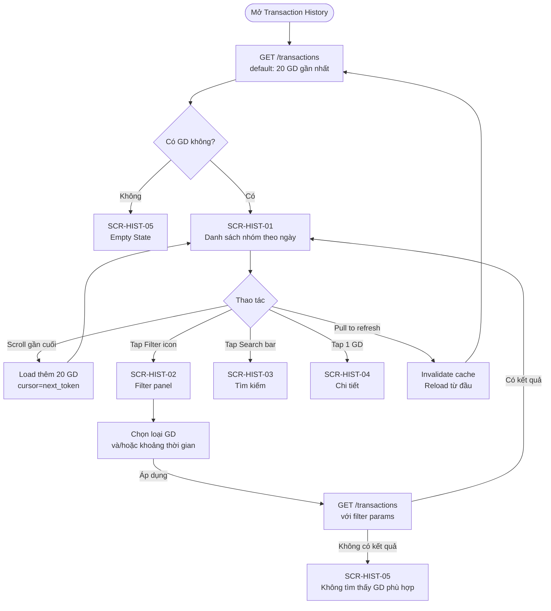
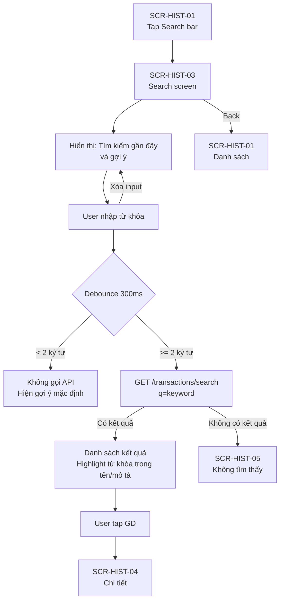
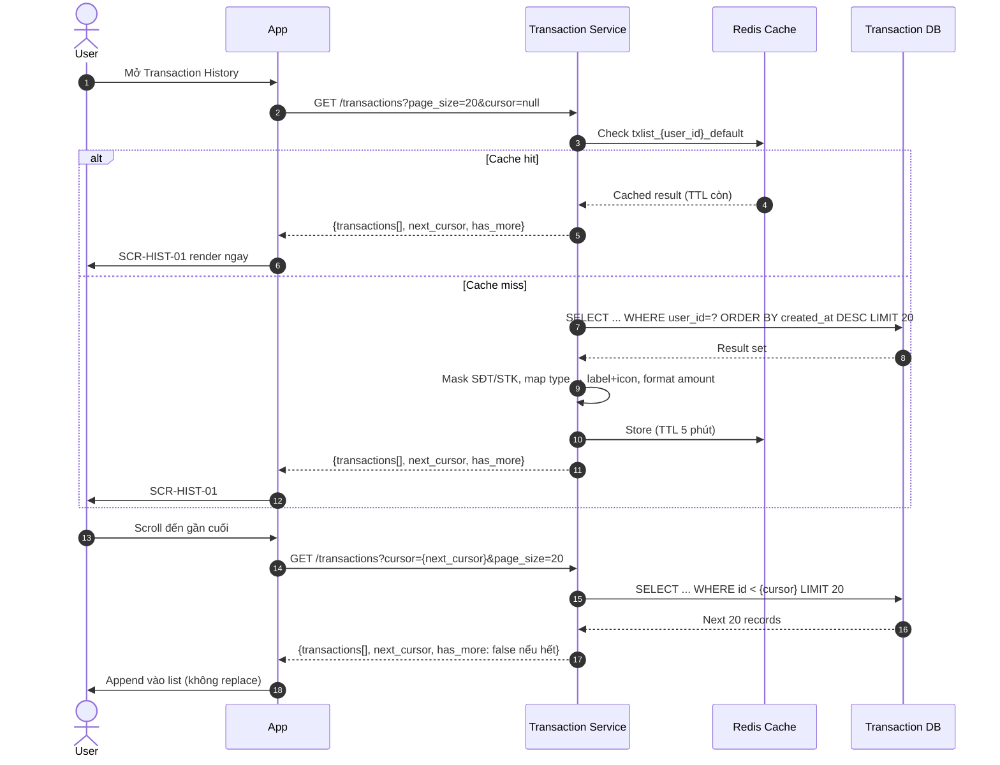

# PRD: Transaction History Module

<Info>
  **Document ID:** PRD-EW-HISTORY-001 · **Version:** 1.0 · **Status:** Draft  
  **Ngày tạo:** 2026-05-26 · **Tác giả:** BA Team  
  **Reviewer:** Tech Lead, QA Lead · **Approver:** Head of Product  
  **Tài liệu liên quan:** PRD-EW-WALLET-001, PRD-EW-TRANSFER-001, PRD-EW-QR-001
</Info>

| Vai trò | Mục đích đọc |
|---|---|
| Tech Lead / Developer | Thiết kế Transaction Service, cursor pagination, search indexing |
| QA Lead | Test cases: filter, search, chi tiết, empty state, 6-month boundary |
| UX Designer | Hiểu grouping theo ngày, skeleton loading, search UX |

---

## 1. Tổng quan module

### 1.1 Phạm vi (Scope)

| Tính năng | Trong phạm vi | Ghi chú |
|---|:---:|---|
| Danh sách GD — nhóm theo ngày (infinite scroll) | ✅ | 20 GD / batch; cursor-based pagination |
| Lọc theo loại GD | ✅ | Nạp / Rút / Chuyển đi / Nhận tiền / QR |
| Lọc theo khoảng thời gian | ✅ | Hôm nay / 7 ngày / 30 ngày / Tùy chọn; tối đa 6 tháng trở về |
| Tìm kiếm tự do | ✅ | Theo tên đối tác, nội dung GD, mã tx_id |
| Xem chi tiết GD (màn receipt) | ✅ | Đầy đủ thông tin + số dư sau GD |
| Lọc theo trạng thái | ❌ | Không trong scope — danh sách hiển thị tất cả trạng thái (success/failed/pending); không có filter chip riêng cho status |
| Chia sẻ / download biên lai | ❌ | Roadmap — Sprint 9 |
| Export CSV / sao kê email | ❌ | Roadmap — cần async job |
| Xóa giao dịch | ❌ | Không hỗ trợ — audit log bất biến |

### 1.2 Loại giao dịch hiển thị

| Type | Direction | Icon | Label hiển thị |
|---|---|---|---|
| `topup_pull` | credit | ⬆ | "Nạp tiền — [Tên ngân hàng]" |
| `topup_push` | credit | ⬆ | "Nạp tiền — Chuyển khoản vào ví" |
| `withdrawal` | debit | ⬇ | "Rút tiền — [Tên ngân hàng]" |
| `p2p_send` | debit | → | "Chuyển đến [Tên người nhận]" |
| `p2p_receive` | credit | ← | "Nhận từ [Tên người gửi]" |
| `qr_pay` | debit | ☐ | "Thanh toán QR — [Tên bank]" |

### 1.3 Trạng thái giao dịch

| Status | Màu badge | Ý nghĩa | Hiển thị trong list mặc định |
|---|---|---|---|
| `success` | Xanh lá | GD hoàn tất | ✅ |
| `failed` | Đỏ | GD thất bại, số dư đã hoàn | ✅ (vẫn hiện, người dùng cần biết) |
| `pending` | Vàng | Đang chờ xác nhận | ✅ (pulse animation) |

---

## 2. Danh sách màn hình

| Screen ID | Tên màn hình | Điều kiện hiển thị |
|---|---|---|
| SCR-HIST-01 | Danh sách giao dịch | Entry từ Bottom tab / Home quick access |
| SCR-HIST-02 | Filter panel (bottom sheet) | Nhấn icon Filter trên SCR-HIST-01 |
| SCR-HIST-03 | Tìm kiếm | Tap vào search bar trên SCR-HIST-01 |
| SCR-HIST-04 | Chi tiết giao dịch | Tap vào bất kỳ GD nào |
| SCR-HIST-05 | Empty state / Error state | Khi danh sách rỗng hoặc lỗi load |

---

## 3. User Flow

### 3.1 Flow A — Xem danh sách và lọc



### 3.2 Flow B — Tìm kiếm



### 3.3 Flow C — Xem chi tiết

```mermaid
flowchart TD
    A[Tap GD trong list / search] --> B[GET /transactions/{tx_id}]
    B -- 404 hoặc unauthorized --> C[Toast: Không tìm thấy GD]
    B -- Thành công --> D[SCR-HIST-04\nChi tiết GD]
    D --> E{Thao tác}
    E -- Copy mã GD --> F[Copy tx_id vào clipboard\nToast: Đã sao chép]
    E -- Copy mã NAPAS --> G[Copy napas_ref\nToast: Đã sao chép]
    E -- Liên hệ CSKH --> H[Deeplink CSKH\nkèm tx_id prefilled]
    E -- Back --> I[Quay lại danh sách / search]
    H --> I
```

---

## 4. Sequence Diagram

### 4.1 Load danh sách (Cursor-Based Pagination)



### 4.2 Tìm kiếm

```mermaid
sequenceDiagram
    autonumber
    actor User
    participant App
    participant TxSvc as Transaction Service
    participant SearchIdx as Search Index (PostgreSQL FTS)

    User->>App: Nhập "Nguyen Van" vào search bar
    Note over App: Debounce 300ms — chỉ gọi API khi dừng gõ
    App->>TxSvc: GET /transactions/search?q=Nguyen+Van&page_size=20
    TxSvc->>TxSvc: Validate: length >= 2, sanitize input
    TxSvc->>SearchIdx: Full-text search trên: counterparty_name, description, tx_id
    Note over SearchIdx: Index: tsvector trên 3 fields; rank by relevance + created_at DESC
    SearchIdx-->>TxSvc: Matched transactions (max 50 results)
    TxSvc->>TxSvc: Mask PII, format
    TxSvc-->>App: {transactions[], total_found, query_echo}
    App->>User: SCR-HIST-03 với kết quả, highlight từ khóa
```

---

## 5. Screen Specifications

### SCR-HIST-01 — Danh sách giao dịch

```
┌─────────────────────────────────┐
│  ←   Lịch sử giao dịch    ⚙ ▼ │  ← ▼ = filter icon; badge nếu active
│                                 │
│  ┌─────────────────────────┐   │
│  │ 🔍  Tìm kiếm giao dịch  │   │  ← tap → SCR-HIST-03
│  └─────────────────────────┘   │
│                                 │
│  Hôm nay                        │  ← group header
│  ┌───────────────────────────┐  │
│  │ ✅ → Chuyển đến An   14:30│  │
│  │         −500,000 đ        │  │
│  └───────────────────────────┘  │
│  ┌───────────────────────────┐  │
│  │ ✅ ⬆ Nạp tiền MBBank 09:15│  │
│  │         +2,000,000 đ      │  │
│  └───────────────────────────┘  │
│                                 │
│  Hôm qua                        │
│  ┌───────────────────────────┐  │
│  │ ⏳ ☐ Thanh toán QR   18:45│  │  ← pending: pulse
│  │         −150,000 đ        │  │
│  └───────────────────────────┘  │
│                                 │
│         ⟳ Đang tải thêm...     │  ← infinite scroll loader
└─────────────────────────────────┘
```

| Component | Loại | Nội dung | Action |
|---|---|---|---|
| Back / Header | Nav | "Lịch sử giao dịch" | — |
| Filter icon | Icon button | ▼ icon + badge số filter active | Mở SCR-HIST-02 |
| Search bar | Input (inactive) | "🔍 Tìm kiếm giao dịch..." | Tap → SCR-HIST-03 (expand) |
| Group header | Text (bold) | "Hôm nay" / "Hôm qua" / "DD tháng MM YYYY" | — |
| Transaction row | List item | [Status icon] [Type icon] [Label] [Time HH:mm] / [±Amount màu] | Tap → SCR-HIST-04 |
| Amount màu | Text | Credit (+): xanh lá; Debit (−): đỏ đậm | — |
| Status icon | Icon | ✅ success / ❌ failed / ⏳ pending (pulse animation) | — |
| Infinite scroll loader | Spinner | Hiện khi load thêm batch | — |
| Skeleton loading | Placeholder | Rows giả khi fetch batch đầu (3 nhóm ngày) | — |
| Pull-to-refresh | Gesture | Kéo xuống → invalidate cache, reload | — |
| Filter active banner | Banner | "Đang lọc: [Loại GD] · [Thời gian]" + nút X để reset | Reset all filters |

**Ghi chú quan trọng:**
- Khi có filter active → không nhóm theo ngày nữa (hiển thị list phẳng vì filter có thể cross nhiều tháng)
- Skeleton rows: 3 nhóm với tổng 7 placeholder rows
- GD `pending` có `●` animation pulse trên status icon

---

### SCR-HIST-02 — Filter Panel (Bottom Sheet)

```
┌─────────────────────────────────┐
│  ─────                          │  ← drag handle
│  Bộ lọc              Đặt lại   │
│                                 │
│  Loại giao dịch                 │
│  ┌────┐ ┌────┐ ┌────┐ ┌────┐   │
│  │ Tất│ │ Nạp│ │ Rút│ │ P2P│   │
│  │ cả │ │tiền│ │tiền│ │    │   │
│  └────┘ └────┘ └────┘ └────┘   │
│  ┌────┐                         │
│  │ QR │                         │
│  └────┘                         │
│                                 │
│  Khoảng thời gian               │
│  ● Hôm nay                      │
│  ○ 7 ngày qua                   │
│  ○ 30 ngày qua                  │
│  ○ Tùy chọn                     │
│                                 │
│  [   Từ: 01/12/2025   ]         │  ← chỉ hiện khi chọn Tùy chọn
│  [   Đến: 26/05/2026  ]         │
│  ⚠ Tối đa 6 tháng              │
│                                 │
│  [        Áp dụng       ]       │
└─────────────────────────────────┘
```

| Component | Loại | Nội dung | Action |
|---|---|---|---|
| Drag handle | — | Thanh ngang ở đỉnh | Swipe down → đóng |
| "Đặt lại" | Text button | Reset tất cả về mặc định | Clear filter + đóng sheet |
| Loại GD | Multi-select chips | Tất cả / Nạp tiền / Rút tiền / Chuyển tiền / QR | Chọn nhiều; "Tất cả" deselect các loại khác |
| Thời gian | Radio group | Hôm nay / 7 ngày qua / 30 ngày qua / Tùy chọn | Single select |
| Date picker (từ/đến) | Date input | Chỉ hiện khi chọn "Tùy chọn" | Calendar picker; max to_date = today |
| Cảnh báo 6 tháng | Inline text | "Tối đa 6 tháng. Chỉ có thể xem GD từ ngày tạo TK trở đi." | — |
| "Áp dụng" | Primary button | Disabled nếu date range không hợp lệ | Áp dụng filter + đóng sheet |

---

### SCR-HIST-03 — Tìm kiếm

```
┌─────────────────────────────────┐
│  ✕  [  Tìm kiếm giao dịch  ]   │  ← ✕ = cancel → về SCR-HIST-01
│                                 │
│  Gần đây                        │  ← chỉ khi chưa nhập
│  🕐 "Nguyen Van An"             │
│  🕐 "TXN-P2P-2026"              │
│                                 │
│  ─────────────────────────────  │
│                                 │
│  Kết quả (12)                   │  ← khi đang search
│  ┌───────────────────────────┐  │
│  │ → Chuyển đến **An**  14:30│  │  ← bold highlight từ khóa
│  │         −500,000 đ 25/05  │  │
│  └───────────────────────────┘  │
│  ┌───────────────────────────┐  │
│  │ ← Nhận từ **An**h     ... │  │
│  │         +200,000 đ 20/05  │  │
│  └───────────────────────────┘  │
│                                 │
│      Không tìm thấy thêm        │  ← khi hết kết quả
└─────────────────────────────────┘
```

| Component | Loại | Nội dung | Action |
|---|---|---|---|
| Search input | Text input (active) | Autofocus khi vào screen; keyboard số + chữ | Gọi API sau debounce 300ms |
| "✕" Cancel | Icon button | Đóng search | Về SCR-HIST-01 |
| Recent searches | List | 5 từ khóa gần nhất (localStorage) | Tap → điền vào search input |
| "Xóa lịch sử" | Text link | Bên cạnh "Gần đây" | Clear recent searches |
| Result rows | List items | [Type icon] [Label + highlight] [Amount] [Date DD/MM] | Tap → SCR-HIST-04 |
| Total count | Text | "Kết quả (N)" | — |
| Empty state | Illustration + text | "Không tìm thấy giao dịch nào cho [keyword]" | — |

**Highlight từ khóa:** Từ khóa match trong tên/mô tả được wrap `<mark>` → hiển thị bold.

**Phạm vi tìm kiếm:** Search chỉ tìm trong 6 tháng gần nhất (giới hạn lịch sử).

---

### SCR-HIST-04 — Chi tiết giao dịch

```
┌─────────────────────────────────┐
│  ←        Chi tiết GD          │
│                                 │
│           ✅                    │  ← lớn, màu theo status
│      Chuyển tiền thành công     │
│                                 │
│          −500,000 đ             │  ← font rất lớn
│                                 │
│  ─────────────────────────────  │
│  Đến              Nguyen Van An │
│  SĐT                090****567  │
│  Nội dung          Tien an trua │
│  Ngày giờ   26/05/2026 · 14:30  │
│  Phí                  Miễn phí  │
│  Số dư sau GD       2,000,000 đ │
│  ─────────────────────────────  │
│  Mã GD    TXN-P2P-2026-001234  📋│  ← tap 📋 = copy
│  ─────────────────────────────  │
│                                 │
│         [ Liên hệ CSKH ]        │  ← chỉ hiện khi status = failed
└─────────────────────────────────┘
```

| Component | Loại | Nội dung | Điều kiện |
|---|---|---|---|
| Status icon | Icon (large) | ✅ / ❌ / ⏳ | Always |
| Status label | Text | "Thành công" / "Thất bại" / "Đang xử lý" | Always |
| Amount | Text (H1) | ±{amount} VND; màu xanh (credit) / đỏ (debit) | Always |
| Đối tác | Row | P2P: tên + SĐT masked; Topup/Rút/QR: tên ngân hàng + STK masked | Theo loại GD |
| Nội dung CK | Row | Mô tả (nếu có) hoặc "—" | Always |
| Ngày giờ | Row | DD/MM/YYYY · HH:mm:ss | Always |
| Phí | Row | "Miễn phí" hoặc giá trị | Always |
| Số dư sau GD | Row | Balance tại thời điểm GD commit | Chỉ khi `success` |
| Mã GD | Row + Copy icon | `tx_id` | Always |
| Mã NAPAS | Row + Copy icon | `napas_ref` | Khi topup/rút/QR có NAPAS |
| "Liên hệ CSKH" | Secondary button | Deeplink CSKH với tx_id prefilled | Chỉ khi `failed` |

**Fields hiển thị theo loại GD:**

| Field | topup | withdrawal | p2p_send/receive | qr_pay |
|---|:---:|:---:|:---:|:---:|
| Ngân hàng + STK | ✅ | ✅ | ❌ | ✅ |
| Tên + SĐT đối tác | ❌ | ❌ | ✅ | ❌ |
| Mã NAPAS | ✅ | ✅ | ❌ | ✅ |
| Số dư sau GD | Nếu success | Nếu success | Nếu success | Nếu success |

---

### SCR-HIST-05 — Empty / Error State

| Tình huống | Icon | Tiêu đề | Phụ đề | CTA |
|---|---|---|---|---|
| Chưa có GD nào | 🗂 ví trống | "Chưa có giao dịch nào" | "Hãy bắt đầu bằng cách nạp tiền vào ví!" | "Nạp tiền ngay" |
| Filter không có kết quả | 🔍 | "Không tìm thấy giao dịch" | "Thử thay đổi bộ lọc hoặc khoảng thời gian" | "Đặt lại bộ lọc" |
| Search không có kết quả | 🔍 | "Không tìm thấy giao dịch" | "Không có GD nào khớp với [keyword]" | — |
| Lỗi network | 📡 | "Không thể tải lịch sử" | "Kiểm tra kết nối và thử lại" | "Thử lại" |

---

## 6. Validation Rules

| Rule ID | Field / Bước | Điều kiện vi phạm | Xử lý |
|---|---|---|---|
| VAL-HIST-01 | Date from | `from_date > to_date` | Disable nút Áp dụng + "Ngày bắt đầu phải trước ngày kết thúc" |
| VAL-HIST-02 | Date range | `to_date - from_date > 180 ngày` (6 tháng) | Warning + disable Áp dụng: "Tối đa 6 tháng mỗi lần lọc" |
| VAL-HIST-03 | Date from | `from_date < account_created_at` | Clamp về ngày tạo tài khoản tự động |
| VAL-HIST-04 | Date to | `to_date > today` | Clamp về today tự động |
| VAL-HIST-05 | Search keyword | Độ dài < 2 ký tự | Không gọi API; hiển thị recent searches |
| VAL-HIST-06 | tx_id (detail) | GD không thuộc user hiện tại | Lỗi HIST_003 — không lộ thông tin GD người khác |

---

## 7. Business Rules

| ID | Rule | Áp dụng tại |
|---|---|---|
| BR-HIST-01 | Giới hạn lịch sử 6 tháng | API trả về GD trong 6 tháng gần nhất; không hỗ trợ xem GD cũ hơn qua app |
| BR-HIST-02 | Lưu trữ 5 năm | Tất cả GD lưu ≥ 5 năm theo NĐ52/2024; chỉ 6 tháng gần nhất khả dụng qua app |
| BR-HIST-03 | Audit log bất biến | Không UPDATE record gốc; mọi thay đổi trạng thái chỉ được ghi thêm (append-only) |
| BR-HIST-04 | Cursor-based pagination | Dùng cursor (opaque token encode tx_id + created_at) thay vì OFFSET/LIMIT thuần — tránh data shifting |
| BR-HIST-05 | Cache invalidation | Cache danh sách (TTL 5 phút) bị invalidate ngay khi có GD mới commit — đảm bảo GD vừa xảy ra luôn xuất hiện khi pull-to-refresh |
| BR-HIST-06 | Masking PII | SĐT trả về dạng `090****567`; STK ngân hàng dạng `****7890`; không bao giờ trả plaintext qua history API |
| BR-HIST-07 | Phân quyền GD | User chỉ được xem GD của chính mình; `user_id` luôn lấy từ JWT, không nhận từ client |
| BR-HIST-08 | Balance after | `balance_after` tính và lưu tại thời điểm DB commit — không tính lại realtime; phản ánh đúng số dư lúc GD xảy ra |
| BR-HIST-09 | Search scope | Search chỉ tìm trong 6 tháng gần nhất; không full-history search |
| BR-HIST-10 | Recent searches | Lưu tối đa 10 từ khóa gần nhất trên device (local storage); user có thể xóa |
| BR-HIST-11 | GD PENDING timeout | GD `pending` > 24h không có update → system job tự chuyển `failed`; rollback nếu cần; update trong list ngay sau |

---

## 8. API Summary

| Method | Endpoint | Mô tả | Auth |
|---|---|---|---|
| GET | `/transactions` | Danh sách GD với filter + cursor pagination | JWT |
| GET | `/transactions/{tx_id}` | Chi tiết 1 GD | JWT |
| GET | `/transactions/search` | Tìm kiếm full-text trong 6 tháng | JWT |

**GET `/transactions` — Query params:**

| Param | Type | Mặc định | Ghi chú |
|---|---|---|---|
| `type` | enum (multi, CSV) | all | `topup,withdrawal,p2p_send,p2p_receive,qr_pay` |
| `from_date` | ISO8601 date | — | Inclusive |
| `to_date` | ISO8601 date | today | Inclusive; max range 180 ngày |
| `page_size` | int | 20 | Max 50 |
| `cursor` | string | null | Base64-encoded; null = first page |

**GET `/transactions/search` — Query params:**

| Param | Type | Ghi chú |
|---|---|---|
| `q` | string | Min 2 ký tự; search trong: tên đối tác, mô tả, tx_id |
| `page_size` | int | Default 20; max 50 |

---

## 9. Error Codes

| Code | HTTP | Hiển thị user | Ghi chú dev |
|---|---|---|---|
| `HIST_001` | 400 | "Khoảng ngày không hợp lệ" | from_date > to_date |
| `HIST_002` | 400 | "Khoảng thời gian tối đa 6 tháng" | Range > 180 ngày |
| `HIST_003` | 403 | "Bạn không có quyền xem giao dịch này" | tx_id không thuộc user |
| `HIST_004` | 404 | "Giao dịch không tìm thấy" | tx_id không tồn tại |
| `HIST_005` | 400 | "Từ khóa tìm kiếm quá ngắn" | query < 2 ký tự |
| `HIST_006` | 500 | "Không thể tải lịch sử. Vui lòng thử lại" | DB query error |
| `HIST_007` | 503 | "Dịch vụ tạm gián đoạn. Vui lòng thử lại sau" | Service unavailable |

---

## 10. Non-Functional Requirements (NFR)

### Performance

| Chỉ số | Target | Ghi chú |
|---|---|---|
| Load batch đầu (cache hit) | P95 < 300ms | Redis cache hit — không cần DB |
| Load batch đầu (cache miss) | P95 < 1.5s | DB query có composite index |
| Infinite scroll (load thêm) | P95 < 800ms | Cursor-based query; index scan nhỏ |
| Transaction detail | P95 < 500ms | PK lookup; có thể cache detail riêng |
| Search response | P95 < 1s | PostgreSQL FTS với tsvector index |
| Search debounce | 300ms | Không gọi API khi đang gõ dở |

### Bảo mật (Security)

| Yêu cầu | Mô tả |
|---|---|
| Authorization | `user_id` luôn từ JWT access token; không nhận từ request body/query |
| PII masking | Tất cả SĐT và STK ngân hàng phải mask trước khi trả về; không log plaintext |
| Search input sanitization | Escape đặc biệt chars; prevent SQL injection; max 200 ký tự |
| Rate limiting | GET /transactions: 60 req/phút/user; GET /search: 30 req/phút/user |

### Tính sẵn sàng & Độ tin cậy

| Chỉ số | Target | Ghi chú |
|---|---|---|
| Transaction Service uptime | ≥ 99.5% | Read-only service; downtime ít ảnh hưởng hơn payment service |
| DB index health | Composite index: (user_id, created_at DESC, type) | Phải có; verify trong CI |
| Cache availability | Redis Cluster với replica | Cache miss là graceful fallback, không phải lỗi |

### Lưu trữ & Compliance

| Loại dữ liệu | Thời gian lưu | Cơ sở pháp lý |
|---|---|---|
| Transaction records | Tối thiểu 5 năm | Nghị định 52/2024 |
| Audit log (status changes) | Tối thiểu 5 năm | Append-only; không xóa |
| Search history (device local) | Đến khi user xóa hoặc uninstall | Privacy; không sync lên server |
| Redis cache | TTL 5 phút | Tự expire; không cần compliance |

---

## 11. Edge Cases

| Trường hợp | Xử lý |
|---|---|
| GD mới vừa tạo xuất hiện khi đang xem list | Pull-to-refresh invalidate cache → GD mới nhất hiện lên đầu; không tự refresh (tránh scroll jump) |
| GD `pending` đang hiện, chuyển sang `success` | App poll trạng thái GD pending mỗi 30s khi màn hình active. Cập nhật status chip không reload toàn bộ list |
| User cuộn rất nhanh → nhiều concurrent cursor requests | Debounce trigger infinite scroll 300ms; cancel request cursor cũ nếu cursor đã thay đổi |
| Filter date range chọn đúng ngày tạo tài khoản | Clamp from_date về `account_created_at`; không cần báo lỗi |
| User có 10,000+ GD trong 6 tháng | Composite index + cursor pagination đảm bảo query nhanh; không COUNT(*) toàn bảng (chỉ `has_more`) |
| GD timeout — pending 24h không resolve | System job tự fail sau 24h; khi user mở app thấy status đã cập nhật; không cần reload thủ công |
| Search trùng từ khóa với tx_id | Kết quả gồm cả GD match theo tên ĐỐI TÁC lẫn GD match tx_id; xếp relevance trước rồi theo time |
| User nhập từ khóa có ký tự đặc biệt (ví dụ: `%`) | Server escape trước khi query; không trả lỗi, trả empty result |

---

## 12. Roadmap — Tính năng phát triển

<Info>
  Các tính năng dưới đây bổ sung cho phạm vi MVP hiện tại (xem chi tiết, lọc, tìm kiếm cơ bản). Phân loại theo Sprint dự kiến — cần Product và UX xác nhận trước khi đưa vào backlog.
</Info>

<AccordionGroup>
  <Accordion title="[Sprint 7] Deep Link — Tap Notification mở thẳng Chi tiết GD" icon="link">
    **Team:** Tech + Product · **Ưu tiên:** High

    Khi user tap vào push notification liên quan đến giao dịch (ví dụ: "Nhận 500,000đ từ Minh"), app điều hướng thẳng đến **SCR-HIST-04** của GD đó mà không qua màn danh sách. Cải thiện đáng kể UX từ notification.

    **Yêu cầu chính:** Notification payload chứa `tx_id`; deep link router xử lý scheme `finpay://history/{tx_id}`; fallback về SCR-HIST-01 nếu tx_id không tồn tại hoặc đã hơn 6 tháng.  
    **Phụ thuộc:** Xác nhận deep link scheme với Notifications module (PRD-EW-NOTIF-001); iOS Universal Links + Android App Links cần cấu hình.
  </Accordion>

  <Accordion title="[Sprint 8] Badge số GD mới trên Tab Lịch sử" icon="bell">
    **Team:** UX + Tech · **Ưu tiên:** Medium

    Hiển thị **badge số đếm** trên bottom tab "Lịch sử" khi có giao dịch mới kể từ lần mở màn cuối. Tương tự unread badge notification — giúp user biết có GD mới mà không cần chủ động vào tab.

    **Yêu cầu chính:** Redis counter tăng khi có GD mới cho user đó; reset về 0 khi user mở SCR-HIST-01; hiển thị tối đa "99+" nếu vượt ngưỡng; sync khi app về foreground.  
    **Phụ thuộc:** Wallet Core phải emit event khi GD completed; UX xác nhận vị trí và style badge trên bottom tab bar.
  </Accordion>

  <Accordion title="[Sprint 8] Hiển thị Số dư sau GD trên danh sách (SCR-HIST-01)" icon="wallet">
    **Team:** UX + Product · **Ưu tiên:** Low

    Thêm trường **"Số dư sau GD"** hiển thị trực tiếp trên mỗi row trong danh sách lịch sử. Cho phép user theo dõi lịch sử thay đổi số dư ngay trên list view mà không cần mở từng GD.

    **Lưu ý kỹ thuật:** Field `balance_after` đã được lưu vào DB tại thời điểm commit per BR-HIST-08, và đã hiển thị trên SCR-HIST-04 (chi tiết GD) trong MVP. Sprint 8 chỉ bổ sung hiển thị trường này lên **SCR-HIST-01 (danh sách)** — không cần thay đổi schema DB.  
    **Yêu cầu chính:** API `/transactions` trả thêm field `balance_after` trong response; UX cập nhật row layout SCR-HIST-01 để có thêm dòng số dư; xem xét tăng payload size.  
    **Phụ thuộc:** GD cũ trước khi field tồn tại (nếu có) hiển thị "—"; đánh giá impact bandwidth trên danh sách dài.
  </Accordion>

  <Accordion title="[Sprint 9] Yêu cầu Sao kê — Export GD quá 6 tháng qua Email" icon="file-export">
    **Team:** Product + CS Ops · **Ưu tiên:** Medium

    Khi user cần xem lịch sử GD **quá 6 tháng** (app không hiển thị), cho phép gửi **yêu cầu sao kê** ngay trong app. Hệ thống tạo file PDF/CSV (async job) và gửi về email đăng ký. Tuân thủ nghĩa vụ cung cấp lịch sử 5 năm theo Nghị định 52/2024.

    **Yêu cầu chính:** Entry point trên SCR-HIST-05 (empty state khi search > 6 tháng); async export job; email PDF với đầy đủ thông tin GD; giới hạn 1 yêu cầu / tháng / user để tránh abuse.  
    **Phụ thuộc:** CS Ops thiết lập SLA xử lý (đề xuất trong 24 giờ); email service hỗ trợ gửi attachment PDF lớn.
  </Accordion>

  <Accordion title="[Sprint 9] Tìm kiếm kết hợp — Search Text + Filter loại GD đồng thời" icon="magnifying-glass">
    **Team:** Product · **Ưu tiên:** Low

    Mở rộng tính năng tìm kiếm để hỗ trợ **kết hợp search text + filter loại GD** cùng lúc (ví dụ: tìm "Nguyen" trong loại "Chuyển tiền"). Hiện tại khi filter active, thanh search bị ẩn và ngược lại.

    **Yêu cầu chính:** Cập nhật SCR-HIST-02 và SCR-HIST-03 để hai điều kiện coexist; API `/transactions/search` nhận thêm tham số `type` filter; UX thiết kế lại filter panel để không conflict với search bar.  
    **Phụ thuộc:** Tech đánh giá performance combined FTS query + type filter trên dataset 6 tháng; cần load test trước khi release.
  </Accordion>
</AccordionGroup>
