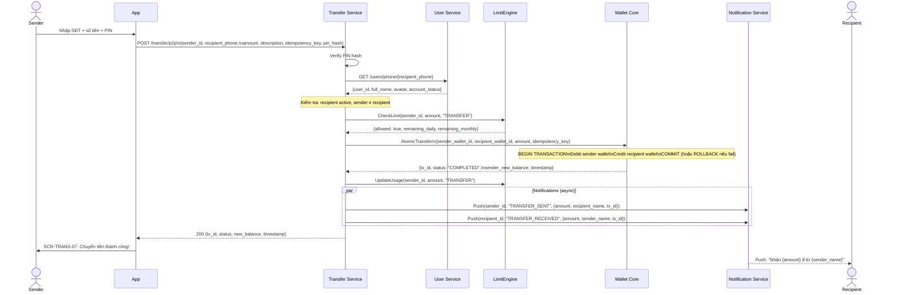

# PRD: Transfer P2P Module

<Info>
  **Document ID:** PRD-EW-TRANSFER-001 · **Version:** 1.0 · **Status:** Draft  
  **Ngày tạo:** 2026-05-25 · **Tác giả:** BA Team  
  **Reviewer:** Tech Lead, Risk Team, QA Lead · **Approver:** Head of Product  
  **Tài liệu liên quan:** PRD-EW-AUTH-001, PRD-EW-KYC-001, PRD-EW-WALLET-001
</Info>

| Vai trò | Mục đích đọc |
|---|---|
| Tech Lead / Developer | Thiết kế Transfer Service, atomic debit/credit, idempotency |
| Risk Team | Review limit engine, fraud detection khi chuyển bất thường |
| QA Lead | Test cases: P2P by SĐT, P2P by QR, limit exceeded, sender = recipient, timeout |
| UX Designer | Hiểu luồng nhập người nhận, confirm screen, success/error states |

---

## 1. Tổng quan module

### 1.1 Phạm vi

| Trong scope | Ngoài scope |
|---|---|
| P2P cá nhân → cá nhân qua SĐT | Business disbursement (sản phẩm riêng) |
| P2P qua QR cá nhân | Thanh toán merchant QR (Module 06) |
| Nhận tiền bằng cách hiển thị QR cá nhân | Chuyển tiền xuyên biên giới / ngoại tệ |
| Xem lịch sử chuyển tiền | Hoàn tiền (reversal) tự động |

### 1.2 Quy tắc cốt lõi

<Warning>
  **Giao dịch tức thì — Không thể hoàn:** Sau khi Sender nhấn "Xác nhận", hệ thống thực hiện debit/credit ngay lập tức. Không có cơ chế hủy hay hoàn tiền tự động. Tranh chấp được xử lý bởi CS Team.
</Warning>

### 1.3 Hạn mức theo KYC Tier

| Hạn mức | Tier 1 | Tier 2 | Tier 3 |
|---|---|---|---|
| Chuyển / lần | ❌ | 20,000,000 VND | 100,000,000 VND |
| Chuyển / ngày | ❌ | 100,000,000 VND | 500,000,000 VND |
| Chuyển / tháng | ❌ | 100,000,000 VND | 500,000,000 VND |
| Nhận / lần | Không giới hạn | Không giới hạn | Không giới hạn |
| Số tiền tối thiểu | — | 1,000 VND | 1,000 VND |

### 1.4 Authentication

| Điều kiện | Auth yêu cầu |
|---|---|
| Mọi lệnh chuyển tiền P2P | **PIN bắt buộc** (single factor, không phân biệt số tiền) |

---

## 2. Danh sách màn hình

| Screen ID | Tên màn hình | Điều kiện hiển thị |
|---|---|---|
| SCR-TRANS-01 | Nhập người nhận (SĐT / QR) | User nhấn "Chuyển tiền" từ Home |
| SCR-TRANS-02 | Xác nhận người nhận | Sau khi tìm thấy tài khoản hợp lệ |
| SCR-TRANS-03 | Nhập số tiền + nội dung | Sau khi xác nhận đúng người nhận |
| SCR-TRANS-04 | Xác nhận giao dịch | Sau khi nhập số tiền hợp lệ |
| SCR-TRANS-05 | Nhập PIN | Sau khi nhấn "Xác nhận chuyển" |
| SCR-TRANS-06 | Đang xử lý | Sau khi PIN đúng; GD đang chạy |
| SCR-TRANS-07 | Kết quả thành công | GD hoàn thành |
| SCR-TRANS-08 | Kết quả thất bại | GD thất bại hoặc timeout |
| SCR-TRANS-09 | QR Scanner | User chọn "Quét QR" ở SCR-TRANS-01 |
| SCR-TRANS-10 | QR cá nhân của tôi | User nhấn "Nhận tiền" / "QR của tôi" |

---

## 3. User Flow — P2P qua SĐT

```mermaid
flowchart TD
    A([User nhấn\n"Chuyển tiền"]) --> B{Tier ≥ 2?}
    B -- Tier 1 --> C[Banner: Cần KYC\ntrước khi chuyển tiền]
    B -- Tier 2+ --> D[SCR-TRANS-01\nNhập SĐT người nhận]

    D --> E[Nhập SĐT\n10 chữ số]
    E --> F{Validate SĐT}
    F -- Sai format --> G[Inline error]
    G --> E
    F -- Hợp lệ --> H[API: Tìm tài khoản]

    H --> I{Tìm thấy?}
    I -- Không --> J[Error: SĐT chưa\nđăng ký ví]
    I -- Bị suspended --> K[Error: Không thể\nchuyển đến TK này]
    I -- Chính mình --> L[Error: Không thể\nchuyển cho chính mình]
    I -- Tìm thấy --> M[SCR-TRANS-02\nHiển thị tên + avatar]

    M --> N{User xác nhận\nđúng người?}
    N -- Sai người --> D
    N -- Đúng --> O[SCR-TRANS-03\nNhập số tiền]

    O --> P[Nhập số tiền\n+ nội dung tùy chọn]
    P --> Q{Validate\nrealtime}
    Q -- Lỗi --> P
    Q -- OK --> R[Limit Engine check]
    R --> S{Vượt hạn mức?}
    S -- Có --> T[Hiển thị lỗi\nhạn mức cụ thể]
    S -- Không --> U[SCR-TRANS-04\nConfirm screen]

    U --> V[SCR-TRANS-05\nNhập PIN]
    V --> W{PIN đúng?}
    W -- Sai --> X[Lỗi + số lần còn lại]
    X --> V
    W -- Đúng --> Y[SCR-TRANS-06\nĐang xử lý]

    Y --> Z[Atomic:\nDebit Sender ← Credit Recipient]
    Z --> AA{Kết quả}
    AA -- Thành công --> AB[SCR-TRANS-07\nThành công]
    AA -- Balance lỗi\nrace condition --> AC[SCR-TRANS-08\nThất bại: Số dư không đủ]
    AA -- Timeout > 30s --> AD[SCR-TRANS-08\nĐang xử lý — kiểm tra lịch sử]
```

---

## 4. User Flow — P2P qua QR cá nhân

```mermaid
flowchart TD
    A[SCR-TRANS-01\nNhập người nhận] -- Chọn "Quét QR" --> B[SCR-TRANS-09\nQR Scanner]
    B --> C[User quét QR\ncủa người nhận]
    C --> D{QR hợp lệ?}
    D -- Hết hạn / Hỏng --> E[Toast: "Mã QR không hợp lệ.\nVui lòng thử lại."]
    E --> B
    D -- Không phải QR ví --> F[Toast: "Mã QR không\nđược hỗ trợ."]
    F --> B
    D -- Hợp lệ --> G[Parse: user_id\ntừ QR content]
    G --> H[API: Lấy thông tin\nngười nhận]
    H --> I[Tự động điền\nvào SCR-TRANS-02]
    I --> J[Flow tiếp tục\nnhư P2P SĐT\n↓ Confirm người nhận]
```

---

## 5. User Flow — Nhận tiền (Hiển thị QR cá nhân)

```mermaid
flowchart TD
    A([User nhấn\n"Nhận tiền" / "QR của tôi"]) --> B[SCR-TRANS-10\nHiển thị QR cá nhân]
    B --> C[QR chứa: user_id\n+ app_scheme]
    C --> D{User muốn gì?}
    D -- Chia sẻ QR --> E[Share sheet:\nLưu ảnh / Gửi qua app khác]
    D -- Nhập số tiền\ntrong QR --> F[Nhập số tiền mong muốn]
    F --> G[QR tự cập nhật\nvới amount embed]
    G --> H[Người kia quét QR\n→ tự điền số tiền]
```

---

## 6. Sequence Diagram — Transfer P2P (End-to-End)



---

## 7. Screen Specifications

### SCR-TRANS-01 — Nhập người nhận

```
┌─────────────────────────────────┐
│  ←           Chuyển tiền       │
│                                 │
│  ┌─────────────────────────┐   │
│  │ 📱 Nhập số điện thoại  📷│   │  ← 📷 = scan QR
│  └─────────────────────────┘   │
│                                 │
│  Đã chuyển gần đây              │
│  [👤 An] [👤 Bình] [👤 Chi]    │
│                                 │
│  Thường xuyên chuyển            │
│  [⭐ Mẹ]  [⭐ Bạn thân]        │
│                                 │
│      [      Tiếp tục      ]     │
│                                 │
│        Hiển thị QR của tôi      │
└─────────────────────────────────┘
```

| Component | Loại | Nội dung | Điều kiện | Action |
|---|---|---|---|---|
| Header | Text H1 | "Chuyển tiền" | Always | — |
| SĐT input | Phone input | "Nhập số điện thoại" | Always | Numeric keyboard; auto-format |
| "Quét QR" | Icon button | 📷 QR icon (góc phải input) | Always | Sang SCR-TRANS-09 |
| Quick access | Section | "Đã chuyển gần đây" — danh sách avatar + tên 5 người gần nhất | Có lịch sử transfer | Tap → auto-fill SĐT → lookup |
| Favorites | Section | "Thường xuyên chuyển" (nếu có) | Nếu user đã mark favorite | Tap → auto-fill |
| Inline error | Text (red) | Xem bảng Validation | Khi lỗi | — |
| "Tiếp tục" | Primary button | "Tiếp tục" | Disabled khi rỗng hoặc lỗi format | Trigger API lookup |
| "QR của tôi" | Text link | "Hiển thị QR của tôi" (để nhận tiền) | Always | Sang SCR-TRANS-10 |

---

### SCR-TRANS-02 — Xác nhận người nhận

```
┌─────────────────────────────────┐
│  ←                             │
│                                 │
│        [ Avatar 80px ]          │
│                                 │
│       NGUYEN VAN AN             │
│         090*** 123              │
│                                 │
│  Đây có phải người bạn muốn     │
│  chuyển tiền không?             │
│                                 │
│   [   Đúng, tiếp tục   ]       │
│                                 │
│      Không phải người này       │
└─────────────────────────────────┘
```

<Warning>
  **Bắt buộc hiển thị tên đầy đủ trước khi tiếp tục.** Đây là biện pháp chống chuyển nhầm tiền. User phải bấm "Đúng, tiếp tục" — không được auto-advance.
</Warning>

| Component | Loại | Nội dung | Điều kiện | Action |
|---|---|---|---|---|
| Avatar | Image (large) | Ảnh đại diện recipient (hoặc initials placeholder) | Always | — |
| Tên đầy đủ | Text H2 | Họ tên đầy đủ của recipient | Always | — |
| SĐT | Text | {SĐT — ẩn 3 số giữa: 09xx xxx x23} | Always | — |
| Confirm button | Primary button | "Đúng, tiếp tục" | Always | Sang SCR-TRANS-03 |
| Cancel button | Secondary | "Không phải người này" | Always | Về SCR-TRANS-01; xóa SĐT |

<Warning>
  **Bắt buộc hiển thị tên đầy đủ trước khi tiếp tục.** Đây là biện pháp chống chuyển nhầm tiền. User phải bấm "Đúng, tiếp tục" — không được auto-advance.
</Warning>

---

### SCR-TRANS-03 — Nhập số tiền + nội dung

```
┌─────────────────────────────────┐
│  ←                             │
│  ┌───────────────────────────┐  │
│  │ [👤] NGUYEN VAN AN · 090* │  │  ← mini recipient card
│  └───────────────────────────┘  │
│                                 │
│                                 │
│          0 đ                    │  ← large amount input
│                                 │
│  Số dư: 2,500,000 đ             │
│  Còn có thể chi hôm nay: 20M đ  │
│                                 │
│  [50K]  [100K]  [200K]  [500K]  │
│                                 │
│  Nội dung (tùy chọn)            │
│  ┌───────────────────────────┐  │
│  │                    0/200  │  │
│  └───────────────────────────┘  │
│                                 │
│       [      Tiếp tục     ]     │
└─────────────────────────────────┘
```

| Component | Loại | Nội dung | Điều kiện | Action |
|---|---|---|---|---|
| Recipient mini-card | Card | Avatar nhỏ + tên + SĐT ẩn | Always | Tap → về SCR-TRANS-02 |
| Amount input | Large numeric | "0 đ" | Always | Format realtime; dấu chấm ngăn cách |
| Balance info | Text (small) | "Số dư khả dụng: {X} đ" | Always | — |
| Limit info | Text (small) | "Hạn mức ngày còn lại: {Y} đ" | Always | — |
| Quick amounts | Chips | 50K · 100K · 200K · 500K · 1M | Always | Auto-fill |
| Description input | Text input | "Nội dung (tùy chọn) — Tối đa 200 ký tự" | Always | Optional |
| Char counter | Text (small) | "{N}/200" | Khi nhập nội dung | — |
| Inline error | Text (red) | Xem bảng Validation | Khi lỗi | — |
| "Tiếp tục" | Primary button | "Tiếp tục" | Disabled khi invalid | Sang SCR-TRANS-04 |

---

### SCR-TRANS-04 — Xác nhận giao dịch

| Component | Loại | Nội dung | Điều kiện | Action |
|---|---|---|---|---|
| Title | Text H2 | "Xác nhận chuyển tiền" | Always | — |
| Recipient | Row | Avatar + Tên + SĐT ẩn | Always | — |
| Amount | Row (large) | **{amount} đ** | Always | — |
| Description | Row | "{nội dung}" hoặc "—" nếu không nhập | Always | — |
| Fee | Row | "Phí: **Miễn phí**" | Always | — |
| Irreversible note | Banner (orange) | "⚠ Giao dịch không thể hoàn sau khi xác nhận." | Always | — |
| "Xác nhận chuyển" | Primary button | "Xác nhận chuyển {amount} đ" | Always | Sang SCR-TRANS-05 |
| "Hủy" | Text link | "Hủy giao dịch" | Always | Về Home |

---

### SCR-TRANS-07 — Kết quả thành công

| Component | Loại | Nội dung | Điều kiện | Action |
|---|---|---|---|---|
| Success animation | Lottie | Checkmark animation | Always | Auto-play 1s |
| Title | Text | "Chuyển tiền thành công!" | Always | — |
| Amount | Text H1 | "−{amount} đ" (màu xanh) | Always | — |
| To | Text | "Đến: {recipient_name}" | Always | — |
| Transaction ID | Text (small) | "Mã GD: {tx_id}" | Always | Copy to clipboard |
| Timestamp | Text (small) | "{HH:mm DD/MM/YYYY}" | Always | — |
| New balance | Text | "Số dư hiện tại: {new_balance} đ" | Always | — |
| "Chia sẻ biên lai" | Secondary | "Chia sẻ" | Always | Share receipt |
| "Chuyển tiếp" | Text link | "Chuyển tiếp cho người khác" | Always | Về SCR-TRANS-01 |
| "Về trang chủ" | Primary | "Về trang chủ" | Always | Về Home |

---

### SCR-TRANS-10 — QR cá nhân để nhận tiền

| Component | Loại | Nội dung | Điều kiện | Action |
|---|---|---|---|---|
| User name | Text H2 | Tên của user hiện tại | Always | — |
| QR code | Image | QR encode: `ewallet://transfer?user_id={id}&name={name}` | Always | — |
| Amount toggle | Switch | "Thêm số tiền vào QR" | Always | Bật → hiện Amount input |
| Amount input | Numeric | Nhập số tiền cụ thể | Khi toggle bật | Cập nhật QR realtime |
| "Lưu ảnh" | Button | "Lưu QR" | Always | Save to Camera Roll |
| "Chia sẻ" | Button | "Chia sẻ QR" | Always | Share sheet |
| Instructions | Text (small) | "Nhờ người kia quét mã QR này để chuyển tiền cho bạn" | Always | — |

---

## 8. Validation Rules

| Field / Bước | Rule | Thông báo | Trigger |
|---|---|---|---|
| **SĐT người nhận** | Bắt buộc | "Vui lòng nhập số điện thoại" | On submit |
| | 10 chữ số, đầu số hợp lệ VN | "Số điện thoại không hợp lệ" | On blur |
| | Tài khoản tồn tại | "Số điện thoại này chưa đăng ký ví" | After API |
| | Tài khoản active | "Không thể chuyển đến tài khoản này lúc này" | After API (không nêu lý do cụ thể) |
| | Không được là chính sender | "Không thể chuyển tiền cho chính mình" | After API |
| **Số tiền** | ≥ 1,000 VND | "Số tiền tối thiểu là 1,000 đ" | On blur |
| | ≤ 20,000,000 VND / lần (Tier 2) | "Số tiền tối đa 1 lần chuyển là 20,000,000 đ" | On blur |
| | ≤ `balance_available` | "Số dư khả dụng không đủ. Hiện có {X} đ" | On blur + API check |
| | ≤ Hạn mức ngày còn lại | "Vượt hạn mức ngày. Còn {X} đ hôm nay." | After API |
| | ≤ Hạn mức tháng còn lại | "Vượt hạn mức tháng. Còn {Y} đ tháng này." | After API |
| **Nội dung** | Tối đa 200 ký tự | Counter realtime; quá 200 thì disable "Tiếp tục" | Real-time |
| | Không chứa ký tự tấn công (sanitize) | Lọc phía server; không hiển thị error với user | Server |
| **QR scanner** | QR hợp lệ (scheme `ewallet://transfer`) | "Mã QR không hợp lệ hoặc không được hỗ trợ" | On scan |
| | QR chưa hết hạn (nếu dynamic QR) | "Mã QR đã hết hạn" | On scan |
| **PIN** | Đúng PIN | "PIN không đúng. Còn {N} lần." | After API |
| | Sai 5 lần | Khóa account 30 phút | After API |

---

## 9. Business Rules

| ID | Rule | Áp dụng tại |
|---|---|---|
| BR-TRANS-01 | Tier 1 không được chuyển tiền (chỉ nhận) | SCR-TRANS-01 gate, API |
| BR-TRANS-02 | Số tiền tối thiểu: 1,000 VND | Validation |
| BR-TRANS-03 | Phải xác nhận tên người nhận trước khi tiếp tục (mandatory confirm screen) | SCR-TRANS-02 |
| BR-TRANS-04 | Giao dịch tức thì, không thể hoàn sau khi confirm | Transfer Service |
| BR-TRANS-05 | PIN bắt buộc cho mọi lệnh chuyển, bất kể số tiền | SCR-TRANS-05 |
| BR-TRANS-06 | Idempotency key bắt buộc — unique per sender per 24 giờ | Transfer Service |
| BR-TRANS-07 | Atomic debit/credit: cả hai xảy ra cùng lúc hoặc không xảy ra | Wallet Core (DB transaction) |
| BR-TRANS-08 | Timeout Wallet Core > 30 giây: không retry tự động; trả PENDING status | Transfer Service |
| BR-TRANS-09 | Nếu status = PENDING sau timeout: log; kiểm tra bằng idempotency khi user mở lại | Idempotency layer |
| BR-TRANS-10 | Hạn mức ngày reset 00:00 UTC+7; hạn mức tháng reset ngày 1 UTC+7 | Limit Engine |
| BR-TRANS-11 | Thông tin recipient hiển thị: chỉ tên đầy đủ và avatar — không lộ SĐT đầy đủ, email | Privacy |
| BR-TRANS-12 | Log đầy đủ mọi GD: sender_id, recipient_id, amount, tx_id, auth_level, ip, device_id, timestamp | Audit Logger |

---

## 10. Notification Specifications

| Event | Channel | Nội dung | Thời điểm |
|---|---|---|---|
| Sender — chuyển thành công | Push + In-app | "✅ Chuyển {amount} đ đến {recipient_name} thành công. Mã GD: {tx_id}" | Ngay sau COMPLETED |
| Recipient — nhận tiền | Push + In-app | "💰 Nhận {amount} đ từ {sender_name}. Số dư: {new_balance} đ." | Ngay sau COMPLETED |
| Chuyển thất bại (balance race) | Push + In-app | "❌ Chuyển tiền thất bại: Số dư không đủ tại thời điểm xử lý." | Ngay sau FAILED |
| GD timeout (PENDING) | Push + In-app | "⏳ Giao dịch {tx_id} đang xử lý. Kiểm tra lịch sử trước khi thử lại." | Sau 30s timeout |
| Gần đạt hạn mức ngày (80%) | In-app | "⚠ Đã dùng 80% hạn mức chuyển tiền hôm nay. Còn {X} đ." | Khi vượt 80% daily |
| Gần đạt hạn mức tháng (80%) | Push + In-app | "⚠ Đã dùng 80% hạn mức tháng. Còn {Y} đ tháng này." | Khi vượt 80% monthly |

---

## 11. API Summary

| Method | Endpoint | Request | Response | Mô tả |
|---|---|---|---|---|
| GET | `/users/lookup?phone={phone}` | — | `{user_id, full_name, avatar_url, account_status}` | Tìm user theo SĐT |
| POST | `/transfer/p2p` | `{sender_id, recipient_id, amount, description?, idempotency_key, pin_hash}` | `{tx_id, status, new_balance, timestamp}` | Thực hiện chuyển tiền P2P |
| GET | `/transfer/status?idempotency_key=` | — | `{tx_id, status, amount, ...}` | Kiểm tra trạng thái GD (khi timeout) |
| GET | `/users/me/qr` | — | `{qr_content, qr_image_url}` | Lấy QR cá nhân của user |
| GET | `/users/me/qr?amount={amount}` | — | `{qr_content, qr_image_url, expires_at}` | QR với số tiền cụ thể (expire 10 phút) |
| GET | `/transfer/limits` | — | `{per_tx_max, daily_remaining, monthly_remaining}` | Lấy hạn mức realtime |

---

## 12. Error Codes

| Code | HTTP | Hiển thị user | Ghi chú dev |
|---|---|---|---|
| `TRANS_001` | 404 | "Số điện thoại này chưa đăng ký ví." | User not found by phone |
| `TRANS_002` | 400 | "Không thể chuyển tiền đến tài khoản này lúc này." | Recipient account_status != ACTIVE |
| `TRANS_003` | 400 | "Không thể chuyển tiền cho chính mình." | sender_id == recipient_id |
| `TRANS_004` | 400 | "Số tiền tối thiểu là 1,000 đ." | amount < 1000 |
| `TRANS_005` | 400 | "Số tiền tối đa 1 lần là {X} đ." | amount > per_tx_limit |
| `TRANS_006` | 400 | "Số dư không đủ. Hiện có {X} đ." | available_balance < amount |
| `TRANS_007` | 400 | "Vượt hạn mức ngày. Còn {X} đ hôm nay." | daily_remaining < amount |
| `TRANS_008` | 400 | "Vượt hạn mức tháng. Còn {Y} đ tháng này." | monthly_remaining < amount |
| `TRANS_009` | 403 | "Cần xác minh danh tính (KYC) để chuyển tiền." | tier < TIER_2 |
| `TRANS_010` | 504 | "Giao dịch đang xử lý. Kiểm tra lịch sử trước khi thử lại." | Wallet Core timeout |
| `TRANS_011` | 409 | — (xử lý silent; trả kết quả GD cũ) | Duplicate idempotency_key |
| `TRANS_012` | 400 | "Mã QR không hợp lệ hoặc đã hết hạn." | Invalid/expired QR |

---

## 13. Edge Cases

| Trường hợp | Xử lý |
|---|---|
| Sender mất mạng sau PIN đúng, trước khi nhận response | Khi reconnect: App gọi `GET /transfer/status?idempotency_key=`; nếu COMPLETED → show success; nếu không tìm thấy → FAILED (không retry) |
| Sender và Recipient gửi tiền cho nhau cùng lúc | Mỗi GD độc lập; Wallet Core xử lý tuần tự; không deadlock (dùng row-level lock theo thứ tự wallet_id nhỏ → lớn) |
| Balance đủ khi check (bước limit) nhưng không đủ khi Wallet Core debit (race condition) | Wallet Core trả fail → Transfer Service retry 0 lần (no retry) → trả TRANS_006 cho user |
| Recipient tài khoản bị suspend đúng lúc nhận | Trường hợp hiếm: GD vẫn credit vào ví (ví hoạt động độc lập với account status); nhưng Recipient không dùng được tiền cho đến khi tài khoản được mở lại |
| Notification service down khi GD hoàn thành | GD vẫn COMPLETED và valid; retry notification async tối đa 3 lần; không rollback GD |
| User nhập SĐT người thân rồi transfer nhiều lần nhanh (rapid fire) | Rate limit: tối đa 5 GD / phút / user; quá ngưỡng → trả 429 "Bạn đang thực hiện quá nhiều giao dịch. Vui lòng thử lại sau vài giây." |
| QR cá nhân có amount bị chụp lại và dùng lại | Dynamic QR với amount expire sau 10 phút (server-side check khi scan); static QR không expire nhưng không có amount embed |

---

## 14. Open Questions

| # | Câu hỏi | Owner | Sprint |
|---|---|---|---|
| OQ-TRANS-01 | Rate limit 5 GD/phút: có nên cấu hình theo tier không (Tier 3 có thể cao hơn)? | Risk + Product | Sprint 1 |
| OQ-TRANS-02 | Lịch sử "Đã chuyển gần đây" trên SCR-TRANS-01: lưu bao nhiêu người và trong bao lâu? | Product | Sprint 2 |
| OQ-TRANS-03 | "Favorite contacts": user có thể đánh dấu người nhận hay tự động từ tần suất? | Product | Sprint 2 |
| OQ-TRANS-04 | GD timeout (PENDING): sau bao lâu system tự động resolve? 1 giờ hay 24 giờ? | Tech Lead | Sprint 1 |
| OQ-TRANS-05 | Push notification cho Recipient: nếu Recipient tắt push, có gửi SMS không? | Product | Sprint 2 |
