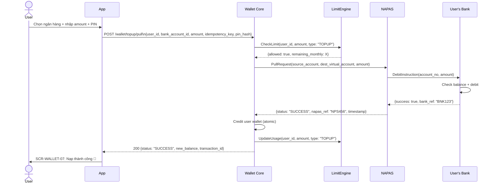

# PRD: Wallet Core Module

<Info>
  **Document ID:** PRD-EW-WALLET-001 · **Version:** 1.0 · **Status:** Draft  
  **Ngày tạo:** 2026-05-25 · **Tác giả:** BA Team  
  **Reviewer:** Tech Lead, Compliance, Risk Team · **Approver:** Head of Product  
  **Tài liệu liên quan:** PRD-EW-AUTH-001, PRD-EW-KYC-001, PRD-EW-BANK-001
</Info>

| Vai trò | Mục đích đọc |
|---|---|
| Tech Lead / Developer | Thiết kế Wallet Core Service, NAPAS integration, balance engine |
| Compliance | Xác nhận hạn mức đúng Nghị định 52/2024; phí = 0 |
| Risk Team | Review limit engine, fraud detection trigger khi nạp/rút bất thường |
| QA Lead | Test cases: pull top-up, push top-up, withdraw, limit exceeded, NAPAS timeout |
| UX Designer | Hiểu balance display, trạng thái processing, error states |

---

## 1. Tổng quan module

<CardGroup cols={2}>
  <Card title="Balance Management" icon="scale-balanced">
    Hiển thị số dư tổng / khả dụng / bị khóa. Toggle ẩn/hiện. Cập nhật realtime sau mỗi GD.
  </Card>
  <Card title="Nạp tiền" icon="arrow-down-to-bracket">
    Pull (kéo từ ngân hàng liên kết — chính) + Push QR (chuyển thủ công từ app ngân hàng — fallback)
  </Card>
  <Card title="Rút tiền" icon="arrow-up-from-bracket">
    NAPAS 247 T+0; về tài khoản ngân hàng đã liên kết; PIN bắt buộc; tức thì
  </Card>
  <Card title="Limit Engine" icon="gauge">
    Hạn mức real-time theo KYC tier; reset theo ngày/tháng; block trước khi thực hiện GD
  </Card>
</CardGroup>

### 1.1 Phí giao dịch

<Info>
  **Miễn phí toàn bộ:** Nạp tiền (mọi phương thức) và rút tiền đều **không thu phí**. Chi phí NAPAS do platform hấp thụ.
</Info>

### 1.2 Hạn mức theo KYC Tier

| Hạn mức | Tier 1 (SĐT only) | Tier 2 (eKYC) | Tier 3 (Full KYC) | Nguồn |
|---|---|---|---|---|
| Nạp / lần | 1,000,000 VND | 20,000,000 VND | 100,000,000 VND | Nghị định 52/2024 |
| Rút / lần | ❌ Không cho rút | 20,000,000 VND | 100,000,000 VND | |
| Tổng nạp + rút / tháng | 10,000,000 VND | 100,000,000 VND | 500,000,000 VND | |
| Số dư tối đa tại bất kỳ thời điểm | 10,000,000 VND | 100,000,000 VND | 500,000,000 VND | |

### 1.3 Balance Types

| Loại | Ký hiệu | Mô tả |
|---|---|---|
| **Total Balance** | `balance_total` | Tổng số dư trong ví |
| **Available Balance** | `balance_available` | `= balance_total - balance_locked` — số tiền có thể dùng ngay |
| **Locked Balance** | `balance_locked` | Tiền đang giữ trong lệnh pending (rút đang xử lý, transfer chờ duyệt) |

---

## 2. Danh sách màn hình

| Screen ID | Tên màn hình | Điều kiện hiển thị |
|---|---|---|
| SCR-WALLET-01 | Home — Balance Card | Luôn hiển thị trên Home sau đăng nhập |
| SCR-WALLET-02 | Chọn phương thức nạp | User nhấn "Nạp tiền" |
| SCR-WALLET-03 | Nạp qua ngân hàng (Pull) — Chọn bank + nhập số tiền | User chọn "Từ ngân hàng liên kết" |
| SCR-WALLET-04 | Nạp — Xác nhận pull | Sau khi nhập số tiền hợp lệ |
| SCR-WALLET-05 | Nạp — Nhập PIN | Sau confirm pull |
| SCR-WALLET-06 | Nạp — Đang xử lý | Sau PIN đúng; NAPAS call đang chạy |
| SCR-WALLET-07 | Nạp — Kết quả | Sau khi NAPAS trả kết quả |
| SCR-WALLET-08 | Nạp qua QR (Push) — Hiển thị QR + STK ảo | User chọn "Chuyển khoản thủ công" |
| SCR-WALLET-09 | Rút tiền — Chọn ngân hàng nhận | User nhấn "Rút tiền" |
| SCR-WALLET-10 | Rút tiền — Nhập số tiền | Sau khi chọn ngân hàng |
| SCR-WALLET-11 | Rút tiền — Xác nhận | Sau khi nhập số tiền hợp lệ |
| SCR-WALLET-12 | Rút tiền — Nhập PIN | Sau confirm rút |
| SCR-WALLET-13 | Rút tiền — Đang xử lý | Sau PIN đúng |
| SCR-WALLET-14 | Rút tiền — Kết quả | Sau khi NAPAS trả kết quả |

---

## 3. User Flow — Nạp tiền (Pull — Chính)

```mermaid
flowchart TD
    A([User nhấn\n"Nạp tiền"]) --> B[SCR-WALLET-02\nChọn phương thức]
    B -- Từ ngân hàng liên kết --> C[SCR-WALLET-03\nChọn bank + nhập số tiền]
    B -- Chuyển khoản thủ công --> PUSH([SCR-WALLET-08\nFlow Push / QR])

    C --> D{Có ngân hàng\nliên kết?}
    D -- Chưa có --> E[Redirect:\nLiên kết ngân hàng trước\nModule 04]
    D -- Có --> F[Hiển thị danh sách\nngân hàng đã liên kết]
    F --> G[Chọn ngân hàng]
    G --> H[Nhập số tiền]
    H --> I{Validate\nsố tiền}
    I -- Lỗi --> H
    I -- OK --> J[Limit Engine check\nrealtime]
    J --> K{Vượt hạn\nmức?}
    K -- Có --> L[Hiển thị lỗi\nhạn mức cụ thể]
    K -- Không --> M[SCR-WALLET-04\nXác nhận pull]

    M --> N[SCR-WALLET-05\nNhập PIN]
    N --> O{PIN đúng?}
    O -- Sai --> P[Hiển thị lỗi\nsố lần còn lại]
    P --> N
    O -- Đúng --> Q[SCR-WALLET-06\nĐang xử lý]

    Q --> R[Wallet Core gọi\nNAPAS Pull API]
    R --> S{NAPAS\nkết quả}
    S -- Thành công --> T[Credit vào ví\nUpdate balance]
    T --> U[SCR-WALLET-07\nThành công]
    S -- Bank số dư không đủ --> V[SCR-WALLET-07\nThất bại: Số dư ngân hàng không đủ]
    S -- Timeout > 30s --> W[SCR-WALLET-07\nĐang xử lý — kiểm tra lại sau]
    S -- Bank declined --> X[SCR-WALLET-07\nThất bại: Ngân hàng từ chối]
```

---

## 4. User Flow — Nạp tiền (Push QR — Fallback)

```mermaid
flowchart TD
    A[SCR-WALLET-08\nHiển thị QR + STK ảo] --> B[Hệ thống tạo\nVirtual Account Number\ncho user này]
    B --> C[Hiển thị:\n• QR Code động\n• Số TK ảo: xxxx-yyyy-zzzz\n• Tên thụ hưởng\n• Nội dung CK: mã user]
    C --> D[User mở app ngân hàng\nQuét QR hoặc nhập STK ảo]

    D --> E[User chuyển tiền\ntừ app ngân hàng]
    E --> F[NAPAS gửi\nwebhook → Wallet Core]
    F --> G{Webhook\nhợp lệ?}
    G -- Không --> H[Log; bỏ qua]
    G -- Có --> I{Số tiền trong\nhạn mức?}
    I -- Vượt hạn mức --> J[Reject; hoàn tiền\nngược lại user\nqua NAPAS]
    I -- Hợp lệ --> K[Credit vào ví]
    K --> L[Push notification\n"Nạp {amount} thành công"]
    L --> M([Balance tự cập nhật\nkhi user mở app])
```

---

## 5. User Flow — Rút tiền

```mermaid
flowchart TD
    A([User nhấn\n"Rút tiền"]) --> B{Tier ≥ Tier 2?}
    B -- Tier 1 --> C[Thông báo:\n"Cần xác minh danh tính\ntrước khi rút tiền"]
    C --> D[Link đến KYC Module]
    B -- Tier 2+ --> E[SCR-WALLET-09\nChọn ngân hàng nhận]

    E --> F{Có ngân hàng\nliên kết?}
    F -- Chưa --> G[Redirect: Liên kết\nngân hàng trước]
    F -- Có --> H[Danh sách ngân hàng\nliên kết; chọn bank]
    H --> I[SCR-WALLET-10\nNhập số tiền rút]
    I --> J{Validate số tiền}
    J -- Lỗi --> I
    J -- OK --> K[Limit Engine check:\nBalance đủ? Hạn mức GD/tháng?]
    K --> L{Check OK?}
    L -- Không đủ balance --> M[Error: Số dư không đủ]
    L -- Vượt hạn mức --> N[Error: Hạn mức cụ thể]
    L -- OK --> O[SCR-WALLET-11\nXác nhận rút]

    O --> P[SCR-WALLET-12\nNhập PIN]
    P --> Q{PIN đúng?}
    Q -- Sai --> R[Lỗi + số lần còn lại]
    R --> P
    Q -- Đúng --> S[Lock amount\nDebit từ ví\nSCR-WALLET-13]

    S --> T[Gọi NAPAS 247\nCredit to Bank]
    T --> U{NAPAS\nkết quả}
    U -- Thành công\n(T+0) --> V[Xác nhận\nUnlock amount\nĐã credit]
    V --> W[SCR-WALLET-14\nThành công]
    U -- Bank unavailable --> X[Rollback debit\nHoàn tiền về ví]
    X --> Y[SCR-WALLET-14\nThất bại; thử lại]
    U -- Timeout > 30s --> Z[Giữ locked\nBackground retry 3 lần\nNotify khi có kết quả]
```

---

## 6. Sequence Diagram — Pull Top-up (NAPAS)



---

## 7. Sequence Diagram — Push Top-up (Webhook)

```mermaid
sequenceDiagram
    participant BankApp as User's Bank App
    participant Bank as Bank Core
    participant NAPAS
    participant WebhookSvc as Webhook Handler
    participant WalletSvc as Wallet Core
    participant LimitEngine
    participant NotifSvc as Notification Service
    actor User

    BankApp->>Bank: Chuyển tiền đến STK ảo (Virtual Account)
    Bank->>NAPAS: Transfer to Virtual Account
    NAPAS->>WebhookSvc: POST /webhooks/napas/credit\n{virtual_account, amount, sender_bank, bank_ref, timestamp}

    WebhookSvc->>WebhookSvc: Verify HMAC signature
    WebhookSvc->>WebhookSvc: Lookup user_id từ virtual_account
    WebhookSvc->>LimitEngine: CheckLimit(user_id, amount, "TOPUP")

    alt Hợp lệ và trong hạn mức
        WebhookSvc->>WalletSvc: Credit(user_id, amount, ref: bank_ref)
        WalletSvc->>WalletSvc: Idempotency check (bank_ref đã xử lý chưa?)
        WalletSvc-->>WebhookSvc: {credited: true, transaction_id}
        WebhookSvc->>NotifSvc: Push(user_id, "TOPUP_SUCCESS", amount)
        NotifSvc-->>User: "Nạp tiền thành công: +{amount} VND"
        WebhookSvc-->>NAPAS: 200 OK

    else Vượt hạn mức hoặc tài khoản không hợp lệ
        WebhookSvc->>NAPAS: Refund(amount to sender)
        WebhookSvc->>NotifSvc: Push(user_id, "TOPUP_REJECTED", reason)
        WebhookSvc-->>NAPAS: 200 OK (acknowledged; refund initiated)
    end
```

---

## 8. Sequence Diagram — Withdrawal (NAPAS 247 T+0)

```mermaid
sequenceDiagram
    actor User
    participant App
    participant WalletSvc as Wallet Core
    participant LimitEngine
    participant NAPAS
    participant BankCore as Recipient Bank

    User->>App: Chọn bank + amount + PIN
    App->>WalletSvc: POST /wallet/withdraw\n{user_id, bank_account_id, amount, idempotency_key, pin_hash}

    WalletSvc->>WalletSvc: Verify PIN hash
    WalletSvc->>LimitEngine: CheckLimit(user_id, amount, "WITHDRAW")
    LimitEngine-->>WalletSvc: {allowed: true}

    WalletSvc->>WalletSvc: Lock amount (balance_locked += amount)
    WalletSvc->>NAPAS: CreditInstruction(dest_account, amount)
    NAPAS->>BankCore: Credit to account
    BankCore-->>NAPAS: {success: true, bank_ref: "BNK789"}
    NAPAS-->>WalletSvc: {status: "SUCCESS", napas_ref: "NPS999"}

    WalletSvc->>WalletSvc: Confirm debit (balance_total -= amount, locked = 0)
    WalletSvc->>LimitEngine: UpdateUsage(user_id, amount, "WITHDRAW")
    WalletSvc-->>App: 200 {status: "SUCCESS", new_balance, transaction_id}
    App->>User: SCR-WALLET-14: Rút tiền thành công

    Note over WalletSvc: Nếu NAPAS timeout → retry 3 lần (5s, 15s, 30s)\nSau 3 lần fail → rollback lock; notify user
```

---

## 9. Screen Specifications

### SCR-WALLET-01 — Home Balance Card

```
┌─────────────────────────────────┐
│  ┌───────────────────────────┐  │
│  │  Số dư khả dụng    [👁]   │  │
│  │                           │  │
│  │    2,500,000 đ            │  │  ← hiện rõ
│  │  ─── hoặc ───             │  │
│  │    • • • • • • đ          │  │  ← khi ẩn
│  │                           │  │
│  │  Đang xử lý: 150,000 đ   │  │  ← nếu có locked
│  │  [Tier 2]                 │  │
│  │                           │  │
│  │  [↓ Nạp]      [↑ Rút]    │  │
│  └───────────────────────────┘  │
│                                 │
│  ╔═══════════════════════════╗  │
│  ║ Xác minh KYC để rút tiền ║  │  ← Tier 1 only
│  ╚═══════════════════════════╝  │
└─────────────────────────────────┘
```

| Component | Loại | Nội dung | Điều kiện | Action |
|---|---|---|---|---|
| Balance label | Text (small) | "Số dư khả dụng" | Always | — |
| Balance amount | Text H1 bold | "X,XXX,XXX đ" (format: dấu phẩy ngăn cách) | Default: hiển thị rõ | — |
| Balance masked | Text H1 | "• • • • • • đ" | Khi user ẩn | — |
| Toggle eye icon | Icon button | 👁 / 👁‍🗨 | Always | Toggle ẩn/hiện; lưu preference |
| Locked amount | Text (small, grey) | "Đang xử lý: {X} đ" | Khi `balance_locked > 0` | — |
| "Nạp tiền" button | Outlined button | ↓ Nạp | Always | Sang SCR-WALLET-02 |
| "Rút tiền" button | Outlined button | ↑ Rút | Tier 2+; else disabled với tooltip | Sang SCR-WALLET-09 |
| Tier badge | Badge | "Tier 1" / "Tier 2" / "Tier 3" | Always | Tap → xem hạn mức chi tiết |
| Upgrade CTA | Banner (orange) | "Xác minh danh tính để rút tiền và tăng hạn mức →" | Tier 1 only | Sang KYC module |

---

### SCR-WALLET-03 — Nạp qua Ngân hàng (Pull)

```
┌─────────────────────────────────┐
│  ←              Nạp tiền       │
│                                 │
│  Nguồn tiền                     │
│  ┌───────────────────────────┐  │
│  │ [Logo MB] MBBank ****1234 │  │  ← dropdown chọn bank
│  └───────────────────────────┘  │
│  + Thêm ngân hàng mới           │
│                                 │
│  Số tiền                        │
│  ┌───────────────────────────┐  │
│  │     0 đ                   │  │
│  └───────────────────────────┘  │
│  ⚠ Tối thiểu 5,000 đ            │  ← inline error
│  [50K]  [100K]  [500K]  [1M]   │
│                                 │
│  Hạn mức ngày còn: 95,000,000 đ │
│                                 │
│       [      Tiếp tục     ]     │
└─────────────────────────────────┘
```

| Component | Loại | Nội dung | Điều kiện | Action |
|---|---|---|---|---|
| "Chọn ngân hàng" | Label | "Nguồn tiền" | Always | — |
| Bank list | Dropdown/Sheet | Danh sách ngân hàng liên kết (avatar, tên bank, số TK ẩn 4 số cuối) | Always | Chọn 1 |
| "Thêm ngân hàng" | Text link | "+ Thêm ngân hàng mới" | Always | Sang Bank Linking module |
| Amount input | Numeric input | "Nhập số tiền" | Always | Format realtime: "1.000.000 đ" |
| Quick amount | Chips | 50K · 100K · 500K · 1M · 2M | Always | Auto-fill amount |
| Remaining limit | Text (small) | "Hạn mức ngày còn lại: {X} đ · Tháng còn lại: {Y} đ" | Always | — |
| Min/Max note | Text (small) | "Tối thiểu 5,000 đ · Tối đa 20,000,000 đ/lần (Tier 2)" | Always | — |
| Inline error | Text (red) | Xem Validation Rules | Khi lỗi | — |
| "Tiếp tục" | Primary button | "Tiếp tục" | Disabled khi invalid | Sang SCR-WALLET-04 |

---

### SCR-WALLET-04 — Xác nhận Nạp (Pull)

```
┌─────────────────────────────────┐
│  ←          Xác nhận nạp tiền  │
│                                 │
│  ┌───────────────────────────┐  │
│  │ Nguồn      MBBank ****1234│  │
│  │ Số tiền     1,000,000 đ   │  │
│  │ Phí               Miễn phí│  │
│  │ ───────────────────────   │  │
│  │ Nhận được   1,000,000 đ   │  │
│  │ Ước tính        vài giây  │  │
│  └───────────────────────────┘  │
│                                 │
│  Giao dịch không thể hoàn sau   │
│  khi xác nhận.                  │
│                                 │
│     [ Xác nhận nạp tiền ]       │
│            Hủy                  │
└─────────────────────────────────┘
```

| Component | Loại | Nội dung | Action |
|---|---|---|---|
| Summary card | Card | Nguồn: [bank name] — [masked account] | — |
| | | Số tiền: **{amount}** | — |
| | | Phí: **Miễn phí** | — |
| | | Ước tính nhận: **{amount}** (trong vòng vài giây) | — |
| Legal note | Text (small) | "Giao dịch không thể hoàn sau khi xác nhận." | — |
| "Xác nhận nạp" | Primary button | "Xác nhận nạp tiền" | Sang PIN screen |
| "Hủy" | Text link | "Hủy" | Về SCR-WALLET-03 |

---

### SCR-WALLET-08 — Nạp qua QR (Push)

```
┌─────────────────────────────────┐
│  ←           Nạp qua QR        │
│                                 │
│  Dùng app ngân hàng quét QR     │
│  hoặc chuyển đến số TK bên dưới │
│                                 │
│  ┌─────────────────────────┐   │
│  │    [ QR CODE IMAGE ]    │   │
│  │       VietQR logo       │   │
│  └─────────────────────────┘   │
│                                 │
│  Số TK ảo  9704038112341234 [📋]│
│  Tên TH    Ví điện tử App       │
│  Nội dung  NDC2026001  [📋]    │  ← bắt buộc đúng
│  Ngân hàng MB Bank              │
│                                 │
│  ╔═══════════════════════════╗  │
│  ║ ⚠ Nhập đúng nội dung CK  ║  │
│  ╚═══════════════════════════╝  │
│                                 │
│  ⏳ Đang chờ giao dịch...       │  ← auto-refresh
│                                 │
│     [ Tôi đã chuyển xong ]      │
└─────────────────────────────────┘
```

| Component | Loại | Nội dung | Action |
|---|---|---|---|
| Instruction | Text | "Dùng app ngân hàng bất kỳ để quét QR hoặc chuyển đến số TK bên dưới" | — |
| QR Code | Image | QR chứa thông tin Virtual Account | — |
| Virtual account info | Card | **Số TK ảo:** {virtual_account_number} | Copy to clipboard |
| | | **Tên thụ hưởng:** [Tên công ty / App Name] | — |
| | | **Nội dung CK:** {user_code} — *Bắt buộc nhập đúng* | — |
| | | **Ngân hàng:** [Bank name] | — |
| Min amount note | Text | "Tối thiểu 5,000 đ" | — |
| Warning | Banner (orange) | "Nhập đúng nội dung chuyển khoản. Sai nội dung, tiền có thể không được cộng tự động." | — |
| Status | Auto-refresh | "Đang chờ giao dịch..." → "✅ Nhận được {X} đ!" | Poll `/wallet/topup/status` mỗi 5s |
| "Tôi đã chuyển xong" | Secondary button | "Tôi đã chuyển xong" | Đóng màn hình; về Home; notify khi nhận được |

---

### SCR-WALLET-11 — Xác nhận Rút tiền

```
┌─────────────────────────────────┐
│  ←          Xác nhận rút tiền  │
│                                 │
│  ┌───────────────────────────┐  │
│  │ Đến      MBBank ****1234  │  │
│  │ Chủ TK   NGUYEN DUC CHINH │  │
│  │ Số tiền     500,000 đ     │  │
│  │ Phí               Miễn phí│  │
│  │ Thời gian      Ngay lập tức│  │
│  │ Số dư còn  2,000,000 đ    │  │
│  └───────────────────────────┘  │
│                                 │
│  ╔═══════════════════════════╗  │
│  ║ ⚠ Giao dịch không thể    ║  │
│  ║    hoàn sau khi xác nhận  ║  │
│  ╚═══════════════════════════╝  │
│                                 │
│     [ Xác nhận rút tiền ]       │  ← màu đỏ
│            Hủy                  │
└─────────────────────────────────┘
```

| Component | Loại | Nội dung | Action |
|---|---|---|---|
| Summary card | Card | Đến: [bank name] — [masked account] — [owner name] | — |
| | | Số tiền: **{amount}** | — |
| | | Phí: **Miễn phí** | — |
| | | Thời gian nhận: **Ngay lập tức (NAPAS 247)** | — |
| Available balance | Text | "Số dư sau khi rút: [available - amount] đ" | — |
| Irreversible warning | Banner (red) | "⚠ Giao dịch không thể hoàn sau khi xác nhận." | — |
| "Xác nhận rút" | Primary button (red) | "Xác nhận rút tiền" | Sang PIN screen |
| "Hủy" | Text link | "Hủy" | Về SCR-WALLET-10 |

---

## 10. Validation Rules

| Field / Bước | Rule | Thông báo | Trigger |
|---|---|---|---|
| **Số tiền nạp** | ≥ 5,000 VND | "Số tiền tối thiểu là 5,000 đ" | On blur / submit |
| | ≤ 20,000,000 VND/lần (Tier 2) | "Số tiền tối đa 1 lần nạp là 20,000,000 đ" | On blur |
| | ≤ Hạn mức ngày còn lại | "Vượt hạn mức ngày. Bạn còn có thể nạp {X} đ hôm nay." | After API limit check |
| | ≤ Hạn mức tháng còn lại | "Vượt hạn mức tháng. Còn {Y} đ trong tháng này." | After API limit check |
| | ≤ Số dư tối đa trong ví (balance_total + amount ≤ tier_max_balance) | "Số dư ví sẽ vượt hạn mức {tier_max}. Vui lòng rút bớt trước." | After API limit check |
| | Chỉ chứa số (không ký tự đặc biệt) | Format auto: phân cách dấu chấm | On input |
| **Số tiền rút** | ≥ 10,000 VND | "Số tiền tối thiểu rút là 10,000 đ" | On blur |
| | ≤ `balance_available` | "Số dư khả dụng không đủ. Hiện có {X} đ." | On blur / API |
| | ≤ 20,000,000 VND/lần (Tier 2) | "Số tiền tối đa 1 lần rút là 20,000,000 đ" | On blur |
| | ≤ Hạn mức tháng còn lại | "Vượt hạn mức tháng. Còn {Y} đ." | API |
| **Chọn ngân hàng (rút)** | Phải có ít nhất 1 ngân hàng liên kết | Redirect → Bank Linking module | Pre-screen |
| | Ngân hàng được chọn phải còn active | "Ngân hàng này không khả dụng. Chọn ngân hàng khác." | API |
| **PIN** | Đúng PIN | "PIN không đúng. Còn {N} lần." | After API |
| | Sai 5 lần | Lock account 30 phút | After API |

---

## 11. Business Rules

| ID | Rule | Áp dụng tại |
|---|---|---|
| BR-WALLET-01 | Tier 1: không được rút tiền về ngân hàng | SCR-WALLET-01 (disable nút Rút), SCR-WALLET-09 |
| BR-WALLET-02 | Nạp và rút đều miễn phí 100%; không thu phí ẩn | Confirm screens |
| BR-WALLET-03 | Atomic operation: debit và credit phải xảy ra đồng thời; không trạng thái trung gian | Wallet Core DB |
| BR-WALLET-04 | Idempotency key bắt buộc mọi request nạp/rút; duplicate request trả kết quả cũ | API |
| BR-WALLET-05 | Pull top-up: nếu NAPAS timeout sau 30s → không retry tự động; status = PENDING; notify user | NAPAS integration |
| BR-WALLET-06 | Push top-up: validate nội dung chuyển khoản phải chứa `user_code`; nếu sai → hoàn tiền tự động | Webhook handler |
| BR-WALLET-07 | Withdrawal: Lock amount ngay sau khi PIN đúng; chỉ unlock khi NAPAS confirm hoặc rollback khi fail | Wallet Core |
| BR-WALLET-08 | NAPAS withdrawal fail: retry tối đa 3 lần (5s, 15s, 30s); sau 3 lần → rollback; notify user | NAPAS integration |
| BR-WALLET-09 | Balance không bao giờ âm; enforce tại DB level: `CHECK (balance_total >= 0)` | DB constraint |
| BR-WALLET-10 | Hạn mức tháng reset vào 00:00 ngày 1 hàng tháng (múi giờ UTC+7) | Limit Engine |
| BR-WALLET-11 | Hạn mức ngày reset vào 00:00 mỗi ngày (UTC+7) | Limit Engine |
| BR-WALLET-12 | Push top-up: Nếu amount vượt hạn mức → hoàn tiền ngay trong 30 phút qua NAPAS | Webhook handler |
| BR-WALLET-13 | Cảnh báo khi user nạp vượt 80% hạn mức tháng: banner thông báo | Limit Engine |

---

## 12. Notification Specifications

| Event | Channel | Nội dung | Thời điểm |
|---|---|---|---|
| Nạp tiền thành công (pull) | Push + In-app | "✅ Nạp thành công +{amount} đ từ {bank_name}. Số dư: {new_balance} đ" | Ngay khi credit |
| Nạp tiền thành công (push) | Push + In-app | "✅ Nhận được +{amount} đ từ chuyển khoản {bank_name}. Số dư: {new_balance} đ" | Khi webhook credit |
| Nạp tiền thất bại | Push + In-app | "❌ Nạp tiền thất bại: {reason}. Vui lòng thử lại." | Khi fail confirmed |
| Rút tiền thành công | Push + In-app + SMS | "✅ Rút {amount} đ về {bank_name} thành công. Mã GD: {tx_id}" | Khi NAPAS confirm |
| Rút tiền đang xử lý (timeout) | Push + In-app | "⏳ Lệnh rút {amount} đ đang được xử lý. Chúng tôi sẽ thông báo khi hoàn tất." | Khi timeout |
| Rút tiền thất bại + hoàn tiền | Push + In-app | "❌ Rút tiền thất bại. {amount} đ đã được hoàn lại vào ví. Mã lỗi: {code}" | Khi rollback hoàn tất |
| Gần đạt hạn mức tháng (80%) | Push + In-app | "⚠ Bạn đã dùng 80% hạn mức giao dịch tháng. Còn {X} đ. Nâng tier để tăng hạn mức." | Khi vượt 80% |
| Đạt hạn mức tháng (100%) | Push + In-app | "🔴 Hạn mức tháng đã hết. Chờ đến [ngày 1 tháng sau] để tiếp tục giao dịch." | Khi đạt 100% |
| Push top-up bị hoàn tiền | SMS + Push | "Chuyển khoản {amount} đ vào ví bị hoàn: {reason}. Tiền sẽ về TK ngân hàng trong 30 phút." | Khi refund initiated |

---

## 13. API Summary

| Method | Endpoint | Request | Response | Mô tả |
|---|---|---|---|---|
| GET | `/wallet/balance` | — (header: token) | `[total, available, locked, currency, tier]` | Lấy số dư; gọi mỗi khi mở app / sau mỗi GD |
| POST | `/wallet/topup/pull` | `[bank_account_id, amount, idempotency_key, pin_hash]` | `[tx_id, status, new_balance]` | Kéo tiền từ ngân hàng liên kết |
| GET | `/wallet/topup/virtual-account` | — | `[virtual_account_no, bank_name, account_name, user_code, qr_content]` | Lấy thông tin STK ảo để hiển thị QR push |
| GET | `/wallet/topup/status?tx_id=` | — | `[status, amount?, credited_at?]` | Poll trạng thái push top-up |
| POST | `/wallet/withdraw` | `[bank_account_id, amount, idempotency_key, pin_hash]` | `[tx_id, status, new_balance]` | Rút tiền về ngân hàng |
| GET | `/wallet/limits` | — | `[per_tx_max, daily_remaining, monthly_remaining, max_balance]` | Lấy hạn mức realtime |
| POST | `/webhooks/napas/credit` | `[virtual_account, amount, bank_ref, ...]` *(internal)* | `[success: true]` | NAPAS gửi webhook khi push top-up đến |

---

## 14. Error Codes

| Code | HTTP | Hiển thị user | Ghi chú dev |
|---|---|---|---|
| `WALLET_001` | 400 | "Số tiền tối thiểu là 5,000 đ" | amount < min_topup |
| `WALLET_002` | 400 | "Số tiền tối đa 1 lần là {X} đ" | amount > per_tx_limit |
| `WALLET_003` | 400 | "Vượt hạn mức ngày. Còn {X} đ hôm nay." | daily_remaining < amount |
| `WALLET_004` | 400 | "Vượt hạn mức tháng. Còn {X} đ tháng này." | monthly_remaining < amount |
| `WALLET_005` | 400 | "Số dư ví sẽ vượt hạn mức cho phép." | new_balance > max_balance |
| `WALLET_006` | 400 | "Số dư khả dụng không đủ. Hiện có {X} đ." | available < withdraw_amount |
| `WALLET_007` | 402 | "Số dư tài khoản ngân hàng không đủ." | Bank returned insufficient funds |
| `WALLET_008` | 503 | "Ngân hàng đang bảo trì. Vui lòng thử lại sau." | Bank / NAPAS timeout |
| `WALLET_009` | 409 | — (xử lý silent; trả kết quả cũ) | Duplicate idempotency_key |
| `WALLET_010` | 403 | "Tài khoản Tier 1 chưa được rút tiền. Xác minh danh tính để mở tính năng này." | tier < TIER_2 |
| `WALLET_011` | 400 | "Ngân hàng này không khả dụng lúc này. Chọn ngân hàng khác." | Bank account inactive/unlinked |

---

## 15. Edge Cases

| Trường hợp | Xử lý |
|---|---|
| User nạp đúng bằng hạn mức tối đa ví rồi ngay lập tức rút | Sequence: nạp → balance = max; rút → balance = max - withdraw_amount; không lỗi nếu amount ≤ balance |
| Push top-up đến nhưng tài khoản bị frozen (CCCD hết hạn) | Hoàn tiền tự động; notify user: "Tài khoản đang bị hạn chế. Cập nhật CCCD để nhận tiền." |
| Hai lệnh rút cùng lúc (race condition) | Optimistic lock trên balance; lệnh thứ hai sẽ fail nếu balance không đủ sau khi lệnh đầu lock amount |
| NAPAS timeout rút tiền nhưng Bank đã credit user | Wallet Core phát hiện duplicate qua `napas_ref`; không rollback; mark COMPLETED manually |
| User thay đổi tier (KYC approved) trong khi có lệnh nạp đang pending | Lệnh pending dùng limit của tier cũ; sau approve tier mới áp dụng lệnh tiếp theo |
| Virtual Account Number bị gửi tiền không có `user_code` | Webhook từ chối và hoàn tiền; log để CS xử lý thủ công nếu user claim |
| Network mất kết nối sau khi PIN đúng, trước khi nhận kết quả | App hiển thị "Đang xử lý"; khi reconnect gọi `GET /wallet/topup/status?idempotency_key=`; idempotency đảm bảo không duplicate |

---

## 16. Open Questions

| # | Câu hỏi | Owner | Sprint |
|---|---|---|---|
| OQ-WALLET-01 | Virtual Account Number: dùng 1 STK ảo cố định per user hay generate mới mỗi session? Sinh mới an toàn hơn nhưng phức tạp hơn. | Tech Lead | Sprint 1 |
| OQ-WALLET-02 | Số lần retry NAPAS timeout (hiện thiết kế 3 lần): Risk Team có yêu cầu log thêm để phát hiện pattern giả GD không? | Risk | Sprint 1 |
| OQ-WALLET-03 | Cảnh báo hạn mức 80%: push notification hay chỉ in-app? Tần suất: mỗi GD sau 80% hay chỉ 1 lần? | Product | Sprint 2 |
| OQ-WALLET-04 | Khi NAPAS rút tiền bị timeout và đang retry: user có thể bắt đầu giao dịch khác không, hay lock toàn bộ ví? | Tech Lead + Risk | Sprint 1 |
| OQ-WALLET-05 | Balance hiển thị có real-time push (WebSocket) không, hay chỉ pull khi mở app? | Tech Lead | Sprint 2 |
