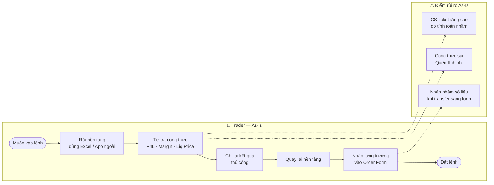
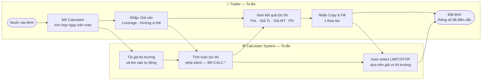

## Document Header

| Trường | Giá trị |
|---|---|
| **ID** | BRD-FUTURES-CALC-001 |
| **Phiên bản** | 1.1 |
| **Trạng thái** | Draft |
| **Ngày tạo** | 2026-05-26 |
| **Cập nhật lần cuối** | 2026-05-27 |
| **Project Sponsor** | CPO |
| **Business PM** | Head of Product |
| **Business Analyst** | BA Team |
| **Tài liệu liên quan** | FRD-FUTURES-CALC-001 (Part 1 & Part 2), UX-FUTURES-CALC-001, FRD-FEE-TOKEN-001 |

---

## Phân phối & Phê duyệt tài liệu

**Danh sách phê duyệt**

| Vai trò | Họ tên | Phạm vi phê duyệt | Ngày phê duyệt |
|---|---|---|---|
| Head of Product | | Scope & Business Objectives | |
| Compliance | | Rủi ro pháp lý & Disclaimer | |
| CPO | | Final approval (nếu ảnh hưởng fee structure) | |

**Danh sách nhận tài liệu**

| Họ tên | Vai trò | Mục đích |
|---|---|---|
| | Product Manager | Chuyển đổi sang FRD & sprint planning |
| | UX Lead | Hiểu pain point & User Profiles để thiết kế |
| | CS Manager | Xác nhận pain point thực tế từ ticket history |
| | Tech Lead | Đánh giá Dependencies & Assumptions kỹ thuật |
| | Finance / Token Team | Review tác động fee structure & Native Token |

---

## Lịch sử thay đổi

| Phiên bản | Ngày | Người thay đổi | Nội dung |
|---|---|---|---|
| 1.0 | 2026-05-26 | BA Team | Tạo mới — Draft đầu tiên |
| 1.1 | 2026-05-27 | BA Team | Thêm Problem/Impact/Outcome, Scope, User Profiles, Issues, Business Impact Assessment, Glossary; bổ sung MoSCoW cho Business Requirements; cập nhật reference PRD → FRD |

---

## 1. Giới thiệu (Introduction)

Nami Exchange — nền tảng giao dịch crypto phái sinh — đang vận hành tính năng Futures Trading với đòn bẩy (leverage). Khi số lượng trader mới tăng, nhu cầu tự tính toán rủi ro trước khi vào lệnh ngày càng cao, nhưng nền tảng chưa có công cụ hỗ trợ tích hợp sẵn.

**Futures Position Calculator** là công cụ tính toán vị thế được tích hợp trực tiếp vào màn Futures Trading, giúp trader ước tính PnL, Target Price và Liquidation Price trước khi đặt lệnh mà không cần rời khỏi nền tảng. Tính năng Copy & Fill cho phép chuyển kết quả sang Order Form bằng 1 thao tác.

Tài liệu này mô tả **yêu cầu cấp nghiệp vụ** để làm cơ sở phê duyệt đầu tư và bàn giao cho Product Team phát triển FRD, sprint planning và implementation. Tài liệu **không** mô tả chi tiết kỹ thuật, công thức tính toán hay acceptance criteria — các nội dung đó thuộc FRD-FUTURES-CALC-001.

---

## 2. Vấn đề – Tác động – Kết quả kỳ vọng

| Vấn đề (Problem) | Tác động (Impact) | Kết quả kỳ vọng (Successful Outcome) |
|---|---|---|
| Trader phải rời nền tảng để tính PnL, margin và liquidation price bằng công cụ ngoài (Excel, app tính, website bên thứ ba) | Quyết định dựa trên công thức sai hoặc không tính phí → rủi ro liquidation bất ngờ; gián đoạn luồng giao dịch → giảm tỷ lệ chuyển đổi sang đặt lệnh thực | Trader tính toán ngay trong nền tảng, hiểu rõ rủi ro trước khi vào lệnh; đặt lệnh bằng 1 thao tác Copy & Fill — không cần rời màn |
| Trader mới không biết liquidation price của mình ở đâu cho đến khi bị thanh lý | Thanh lý bất ngờ → mất vốn → churn; reputation nền tảng bị ảnh hưởng | Trader mới biết chính xác mức giá thanh lý theo leverage đã chọn *trước khi* đặt lệnh |
| CS team tốn 5–10 phút/ticket để giải thích công thức PnL, margin và liquidation | Nguồn lực CS không được tập trung vào vấn đề thực sự cần hỗ trợ; chi phí support cao | Trader tự tính; CS chỉ xử lý ticket thực sự phức tạp cần can thiệp của người |

---

## 3. Phạm vi (Scope)

### Trong phạm vi — MVP

| # | Hạng mục | Mô tả ngắn |
|---|---|---|
| 1 | PnL Calculator | Tính Profit/Loss cho Long và Short, bao gồm phí Maker/Taker |
| 2 | Target Price Calculator | Tính giá mục tiêu theo PnL tuyệt đối hoặc %PnL kỳ vọng |
| 3 | Liquidation Price Calculator | Tính giá thanh lý theo leverage và size (Isolated Margin) |
| 4 | Copy & Fill | Sao chép thông số từ Calculator sang Order Form; auto-select LIMIT/STOP |
| 5 | Native Token Fee Checkbox | So sánh phí thông thường vs. phí Native Token; hiển thị trạng thái số dư |
| 6 | Onboarding | Hướng dẫn dùng lần đầu cho từng Calculator |
| 7 | Đa nền tảng | Web (desktop + responsive) · iOS · Android |

### Ngoài phạm vi — MVP

| Hạng mục | Lý do loại khỏi MVP |
|---|---|
| Lưu lịch sử kịch bản tính toán | Yêu cầu backend storage; không đủ priority cho MVP |
| So sánh đa kịch bản đồng thời | UX phức tạp; nghiên cứu thêm trước khi thiết kế |
| Liquidation Calculator cho Cross Margin | Công thức và logic khác biệt lớn; cần spec riêng |
| Tính PnL theo tổng portfolio | Cần tích hợp Position API; ngoài scope tính năng này |
| API công khai cho Calculator | Third-party use case; cần governance riêng |
| Ước tính thuế lợi vốn trên PnL | Phụ thuộc jurisdiction; cần legal review |
| Alert khi giá tiệm cận Liquidation Price | Cần notification infrastructure; roadmap Q4 |

---

## 4. Đối tượng sử dụng (User Profiles)

<Info>
Phân nhóm trader dưới đây dựa trên giả định từ CS ticket history và user research sơ bộ. Product Team cần validate bằng dữ liệu thực (thời gian account tồn tại, volume/tháng, tần suất đặt lệnh) trước khi dùng để ra quyết định UX.
</Info>

Futures Position Calculator phục vụ **ba nhóm trader** với hành vi và nhu cầu khác nhau:

### 4.1 Trader mới (New Trader)

| Thuộc tính | Mô tả |
|---|---|
| **Kinh nghiệm** | Dưới 3 tháng giao dịch futures; có thể đã trade spot nhưng chưa quen leverage |
| **Hành vi điển hình** | Đặt lệnh theo cảm tính hoặc tin tức; hiếm khi tính leverage risk trước khi vào lệnh |
| **Pain point chính** | Không biết liquidation price ở đâu; bị liquidation bất ngờ; không hiểu PnL thực có tính phí không |
| **Nhu cầu với Calculator** | Biết mình sẽ bị thanh lý ở mức giá nào *trước khi* đặt lệnh |
| **Calculator hay dùng** | Liquidation Price Calculator |
| **Rủi ro nếu không có** | Liquidation bất ngờ → mất vốn → churn |

### 4.2 Trader thường (Regular Trader)

| Thuộc tính | Mô tả |
|---|---|
| **Kinh nghiệm** | 3–18 tháng futures; hiểu cơ bản leverage nhưng không tính tay thường xuyên |
| **Hành vi điển hình** | Có chiến lược TP/SL sơ bộ; thỉnh thoảng dùng tool ngoài (Excel, app tính) nhưng không nhất quán |
| **Pain point chính** | Mất thời gian rời nền tảng để tính; khi quay lại giá đã thay đổi; dễ nhập sai khi chuyển kết quả thủ công |
| **Nhu cầu với Calculator** | Tính nhanh PnL và Target Price ngay trên màn giao dịch, không cần mở tab mới |
| **Calculator hay dùng** | PnL Calculator + Target Price Calculator |
| **Rủi ro nếu không có** | Dùng tool đối thủ có tích hợp calculator → giảm stickiness với nền tảng |

### 4.3 Trader pro (Professional Trader)

| Thuộc tính | Mô tả |
|---|---|
| **Kinh nghiệm** | Trên 18 tháng; trade đa lệnh, quản lý rủi ro chủ động; biết công thức thuộc lòng |
| **Hành vi điển hình** | Tính trước nhiều kịch bản; đặt lệnh nhanh sau khi xác nhận thông số; tối ưu phí giao dịch |
| **Pain point chính** | Thao tác chuyển kết quả sang Order Form mất 5–10 giây/lần × nhiều lệnh/ngày; muốn dùng Native Token để được ưu đãi phí |
| **Nhu cầu với Calculator** | Copy & Fill 1-click; checkbox phí Native Token để so sánh nhanh |
| **Calculator hay dùng** | Copy & Fill + Native Token Fee |
| **Rủi ro nếu không có** | Ít bị ảnh hưởng nhất nhưng là nhóm đóng góp volume giao dịch cao nhất |

---

## 5. Mục tiêu nghiệp vụ & KPIs

| ID | Mục tiêu nghiệp vụ | Owner | KPI | Target | Timeframe |
|---|---|---|---|---|---|
| OBJ-01 | Giảm CS ticket liên quan tính toán PnL, margin, liquidation | CS Manager | Số ticket/tháng thuộc category "calculation" | Giảm 40% | 3 tháng sau launch |
| OBJ-02 | Tăng tỷ lệ chuyển đổi từ Calculator sang đặt lệnh thực qua Copy & Fill | Product Manager | % phiên dùng Calculator kết thúc bằng Order được đặt | Đạt 25% | 3 tháng sau launch |
| OBJ-03 | Tăng tỷ lệ sử dụng Native Token làm phí giao dịch | Finance / Token Team | % giao dịch futures dùng Native Token | Tăng 15 điểm % vs. baseline | 6 tháng sau launch |
| OBJ-04 | Giảm tỷ lệ trader mới bị liquidation trong 30 ngày đầu | Product Manager | % tài khoản mới có ≥1 liquidation event trong tháng đầu | Giảm 20% | 6 tháng sau launch |

<Info>
Target KPI trong bảng trên là ước tính sơ bộ. CS Manager và Growth Team cần xác nhận baseline số liệu thực tế trước khi finalize — xem thêm **I-02**.
</Info>

---

## 6. Quy trình nghiệp vụ (As-Is & To-Be)

### Tóm tắt thay đổi

| Chiều | As-Is (Hiện tại) | To-Be (Mục tiêu) |
|---|---|---|
| **Trader tính PnL** | Dùng spreadsheet hoặc tool ngoài, tự tra công thức | Tính ngay trên màn giao dịch, công thức chuẩn của nền tảng |
| **Trader hiểu liquidation risk** | Không có công cụ; học qua kinh nghiệm hoặc hỏi CS | Calculator hiển thị giá thanh lý tức thì theo leverage & size |
| **Chuyển từ tính toán → đặt lệnh** | Thủ công: ghi kết quả, nhập lại vào Order Form | Copy & Fill tự động điền thông số, auto-select LIMIT/STOP |
| **Phí giao dịch** | Không rõ phí trước khi đặt lệnh | Hiển thị phí ước tính; so sánh Native Token vs. thông thường |
| **CS ticket về tính toán** | Lượng ticket cao, mất 5–10 phút/ticket | Trader tự tính; CS chỉ xử lý ticket thực sự cần hỗ trợ |

### As-Is — Trader phải rời nền tảng để tính toán

### To-Be — Futures Calculator tích hợp sẵn trong nền tảng

**Kết quả nghiệp vụ kỳ vọng:** Giảm 40% CS ticket liên quan tính toán (OBJ-01) · Tăng 25% tỷ lệ chuyển đổi calculator → lệnh thực (OBJ-02).

---

## 7. Stakeholder Analysis

| Stakeholder | Vai trò | Lợi ích khi có tính năng | Mức độ ảnh hưởng | Mức độ quan tâm |
|---|---|---|---|---|
| Trader mới | Người dùng cuối | Hiểu risk trước khi đặt lệnh; tránh liquidation | Cao | Cao |
| Trader thường | Người dùng cuối | Tính toán nhanh, không cần rời màn | Cao | Trung bình |
| Trader pro | Người dùng cuối | Copy & Fill giảm thao tác thủ công | Trung bình | Thấp |
| CS Team | Người hưởng lợi gián tiếp | Giảm ticket giải thích công thức | Trung bình | Cao |
| Product Team | Owner tính năng | Tăng engagement, conversion, Native Token adoption | Cao | Cao |
| Compliance | Reviewer rủi ro | Đảm bảo công cụ không bị hiểu là cam kết lợi nhuận | Cao | Trung bình |
| Finance / Token Team | Liên quan phí Native Token | Tăng tỷ lệ dùng Native Token; cần cung cấp fee rate API | Trung bình | Trung bình |

---

## 8. Yêu cầu nghiệp vụ (Business Requirements)

<Info>
Phần này mô tả **yêu cầu cấp nghiệp vụ** — quy tắc và ràng buộc mà sản phẩm phải đáp ứng về mặt business. Chi tiết functional spec, business rules và acceptance criteria được mô tả trong FRD-FUTURES-CALC-001 (Part 1: Calculator Engine · Part 2: Copy & Fill).
</Info>

**Ưu tiên MoSCoW:**

| Ký hiệu | Ý nghĩa |
|---|---|
| **M** — Must Have | Bắt buộc — không có tính năng là failure; không thể workaround |
| **S** — Should Have | Ưu tiên cao — nên có; có thể workaround tạm thời nếu thiếu thời gian |
| **C** — Could Have | Mong muốn — tốt hơn nếu có; bỏ qua nếu thiếu resources |
| **W** — Would Have | Lên kế hoạch cho release tiếp theo; không đưa vào MVP |

| ID | Tiêu đề | Yêu cầu nghiệp vụ | MoSCoW | Originator | Trạng thái |
|---|---|---|---|---|---|
| BR-01 | Công thức chuẩn nền tảng | Kết quả tính toán phải sử dụng đúng công thức và fee rate chính thức của nền tảng — không được hardcode giá trị phí | M | Compliance / Product | Proposed |
| BR-02 | Disclaimer bắt buộc | Công cụ phải có disclaimer rõ ràng ở mọi điểm hiển thị kết quả: kết quả mang tính tham khảo, không phải cam kết lợi nhuận | M | Compliance | Proposed |
| BR-03 | Không yêu cầu đăng nhập để tính | Chức năng tính toán cơ bản (PnL, Target Price, Liquidation) phải hoạt động không cần đăng nhập | M | Product | Proposed |
| BR-04 | Yêu cầu đăng nhập để Copy & Fill | Copy & Fill chỉ khả dụng khi user đã đăng nhập; hệ thống phải hiển thị prompt login thay vì ẩn hoàn toàn tính năng | M | Product / UX | Proposed |
| BR-05 | Cập nhật fee rate kịp thời | Khi fee rate thay đổi (Maker/Taker/Native Token), Calculator phải phản ánh fee rate mới trong vòng 24 giờ | S | Product | Proposed |
| BR-06 | Hiển thị trạng thái Native Token | Checkbox "Phí bằng Native Token" phải hiển thị rõ ràng cả hai kịch bản (đủ số dư / không đủ số dư) và lý do không đủ điều kiện | S | Finance / Token Team | Proposed |
| BR-07 | Không ghi đè lệnh đang soạn | Copy & Fill không được ghi đè thông số trên Order Form nếu user đang soạn lệnh, trừ khi có xác nhận rõ ràng | S | Product / UX | Proposed |
| BR-08 | Giữ state trên Mobile | Copy & Fill trên Mobile phải giữ nguyên state khi user chuyển tab, ứng dụng vào background hoặc bị gián đoạn | S | Product | Proposed |

---

## 9. Rủi ro, Giả định & Vấn đề mở

### 9.1 Rủi ro (Risks)

<Warning>
Các rủi ro dưới đây cần được review và sign-off bởi Compliance trước khi tính năng được publish.
</Warning>

| ID | Rủi ro | Xác suất | Tác động | Biện pháp giảm thiểu | Ref |
|---|---|---|---|---|---|
| R-01 | Công thức tính sai → user trade dựa trên kết quả không chính xác | Thấp | Rất cao | Kiểm thử công thức độc lập bởi BA + Tech; test case bao gồm edge cases về leverage, phí và hướng lệnh | BR-01 |
| R-02 | Fee rate thay đổi mà Calculator chưa cập nhật → kết quả lệch thực tế | Trung bình | Cao | Định nghĩa SLA cập nhật fee rate (≤24h); cơ chế thông báo khi fee rate vừa thay đổi | BR-05, A-01 |
| R-03 | User hiểu kết quả Calculator là cam kết lợi nhuận từ nền tảng | Trung bình | Rất cao | Disclaimer bắt buộc; ngôn từ UI phải rõ "ước tính" / "tham khảo"; Compliance review trước launch | BR-02 |
| R-04 | Mobile UX kém → Copy & Fill mất state khi chuyển tab hoặc bị interrupt | Cao | Trung bình | Kiểm thử trên thiết bị thực (iOS + Android); session storage; thông báo khi state bị reset | BR-08, I-03 |

### 9.2 Giả định (Assumptions)

| ID | Giả định | Rủi ro nếu sai | Ref |
|---|---|---|---|
| A-01 | Fee rate (Maker, Taker, Native Token discount) được expose qua API hoặc config có thể đọc từ client | Phải bổ sung API mới → tác động timeline | R-02, I-01 |
| A-02 | Order Form hiện tại có interface để nhận dữ liệu từ Copy & Fill mà không cần refactor lớn | Có thể phát sinh effort kỹ thuật đáng kể | FRD Part 2 |
| A-03 | Trader mới chiếm >30% monthly active futures traders và là nhóm có nhu cầu cao nhất | Nếu sai, mức độ impact của OBJ-04 sẽ thấp hơn dự kiến | OBJ-04 |
| A-04 | Hệ thống có thể hiển thị trạng thái số dư Native Token real-time để user biết khi đủ/không đủ điều kiện | Cần confirm với Wallet team; nếu không khả thi, tính năng checkbox bị giới hạn chức năng | BR-06 |

### 9.3 Vấn đề mở (Issues)

| ID | Vấn đề | Người chịu trách nhiệm | Hạn giải quyết | Ref |
|---|---|---|---|---|
| I-01 | Chưa confirm API interface của Fee Rate Config với backend team — không rõ format, frequency và latency của dữ liệu fee | Tech Lead | Trước khi FRD finalize | A-01, R-02 |
| I-02 | Chưa có baseline số ticket CS category "calculation" — không thể xác nhận target OBJ-01 giảm 40% là thực tế hay không | CS Manager | Trước khi BRD approved | OBJ-01 |
| I-03 | UX behavior khi Copy & Fill trên Mobile bị interrupt (app vào background, notification, cuộc gọi đến) chưa được design review | UX Lead | Trước Sprint planning Sprint 1 | BR-08, R-04 |

---

## 10. Phụ thuộc (Dependencies)

| ID | Loại | Tài liệu / Hệ thống | Mô tả phụ thuộc | Trạng thái |
|---|---|---|---|---|
| D-01 | Tài liệu | FRD-FUTURES-CALC-001 (Part 1 & Part 2) | Chi tiết functional requirements, business rules và acceptance criteria | calculator.mdx & copy-fill.mdx |
| D-02 | Tài liệu | FRD-FEE-TOKEN-001 | Quy tắc áp dụng phí Native Token và điều kiện eligibility | Cần confirm version hiện hành |
| D-03 | Hệ thống | Fee Rate Config / API | Cung cấp Maker/Taker/Native Token rate cho Calculator | Pending confirm — I-01 |
| D-04 | Hệ thống | Order Form Interface | Nhận dữ liệu từ Copy & Fill; hỗ trợ pre-fill và auto-select order type | Cần assess effort với Tech Lead |
| D-05 | Hệ thống | Wallet / Balance API | Kiểm tra số dư Native Token real-time khi user bật checkbox phí | Pending confirm với Wallet team — A-04 |
| D-06 | Hệ thống | Analytics / Event Tracking | Đo OBJ-02 (Calculator → Order conversion) và OBJ-03 (Native Token adoption) | Cần định nghĩa event schema trước Sprint 1 |

---

## 11. Đánh giá tác động nghiệp vụ (Business Impact Assessment)

| Lens | Tác động chính |
|---|---|
| **Quy trình (Process)** | Trader không còn cần rời nền tảng để tính toán; luồng quyết định → đặt lệnh rút ngắn từ 5–7 bước thủ công xuống 2 bước chính; CS workflow giảm ticket loại "calculation" |
| **Con người (People)** | CS team cần cập nhật knowledge base và FAQ về Calculator; BA/PM/Dev cần phối hợp liên team (Wallet, Order Form, Analytics); không yêu cầu tuyển thêm nhân sự mới |
| **Khách hàng (Customer)** | Trader mới hiểu rủi ro tốt hơn trước khi vào lệnh; trader thường tiết kiệm thời gian; trader pro giảm thao tác thủ công; nền tảng tăng perceived professionalism so với đối thủ |
| **Tài chính (Financial)** | Không phát sinh chi phí hạ tầng backend mới (tính toán phía client); tăng Native Token adoption có thể ảnh hưởng cơ cấu doanh thu phí — Finance team cần review trước launch |
| **Dữ liệu & Báo cáo (Data & MI)** | Cần định nghĩa event tracking mới: `Calculator_Open`, `Calculator_Result_Displayed`, `CopyFill_Clicked`, `Order_Placed_via_Calculator`; event schema phải được confirm trước Sprint 1 |
| **Quản trị & Rủi ro (Governance & Risk)** | Disclaimer bắt buộc trên mọi điểm hiển thị kết quả (BR-02); Compliance phải review và sign-off trước launch; công thức phải được kiểm thử độc lập bởi BA + Tech (R-01) |

---

## 12. Thuật ngữ & Từ viết tắt (Glossary)

| Thuật ngữ | Giải thích |
|---|---|
| **PnL** (Profit and Loss) | Lợi nhuận hoặc lỗ của một vị thế giao dịch, thường tính sau khi trừ phí giao dịch |
| **Leverage (Đòn bẩy)** | Hệ số khuếch đại vị thế — ví dụ leverage 10× cho phép kiểm soát vị thế trị giá 10 lần tài sản thực có |
| **Liquidation Price (Giá thanh lý)** | Mức giá mà vị thế bị đóng bắt buộc bởi hệ thống khi margin không đủ để duy trì |
| **Isolated Margin** | Chế độ margin tách biệt: mỗi vị thế có margin riêng; tổn thất tối đa bị giới hạn trong margin đó |
| **Cross Margin** | Chế độ margin chung: toàn bộ số dư tài khoản làm margin cho tất cả vị thế — **ngoài phạm vi MVP** |
| **Maker Fee** | Phí giao dịch áp dụng cho lệnh tạo thanh khoản (lệnh limit đặt vào sổ lệnh mà chưa khớp ngay) |
| **Taker Fee** | Phí giao dịch áp dụng cho lệnh tiêu thụ thanh khoản (lệnh market hoặc limit khớp ngay lập tức) |
| **Native Token** | Token nội bộ của nền tảng dùng để trả phí giao dịch với mức ưu đãi so với phí thông thường |
| **Copy & Fill** | Tính năng sao chép thông số tính toán từ Calculator sang Order Form bằng 1 thao tác |
| **TP / SL** | Take Profit / Stop Loss — lệnh chốt lời / cắt lỗ tự động |
| **MoSCoW** | Framework ưu tiên yêu cầu: Must Have / Should Have / Could Have / Would Have |
| **BRD** | Business Requirements Document — tài liệu yêu cầu nghiệp vụ phục vụ phê duyệt đầu tư (tài liệu này) |
| **FRD** | Functional Requirements Document — tài liệu đặc tả chức năng phục vụ development và QA |
| **MVP** | Minimum Viable Product — phiên bản tối thiểu đủ để launch và đo đạc business impact |

---

## 13. Phê duyệt (Approval Sign-off)

| Vai trò | Họ tên | Ngày | Chữ ký / Xác nhận |
|---|---|---|---|
| Author (BA) | | | |
| Product Manager | | | |
| Head of Product | | | |
| Compliance | | | |
| CPO | | | |

<Info>
Tài liệu này được coi là **approved** khi Head of Product và Compliance đã xác nhận. CPO sign-off chỉ bắt buộc nếu tính năng ảnh hưởng đến fee structure hoặc regulatory commitment của nền tảng.
</Info>
