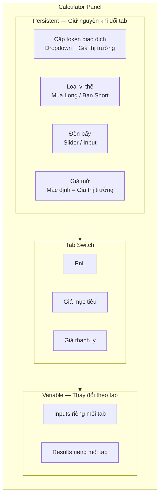
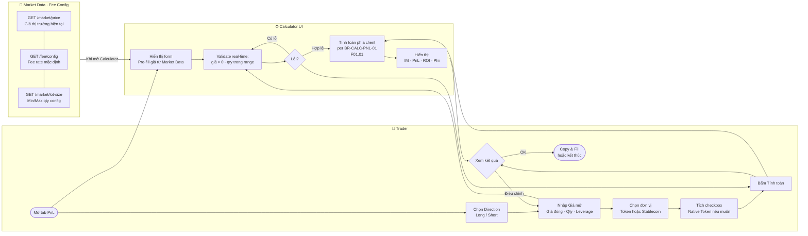
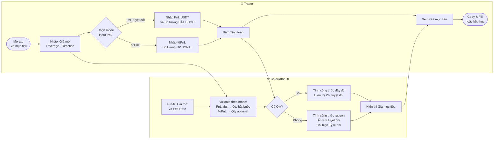
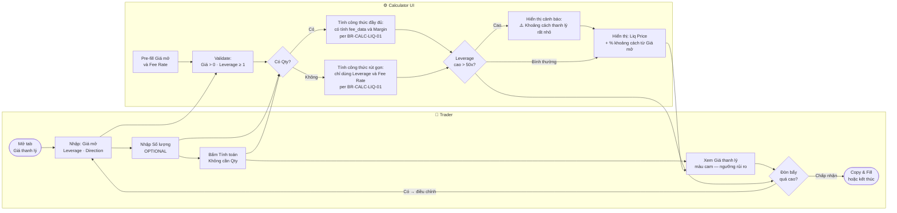
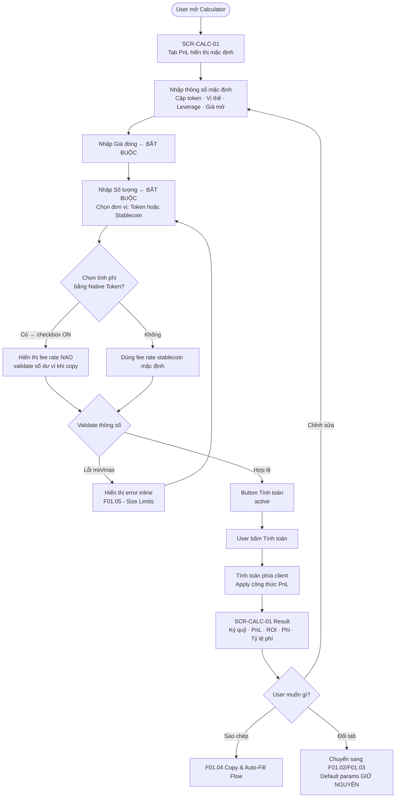
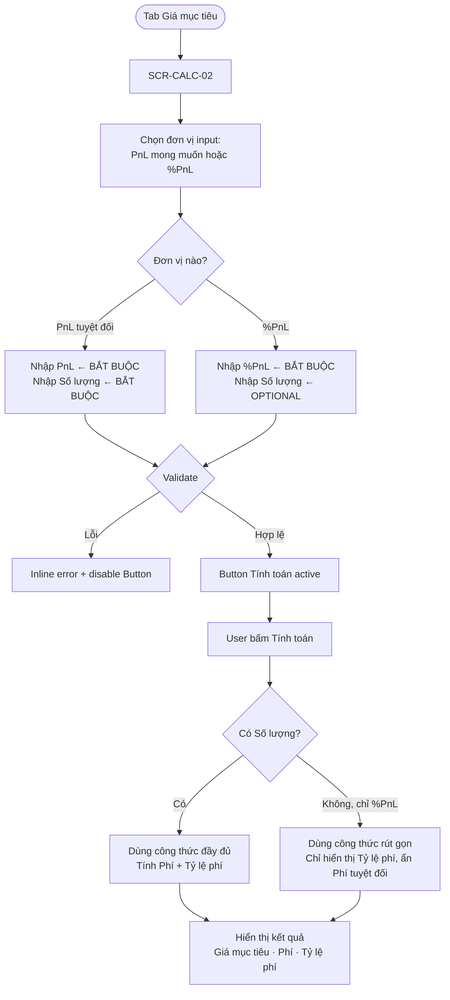
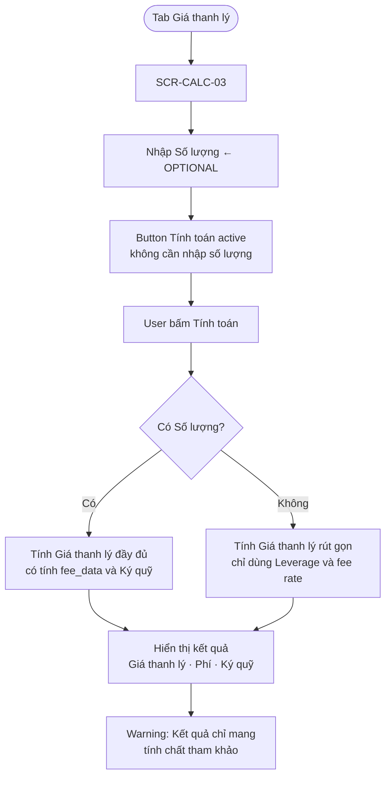
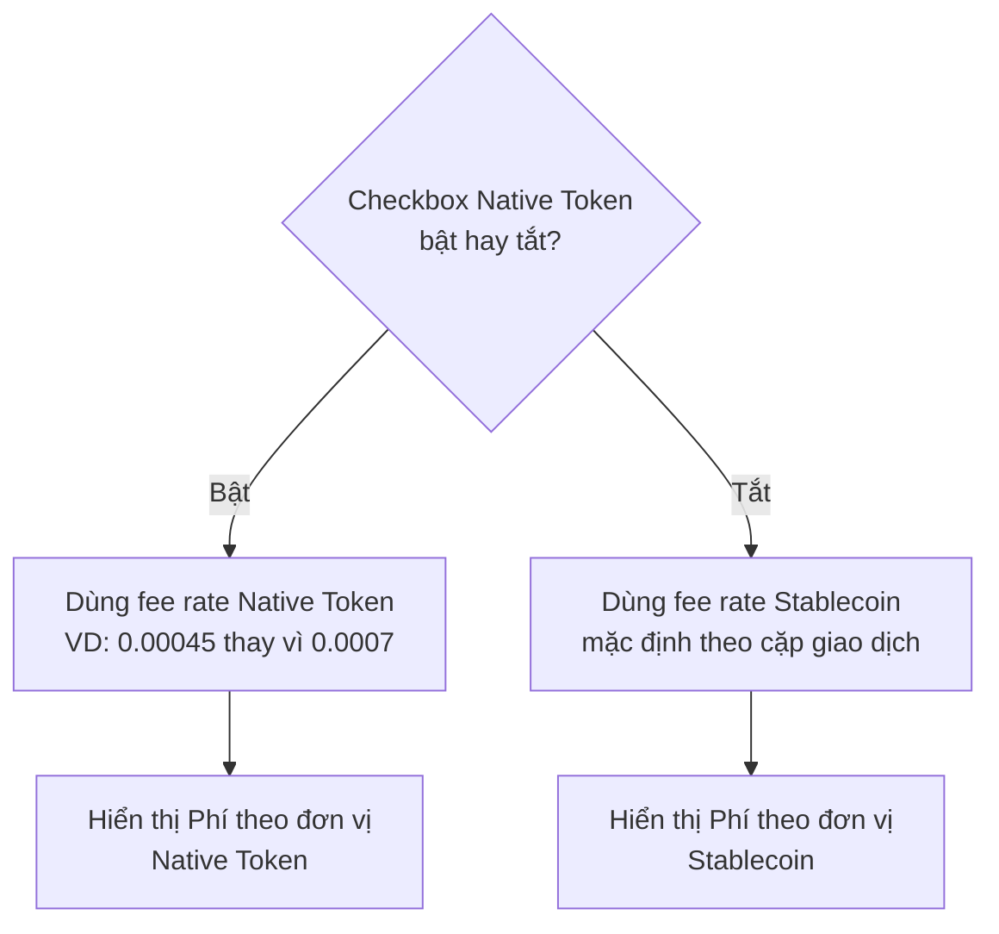

# PRD: Calculator Engine

<Info>
  **Document ID:** PRD-FUTURES-CALC-001 · **Module:** Calculator Core  
  **Features:** F01.01 (PnL) · F01.02 (Target Price) · F01.03 (Liquidation Price) · F01.05 (Size Limits) · F01.06 (Qty/Volume Toggle)
</Info>

---

## 1. Tổng quan Module

Ba loại calculator chia sẻ cùng một UI panel với cấu trúc 2 phần:

- **Phần thông số mặc định (Persistent Section):** Cặp token, Loại vị thế, Đòn bẩy, Giá mở — **không reset khi chuyển tab**
- **Phần thông số biến động (Variable Section):** Khác nhau theo từng loại tính toán



---

## 2. Danh sách màn hình

| Screen ID | Tên màn hình | Loại | Điều kiện |
|---|---|---|---|
| SCR-CALC-01 | Calculator — PnL Tab | Calculator Panel | Default tab khi mở |
| SCR-CALC-02 | Calculator — Target Price Tab | Calculator Panel | User chọn tab "Giá mục tiêu" |
| SCR-CALC-03 | Calculator — Liquidation Price Tab | Calculator Panel | User chọn tab "Giá thanh lý" |
| SCR-CALC-04 | Size Validation — Error State | Inline | Khi số lượng vượt min/max |
| SCR-CALC-05 | Tutorial — Feature Introduction | Overlay | Lần đầu truy cập Futures |
| SCR-CALC-06 | Tutorial — Calculator Step Guide | Modal/Tooltip | Lần đầu mở Calculator |

---

## 3. Swim Lane Diagrams (BPMN)

Các sơ đồ swim lane mô tả **ai làm gì** trong mỗi luồng tính toán — phân biệt rõ trách nhiệm giữa Trader, Calculator UI và Backend Services.

### 3.1 Flow A — PnL Calculator



### 3.2 Flow B — Target Price Calculator



### 3.3 Flow C — Liquidation Price Calculator



---

## 4. User Flows

### 4.1 Flow A — PnL Calculator (F01.01)



### 4.2 Flow B — Target Price Calculator (F01.02)



### 4.3 Flow C — Liquidation Price Calculator (F01.03)



---

## 5. Screen Specifications

### SCR-CALC-01 — Tab PnL

```
┌─────────────────────────────────────────┐
│  Bảng tính Futures                   [✕]│
│                                         │
│  ┌──────────────────────────────────┐   │
│  │ BTC/USDT    ▼    43,250.00 USDT  │   │  ← Dropdown + Giá thị trường
│  └──────────────────────────────────┘   │
│                                         │
│  [  PnL  ]  [ Giá mục tiêu ]  [ Giá TL ]│  ← Tab bar
│  ─────────────────────────────────────  │
│                                         │
│  ── THÔNG SỐ MẶC ĐỊNH ─────────────── ─│
│  Loại vị thế    [  MUA  ]  [  BÁN  ]   │
│  Đòn bẩy              [  10x  ▾  ]      │
│  Giá mở          [ 43,250  ] USDT       │  ← default = thị trường
│                                         │
│  ── THÔNG SỐ PnL ───────────────────── │
│  Giá đóng        [ _______ ] USDT  *    │
│  Số lượng        [ _______ ] [BTC▾] *   │  ← toggle BTC/USDT
│                                         │
│  ┌─ ☑ Sử dụng Native Token làm phí ──┐  │
│  │  Được giảm 40% phí giao dịch       │  │
│  └────────────────────────────────────┘  │
│                                         │
│         [      Tính toán      ]         │
│                                         │
│  ── KẾT QUẢ ────────────────────────── │
│  Ký quỹ ban đầu              5,000 USDT │
│  PnL (đã bao gồm phí)     +2,350 USDT  │  ← màu xanh nếu dương
│  ROI                          +47.0%    │
│  Phí                           50 USDT  │
│  Tỷ lệ phí                      0.10%  │
│                                         │
│  ⚠ Kết quả chỉ mang tính tham khảo    │
│         [   Sao chép thông số   ]       │
└─────────────────────────────────────────┘
```

| Component | Loại | Nội dung | Hành vi |
|---|---|---|---|
| Pair Dropdown | Dropdown | Cặp token + Giá thị trường hiện tại | Chọn → market data cập nhật; link sang màn Order của cặp đó |
| Tab Bar | Segmented Control | PnL / Giá mục tiêu / Giá thanh lý | Switch tab giữ nguyên Default Section |
| Loại vị thế | Toggle Button | MUA (Long) / BÁN (Short) | Đổi dấu trong công thức |
| Đòn bẩy | Dropdown hoặc Slider | 1x → max leverage theo cặp | Cập nhật kết quả |
| Giá mở | Numeric input | Default = Giá thị trường | Editable; user có thể nhập giá khác |
| Giá đóng | Numeric input | Bắt buộc | Validate > 0 |
| Số lượng | Numeric input + Unit toggle | BTC (token) hoặc USDT (stablecoin) | Validate min/max per LOT_SIZE config |
| Native Token checkbox | Checkbox | "Sử dụng Native Token làm phí" | Đổi công thức tính phí |
| Tính toán | Primary button | Disabled khi input invalid | Chạy công thức phía client |
| Kết quả PnL | Text (colored) | Dương → xanh / Âm → đỏ | — |
| Sao chép thông số | Secondary button | Copy & fill vào Order Form | F01.04 flow |

---

### SCR-CALC-02 — Tab Giá mục tiêu

```
┌─────────────────────────────────────────┐
│  Bảng tính Futures                   [✕]│
│  ...Tab bar... (Giá mục tiêu đang chọn)  │
│  ── THÔNG SỐ MẶC ĐỊNH ─────────────── ─│
│  (Giống SCR-CALC-01 — giữ nguyên giá trị)│
│                                         │
│  ── THÔNG SỐ GIÁ MỤC TIÊU ─────────── │
│  Lợi nhuận mong muốn                    │
│  [ __________ ] [ %PnL ▾ ]  *           │  ← chọn: %PnL / USDT / VNST
│                                         │
│  Số lượng                               │
│  [ __________ ] [BTC▾]                  │  ← Optional nếu nhập %PnL
│                                         │
│  ┌─ ☑ Sử dụng Native Token làm phí ──┐  │
│  └────────────────────────────────────┘  │
│         [      Tính toán      ]         │
│                                         │
│  ── KẾT QUẢ ────────────────────────── │
│  Giá mục tiêu                46,500 USDT│
│  Phí                           75 USDT  │  ← ẩn nếu không nhập Số lượng
│  Tỷ lệ phí                      0.10%  │  ← luôn hiển thị
│                                         │
│  ⚠ Kết quả chỉ mang tính tham khảo    │
│         [   Sao chép thông số   ]       │
└─────────────────────────────────────────┘
```

| Component | Loại | Điều kiện | Ghi chú |
|---|---|---|---|
| PnL mong muốn | Numeric input + Unit | Bắt buộc | Cho phép âm/dương trên Web; Mobile chỉ dương |
| Đơn vị PnL | Dropdown | `%PnL` / `USDT` / `VNST` | Nếu chọn %PnL → Số lượng optional |
| Số lượng | Numeric input | Optional khi %PnL; Bắt buộc khi PnL tuyệt đối | > 0 khi nhập |
| Kết quả Phí | Text | Chỉ hiển thị khi có Số lượng | Ẩn nếu không có qty |
| Tỷ lệ phí | Text | Luôn hiển thị | Không phụ thuộc Số lượng |

---

### SCR-CALC-03 — Tab Giá thanh lý

```
┌─────────────────────────────────────────┐
│  Bảng tính Futures                   [✕]│
│  ...Tab bar... (Giá thanh lý đang chọn) │
│  ── THÔNG SỐ MẶC ĐỊNH ─────────────── ─│
│  (Giống SCR-CALC-01 — giữ nguyên giá trị)│
│                                         │
│  ── THÔNG SỐ GIÁ THANH LÝ ─────────── │
│  Số lượng                               │
│  [ __________ ] [BTC▾]                  │  ← OPTIONAL
│                                         │
│         [      Tính toán      ]         │  ← Không cần Số lượng
│                                         │
│  ── KẾT QUẢ ────────────────────────── │
│  Giá thanh lý                38,900 USDT│  ← màu cam (warning)
│  Ký quỹ ban đầu               5,000 USDT│
│  Phí                           50 USDT  │
│                                         │
│  ⚠ Kết quả chỉ mang tính tham khảo    │
│         [   Sao chép thông số   ]       │
└─────────────────────────────────────────┘
```

<Note>
  Giá thanh lý được highlight màu cam để nhấn mạnh đây là ngưỡng rủi ro quan trọng. Kết quả cần hiển thị nổi bật hơn so với các kết quả khác.
</Note>

---

## 6. Công thức tính toán (Calculation Engine)

<Warning>
  Tất cả công thức được tính **phía client (frontend)**. Không có API call cho việc tính toán. Server chỉ cung cấp: `fee_rate`, giá thị trường, và LOT_SIZE config.
</Warning>

### 5.1 Ký hiệu & Quy ước

| Ký hiệu | Ý nghĩa | Đơn vị |
|---|---|---|
| `P_open` | Giá mở vị thế | Stablecoin / token |
| `P_close` | Giá đóng vị thế | Stablecoin / token |
| `P_target` | Giá mục tiêu | Stablecoin / token |
| `P_liq` | Giá thanh lý | Stablecoin / token |
| `Size` | Số lượng token | Token |
| `L` | Leverage (đòn bẩy) | Số nguyên |
| `f` | Fee rate (tổng phí mở + đóng) | Thập phân (VD: 0.001) |
| `IM` | Initial Margin (Ký quỹ ban đầu) | Stablecoin |
| `[±]` | `+` với Long, `−` với Short | — |

**Quy đổi Số lượng từ input:**
```
Nếu user nhập token:      Size = Số_lượng_nhập
Nếu user nhập stablecoin: Size = Số_lượng_nhập / P_open
```

**Initial Margin:**
```
IM = Size × P_open / L
   = Stablecoin_nhập / L   (nếu user nhập stablecoin)
```

---

### 5.2 F01.01 — Công thức PnL Calculator

**%Profit (Tỷ lệ lợi nhuận trên vốn gốc):**

| Vị thế | Công thức |
|---|---|
| Long | `%Profit = +L × [P_close × (1 − f) − P_open × (1 + f)] / P_open` |
| Short | `%Profit = −L × [P_close × (1 − f) − P_open × (1 + f)] / P_open` |

**PnL tuyệt đối (đơn vị stablecoin):**

| Vị thế | Công thức |
|---|---|
| Long | `PnL = +(Size × (P_close − P_open) − Size × P_close × f − Size × P_open × f)` |
| Short | `PnL = −(Size × (P_close − P_open) − Size × P_close × f − Size × P_open × f)` |

**Phí giao dịch:**

| Phí theo | Công thức |
|---|---|
| Stablecoin | `Fee = Size × P_open × f + Size × P_close × f` |
| Native Token | `Fee_native = Fee_stablecoin / Price_NativeToken_Stablecoin` |

**ROI (Return on Initial Margin):**
```
ROI = PnL / IM × 100%
```

---

### 5.3 F01.02 — Công thức Target Price Calculator

**Trường hợp có nhập Số lượng (Size > 0):**

| Vị thế | Công thức |
|---|---|
| Long | `P_target = (PnL + P_open × (Size + Size × f)) / (Size − Size × f)` |
| Short | `P_target = (−PnL + P_open × (Size − Size × f)) / (Size + Size × f)` |

**Trường hợp nhập %PnL, KHÔNG có Số lượng:**

| Vị thế | Công thức |
|---|---|
| Long | `P_target = [(%PnL / 100) × (P_open / L) + P_open × (1 + f)] / (1 − f)` |
| Short | `P_target = [−(%PnL / 100) × (P_open / L) + P_open × (1 − f)] / (1 + f)` |

<Note>
  Khi không có Số lượng: kết quả **không hiển thị trường Phí tuyệt đối**, chỉ hiển thị **Tỷ lệ phí** (vì không đủ dữ liệu để tính phí cụ thể).
</Note>

---

### 5.4 F01.03 — Công thức Liquidation Price Calculator

**Trường hợp có nhập Số lượng (Size > 0):**

| Vị thế | Công thức |
|---|---|
| Long | `P_liq = (Size × P_open + fee_data − IM) / (Size × (1 − f))` |
| Short | `P_liq = (−Size × P_open + fee_data + IM) / (Size × (1 + f))` |

Trong đó `fee_data = Size × P_open × f` (phí tại thời điểm mở lệnh)

**Trường hợp không có Số lượng (Size = 0):**

| Vị thế | Công thức |
|---|---|
| Long | `P_liq = P_open × (1 + f − 1/L) / (1 − f)` |
| Short | `P_liq = P_open × (1 − f + 1/L) / (1 + f)` |

---

### 5.5 Fee Rate — Logic chọn loại tài sản



---

## 7. F01.05 — Size Validation (Min/Max)

### Logic lấy giới hạn

```
Nguồn 1 (ưu tiên): LOT_SIZE config từ hệ thống
  → min_qty, max_qty (đơn vị token)
  → min_notional, max_notional (đơn vị stablecoin)

Nguồn 2 (fallback khi không có config):
  → VNST pair: min_notional = 100,000 VNST
  → USDT pair: min_notional = 5 USDT
```

### Hiển thị lỗi

| Điều kiện | Message (Nhập Token) | Message (Nhập Stablecoin) |
|---|---|---|
| Nhập < min | "Số lượng tối thiểu là {min_qty} {token}" | "Khối lượng tối thiểu là {min_notional} {stablecoin}" |
| Nhập > max | "Số lượng tối đa là {max_qty} {token}" | "Khối lượng tối đa là {max_notional} {stablecoin}" |

**Behavior khi lỗi size:**
- Inline error xuất hiện ngay dưới field
- Button "Tính toán" bị disabled
- Không thể tính toán cho đến khi sửa lỗi

---

## 8. F01.06 — Quantity / Volume Toggle

Khi user chọn đơn vị nhập tại ô Số lượng:

| User chọn | Label ô nhập | Label lỗi min/max |
|---|---|---|
| Token (VD: BTC) | "Số lượng" | "Số lượng tối đa / tối thiểu là..." |
| Stablecoin (VD: USDT) | "Khối lượng" | "Khối lượng tối đa / tối thiểu là..." |

**Default:** Giao diện mặc định hiển thị là **Khối lượng** (nhập theo Stablecoin).

---

## 9. Validation Rules

| Rule ID | Field | Điều kiện vi phạm | Thông báo | Trigger |
|---|---|---|---|---|
| VAL-CALC-01 | Giá đóng (PnL tab) | Rỗng | "Vui lòng nhập Giá đóng" | On submit |
| VAL-CALC-02 | Giá đóng | ≤ 0 | "Giá đóng phải lớn hơn 0" | On blur |
| VAL-CALC-03 | Số lượng | ≤ 0 khi nhập | "Số lượng phải lớn hơn 0" | On blur |
| VAL-CALC-04 | Số lượng | < min_qty hoặc < min_notional | Xem F01.05 | On blur + On submit |
| VAL-CALC-05 | Số lượng | > max_qty hoặc > max_notional | Xem F01.05 | On blur + On submit |
| VAL-CALC-06 | PnL mong muốn (Target tab) | Rỗng | "Vui lòng nhập PnL mong muốn" | On submit |
| VAL-CALC-07 | PnL mong muốn | Không phải số | "Chỉ nhập số" | On input |
| VAL-CALC-08 | Số lượng (Target tab, chọn PnL) | Rỗng khi đơn vị là PnL tuyệt đối | "Số lượng là bắt buộc khi nhập PnL" | On submit |
| VAL-CALC-09 | Giá mở | ≤ 0 | "Giá mở phải lớn hơn 0" | On blur |
| VAL-CALC-10 | %PnL (Mobile) | Âm | "Vui lòng nhập số dương" | On input |
| VAL-CALC-11 | Mọi trường | Không phải số | "Chỉ được nhập số" | On input |

---

## 9. Business Rules

| ID | Rule | Áp dụng tại |
|---|---|---|
| BR-CALC-01 | **Persistent Default Params:** Cặp token, Loại vị thế, Đòn bẩy, Giá mở KHÔNG reset khi user chuyển giữa 3 tab | Calculator Panel — Tab switch |
| BR-CALC-02 | **Giá mở mặc định = Giá thị trường** tại thời điểm mở Calculator; user có thể override bằng cách nhập tay | SCR-CALC-01/02/03 |
| BR-CALC-03 | **Kết quả tính toán chỉ mang tính tham khảo** — không phải cam kết về lợi nhuận; hiển thị disclaimer rõ ràng dưới kết quả | Result Section |
| BR-CALC-04 | **Tính toán phía client** — không gọi API khi tính; data đầu vào (fee_rate, giá) được fetch trước khi user nhập | Calculator Service |
| BR-CALC-05 | **PnL có thể âm** (lỗ) — không giới hạn chiều âm kết quả; hiển thị màu đỏ khi PnL < 0 | Result display |
| BR-CALC-06 | **Mobile: PnL/%PnL chỉ nhập dương** — chiều âm/dương được xác định bởi vị thế (Long/Short) | VAL-CALC-10 |
| BR-CALC-07 | **Web: PnL/%PnL cho phép âm** — user muốn tính "cần bán ở giá nào để chỉ lỗ X%" | Target Price Web |
| BR-CALC-08 | **Chọn cặp token → chuyển sang màn Order của cặp đó** tại Futures Trading Module | Pair Dropdown action |
| BR-CALC-09 | **Số lượng OPTIONAL trong Liquidation tab** — tính toán vẫn chạy mà không cần qty; dùng công thức rút gọn | SCR-CALC-03 |
| BR-CALC-10 | **Số lượng OPTIONAL trong Target Price tab (chỉ khi nhập %PnL)** — bắt buộc khi nhập PnL tuyệt đối | SCR-CALC-02 |
| BR-CALC-11 | **Khi không có Số lượng (Target Price tab)**: ẩn trường Phí, chỉ hiển thị Tỷ lệ phí | Result display |
| BR-CALC-12 | **Không cần đăng nhập** để sử dụng Calculator và xem kết quả | Authentication gate |
| BR-CALC-13 | **Fee rate lấy từ config mặc định** của hệ thống (không tính user-specific tier cho calculator) | Fee Engine |

---

## 10. API Summary

| Method | Endpoint | Mô tả | Auth | Khi gọi |
|---|---|---|---|---|
| GET | `/market/price/{pair}` | Giá thị trường hiện tại của cặp giao dịch | Public | Khi mở Calculator; khi chọn cặp khác |
| GET | `/fee/config?pair={pair}&type=futures` | Fee rate mặc định cho cặp giao dịch | Public / JWT | Khi mở Calculator |
| GET | `/market/lot-size/{pair}` | Min/max size config (LOT_SIZE) | Public | Khi chọn cặp giao dịch |
| GET | `/market/price/native-token` | Giá Native Token / Stablecoin | Public | Khi checkbox Native Token bật |

<Note>
  **Không có API call nào cho việc tính toán.** Toàn bộ công thức PnL, Target Price, Liquidation Price được thực hiện phía client. API chỉ cung cấp dữ liệu đầu vào.
</Note>

---

## 11. Error Codes (API Errors)

| Code | HTTP | Hiển thị user | Ghi chú dev |
|---|---|---|---|
| `CALC_001` | 503 | "Không lấy được giá thị trường. Vui lòng thử lại." | Market data API timeout; retry 3 lần trước khi hiển thị |
| `CALC_002` | 503 | "Không lấy được thông tin phí. Dùng phí mặc định." | Fee config API fail; fallback về fee hardcode |
| `CALC_003` | 503 | "Không lấy được giới hạn vị thế. Nhập thủ công." | LOT_SIZE API fail; disable min/max validation tạm thời |
| `CALC_004` | 400 | "Cặp giao dịch này tạm thời không khả dụng." | Pair bị delisted hoặc maintenance |

---

## 12. Edge Cases

| Trường hợp | Xử lý |
|---|---|
| Leverage = 1x, tính Liquidation Price | P_liq rất xa P_open (gần 0 với Long, rất cao với Short) — hiển thị bình thường, không cần warning thêm |
| PnL âm lớn hơn Initial Margin (lý thuyết vượt 100% thua lỗ) | Hiển thị kết quả; thêm note "Vị thế sẽ bị thanh lý trước khi đạt mức lỗ này" nếu PnL < −IM |
| Giá đóng = Giá mở | PnL = −phí (âm); ROI âm — hiển thị bình thường |
| Số lượng rất nhỏ dẫn đến phí > PnL | Hiển thị bình thường; kết quả âm thể hiện thua phí |
| Giá thị trường thay đổi trong khi user đang nhập | Giá mở đã được nhập thủ công hoặc snapshot → không tự cập nhật kết quả; chỉ cập nhật lần tiếp theo user bấm "Tính toán" |
| Pair bị remove khỏi danh sách trong khi Calculator đang mở | Giữ nguyên giá trị đã nhập; hiển thị warning "Cặp này không còn khả dụng"; disable "Tính toán" |
| Kết quả Giá mục tiêu âm (PnL > vốn hoàn toàn) | Hiển thị kết quả âm; thêm note "Vị thế sẽ bị thanh lý trước khi đạt mức lợi nhuận này" |
| Fee Rate = 0 (VIP tier không phí) | Công thức vẫn đúng (f = 0); Fee = 0; PnL = PnL thuần không phí |

---

## 13. Non-Functional Requirements (NFR)

### Performance

| Chỉ số | Target | Ghi chú |
|---|---|---|
| Tính toán (client-side) | < 50ms | Không có network call; pure JS math |
| Market price API | P95 < 300ms | WebSocket preferred; fallback REST |
| Fee config API | P95 < 200ms | Cache 60 giây; ít thay đổi |
| LOT_SIZE config | Cache 5 phút | Static-like data |
| Calculator panel open | P95 < 200ms | Panel animation + data đã cached |

### Chính xác tính toán (Accuracy)

| Yêu cầu | Chi tiết |
|---|---|
| Precision | Dùng BigDecimal / Decimal.js — không dùng float natively (floating point error) |
| Làm tròn | PnL, Phí: làm tròn 2 chữ số thập phân; Giá: theo precision của cặp giao dịch |
| Edge cases số học | Tránh chia cho 0: kiểm tra Leverage > 0, Size > 0, denominator ≠ 0 trước khi tính |

### UX / Accessibility

| Yêu cầu | Chi tiết |
|---|---|
| Responsive | Mobile + Web cùng một logic; mobile chỉ hạn chế PnL âm |
| Keyboard | Tab focus đúng thứ tự trên Web; numeric keyboard trên Mobile |
| Color coding | PnL dương = xanh (#16a34a); PnL âm = đỏ (#dc2626); Liquidation = cam (#ea580c) |
| Disclaimer | Luôn hiển thị "Kết quả chỉ mang tính tham khảo" dưới results section |
