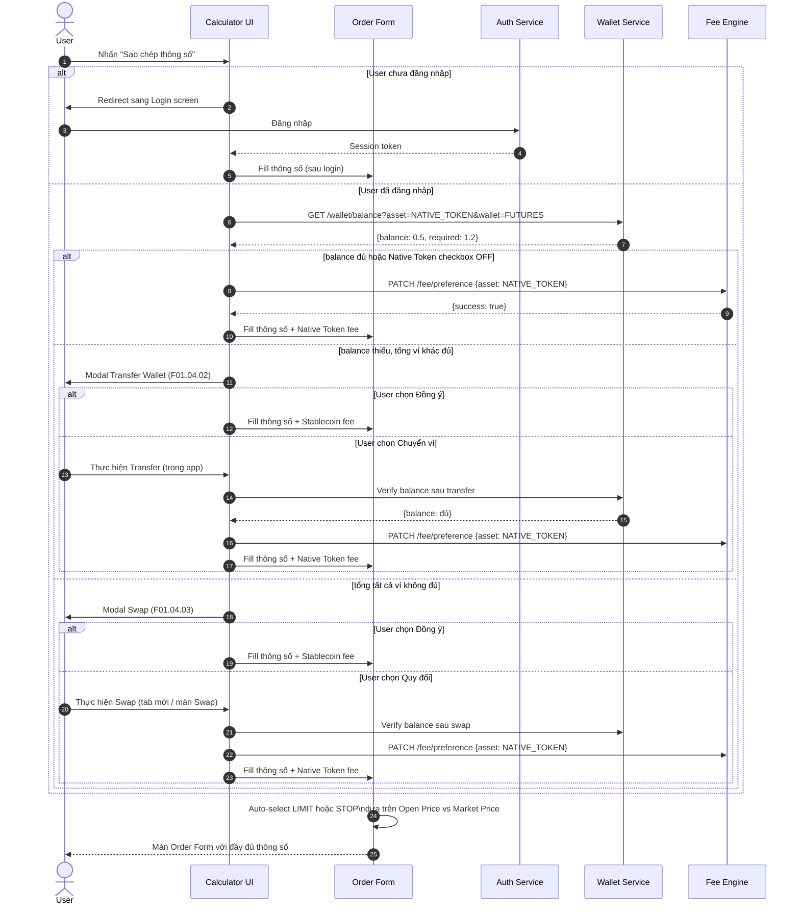

# PRD: Copy & Fill — Fee Handling — Onboarding

<Info>
  **Document ID:** PRD-FUTURES-CALC-001 · **Module:** Copy & Fill + Fee Management + Tutorial  
  **Features:** F01.04.01 (Copy & Fill) · F01.04.02 (Transfer Wallet) · F01.04.03 (Swap) · F01.07 (Intro) · F01.08 (Tutorial)
</Info>

---

## 1. F01.04.01 — Sao chép & Tự động điền thông số

### 1.1 Mô tả tính năng

Sau khi tính toán xong, user nhấn **"Sao chép thông số"** — hệ thống tự động điền toàn bộ các thông số vừa tính vào các ô tương ứng trên màn **Order Form Futures** (không cần nhập tay).

### 1.2 User Flow

```mermaid
flowchart TD
    A([User nhấn\n"Sao chép thông số"]) --> B{User đã\nđăng nhập?}
    B -- Chưa --> C[Copy thông số nhưng\nhiển thị màn Login\nSau login: redirect về Order Form đã filled]
    B -- Đã --> D{Kiểm tra trạng thái\nfee token}
    D -- Native Token checkbox OFF --> E[Fill trực tiếp\nvào Order Form]
    D -- Native Token checkbox ON --> F{Số dư Futures Wallet\nNative Token đủ?}
    F -- Đủ --> G[Cập nhật fee preference\n= Native Token\nFill vào Order Form]
    F -- Thiếu → Ví khác đủ --> H[F01.04.02\nModal Transfer Wallet]
    F -- Thiếu → Toàn bộ ví không đủ --> I[F01.04.03\nModal Swap]
    G & E --> J[Order Form đã filled\nAuto-select order type\nLIMIT hoặc STOP]
    H & I --> K{User chọn}
    K -- Đồng ý dùng Stablecoin --> L[Đổi fee về Stablecoin\nFill vào Order Form]
    K -- Transfer / Swap --> M[Màn Transfer / Swap\nthực hiện xong → quay lại]
    M --> J
    L --> J
    J --> N[Hiển thị Order Form\nvới thông số đã điền đầy đủ]
    C --> N
```

### 1.3 Mapping thông số

| Thông số từ Calculator | Điền vào Order Form | Ghi chú |
|---|---|---|
| Cặp token | Cặp giao dịch | — |
| Loại vị thế (Long/Short) | Buy / Sell | — |
| Đòn bẩy | Leverage | — |
| Giá mở | Price (Giá lệnh) | Xác định LIMIT hoặc STOP (xem BR-COPY-04) |
| Số lượng | Quantity | Trống nếu user chưa nhập trong Calculator |
| Fee token preference | Tài sản thanh toán phí | Đồng bộ với setting mặc định |

### 1.4 Auto-select Order Type (LIMIT / STOP)

Hệ thống tự động chọn loại lệnh dựa trên quan hệ giữa **Giá mở (Open Price)** và giá thị trường hiện tại:

```
LowerBound = Giá thị trường × (1 − tỷ lệ giảm cho phép)
UpperBound = Giá thị trường × (1 + tỷ lệ tăng cho phép)
```

| Vị thế | Điều kiện | Loại lệnh |
|---|---|---|
| **Long (Buy)** | `LowerBound ≤ Open Price ≤ Giá TT` | LIMIT |
| **Long (Buy)** | `Giá TT < Open Price ≤ UpperBound` | STOP |
| **Short (Sell)** | `Giá TT ≤ Open Price ≤ UpperBound` | LIMIT |
| **Short (Sell)** | `LowerBound ≤ Open Price < Giá TT` | STOP |

<Note>
  Nếu giá mở nằm ngoài cả hai ngưỡng (quá xa giá thị trường), hệ thống không tự chọn loại lệnh — để ô Type trống và hiển thị warning cho user tự chọn.
</Note>

### 1.5 Hành vi sau khi fill

| Tình huống | Hành vi |
|---|---|
| User chuyển loại lệnh (Market / Limit / Stop) sau khi fill | Xóa toàn bộ thông số đã fill; reset về trạng thái mặc định |
| User chưa nhập Số lượng trong Calculator | Ô Quantity trên Order Form để trống |
| User chưa đăng nhập khi copy | Hệ thống vẫn cho copy; hiển thị Login screen; sau login fill vào Order Form |
| Stablecoin balance không đủ sau khi fill | Hiển thị `Khối lượng = 0` như thông thường trên Order Form |

---

## 2. F01.04.02 — Chuyển ví bổ sung Native Token

### 2.1 Trigger điều kiện

```
Điều kiện kích hoạt Modal Transfer Wallet:
  • User đã chọn tính phí bằng Native Token (checkbox ON)
  • Số dư Native Token trong Futures Wallet < Phí cần thiết
  • Tổng số dư Native Token trên TẤT CẢ các ví KHÁC ≥ Phí cần thiết
```

### 2.2 Screen Specification

```
┌──────────────────────────────────────┐
│                                      │
│    ⚠  Số dư Native Token chưa đủ    │
│                                      │
│  Số dư Futures Wallet:  0.5 TOKEN   │
│  Phí cần thiết:         1.2 TOKEN   │
│                                      │
│  Bạn có Native Token trong ví khác.  │
│  Chuyển sang ví Futures để tiếp tục │
│  trả phí bằng Native Token.          │
│                                      │
│  ┌────────────────┐  ┌────────────┐  │
│  │    Đồng ý      │  │ Chuyển ví  │  │
│  │ (dùng Stablecoin) │  │           │  │
│  └────────────────┘  └────────────┘  │
└──────────────────────────────────────┘
```

| Lựa chọn | Hành vi |
|---|---|
| **Đồng ý** | Đóng modal; sử dụng Stablecoin làm phí; fill vào Order Form bình thường |
| **Chuyển ví** | Web: Mở modal Transfer Wallet tại chỗ; Mobile: Navigate sang màn Transfer Wallet — **thông số đã fill KHÔNG bị mất** khi quay lại |

### 2.3 Hành vi sau khi Transfer thành công

- User thực hiện transfer xong → hệ thống kiểm tra lại số dư
- Nếu đủ → fill Order Form với Native Token fee preference
- Nếu vẫn chưa đủ → hiển thị lại modal với balance mới

---

## 3. F01.04.03 — Quy đổi sang Native Token

### 3.1 Trigger điều kiện

```
Điều kiện kích hoạt Modal Swap:
  • User đã chọn tính phí bằng Native Token (checkbox ON)
  • Số dư Native Token trong Futures Wallet < Phí cần thiết
  • Tổng số dư Native Token trên TẤT CẢ các ví < Phí cần thiết
    (Người dùng không có đủ Native Token ở bất kỳ đâu)
```

### 3.2 Screen Specification

```
┌──────────────────────────────────────┐
│                                      │
│    ⚠  Không đủ Native Token          │
│                                      │
│  Tổng số dư Native Token:   0 TOKEN │
│  Phí cần thiết:           1.2 TOKEN  │
│                                      │
│  Bạn không đủ Native Token để trả   │
│  phí. Quy đổi từ Stablecoin sang    │
│  Native Token để tiếp tục.           │
│                                      │
│  ┌────────────────┐  ┌────────────┐  │
│  │    Đồng ý      │  │  Quy đổi  │  │
│  │ (dùng Stablecoin) │  │           │  │
│  └────────────────┘  └────────────┘  │
└──────────────────────────────────────┘
```

| Lựa chọn | Hành vi |
|---|---|
| **Đồng ý** | Đóng modal; sử dụng Stablecoin làm phí; fill vào Order Form bình thường |
| **Quy đổi** | Web: Mở tab Swap trong tab mới (Stablecoin → Native Token); Mobile: Navigate sang màn Swap — **thông số đã fill KHÔNG bị mất** khi quay lại |

### 3.3 So sánh F01.04.02 vs F01.04.03

| Tiêu chí | F01.04.02 — Transfer Wallet | F01.04.03 — Swap |
|---|---|---|
| **Điều kiện** | Có Native Token ở ví khác | Không có đủ Native Token ở bất kỳ đâu |
| **Giải pháp** | Chuyển từ ví khác sang Futures Wallet | Mua Native Token bằng Stablecoin |
| **Action** | Modal "Chuyển ví" | Tab/Màn "Quy đổi" |
| **Web behavior** | Modal inline | Mở tab mới |
| **Mobile behavior** | Navigate; state preserved | Navigate; state preserved |

---

## 4. Sequence Diagram — Copy & Fill (End-to-End)



---

## 5. Business Rules — Copy & Fill

| ID | Rule | Áp dụng tại |
|---|---|---|
| BR-COPY-01 | **Không cần đăng nhập để tính toán** — nhưng phải đăng nhập để thực hiện Copy & Fill | F01.04.01 Auth gate |
| BR-COPY-02 | **Chuyển loại lệnh sau khi fill → reset toàn bộ thông số** — hành vi giống khi chuyển lệnh thông thường | Order Form |
| BR-COPY-03 | **Số lượng trống trong Calculator → ô Quantity trống trong Order Form** — không điền 0, không điền giá trị mặc định | F01.04.01 mapping |
| BR-COPY-04 | **Auto-select LIMIT/STOP** dựa trên vị thế (Long/Short) và quan hệ Open Price vs Market Price; nếu ngoài bounds thì không tự chọn | F01.04.01 → Order Form |
| BR-COPY-05 | **Đồng bộ fee preference:** Khi user submit Copy với Native Token → fee preference mặc định của user được cập nhật thành Native Token; với Stablecoin → cập nhật thành Stablecoin | Fee Engine |
| BR-COPY-06 | **Fee preference update chỉ khi Submit "Sao chép thông số"** — không update khi chỉ bật/tắt checkbox trong Calculator | F01.04.01 trigger |
| BR-COPY-07 | **Mobile: State preserved khi navigate ra ngoài** — sau khi Transfer/Swap xong và quay lại, Order Form vẫn giữ nguyên thông số đã fill | Mobile navigation |
| BR-COPY-08 | **Thứ tự kiểm tra fee token:** (1) Check balance Futures Wallet; (2) nếu thiếu → check tổng tất cả ví; (3) nếu tổng ví đủ → Transfer modal; (4) nếu không đủ → Swap modal | F01.04.02/03 |

---

## 6. Business Rules — Fee Token Management

| ID | Rule | Áp dụng tại |
|---|---|---|
| BR-FEE-01 | **Không đủ Native Token nhưng đồng ý dùng Stablecoin** → hệ thống sử dụng stablecoin của cặp giao dịch đó; số lượng trong kết quả có thể khác với kết quả đã tính (vì fee rate khác) | Modal flow |
| BR-FEE-02 | **Stablecoin balance = 0 sau khi fill** → hiển thị `Khối lượng = 0` như thông thường trên Order Form (không block luồng) | Order Form |
| BR-FEE-03 | **Pop-up cảnh báo Native Token** chỉ hiện 1 lần per "Sao chép thông số" action — không hiện lại nếu user đã chọn "Đồng ý" lần trước trong cùng session | Modal trigger |

---

## 7. F01.07 — Giới thiệu tính năng (Feature Introduction)

### 7.1 Mô tả

Bổ sung 1 bước mới vào Tutorial Flow của Futures Trading — giới thiệu **icon truy cập Calculator** và chức năng của nó ngay khi user lần đầu sử dụng Futures.

### 7.2 Trigger

- Hiển thị **lần đầu tiên** user truy cập màn Futures Trading (sau khi tutorial step hiện tại hoàn thành)
- Sau lần đầu: không hiển thị nữa (lưu trạng thái đã xem vào user profile/localStorage)

### 7.3 Screen Specification

```
┌─────────────────────────────────────────┐
│     [Futures Trading Screen]            │
│                                         │
│     ┌───────────────────────────────┐   │
│     │    💡 Tính năng mới!           │   │  ← Tooltip/overlay bubble
│     │                               │   │
│     │  Bảng tính Futures hỗ trợ     │   │
│     │  tính toán nhanh vị thế       │   │
│     │  Futures của bạn.             │   │
│     │                               │   │
│     │      [ Trải nghiệm ngay ]     │   │  ← Text Button dẫn vào Calculator
│     └───────────────────────────────┘   │
│                          ↑              │
│                    [Icon Calculator]    │  ← Arrow chỉ vào icon
│                                         │
└─────────────────────────────────────────┘
```

| Component | Nội dung | Action |
|---|---|---|
| Overlay/Tooltip bubble | Highlight icon Calculator với arrow | Hiển thị note |
| Note text | "Tính năng Bảng tính Futures hỗ trợ tính toán nhanh vị thế Futures của bạn." | — |
| CTA "Trải nghiệm ngay" | Text button | Mở Calculator (như click vào icon) |
| Tap outside | Bất kỳ vùng nào ngoài tooltip | Đóng tooltip; đánh dấu đã xem |

---

## 8. F01.08 — Tutorial Hướng dẫn sử dụng Calculator

### 8.1 Mô tả

Modal step-by-step hướng dẫn user các tính năng cơ bản của Calculator. Hiển thị lần đầu khi user **mở Calculator** (không phải lần đầu vào Futures).

### 8.2 Trigger

- Hiển thị lần đầu khi user tap icon Calculator để mở
- Sau lần đầu: không hiển thị (lưu flag `calculator_tutorial_seen = true`)
- Có thể xem lại qua menu "Hướng dẫn sử dụng" trong Calculator

### 8.3 Các bước Tutorial

| Step | Nội dung | Highlight element |
|---|---|---|
| 1 | "Chọn cặp token và loại vị thế (Mua/Bán) bạn muốn giao dịch" | Default Section |
| 2 | "Nhập đòn bẩy và giá mở kỳ vọng của bạn" | Leverage + Open Price fields |
| 3 | "Chọn loại tính toán: PnL, Giá mục tiêu, hoặc Giá thanh lý" | Tab bar |
| 4 | "Nhập thông số và nhấn Tính toán để xem kết quả" | Input fields + Calculate button |
| 5 | "Sau khi có kết quả, dùng 'Sao chép thông số' để điền tự động vào form đặt lệnh" | Copy button |

### 8.4 Screen Specification — Step cuối

```
┌─────────────────────────────────────────┐
│                                         │
│  Hướng dẫn sử dụng Bảng tính         │
│  ────────────────────────────           │
│                                         │
│  Bước 5/5                               │
│                                         │
│  ┌────────────────────────────────┐    │
│  │  Sau khi có kết quả tính toán, │    │
│  │  nhấn "Sao chép thông số" để  │    │
│  │  tự động điền vào màn đặt lệnh │    │
│  │  — tiết kiệm thời gian và     │    │
│  │  tránh nhập sai thông số.     │    │
│  └────────────────────────────────┘    │
│                                         │
│  ○ ○ ○ ○ ●  (step indicator)           │
│                                         │
│  [  Quay lại  ]    [  Hoàn tất  ]      │
│                                         │
└─────────────────────────────────────────┘
```

**Behavior step cuối:**
- User nhấn "Hoàn tất" → đóng tutorial; bắt đầu sử dụng Calculator
- User tap ra ngoài vùng modal → đóng tutorial; đánh dấu đã xem
- Trạng thái `calculator_tutorial_seen` được lưu ngay khi user tương tác với bất kỳ bước nào (không cần hoàn thành hết)

---

## 9. API Summary (F01.04 + F01.07 + F01.08)

| Method | Endpoint | Request | Response | Mô tả |
|---|---|---|---|---|
| GET | `/wallet/balance?asset=NATIVE_TOKEN` | — (header: JWT) | `{futures_wallet: N, other_wallets: [{wallet_id, balance}]}` | Kiểm tra số dư Native Token khi user copy & fill |
| PATCH | `/fee/preference` | `{asset: "NATIVE_TOKEN" / "STABLECOIN"}` | `{success: true}` | Cập nhật tài sản tính phí mặc định khi submit copy |
| GET | `/user/tutorial-status` | — (header: JWT) | `{futures_intro: bool, calculator_tutorial: bool}` | Kiểm tra trạng thái đã xem tutorial |
| PATCH | `/user/tutorial-status` | `{calculator_tutorial: true}` | `{success: true}` | Đánh dấu đã xem tutorial Calculator |

---

## 10. Error Codes (F01.04)

| Code | HTTP | Hiển thị user | Ghi chú dev |
|---|---|---|---|
| `COPY_001` | 401 | Redirect sang Login | User chưa đăng nhập khi copy; sau login tiếp tục fill |
| `COPY_002` | 400 | "Thông số không hợp lệ, không thể điền vào lệnh." | Validation fail phía Order Form khi nhận params |
| `COPY_003` | 503 | "Không thể cập nhật phí mặc định. Tiếp tục với stablecoin." | Fee preference API fail; fallback graceful |
| `COPY_004` | 409 | "Cặp giao dịch đã thay đổi. Vui lòng chọn lại." | Pair bị unavailable giữa lúc Calculator mở và khi copy |

---

## 11. Edge Cases

| Trường hợp | Xử lý |
|---|---|
| User copy khi Price feed đang offline | Fill thông số đã tính (snapshot); hiển thị warning "Giá thị trường hiện không khả dụng — vui lòng kiểm tra lại giá trước khi đặt lệnh" |
| User transfer xong nhưng balance Futures Wallet vẫn chưa cập nhật (latency) | Retry GET balance sau 2 giây; nếu vẫn fail → fallback về Stablecoin với notification |
| Mobile: App bị kill giữa chừng khi đang ở màn Swap | State không preserved (app crash); khi quay lại Calculator form trắng — acceptable behavior |
| User copy thông số → chuyển sang cặp khác trên Order Form | Toàn bộ thông số cũ bị xóa (hành vi chuẩn của Order Form khi đổi pair) |
| Hai tab mở Calculator cùng lúc (Web) | Mỗi tab là instance độc lập; fee preference được ghi đè bởi tab nào submit sau |
| Fee config thay đổi sau khi user đã tính toán | Kết quả đã tính dùng fee cũ; khi copy fill → Order Form dùng fee hiện tại → PnL thực tế có thể khác kết quả tính |

---

## 12. Non-Functional Requirements

### Security

| Yêu cầu | Mô tả |
|---|---|
| Fee preference update | Yêu cầu JWT hợp lệ; server validate user_id khớp với token |
| Tutorial state | Lưu phía server (không chỉ localStorage) để đồng bộ giữa devices |
| Calculator không lưu kết quả | Không persist kết quả tính toán lên server — privacy-first |

### Mobile UX

| Yêu cầu | Mô tả |
|---|---|
| State preservation | Khi navigate sang Transfer/Swap và quay lại, thông số trên Order Form không mất |
| Bottom sheet | Calculator hiển thị dạng bottom sheet trên Mobile; draggable; dismiss bằng swipe down |
| Keyboard handling | Numeric keyboard tự động focus khi vào input field; dismiss khi tap ngoài |

### Reliability

| Chỉ số | Target |
|---|---|
| Fee preference API uptime | ≥ 99.5%; fallback graceful nếu fail |
| Tutorial state sync | Eventual consistency; nếu API fail → lưu localStorage và sync khi reconnect |
