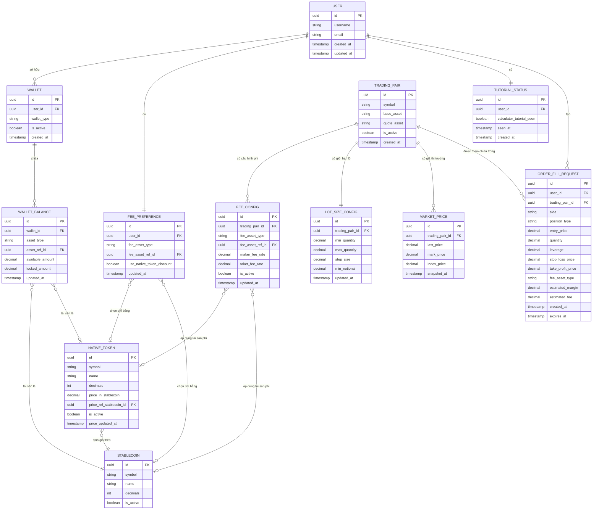

# ERD-FUTURES-CALC-001 — Entity Relationship Diagram

**Tài liệu:** ERD-FUTURES-CALC-001
**Phiên bản:** 1.0.0
**Ngày tạo:** 2026-05-26
**Trạng thái:** Draft

---

## Người đọc dự kiến

| Vai trò | Mục đích sử dụng |
|---|---|
| Database Architect | Thiết kế schema vật lý, chọn kiểu dữ liệu, đặt index |
| Backend Developer | Hiểu quan hệ giữa các entity để viết query và service layer |
| Tech Lead | Review thiết kế, phê duyệt trước khi implement |
| QA Engineer | Hiểu cấu trúc dữ liệu để viết test case và kiểm tra data integrity |

---

## Lịch sử thay đổi

| Phiên bản | Ngày | Tác giả | Mô tả |
|---|---|---|---|
| 1.0.0 | 2026-05-26 | BA Team | Khởi tạo tài liệu ERD cho Futures Position Calculator |

---

## 1. Tổng quan Data Model

Data model của Futures Position Calculator được phân thành 5 nhóm entity chính:

### 1.1 Nhóm User & Cài đặt

Quản lý thông tin người dùng và các tùy chọn cá nhân hóa liên quan đến việc sử dụng calculator.

| Entity | Mô tả |
|---|---|
| **USER** | Người dùng đăng ký trên platform |
| **FEE_PREFERENCE** | Cài đặt tài sản mặc định dùng để thanh toán phí của user |
| **TUTORIAL_STATUS** | Theo dõi trạng thái đã xem/bỏ qua tutorial của user |

### 1.2 Nhóm Ví & Số dư

Quản lý các loại ví và số dư tài sản của người dùng, phục vụ hiển thị available balance trong calculator.

| Entity | Mô tả |
|---|---|
| **WALLET** | Ví của user, phân theo loại (FUTURES, SPOT, EARN...) |
| **WALLET_BALANCE** | Số dư từng tài sản trong một ví cụ thể |

### 1.3 Nhóm Cấu hình Giao dịch

Dữ liệu tham chiếu về cặp giao dịch và các cấu hình liên quan, được dùng để validate và tính toán trong calculator.

| Entity | Mô tả |
|---|---|
| **TRADING_PAIR** | Cặp giao dịch (ví dụ: BTC/USDT, ETH/VNST) |
| **FEE_CONFIG** | Cấu hình tỷ lệ phí theo từng cặp và loại tài sản phí |
| **LOT_SIZE_CONFIG** | Giới hạn số lượng tối thiểu/tối đa/bước nhảy theo từng cặp |

### 1.4 Nhóm Tài sản

Định nghĩa các loại tài sản được sử dụng làm tài sản thế chấp và thanh toán phí.

| Entity | Mô tả |
|---|---|
| **STABLECOIN** | Tài sản stablecoin (USDT, VNST...) dùng làm margin và phí |
| **NATIVE_TOKEN** | Token nội bộ của platform, có thể dùng để giảm phí |

### 1.5 Nhóm Dữ liệu Thị trường & Ephemeral

Dữ liệu giá real-time và các entity tồn tại tạm thời trong session.

| Entity | Mô tả |
|---|---|
| **MARKET_PRICE** | Snapshot giá thị trường mới nhất của một cặp giao dịch |
| **ORDER_FILL_REQUEST** | Yêu cầu điền thông số từ calculator vào Order Form (ephemeral) |

---

## 2. ERD Diagram



---

## 3. Data Dictionary

### USER

**Mô tả:** Người dùng đã đăng ký trên platform, là trung tâm của toàn bộ data model.
**Loại:** Persistent

| Field | Kiểu | Nullable | Mô tả | Ví dụ |
|---|---|---|---|---|
| id | UUID | No | Primary key | `"a3f7c2d1-..."` |
| username | VARCHAR(50) | No | Tên hiển thị của user, unique | `"trader_nguyen"` |
| email | VARCHAR(255) | No | Email đăng nhập, unique | `"user@example.com"` |
| created_at | TIMESTAMP | No | Thời điểm tạo tài khoản | `"2025-01-15T08:00:00Z"` |
| updated_at | TIMESTAMP | No | Thời điểm cập nhật gần nhất | `"2026-05-20T14:30:00Z"` |

**Indexes:**
- `PRIMARY KEY (id)`
- `UNIQUE INDEX (email)`
- `UNIQUE INDEX (username)`

---

### WALLET

**Mô tả:** Ví của người dùng, mỗi user có thể có nhiều loại ví tương ứng với các sản phẩm khác nhau.
**Loại:** Persistent

| Field | Kiểu | Nullable | Mô tả | Ví dụ |
|---|---|---|---|---|
| id | UUID | No | Primary key | `"b1e9a4..."` |
| user_id | UUID | No | FK → USER.id | `"a3f7c2d1-..."` |
| wallet_type | VARCHAR(20) | No | Loại ví: `FUTURES`, `SPOT`, `EARN` | `"FUTURES"` |
| is_active | BOOLEAN | No | Ví có đang hoạt động không | `true` |
| created_at | TIMESTAMP | No | Thời điểm tạo ví | `"2025-01-15T08:05:00Z"` |

**Indexes:**
- `PRIMARY KEY (id)`
- `INDEX (user_id)`
- `UNIQUE INDEX (user_id, wallet_type)`

---

### WALLET_BALANCE

**Mô tả:** Số dư của một tài sản cụ thể bên trong một ví. Một ví có thể chứa nhiều loại tài sản.
**Loại:** Persistent

| Field | Kiểu | Nullable | Mô tả | Ví dụ |
|---|---|---|---|---|
| id | UUID | No | Primary key | `"c2f8b5..."` |
| wallet_id | UUID | No | FK → WALLET.id | `"b1e9a4..."` |
| asset_type | VARCHAR(20) | No | Loại tài sản: `STABLECOIN`, `NATIVE_TOKEN` | `"STABLECOIN"` |
| asset_ref_id | UUID | No | FK → STABLECOIN.id hoặc NATIVE_TOKEN.id tùy `asset_type` | `"d4a1c9..."` |
| available_amount | DECIMAL(36,18) | No | Số dư khả dụng (chưa bị khóa) | `"1500.750000"` |
| locked_amount | DECIMAL(36,18) | No | Số dư đang bị khóa trong lệnh mở | `"200.000000"` |
| updated_at | TIMESTAMP | No | Thời điểm cập nhật số dư gần nhất | `"2026-05-26T09:10:00Z"` |

**Indexes:**
- `PRIMARY KEY (id)`
- `INDEX (wallet_id)`
- `UNIQUE INDEX (wallet_id, asset_type, asset_ref_id)`
- `INDEX (asset_type, asset_ref_id)`

---

### FEE_PREFERENCE

**Mô tả:** Cài đặt của user về loại tài sản muốn dùng để thanh toán phí giao dịch theo mặc định.
**Loại:** Persistent

| Field | Kiểu | Nullable | Mô tả | Ví dụ |
|---|---|---|---|---|
| id | UUID | No | Primary key | `"e5b3d7..."` |
| user_id | UUID | No | FK → USER.id, unique | `"a3f7c2d1-..."` |
| fee_asset_type | VARCHAR(20) | No | Loại tài sản phí ưa thích: `NATIVE_TOKEN`, `STABLECOIN` | `"NATIVE_TOKEN"` |
| fee_asset_ref_id | UUID | No | FK → NATIVE_TOKEN.id hoặc STABLECOIN.id tùy `fee_asset_type` | `"f6c4e8..."` |
| use_native_token_discount | BOOLEAN | No | Bật/tắt ưu đãi giảm phí khi dùng native token | `true` |
| updated_at | TIMESTAMP | No | Thời điểm user thay đổi cài đặt gần nhất | `"2026-04-10T11:00:00Z"` |

**Indexes:**
- `PRIMARY KEY (id)`
- `UNIQUE INDEX (user_id)`

---

### TUTORIAL_STATUS

**Mô tả:** Theo dõi trạng thái user đã xem hay chưa xem tutorial của các tính năng, tránh hiển thị lại không cần thiết.
**Loại:** Persistent

| Field | Kiểu | Nullable | Mô tả | Ví dụ |
|---|---|---|---|---|
| id | UUID | No | Primary key | `"g7d5f9..."` |
| user_id | UUID | No | FK → USER.id, unique | `"a3f7c2d1-..."` |
| calculator_tutorial_seen | BOOLEAN | No | User đã xem tutorial Futures Calculator chưa | `true` |
| seen_at | TIMESTAMP | Yes | Thời điểm user xem/dismiss tutorial lần đầu | `"2026-02-20T10:30:00Z"` |
| created_at | TIMESTAMP | No | Thời điểm record được tạo | `"2025-01-15T08:05:00Z"` |

**Indexes:**
- `PRIMARY KEY (id)`
- `UNIQUE INDEX (user_id)`

---

### TRADING_PAIR

**Mô tả:** Cặp giao dịch được hỗ trợ trên platform, là entity trung tâm cho việc cấu hình phí, lot size và giá thị trường.
**Loại:** Reference Data

| Field | Kiểu | Nullable | Mô tả | Ví dụ |
|---|---|---|---|---|
| id | UUID | No | Primary key | `"h8e6ga..."` |
| symbol | VARCHAR(20) | No | Ký hiệu giao dịch, unique | `"BTCUSDT"` |
| base_asset | VARCHAR(10) | No | Tài sản gốc (tài sản mua/bán) | `"BTC"` |
| quote_asset | VARCHAR(10) | No | Tài sản định giá (đơn vị tính toán) | `"USDT"` |
| is_active | BOOLEAN | No | Cặp đang hoạt động hay bị tạm dừng | `true` |
| created_at | TIMESTAMP | No | Thời điểm cặp được thêm vào platform | `"2024-06-01T00:00:00Z"` |

**Indexes:**
- `PRIMARY KEY (id)`
- `UNIQUE INDEX (symbol)`
- `INDEX (is_active)`
- `INDEX (quote_asset)`

---

### FEE_CONFIG

**Mô tả:** Cấu hình tỷ lệ phí maker/taker cho từng cặp giao dịch theo từng loại tài sản thanh toán phí.
**Loại:** Reference Data

| Field | Kiểu | Nullable | Mô tả | Ví dụ |
|---|---|---|---|---|
| id | UUID | No | Primary key | `"i9f7hb..."` |
| trading_pair_id | UUID | No | FK → TRADING_PAIR.id | `"h8e6ga..."` |
| fee_asset_type | VARCHAR(20) | No | Loại tài sản phí áp dụng: `NATIVE_TOKEN`, `STABLECOIN` | `"NATIVE_TOKEN"` |
| fee_asset_ref_id | UUID | No | FK → NATIVE_TOKEN.id hoặc STABLECOIN.id tùy `fee_asset_type` | `"f6c4e8..."` |
| maker_fee_rate | DECIMAL(10,8) | No | Tỷ lệ phí maker (dạng thập phân) | `"0.00080000"` |
| taker_fee_rate | DECIMAL(10,8) | No | Tỷ lệ phí taker (dạng thập phân) | `"0.00100000"` |
| is_active | BOOLEAN | No | Cấu hình này đang có hiệu lực không | `true` |
| updated_at | TIMESTAMP | No | Thời điểm phí được điều chỉnh gần nhất | `"2026-01-01T00:00:00Z"` |

**Indexes:**
- `PRIMARY KEY (id)`
- `UNIQUE INDEX (trading_pair_id, fee_asset_type, fee_asset_ref_id)`
- `INDEX (trading_pair_id, is_active)`

---

### LOT_SIZE_CONFIG

**Mô tả:** Giới hạn về số lượng hợp lệ khi đặt lệnh cho từng cặp giao dịch, dùng để validate input trong calculator.
**Loại:** Reference Data

| Field | Kiểu | Nullable | Mô tả | Ví dụ |
|---|---|---|---|---|
| id | UUID | No | Primary key | `"j0g8ic..."` |
| trading_pair_id | UUID | No | FK → TRADING_PAIR.id, unique | `"h8e6ga..."` |
| min_quantity | DECIMAL(36,18) | No | Số lượng tối thiểu cho một lệnh | `"0.001"` |
| max_quantity | DECIMAL(36,18) | No | Số lượng tối đa cho một lệnh | `"1000.000"` |
| step_size | DECIMAL(36,18) | No | Bước nhảy số lượng hợp lệ | `"0.001"` |
| min_notional | DECIMAL(36,18) | No | Giá trị lệnh tối thiểu tính theo quote asset | `"5.000"` |
| updated_at | TIMESTAMP | No | Thời điểm cập nhật cấu hình | `"2026-03-15T00:00:00Z"` |

**Indexes:**
- `PRIMARY KEY (id)`
- `UNIQUE INDEX (trading_pair_id)`

---

### MARKET_PRICE

**Mô tả:** Snapshot giá thị trường mới nhất của một cặp giao dịch, phục vụ calculator tính toán margin và PnL. Không phải dữ liệu OHLCV đầy đủ.
**Loại:** Persistent (rolling — chỉ giữ bản ghi mới nhất hoặc vài phút gần nhất)

| Field | Kiểu | Nullable | Mô tả | Ví dụ |
|---|---|---|---|---|
| id | UUID | No | Primary key | `"k1h9jd..."` |
| trading_pair_id | UUID | No | FK → TRADING_PAIR.id | `"h8e6ga..."` |
| last_price | DECIMAL(36,18) | No | Giá giao dịch gần nhất | `"67850.500000"` |
| mark_price | DECIMAL(36,18) | No | Mark price dùng tính unrealized PnL và liquidation | `"67848.200000"` |
| index_price | DECIMAL(36,18) | Yes | Index price tham chiếu từ các sàn khác | `"67840.000000"` |
| snapshot_at | TIMESTAMP | No | Thời điểm snapshot được ghi nhận | `"2026-05-26T09:15:30Z"` |

**Indexes:**
- `PRIMARY KEY (id)`
- `INDEX (trading_pair_id, snapshot_at DESC)` — để query bản ghi mới nhất nhanh
- `INDEX (snapshot_at)` — cho việc cleanup dữ liệu cũ

---

### STABLECOIN

**Mô tả:** Danh mục các stablecoin được platform hỗ trợ, dùng làm margin, quote asset và thanh toán phí.
**Loại:** Reference Data

| Field | Kiểu | Nullable | Mô tả | Ví dụ |
|---|---|---|---|---|
| id | UUID | No | Primary key | `"d4a1c9..."` |
| symbol | VARCHAR(10) | No | Ký hiệu tài sản, unique | `"USDT"` |
| name | VARCHAR(50) | No | Tên đầy đủ | `"Tether USD"` |
| decimals | INT | No | Số chữ số thập phân của tài sản | `6` |
| is_active | BOOLEAN | No | Tài sản đang được hỗ trợ không | `true` |

**Indexes:**
- `PRIMARY KEY (id)`
- `UNIQUE INDEX (symbol)`
- `INDEX (is_active)`

---

### NATIVE_TOKEN

**Mô tả:** Token nội bộ của platform, có thể được dùng để thanh toán phí giao dịch với ưu đãi giảm giá. Giá được định kỳ cập nhật theo stablecoin tham chiếu.
**Loại:** Reference Data

| Field | Kiểu | Nullable | Mô tả | Ví dụ |
|---|---|---|---|---|
| id | UUID | No | Primary key | `"f6c4e8..."` |
| symbol | VARCHAR(10) | No | Ký hiệu token, unique | `"PLTF"` |
| name | VARCHAR(50) | No | Tên đầy đủ | `"Platform Token"` |
| decimals | INT | No | Số chữ số thập phân | `18` |
| price_in_stablecoin | DECIMAL(36,18) | No | Giá hiện tại của token tính theo stablecoin tham chiếu | `"0.245000"` |
| price_ref_stablecoin_id | UUID | No | FK → STABLECOIN.id — stablecoin dùng để định giá | `"d4a1c9..."` |
| is_active | BOOLEAN | No | Token đang được hỗ trợ không | `true` |
| price_updated_at | TIMESTAMP | No | Thời điểm giá token được cập nhật gần nhất | `"2026-05-26T09:00:00Z"` |

**Indexes:**
- `PRIMARY KEY (id)`
- `UNIQUE INDEX (symbol)`
- `INDEX (is_active)`

---

### ORDER_FILL_REQUEST

**Mô tả:** Yêu cầu điền thông số tính toán từ Futures Calculator vào Order Form. Entity này tồn tại tạm thời trong session và tự hết hạn sau một khoảng thời gian ngắn.
**Loại:** Ephemeral (session-scoped, có TTL)

<Warning>
Entity này **không** được lưu trữ lâu dài. Sau khi user điền xong vào Order Form hoặc sau khi hết TTL (`expires_at`), record có thể bị xóa. Không dùng entity này cho mục đích audit hay lịch sử giao dịch.
</Warning>

| Field | Kiểu | Nullable | Mô tả | Ví dụ |
|---|---|---|---|---|
| id | UUID | No | Primary key | `"l2i0ke..."` |
| user_id | UUID | No | FK → USER.id — user tạo request | `"a3f7c2d1-..."` |
| trading_pair_id | UUID | No | FK → TRADING_PAIR.id — cặp giao dịch được chọn | `"h8e6ga..."` |
| side | VARCHAR(10) | No | Chiều lệnh: `BUY`, `SELL` | `"BUY"` |
| position_type | VARCHAR(10) | No | Loại vị thế: `LONG`, `SHORT` | `"LONG"` |
| entry_price | DECIMAL(36,18) | No | Giá vào lệnh do user nhập hoặc lấy từ market | `"67850.500000"` |
| quantity | DECIMAL(36,18) | No | Số lượng hợp đồng | `"0.050"` |
| leverage | DECIMAL(5,2) | No | Đòn bẩy áp dụng | `"10.00"` |
| stop_loss_price | DECIMAL(36,18) | Yes | Giá stop loss (nếu user nhập) | `"65000.000000"` |
| take_profit_price | DECIMAL(36,18) | Yes | Giá take profit (nếu user nhập) | `"72000.000000"` |
| fee_asset_type | VARCHAR(20) | No | Loại tài sản phí sẽ sử dụng khi đặt lệnh | `"NATIVE_TOKEN"` |
| estimated_margin | DECIMAL(36,18) | No | Margin ước tính được tính bởi calculator | `"339.253000"` |
| estimated_fee | DECIMAL(36,18) | No | Phí ước tính được tính bởi calculator | `"3.393000"` |
| created_at | TIMESTAMP | No | Thời điểm user nhấn "Fill to Order Form" | `"2026-05-26T09:20:00Z"` |
| expires_at | TIMESTAMP | No | Thời điểm request hết hạn (thường là created_at + 5 phút) | `"2026-05-26T09:25:00Z"` |

**Indexes:**
- `PRIMARY KEY (id)`
- `INDEX (user_id, expires_at)` — để query request còn hiệu lực của user
- `INDEX (expires_at)` — cho job cleanup định kỳ

---

## 4. Relationship Matrix

| Entity A | Cardinality | Entity B | Mô tả quan hệ |
|---|---|---|---|
| USER | 1 : N | WALLET | Một user có thể có nhiều ví (FUTURES, SPOT, EARN...) |
| USER | 1 : 1 | FEE_PREFERENCE | Mỗi user có đúng một bộ cài đặt phí mặc định |
| USER | 1 : 1 | TUTORIAL_STATUS | Mỗi user có đúng một bản ghi theo dõi trạng thái tutorial |
| USER | 1 : N | ORDER_FILL_REQUEST | Một user có thể tạo nhiều fill request trong các session khác nhau |
| WALLET | 1 : N | WALLET_BALANCE | Một ví chứa số dư của nhiều loại tài sản khác nhau |
| WALLET_BALANCE | N : 1 | STABLECOIN | Nhiều balance record có thể tham chiếu cùng một stablecoin |
| WALLET_BALANCE | N : 0..1 | NATIVE_TOKEN | Balance có thể là native token (nullable nếu tài sản là stablecoin) |
| FEE_PREFERENCE | N : 0..1 | NATIVE_TOKEN | User có thể chọn native token làm tài sản phí mặc định |
| FEE_PREFERENCE | N : 0..1 | STABLECOIN | User có thể chọn stablecoin làm tài sản phí mặc định |
| TRADING_PAIR | 1 : N | FEE_CONFIG | Một cặp có nhiều cấu hình phí (khác nhau theo loại tài sản phí) |
| TRADING_PAIR | 1 : 1 | LOT_SIZE_CONFIG | Mỗi cặp có đúng một cấu hình giới hạn lot size |
| TRADING_PAIR | 1 : N | MARKET_PRICE | Một cặp có nhiều snapshot giá theo thời gian |
| TRADING_PAIR | 1 : N | ORDER_FILL_REQUEST | Một cặp có thể được tham chiếu trong nhiều fill request |
| FEE_CONFIG | N : 0..1 | NATIVE_TOKEN | Cấu hình phí có thể áp dụng cho native token |
| FEE_CONFIG | N : 0..1 | STABLECOIN | Cấu hình phí có thể áp dụng cho stablecoin |
| NATIVE_TOKEN | N : 1 | STABLECOIN | Native token được định giá theo một stablecoin tham chiếu |

---

## 5. Ghi chú thiết kế

### 5.1 Polymorphic Reference — Mẫu `asset_type` + `asset_ref_id`

Các entity **WALLET_BALANCE**, **FEE_PREFERENCE**, và **FEE_CONFIG** dùng mẫu polymorphic reference với cặp field `*_asset_type` + `*_asset_ref_id` thay vì dùng hai FK riêng biệt nullable (`native_token_id`, `stablecoin_id`).

**Lý do chọn mẫu này:**
- Giữ schema gọn gàng khi số loại tài sản có thể tăng thêm
- Phù hợp với cách API trả về dữ liệu (`fee_asset_type: "NATIVE_TOKEN"`, `fee_asset_ref_id: "..."`)

**Lưu ý cho Developer:**
- Database không thể enforce FK constraint trực tiếp với mẫu này — cần enforce ở application layer
- Nên dùng check constraint hoặc trigger để đảm bảo `asset_type` chỉ nhận giá trị hợp lệ
- Khi query, luôn JOIN dựa trên cả hai field: `WHERE asset_type = 'STABLECOIN' AND asset_ref_id = ?`

### 5.2 MARKET_PRICE — Không phải OHLCV

**MARKET_PRICE** chỉ lưu 3 trường giá cần thiết cho calculator: `last_price`, `mark_price`, `index_price`. Đây **không phải** bảng candlestick OHLCV.

**Chiến lược lưu trữ khuyến nghị:**
- Chỉ giữ bản ghi trong vòng 15-30 phút gần nhất
- Dùng cron job cleanup định kỳ dựa trên index `snapshot_at`
- Hoặc dùng Redis/cache layer thay vì table SQL cho use case real-time

### 5.3 ORDER_FILL_REQUEST — Ephemeral Entity

**ORDER_FILL_REQUEST** được thiết kế là ephemeral (tồn tại ngắn hạn). Entity này **không** phục vụ mục đích lịch sử hay audit.

**Luồng sống của một record:**
1. Tạo khi user nhấn "Fill to Order Form" trong calculator
2. Được đọc bởi Order Form để pre-populate các field
3. Tự expire sau TTL (mặc định đề xuất: 5 phút)
4. Cleanup job xóa các record đã expire

**Lưu ý:** Calculator session state (người dùng đang nhập gì trong form) là **client-side only** và **không bao giờ được persist** vào database. Chỉ kết quả cuối cùng (khi user chủ động nhấn fill) mới tạo `ORDER_FILL_REQUEST`.

### 5.4 NATIVE_TOKEN — Giá cần cập nhật định kỳ

Field `price_in_stablecoin` trong **NATIVE_TOKEN** cần được cập nhật định kỳ (khuyến nghị mỗi 1-5 phút) từ nguồn giá thị trường. Calculator dùng giá này để:
- Hiển thị estimated fee quy đổi sang stablecoin
- So sánh available balance native token với required fee

**Không dùng giá này** cho các mục đích financial settlement — chỉ dùng cho hiển thị ước tính.

### 5.5 FEE_CONFIG — Tỷ lệ phí theo tài sản phí

Mỗi cặp giao dịch có thể có **tỷ lệ phí khác nhau** tùy thuộc vào loại tài sản thanh toán phí. Ví dụ: cùng cặp BTCUSDT nhưng phí khi trả bằng native token thấp hơn khi trả bằng stablecoin.

Database Architect cần đảm bảo constraint:
```sql
UNIQUE (trading_pair_id, fee_asset_type, fee_asset_ref_id)
```

để tránh duplicate fee config cho cùng một cặp + loại tài sản phí.

### 5.6 LOT_SIZE_CONFIG — Validate phía Application

`step_size` trong **LOT_SIZE_CONFIG** dùng để kiểm tra xem `quantity` do user nhập có phải là bội số hợp lệ không. Logic validate:

```
(quantity - min_quantity) % step_size == 0
```

Validation này cần được thực hiện ở **cả hai phía** client (calculator UI) và server (khi nhận ORDER_FILL_REQUEST) để đảm bảo data integrity.
