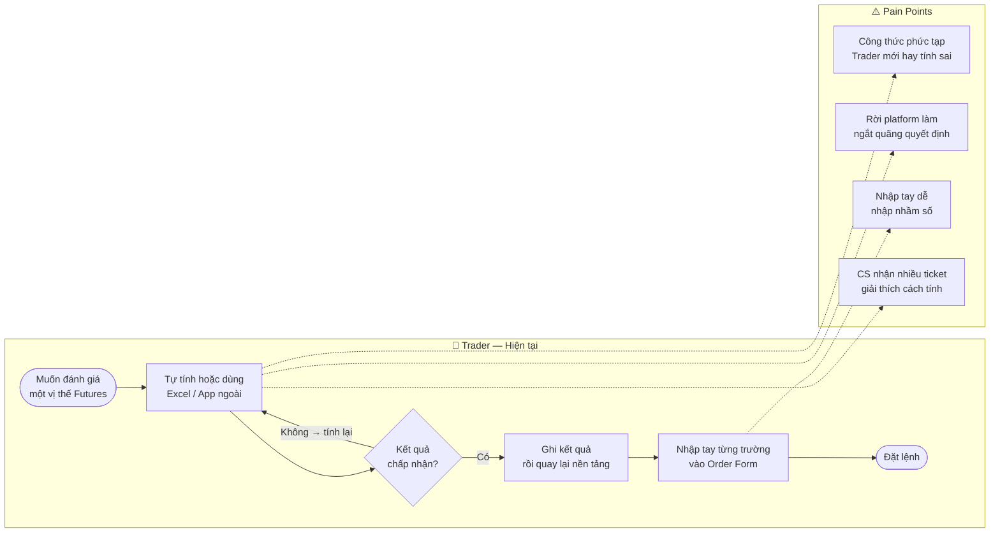
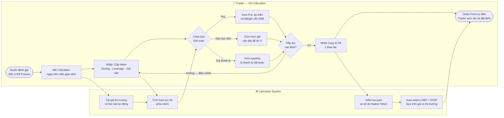
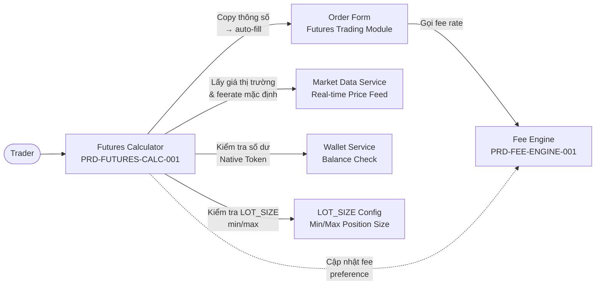
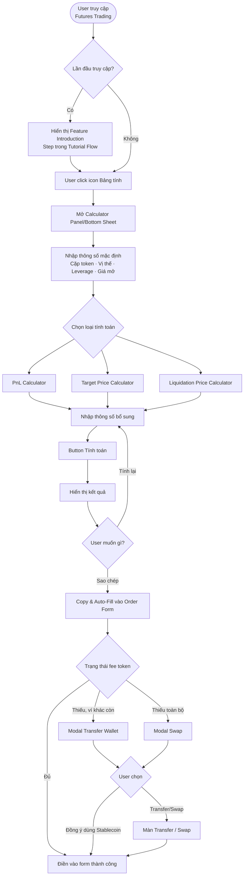

# PRD: Futures Position Calculator

<Info>
  **Document ID:** PRD-FUTURES-CALC-001 · **Version:** 1.0 · **Status:** Draft  
  **Ngày tạo:** 2024-09-16 · **Tác giả:** BA Team  
  **Reviewer:** Tech Lead, QA Lead, UX Designer · **Approver:** Head of Product  
  **Tài liệu liên quan:** PRD-FUTURES-TRADING-001, PRD-FEE-ENGINE-001
</Info>

| Vai trò | Mục đích đọc |
|---|---|
| Tech Lead / Developer | Thiết kế Calculator Service, tích hợp Copy & Fill vào Order Form |
| QA Lead | Test cases: công thức tính toán, edge cases về số lượng, copy & fill, fee token |
| UX Designer | Hiểu luồng tab switch, persistent default params, trạng thái kết quả |
| Risk Team | Review điều kiện tự động chọn loại lệnh (LIMIT/STOP) khi fill |

---

## 1. Bối cảnh & Vấn đề

### 1.1 Problem Statement

Trader khi giao dịch Futures thường **phải tính toán thủ công** hoặc dùng tool bên ngoài platform trước khi đặt lệnh. Điều này gây ra:

| Pain Point | Tác động |
|---|---|
| Tính PnL sai vì quên tính phí giao dịch | Lỗ nhiều hơn dự kiến |
| Không biết giá thanh lý → margin call bất ngờ | Rủi ro tài khoản cao |
| Phải rời platform để dùng calculator ngoài | Chuyển lệnh chậm, trải nghiệm kém |
| Nhập tay thông số vào form sau khi tính → nhập sai | Lệnh đặt sai giá/khối lượng |

**CS Team insights:** Top 3 câu hỏi thường gặp nhất từ user:
1. *"Tôi đặt lệnh X với leverage Y thì bị thanh lý tại giá bao nhiêu?"*
2. *"Tôi muốn lời 1 triệu thì giá cần đạt bao nhiêu?"*
3. *"Đặt lệnh này tôi lời/lỗ bao nhiêu nếu đóng tại giá Z?"*

### 1.2 Giải pháp

**Futures Position Calculator** — công cụ tính toán nhanh tích hợp ngay trên màn Futures Trading:

<CardGroup cols={3}>
  <Card title="PnL Calculator" icon="chart-line">
    Tính lợi nhuận, ROI, phí giao dịch dựa trên giá đóng kỳ vọng và số lượng
  </Card>
  <Card title="Target Price" icon="bullseye">
    Tính giá cần đạt để đạt mức lợi nhuận mong muốn (nhập PnL hoặc %PnL)
  </Card>
  <Card title="Liquidation Price" icon="triangle-exclamation">
    Tính giá thanh lý của vị thế — giúp trader kiểm soát rủi ro trước khi vào lệnh
  </Card>
</CardGroup>

Sau khi tính toán, user có thể **sao chép toàn bộ thông số** và tự động điền vào màn đặt lệnh Futures chỉ với 1 tap.

---

## 2. Sơ đồ nghiệp vụ (Business Process)

### As-Is: Trader tính toán thủ công

### To-Be: Với Futures Position Calculator tích hợp

**Kết quả nghiệp vụ kỳ vọng (per BRD-FUTURES-CALC-001):**
- OBJ-01: Giảm 40% CS ticket liên quan tính toán trong 3 tháng sau launch
- OBJ-02: 25% phiên dùng Calculator kết thúc bằng đặt lệnh thực (Copy & Fill)
- OBJ-03: Tăng 15 điểm % tỷ lệ dùng Native Token làm phí giao dịch

---

## 3. Phạm vi (Scope)

| Tính năng | Trong phạm vi | Ghi chú |
|---|:---:|---|
| Tính PnL theo giá đóng | ✅ | Có tính phí giao dịch |
| Tính Giá mục tiêu theo PnL hoặc %PnL mong muốn | ✅ | Hỗ trợ cả có/không có số lượng |
| Tính Giá thanh lý | ✅ | Hỗ trợ cả có/không có số lượng |
| Tính phí bằng Native Token (giảm phí) | ✅ | Checkbox trong calculator |
| Sao chép thông số → tự động điền vào Order Form | ✅ | Bao gồm auto-select LIMIT/STOP |
| Cập nhật tài sản tính phí mặc định khi copy | ✅ | Đồng bộ với fee preference của user |
| Hướng dẫn sử dụng (Tutorial / Onboarding) | ✅ | Hiển thị lần đầu truy cập |
| Xử lý khi Native Token không đủ | ✅ | Modal Transfer Wallet / Swap |
| Sử dụng không cần đăng nhập | ✅ | Chỉ cần login khi thực hiện copy & fill |
| Lưu lịch sử tính toán | ❌ | Roadmap Sprint tiếp theo |
| Tính toán cho nhiều vị thế cùng lúc (portfolio calc) | ❌ | Roadmap |
| Tính toán GD phức hợp (hedge, straddle) | ❌ | Out of scope MVP |
| Chia sẻ kết quả tính toán | ❌ | Roadmap |

---

## 4. User Personas

| Persona | Đặc điểm | Nhu cầu chính | Tính năng ưu tiên |
|---|---|---|---|
| **Trader mới** | Chưa quen Futures, lo ngại rủi ro | Biết giá thanh lý để không mất tài khoản | Liquidation Price Calculator |
| **Trader thường** | Giao dịch 3–5 lần/ngày | Tính nhanh PnL trước khi vào lệnh | PnL Calculator + Copy & Fill |
| **Trader pro** | Giao dịch nhiều lần, optimize leverage | Tính break-even, target price chính xác | Target Price + tất cả calculator |
| **Trader mobile** | Giao dịch trên điện thoại | UX nhanh, không mất thông số khi back | Copy & Fill không mất state |

---

## 5. Kiến trúc hệ thống

### 4.1 Dữ liệu đầu vào từ hệ thống

| Nguồn | Dữ liệu cung cấp | Cách lấy |
|---|---|---|
| Market Data Service | Giá thị trường hiện tại (mỗi cặp token) | Real-time API / WebSocket |
| Fee Engine | `fee_rate` mặc định theo loại user, loại tài sản thanh toán phí | API call |
| LOT_SIZE Config | `min_qty`, `max_qty`, `min_notional`, `max_notional` theo cặp giao dịch | Static config / API |
| Wallet Service | Số dư Native Token trong Futures Wallet và các ví khác | API call (khi user đăng nhập) |
| Native Token Price | Giá Native Token/Stablecoin để quy đổi phí | Market Data |

---

## 6. Định nghĩa thuật ngữ

| Thuật ngữ | Định nghĩa |
|---|---|
| **Open Price** (Giá mở) | Giá dự kiến mở vị thế. Mặc định lấy giá thị trường hiện tại |
| **Close Price** (Giá đóng) | Giá dự kiến đóng vị thế |
| **Size** (Số lượng) | Số lượng token trong vị thế (đơn vị: token hoặc stablecoin) |
| **Leverage** (Đòn bẩy) | Hệ số nhân vốn; tăng cả lợi nhuận lẫn rủi ro |
| **Fee Rate** | Tỷ lệ phí giao dịch (tính cả mở lẫn đóng vị thế) |
| **PnL** | Profit and Loss — lợi nhuận hoặc lỗ tuyệt đối (đơn vị: stablecoin) |
| **ROI** | Return on Investment — tỷ lệ lợi nhuận trên vốn ký quỹ ban đầu |
| **%Profit** | Tỷ lệ lợi nhuận trên vốn gốc (không tính ký quỹ) |
| **Initial Margin** (Ký quỹ ban đầu) | Số tiền bắt buộc để mở vị thế = Position Value / Leverage |
| **Liquidation Price** (Giá thanh lý) | Giá mà tại đó hệ thống tự động đóng vị thế khi margin không đủ |
| **Target Price** (Giá mục tiêu) | Giá cần đạt để đạt PnL mong muốn |
| **Native Token** | Token nội bộ của platform; dùng để trả phí với mức chiết khấu |
| **LowerBound / UpperBound** | Ngưỡng giá dưới/trên so với giá thị trường; dùng để auto-select LIMIT/STOP |

---

## 7. Luồng sản phẩm tổng quan

