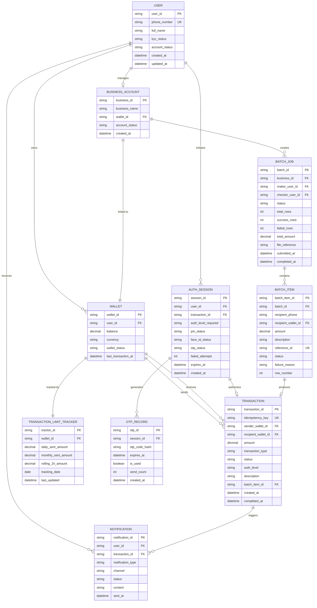

# ERD: Chuyển Tiền Nội Bộ Ví MoMo

---

## Thông tin tài liệu

| Trường | Nội dung |
|---|---|
| **Document ID** | ERD-MOMO-TRANSFER-001 |
| **Version** | 1.0 |
| **Status** | Draft |
| **Ngày tạo** | 2026-05-25 |
| **Tác giả** | BA Team |
| **Reviewer** | Tech Lead, Database Architect |
| **Approver** | Engineering Lead |
| **Tài liệu liên quan** | BRD-MOMO-TRANSFER-001, FRD-MOMO-TRANSFER-001, UC-MOMO-TRANSFER-001 |
| **Bảo mật** | Internal — Không phát hành ra ngoài |

---

## 1. Tổng quan Data Model

Tính năng Chuyển Tiền Nội Bộ MoMo bao gồm **10 entity** chính:

| Nhóm | Entity |
|---|---|
| **Identity & Account** | USER, WALLET, BUSINESS\_ACCOUNT |
| **Transaction Core** | TRANSACTION, TRANSACTION\_LIMIT\_TRACKER |
| **Authentication** | AUTH\_SESSION, OTP\_RECORD |
| **Batch Processing** | BATCH\_JOB, BATCH\_ITEM |
| **Communication** | NOTIFICATION |

---

## 2. ERD Diagram

---

## 3. Mô Tả Chi Tiết Các Entity

<AccordionGroup>
  <Accordion title="USER — Tài khoản người dùng">
    | Cột | Kiểu | Nullable | Mô tả |
    |---|---|---|---|
    | user\_id | UUID | No | Primary key |
    | phone\_number | VARCHAR(15) | No | Unique; SĐT đăng ký; dùng để tra cứu recipient |
    | full\_name | VARCHAR(200) | No | Tên hiển thị khi confirm GD |
    | kyc\_status | ENUM | No | `UNVERIFIED`, `eKYC_VERIFIED`, `FULL_KYC` |
    | account\_status | ENUM | No | `ACTIVE`, `SUSPENDED`, `CLOSED` |

    **Notes:**
    - `kyc_status` quyết định hạn mức tháng: eKYC → 200M VND; UNVERIFIED → 20M VND
    - `account_status = SUSPENDED` → không thể gửi hoặc nhận tiền
  </Accordion>

  <Accordion title="WALLET — Ví điện tử">
    | Cột | Kiểu | Nullable | Mô tả |
    |---|---|---|---|
    | wallet\_id | UUID | No | Primary key |
    | user\_id | UUID | Yes | FK → USER; null nếu là ví doanh nghiệp |
    | balance | DECIMAL(18,2) | No | Số dư hiện tại; không âm |
    | currency | CHAR(3) | No | Mặc định `VND` |
    | wallet\_status | ENUM | No | `ACTIVE`, `FROZEN`, `CLOSED` |

    **Constraint:** `balance >= 0` enforce tại DB level. Debit/Credit phải là atomic operation.
  </Accordion>

  <Accordion title="TRANSACTION — Bản ghi giao dịch">
    | Cột | Kiểu | Nullable | Mô tả |
    |---|---|---|---|
    | transaction\_id | UUID | No | PK; trả về client sau confirm |
    | idempotency\_key | VARCHAR(128) | No | **UNIQUE**; ngăn duplicate debit |
    | sender\_wallet\_id | UUID | No | FK → WALLET |
    | recipient\_wallet\_id | UUID | No | FK → WALLET |
    | amount | DECIMAL(18,2) | No | 1,000 ≤ amount ≤ 20,000,000 |
    | transaction\_type | ENUM | No | `P2P`, `BUSINESS_SINGLE`, `BUSINESS_BATCH` |
    | status | ENUM | No | `PENDING`, `PROCESSING`, `COMPLETED`, `FAILED` |
    | auth\_level | ENUM | No | `1FA`, `2FA`, `3FA` |
    | batch\_item\_id | UUID | Yes | FK → BATCH\_ITEM; null nếu không phải batch |

    **Notes:** Immutable sau khi status = `COMPLETED` hoặc `FAILED`. Không có UPDATE.
  </Accordion>

  <Accordion title="TRANSACTION_LIMIT_TRACKER — Theo dõi hạn mức">
    | Cột | Kiểu | Mô tả |
    |---|---|---|
    | wallet\_id | UUID | FK → WALLET; unique per wallet per day |
    | daily\_sent\_amount | DECIMAL | Tổng gửi trong ngày; reset 00:00 |
    | monthly\_sent\_amount | DECIMAL | Tổng gửi trong tháng; reset ngày 1 |
    | rolling\_1h\_amount | DECIMAL | Tổng gửi 60 phút gần nhất (sliding window) |
    | tracking\_date | DATE | Ngày theo dõi (partition key) |

    **Notes:** `rolling_1h_amount` dùng sliding window, không phải fixed hour bucket.
  </Accordion>

  <Accordion title="AUTH_SESSION + OTP_RECORD — Xác thực">
    **AUTH_SESSION:**

    | Cột | Kiểu | Mô tả |
    |---|---|---|
    | session\_id | UUID | PK |
    | user\_id | UUID | FK → USER |
    | auth\_level\_required | ENUM | `1FA`, `2FA`, `3FA` |
    | pin\_status | ENUM | `PENDING`, `PASSED`, `FAILED` |
    | face\_id\_status | ENUM | `PENDING`, `PASSED`, `FAILED`, `NOT_REQUIRED` |
    | otp\_status | ENUM | `PENDING`, `PASSED`, `FAILED`, `NOT_REQUIRED` |
    | failed\_attempts | SMALLINT | Khóa khi = 3 |
    | expires\_at | TIMESTAMP | Hết hạn sau 10 phút |

    **OTP_RECORD:**

    | Cột | Kiểu | Mô tả |
    |---|---|---|
    | otp\_code\_hash | VARCHAR(256) | Bcrypt hash; không lưu plaintext |
    | expires\_at | TIMESTAMP | Hết hạn sau 5 phút |
    | is\_used | BOOLEAN | True sau verify; ngăn reuse |
    | send\_count | SMALLINT | Tối đa 3 lần/phiên |
  </Accordion>

  <Accordion title="BATCH_JOB + BATCH_ITEM — Xử lý batch">
    **BATCH_JOB:**

    | Cột | Kiểu | Mô tả |
    |---|---|---|
    | batch\_id | UUID | PK |
    | maker\_user\_id | UUID | FK → USER |
    | checker\_user\_id | UUID | FK → USER; null cho đến khi approved |
    | status | ENUM | `DRAFT` → `PENDING_APPROVAL` → `PROCESSING` → `COMPLETED` |
    | total\_rows / success\_rows / failed\_rows | INT | Tracking tiến độ |

    **Constraint:** `CHECK (maker_user_id != checker_user_id)`

    **BATCH_ITEM:**

    | Cột | Kiểu | Mô tả |
    |---|---|---|
    | reference\_id | VARCHAR(128) | UNIQUE per batch; idempotency key |
    | status | ENUM | `PENDING`, `SUCCESS`, `FAILED`, `INVALID` |
    | failure\_reason | VARCHAR(500) | Null nếu SUCCESS |
  </Accordion>
</AccordionGroup>

---

## 4. Quan Hệ Giữa Các Entity

| Quan hệ | Cardinality | Mô tả |
|---|---|---|
| USER → WALLET | 1:1 | Mỗi user có đúng 1 ví cá nhân |
| USER → BUSINESS\_ACCOUNT | 1:0..1 | User có thể quản lý 0 hoặc 1 business account |
| BUSINESS\_ACCOUNT → WALLET | 1:1 | Business account có đúng 1 ví |
| WALLET → TRANSACTION (sender) | 1:N | Một ví là sender của nhiều GD |
| WALLET → TRANSACTION (recipient) | 1:N | Một ví là recipient của nhiều GD |
| WALLET → TRANSACTION\_LIMIT\_TRACKER | 1:1/ngày | Mỗi ví có 1 tracker record mỗi ngày |
| AUTH\_SESSION → OTP\_RECORD | 1:N | Một phiên có thể resend nhiều OTP |
| BATCH\_JOB → BATCH\_ITEM | 1:N | Mỗi batch chứa tối đa 1,000 items |
| BATCH\_ITEM → TRANSACTION | 1:0..1 | Mỗi item sinh ra tối đa 1 GD |

---

## 5. Index Recommendations

| Bảng | Index | Lý do |
|---|---|---|
| USER | `phone_number` (UNIQUE) | Tra cứu recipient — hot path |
| TRANSACTION | `idempotency_key` (UNIQUE) | Ngăn duplicate debit |
| TRANSACTION | `sender_wallet_id, created_at` | Query lịch sử gửi |
| TRANSACTION | `recipient_wallet_id, created_at` | Query lịch sử nhận |
| TRANSACTION\_LIMIT\_TRACKER | `wallet_id, tracking_date` (UNIQUE) | Limit check — hot path |
| AUTH\_SESSION | `user_id, expires_at` | Kiểm tra session còn hiệu lực |
| OTP\_RECORD | `session_id, is_used` | Validate OTP nhanh |
| BATCH\_ITEM | `reference_id` (UNIQUE) | Idempotency per batch |

---

## 6. Data Integrity Constraints

| Constraint | Mô tả |
|---|---|
| `WALLET.balance >= 0` | Số dư không âm — enforce tại DB |
| `TRANSACTION.idempotency_key` UNIQUE | Ngăn duplicate debit hoàn toàn |
| `BATCH_JOB: maker_user_id != checker_user_id` | Maker-Checker separation |
| `OTP_RECORD.is_used` = true sau verify | OTP một lần dùng; không reuse |
| `TRANSACTION` immutable sau COMPLETED/FAILED | Không UPDATE GD đã hoàn tất |
| `TRANSACTION.amount` BETWEEN 1000 AND 20000000 | Hạn mức TT23/2019 |

---

## 7. Open Questions

| # | Câu hỏi | Owner | Deadline |
|---|---|---|---|
| OQ-ERD-01 | Business account có thể có nhiều ví (multi-wallet)? | Tech Lead | Sprint 1 |
| OQ-ERD-02 | rolling\_1h\_amount: sliding window hay bucket? Nếu sliding → cần lưu timestamps riêng | DB Architect | Sprint 1 |
| OQ-ERD-03 | Audit log: lưu chung TRANSACTION hay tách AUDIT\_LOG riêng (append-only)? | Compliance + Tech Lead | Sprint 2 |
| OQ-ERD-04 | OTP\_RECORD lưu hash hay token reference đến OTP Gateway external? | Security Team | Sprint 1 |
